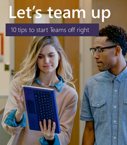

# Ressources Microsoft Teams pour les administrateurs dans l’éducation

## Ressources pour l’apprentissage à distance

Votre établissement scolaire ou université doit-il activer Microsoft Teams l’apprentissage à distance ? De lancez-vous rapidement avec la page Mise en place d’une [page](https://github.com/MicrosoftDocs/OfficeDocs-SkypeForBusiness/blob/live/Teams/downloads/edu-resources/teams-for-education-getting-started-1-pager.pdf?raw=true) et les documents d’adoption suivants .

## Contenu d'adoption

Enthousiasmez votre établissement grâce Microsoft Teams courriers électroniques, affiches, des handouts et de nouvelles ressources que vous êtes désormais libre d’utiliser. Vous pouvez également joindre des étudiants en ligne et sur le campus grâce au nouveau kit de ressources numérique rempli de bannières, de gifs et de vidéos. Lancez-vous dès aujourd’hui !

Veuillez lire les [conditions générales avant](https://github.com/MicrosoftDocs/OfficeDocs-SkypeForBusiness/blob/live/Teams/downloads/edu-resources/license_agreement_teams_for_education.pdf?raw=true) d’utiliser ces documents.

### Biens physiques

|&nbsp; | &nbsp; |
|---------|---------|
|Posters - [personnalisables](https://github.com/MicrosoftDocs/OfficeDocs-SkypeForBusiness/blob/live/Teams/downloads/edu-resources/posters-customizable.zip?raw=true) et [prêts à l’impression](https://github.com/MicrosoftDocs/OfficeDocs-SkypeForBusiness/blob/live/Teams/downloads/edu-resources/posters-print-ready.zip?raw=true)      |[Handouts](https://github.com/MicrosoftDocs/OfficeDocs-SkypeForBusiness/blob/live/Teams/downloads/edu-resources/handouts.zip?raw=true) |
|[Prospectus](https://github.com/MicrosoftDocs/OfficeDocs-SkypeForBusiness/blob/live/Teams/downloads/edu-resources/flyers.zip?raw=true)    |[Publicités dans un livre](https://github.com/MicrosoftDocs/OfficeDocs-SkypeForBusiness/blob/live/Teams/downloads/edu-resources/book-adverts.zip?raw=true)          |
|[Photo du livret Astuces et astuces.](https://github.com/MicrosoftDocs/OfficeDocs-SkypeForBusiness/blob/live/Teams/downloads/edu-resources/get-started-tips-tricks.zip?raw=true)      |

### Biens numériques

N’oubliez pas de consulter le [guide Shared Computer Toolkit numérique](https://github.com/MicrosoftDocs/OfficeDocs-SkypeForBusiness/blob/live/Teams/downloads/edu-resources/digital-toolkit-guidance.zip?raw=true) pour optimiser Teams lancement . 

| &nbsp; |&nbsp;  |
|---------|---------|
|[Modèles de courrier électronique](https://github.com/MicrosoftDocs/OfficeDocs-SkypeForBusiness/blob/live/Teams/downloads/edu-resources/email-templates.zip?raw=true)      |[GIF](https://github.com/MicrosoftDocs/OfficeDocs-SkypeForBusiness/blob/live/Teams/downloads/edu-resources/gifs.zip?raw=true)         |
|[Bannières web](https://github.com/MicrosoftDocs/OfficeDocs-SkypeForBusiness/blob/live/Teams/downloads/edu-resources/web-banners.zip?raw=true)     |[Videos](https://github.com/MicrosoftDocs/OfficeDocs-SkypeForBusiness/blob/live/Teams/downloads/edu-resources/videos.zip?raw=true)           |
|[Publicités à l’écran numérique](https://github.com/MicrosoftDocs/OfficeDocs-SkypeForBusiness/blob/live/Teams/downloads/edu-resources/digital-screen-adverts.zip?raw=true)    |      |

## Appel à l’action

- Visitez la [page Teams pour l’éducation des formations,](https://www.microsoft.com/en-us/education/products/teams/default.aspx) des vidéos et des démonstrations interactives
- Activer les Teams dans la [Centre d’administration Microsoft 365](https://portal.office.com/adminportal/home#/Settings/ServicesAndAddIns) (connectez-vous en tant qu’Office 365 administrateur)
- Télécharger les clients Teams : [Obtenir Teams sur tous vos périphériques](https://teams.microsoft.com/downloads)
- En savoir plus sur Office 365 pour l’éducation dans le [centre d’aide pour l’éducation](https://support.office.com/education)

## Ressources supplémentaires

- [Teams feuille de route](https://aka.ms/teamsroadmap)
- Rester informé avec notre [blog de la communauté technique](https://techcommunity.microsoft.com/t5/Microsoft-Teams-Blog/bg-p/MicrosoftTeamsBlog)
- [Présentation de Teams PowerShell](teams-powershell-overview.md)
- [Envoyer une suggestion](https://aka.ms/eduuservoice)
- [Contacter le support technique](https://aka.ms/o365portal).
- [Demander à la communauté Teams](https://aka.ms/msteamscommunity)
- [Plus de ressources pour l’éducation](https://education.microsoft.com/)
