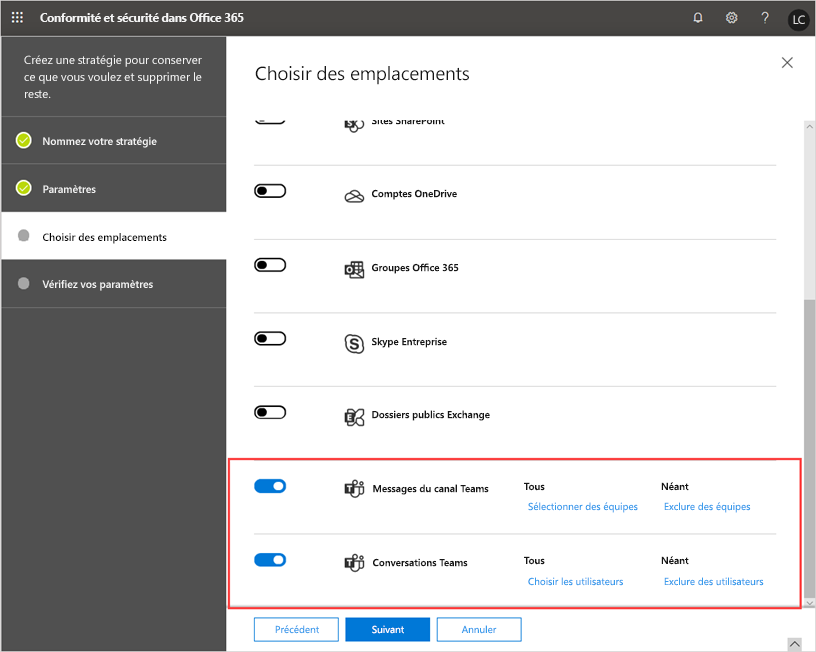
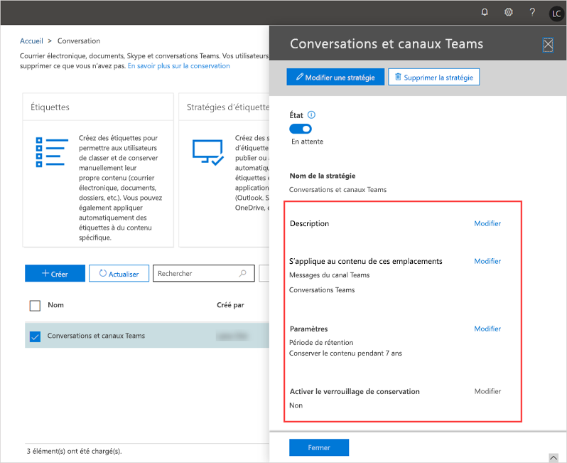

# Stratégies de conservation dans Microsoft TeamsRetention policies in Microsoft Teams

Les stratégies de conservation vous permettent de gérer plus efficacement les informations au sein de votre organisation.Retention policies help you to more effectively manage the information in your organization. Utilisez les stratégies de conservation pour conserver les données requises pour se conformer aux stratégies internes, aux réglementations sectorielles ou aux besoins juridiques de votre organisation, et pour supprimer les données considérées comme un passif, que vous n’avez plus besoin de conserver ou qui n’ont pas de valeur juridique ou commerciale.Use retention policies to keep data that's needed to comply with your organization's internal policies, industry regulations, or legal needs, and to delete data that's considered a liability, that you're no longer required to keep, or has no legal or business value.

Par défaut, les données relatives aux conversations, au canal et aux fichiers Teams sont conservées définitivement.By default, Teams chat, channel, and files data are retained forever. En tant qu'administrateur, vous pouvez configurer des stratégies de conservation Teams pour les messages de conversation et de canal et décider, de manière proactive, de conserver les données, de les supprimer ou de les conserver durant une période donnée, puis de les supprimer.As an admin, you can set up Teams retention policies for chat and channel messages and decide proactively whether to retain the data, delete it, or retain it for a specific period of time and then delete it.

Pour créer et gérer des stratégies de rétention, vous pouvez créer et gérer des stratégies de rétention dans le [Centre de conformité Microsoft 365](https://protection.office.com/) ou utiliser les cmdlets PowerShell du centre de sécurité & conformité.You create and manage retention policies for Teams and other workloads in the [Microsoft 365 Compliance Center](https://protection.office.com/) or by using the Security & Compliance Center PowerShell cmdlets. Vous pouvez appliquer une stratégie de conservation Teams à l’ensemble de votre organisation ou à des utilisateurs et des équipes spécifiques.You can apply a Teams retention policy to your entire organization or to specific users and teams.

> [!NOTE]
> Nous ne prenons pas encore en charge la configuration de la conservation des messages de canal privé.We don't yet support configuration for retention of private channel messages. La conservation des fichiers partagés dans des canaux privés est prise en charge.Retention of files shared in private channels is supported.

Si vous souhaitez en savoir plus sur les stratégies de conservation pour Office 365, consultez l’article [Présentation des stratégies de conservation](https://support.office.com/article/overview-of-retention-policies-5e377752-700d-4870-9b6d-12bfc12d2423).To learn more about retention policies for Office 365, see [Overview of retention policies](https://support.office.com/article/overview-of-retention-policies-5e377752-700d-4870-9b6d-12bfc12d2423).

## Quelles sont les stratégies de conservation pour Teams ?What are retention policies for Teams?

Vous pouvez configurer une stratégie de conservation pour Teams ou pour toute autre charge de travail comme suit :When you set up a retention policy for Teams or any other workload, you can set them up to:

- **Conserver les données** : utilisez une stratégie de conservation pour garantir la conservation de vos données pour une période donnée, indépendamment de ce qui se passe dans l'application utilisateur.**Retain data**: Use a retention policy to ensure that your data is retained for a specified period of time, regardless of what happens in the user app. Les données sont conservées pour des raisons de conformité et sont disponibles pour eDiscovery jusqu’à l’expiration de la période de conservation, au terme de laquelle votre stratégie indique s’il convient de ne rien faire ou de supprimer les données.Data is retained for compliance reasons and is available for eDiscovery until the retention period expires, after which your policy indicates whether to do nothing or delete the data. Par exemple, si vous créez une stratégie de conservation Teams pour conserver les messages de canal pendant 7 ans, les messages sont conservés pour eDiscovery pendant 7 ans, même si les utilisateurs suppriment leurs messages dans Teams.For example, if you create a Teams retention policy to retain channel messages for 7 years, the messages are retained for eDiscovery for 7 years, even if users delete their messages in Teams.
- **Supprimer les données** : utilisez une stratégie de conservation pour supprimer des données afin de vous assurer qu’elles ne constituent pas une responsabilité pour votre organisation.**Delete data**: Use a retention policy to delete data to ensure that it's not a liability for your organization. Lorsque vous supprimez des données avec une stratégie de conservation Teams, celles-ci sont supprimées définitivement de tous les emplacements de stockage du service Teams.With a Teams retention policy, when you delete data, it's permanently deleted from all storage locations on the Teams service.

Avec les stratégies de conservation pour Teams, vous pouvez :With retention policies for Teams, you can:

- Conserver les conversations et/ou les messages de canal Teams pour une période donnée, puis ne rien faire.Retain Teams chats and/or channel messages for a specified duration and then do nothing.
- Conserver les conversations et/ou les messages de canal Teams pour une période donnée, supprimer les données.Retain Teams chats and/or channel messages for a specified duration and then delete the data.
- Supprimer les conversations et/ou les messages de canal Teams après une période donnée.Delete Teams chats and/or channel messages after a specified duration.

> [!NOTE]
> N'oubliez pas que dans Teams, les fichiers que les utilisateurs partagent dans des chats privés sont stockés dans le compte OneDrive Entreprise de l'utilisateur qui a partagé le fichier.Remember that in Teams, files that users share in private chats are stored in the OneDrive for Business account of the user who shared the file. De même, les fichiers que les membres d’une équipe chargent dans une conversation de canal sont stockés sur le site SharePoint de l'équipe.And, files that team members upload to a channel conversation are stored in the team's SharePoint site. Par conséquent, pour conserver ou supprimer des fichiers dans Teams, créez des stratégies de conservation qui s'appliquent à OneDrive Entreprise et SharePoint Online.Therefore, to retain or delete files in Teams, create retention policies that apply to OneDrive for Business and SharePoint Online.

Les utilisateurs peuvent continuer à travailler avec les données soumises à une stratégie de conservation car celles-ci sont conservées dans leur emplacement d’origine.When data is subject to a retention policy, users can continue to work with it because the data is retained in place, in its original location. Si un utilisateur modifie ou supprime les données soumises à la stratégie, une copie est enregistrée dans un emplacement sécurisé et est conservée tant que la stratégie est en vigueur.If a user edits or deletes data that's subject to the policy, a copy is saved to a secure location where it's retained while the policy is in effect.

La licence minimale requise pour les stratégies de conservation est Office 365 E3.The minimum licensing requirement for retention policies is Office 365 E3. Si vous souhaitez en savoir plus sur les licences Teams, consultez l’article [Licence Office 365 pour Teams](Office-365-licensing.md).To learn more about licensing, see [Office 365 licensing for Teams](Office-365-licensing.md).

## Fonctionnement des stratégies de conservation TeamsHow Teams retention policies work

Les conversations Teams sont stockées dans un dossier SubstrateHolds caché dans la boîte aux lettres de chaque utilisateur dans la conversation, et les messages du canal Teams sont stockés dans un dossier SubstratesHolds caché dans la boîte aux lettres de groupe pour une équipe.Teams chats are stored in a hidden SubstrateHolds folder in the mailbox of each user in the chat, and Teams channel messages are stored in a hidden SubstratesHolds folder in the group mailbox for a team. Teams utilise un service de conversation basé sur Azure qui stocke également ces données et, par défaut, ce service stocke les données sans limite de durée.Teams uses an Azure-powered chat service that also stores this data, and by default this service stores the data forever. Lorsque vous supprimez des données avec une stratégie de conservation Teams, celles-ci sont supprimées définitivement des boîtes aux lettres Exchange et du service de conversation sous-jacent.With a Teams retention policy, when you delete data, the data is permanently deleted from both the Exchange mailboxes and the underlying chat service.

Lorsque vous appliquez une stratégie de conservation à des conversations et des messages de canal Teams, voici ce qui se produit :When you apply a retention policy to Teams chats and channel messages, here's what happens:

- Si un message de conversation ou de canal est modifié ou supprimé par un utilisateur pendant la période de conservation, le message est copié (s’il a été modifié) ou déplacé (s’il a été supprimé) vers le dossier SubstrateHolds et est stocké à cet emplacement jusqu’à l’expiration de la période de conservation.If a chat or channel message is edited or deleted by a user during the retention period, the message is copied (if it was edited) or moved (if it was deleted) to the SubstrateHolds folder and stored there until the retention period expires. Si la stratégie est configurée pour supprimer des données à l’expiration de la période de conservation, les messages sont supprimés définitivement le jour où la période de conservation expire.If the policy is configured to delete data when the retention period expires, messages are permanently deleted on the day the retention period expires.
- Si une conversation ou un message de canal n’est pas supprimé pendant la période de conservation, le message est déplacé vers le dossier SubstrateHolds dans la journée suivant l'expiration de la période de conservation.If a chat or channel message isn't deleted by a user during the retention period, the message is moved to the SubstrateHolds folder within one day after the retention period expires. Si la stratégie est configurée pour supprimer les données à l'expiration de la période de conservation, le message est définitivement supprimé un jour après son déplacement vers le dossier.If the policy is configured to delete data when the retention period expires, the message is permanently deleted one day after it's moved to the folder.

> [!NOTE]
> Le même flux fonctionne pour les conversations d’interopérabilité Skype Entreprise Online et Teams.The same flow works for Skype for Business Online and Teams interop chats. Lorsqu’une conversation Skype Entreprise Online intervient dans Teams, celle-ci devient un message de la conversation Teams et est stockée dans la boîte aux lettres appropriée.When a Skype for Business Online chat comes into Teams, it becomes a message in a Teams chat thread and is ingested into the appropriate mailbox. Les stratégies de conservation Teams supprimeront ces messages du fil de conversation Teams.Teams retention policies will delete these messages from the Teams thread. Cependant, si l'historique des conversations est activé pour Skype Entreprise Online et par le côté client Skype Entreprise Online, ceux-ci sont enregistrés dans une boîte aux lettres. Ces données de conversation ne sont pas gérées par une stratégie de conservation Teams.However, if conversation history is turned on for Skype for Business Online and from the Skype for Business Online client side those are being saved into a mailbox, that chat data isn't handled by a Teams retention policy.

Les stratégies de conservation dans Teams sont basées sur la date de création des messages de chat ou de canal et sont rétroactives.Retention policies in Teams are based on the date the chat or channel messages were created and are retroactive. En d’autres termes, si vous créez une stratégie de conservation pour supprimer des données datant de plus de 90 jours, les données Teams créées il y a plus de 90 jours sont supprimées.In other words, if you create a retention policy to delete data older than 90 days, Teams data created more than 90 days ago is deleted.

Il est possible qu’une stratégie de conservation appliquée à SharePoint Online ou OneDrive Entreprise supprime un fichier référencé dans une conversation ou un message de canal Teams avant la suppression de ces messages.It's possible that a retention policy that's applied to SharePoint Online or OneDrive for Business could delete a file that's referenced in a Teams chat or channel message before those messages get deleted. Dans ce cas, le fichier apparaîtra toujours dans le message Teams, mais lorsque les utilisateurs cliquent sur le fichier, le message d’erreur « fichier introuvable » s’affiche.In this scenario, the file will still show up in the Teams message, but when users click the file, they'll get a "File not found" error. Cela peut également se produire en l’absence de stratégie, si quelqu’un supprime manuellement un fichier de SharePoint Online ou OneDrive Entreprise.This can also happen in the absence of a policy, if someone manually deletes a file from SharePoint Online or OneDrive for Business.

### Considérations et limitationsConsiderations and limitations

Voici quelques considérations et limitations à prendre en compte lorsque vous travaillez avec des stratégies de conservation Teams :Here's some considerations and limitations to be aware of when working with Teams retention policies:

- Teams nécessite une stratégie de conservation distincte des autres charges de travail.Teams requires a retention policy that's separate from other workloads. En d’autres termes, vous devez créer des stratégies de conservation spécifiques pour les conversations et/ou les messages de canal Teams.In other words, you have to create specific retention policies for Teams chats and/or channel messages. Pour cette raison, vous ne pouvez pas inclure Teams dans les stratégies de conservation à l’échelle de l’organisation.For this reason, you can't include Teams in org-wide retention policies.

- Les messages de canal privé ne sont pas pris en charge.Private channel messages aren't supported. Actuellement, les stratégies de conservation créées pour Teams s’appliquent uniquement aux messages de canal standard.At this time, retention policies for Teams only apply to standard channel messages.

- Teams ne prend pas en charge les paramètres de conservation avancés, comme la possibilité d’appliquer une stratégie au contenu avec des mots clés ou des informations sensibles.Teams doesn't support advanced retention settings, such as the ability to apply a policy to content that contains keywords or sensitive information. Actuellement, les stratégies de conservation dans Teams s’appliquent à tous les contenus de conversation et/ou de canal.Currently, retention policies in Teams apply to all chat and/or channel message content.

- Le nettoyage des messages expirés risque de durer jusqu’à sept jours.Teams may take up to three to seven days to clean up expired messages. Une stratégie de conservation Teams supprimera les messages de discussion et de canal à l'expiration de la période de conservation.A Teams retention policy will delete chat and channel messages when the retention period expires. Toutefois, le nettoyage de ces messages risque de durer jusqu’à 3 jours et de les supprimer définitivement.However, it may take up to three to seven days to clean up these messages and permanently delete them. De plus, les messages de conversation et de canal seront consultables avec les outils eDiscovery entre le moment qui suit l'expiration de la période de conservation et la suppression définitive des messages.Also, chat and channel messages will be searchable with eDiscovery tools between the time after the retention period expires and when messages are permanently deleted.

### Politiques de conservation multiples et principes de conservationMultiple retention policies and the principles of retention

Si vous configurez des stratégies de conservation multiples Teams avec des durées variables, les [principes des stratégies de conservation](https://docs.microsoft.com/microsoft-365/compliance/retention-policies#the-principles-of-retention-or-what-takes-precedence) s’appliquent.If you set up multiple Teams retention policies with varying durations, the [principles of retention policies](https://docs.microsoft.com/microsoft-365/compliance/retention-policies#the-principles-of-retention-or-what-takes-precedence) apply. Voici un aperçu de ce qui passe en priorité :Here's an overview of what takes precedence:

- La conservation prévaut toujours sur la suppressionPreservation always wins over deletion
- La période de conservation la plus longue prévaut toujoursLongest preservation period always wins
- L'inclusion explicite prévaut sur l'inclusion implicite en termes d’emplacementsExplicit inclusion wins over implicit inclusion in terms of locations
- La période de suppression la plus courte prévautShortest deletion period wins

## Quand utiliser les politiques de conservation pour TeamsWhen to use retention policies for Teams

Dans de nombreux cas, les organisations considèrent les données de conversation privé plus comme une responsabilité que les messages de canal, qui sont généralement des conversations plus liées au projet.In many cases, organizations consider private chat data as more of a liability than channel messages, which are typically more project-related conversations.

Vous pouvez configurer des stratégies de conservation distinctes pour les conversations privées (1:1 ou 1 : plusieurs conversations) et les messages de canal.You can set up separate retention policies for private chats (1:1 or 1:many chats) and channel messages. Vous pouvez également configurer des stratégies uniques qui s'appliquent à des utilisateurs ou des équipes spécifiques de votre organisation.You can also configure unique policies that apply to specific users or teams in your organization. Pour les conversations Teams, vous pouvez sélectionner les utilisateurs auxquels la stratégie s’applique.For Teams chats, you can select which users the policy applies to. Pour les conversations Teams, vous pouvez sélectionner les équipes auxquels la stratégie s’applique.For Teams channel messages, you can select which teams the policy applies to.

Par exemple, pour les messages de canal, vous pouvez appliquer une stratégie de suppression d’un an à des équipes spécifiques au sein de votre organisation et appliquer une stratégie de suppression de trois ans à toutes les autres équipes.For example, for channel messages, you can apply a one-year deletion policy to specific teams in your organization and apply a three-year deletion policy to all other teams.

## Gérer les stratégies de conservation pour TeamsManage retention policies for Teams

### Utiliser le Centre de sécurité et conformitéUsing the Security & Compliance Center

#### Création d’une stratégie de conservationCreate a retention policy

Pour créer une stratégie de conservation pour les conversations et les messages de canal Teams, procédez comme suit :To create a retention policy for Teams chats and channel messages, do the following:

1. Dans le volet gauche du Centre de sécurité et conformité, cliquez sur **Gouvernance des données**  >  **Conservation**.In the left navigation of the Security & Compliance Center, go to **Information governance** > **Retention**.
2. Sélectionnez **Créer**.Select **Create**.
3. Sur la page **Nommez votre stratégie**, entrez un nom et une description pour votre stratégie, puis cliquez sur **Suivant**.On the **Name your policy** page, enter a name and description for your policy, and then click **Next**.
4. Dans la page **Paramètres**, indiquez si vous souhaitez conserver les données, les supprimer, ou les deux, la période de conservation, puis cliquez sur **suivant**.On the **Settings** page, specify whether you want to retain data, delete it, or both, the retention period, and then click **Next**.
5. Dans la page **Choisir les emplacements**, procédez comme suit, puis cliquez sur **Suivant** :On the **Choose locations** page, do the following, and then click **Next**:

    - Pour appliquer la stratégie à des messages de canal, activez **Messages de canal Teams**.To apply the policy to channel messages, turn on **Teams channel messages**.  Si vous souhaitez appliquer la stratégie à des équipes spécifiques au sein de votre organisation, sélectionnez **Choisir les équipes**, puis sélectionnez les équipes de votre choix.If you want to apply the policy to specific teams in your organization, select **Choose teams**, and then select the teams that you want.
    - Pour appliquer la stratégie aux conversations, activez **Conversations Teams**.To apply the policy to chats, turn on **Teams chats**. Si vous souhaitez appliquer la stratégie à des utilisateurs spécifiques au sein de votre organisation, sélectionnez **Choisir les utilisateurs**, puis sélectionnez les utilisateurs de votre choix.If you want to apply the policy to specific users in your organization, select **Choose users**, and then select the users that you want.
      > [!NOTE]
      > Lorsque vous activez **les messages de canal Teams** et/ou **les conversations Teams**, tous les autres emplacements sont automatiquement désactivés.When you turn on **Teams channel messages** and/or **Teams chats**, all other locations are  automatically turned off. Une stratégie de conservation Teams peut inclure uniquement les emplacements Teams.A Teams retention policy can only include Teams locations.

        

      > [!IMPORTANT]
      > Les discussions d’équipe et les messages de canal ne sont pas affectés par les stratégies de rétention appliquées aux boîtes aux lettres d’utilisateur ou de groupe dans les emplacements de **messagerie Exchange** ou de **groupes Microsoft 365** .Teams chats and channel messages aren't affected by retention policies applied to user or group mailboxes in the **Exchange email** or **Microsoft 365 groups** locations. Même si les conversations et les messages de canal Teams sont stockés dans Exchange, ils sont uniquement affectés par une stratégie de conservation appliquée à l’emplacement Teams.Even though Teams chats and channel messages are stored in Exchange, they're only affected by retention policies applied to the Teams locations.

6. Vérifiez vos paramètres, et lorsque vous êtes prêt, sélectionnez **créer cette stratégie**.Review your settings, and then when you're ready, select **Create this policy**.

#### Modifier une stratégie de conservationEdit a retention policy

Pour modifier une stratégie de conservation Teams, procédez comme suit :To edit a Teams retention policy, do the following:

1. Dans le volet gauche du Centre de sécurité et conformité, cliquez sur **Gouvernance des données**  >  **Conservation**.In the left navigation of the Security & Compliance Center, go to **Information governance** > **Retention**.
2. Dans la liste des stratégies de conservation, cochez la case en regard de la stratégie de conservation que vous souhaitez modifier.In the list of retention policies, select the check box next to the retention policy you want to edit.
3. Sélectionnez **modifier** en regard de ce que vous voulez modifier, apportez vos modifications, cliquez sur **enregistrer**, puis cliquez sur **Fermer**.Select **Edit** next to what you want to edit, make your changes, click **Save**, and then click **Close**.

    

#### Supprimer une stratégie de conservationDelete a retention policy

Pour supprimer une stratégie de conservation Teams, procédez comme suit :To delete a Teams retention policy, do the following:

1. Dans le volet gauche du Centre de sécurité et conformité, cliquez sur **Gouvernance des données**  >  **Conservation**.In the left navigation of the Security & Compliance Center, go to **Information governance** > **Retention**.
2. Dans la liste des stratégies de-conservation, cochez la case en regard de la stratégie de conservation que vous souhaitez supprimer.In the list of retention policies, select the check box next to the retention policy you want to delete.
3. Sélectionnez **Supprimer la stratégie**.Select **Delete policy**.

### Utiliser PowerShellUsing PowerShell

Pour créer et gérer des stratégies de rétention d’équipes à l’aide d' [Office 365 Security & Compliance PowerShell](https://docs.microsoft.com/powershell/exchange/office-365-scc/connect-to-scc-powershell/connect-to-scc-powershell), utilisez les applets de commande suivantes :To create and manage Teams retention policies by using [Office 365 Security & Compliance PowerShell](https://docs.microsoft.com/powershell/exchange/office-365-scc/connect-to-scc-powershell/connect-to-scc-powershell), use the following cmdlets:

|StratégiePolicy|RègleRule|
|---|---|
|[Nouveau-RetentionCompliancePolicyNew-RetentionCompliancePolicy](https://docs.microsoft.com/powershell/module/exchange/policy-and-compliance-retention/new-retentioncompliancepolicy?view=exchange-ps)| [Nouveau-RetentionComplianceRuleNew-RetentionComplianceRule](https://docs.microsoft.com/powershell/module/exchange/policy-and-compliance-retention/new-retentioncompliancerule?view=exchange-ps)|
|[Get-RetentionCompliancePolicyGet-RetentionCompliancePolicy](https://docs.microsoft.com/powershell/module/exchange/policy-and-compliance-retention/get-retentioncompliancepolicy?view=exchange-ps)| [Get-RetentionComplianceRuleGet-RetentionComplianceRule](https://docs.microsoft.com/powershell/module/exchange/policy-and-compliance-retention/get-retentioncompliancerule?view=exchange-ps)|
|[Set-RetentionCompliancePolicySet-RetentionCompliancePolicy](https://docs.microsoft.com/powershell/module/exchange/policy-and-compliance-retention/set-retentioncompliancepolicy?view=exchange-ps)| [Set-RetentionComplianceRuleSet-RetentionComplianceRule](https://docs.microsoft.com/powershell/module/exchange/policy-and-compliance-retention/set-retentioncompliancerule?view=exchange-ps)|
|[Remove-RetentionCompliancePolicyRemove-RetentionCompliancePolicy](https://docs.microsoft.com/powershell/module/exchange/policy-and-compliance-retention/remove-retentioncompliancepolicy?view=exchange-ps)| [Remove-RetentionComplianceRuleRemove-RetentionComplianceRule](https://docs.microsoft.com/powershell/module/exchange/policy-and-compliance-retention/remove-retentioncompliancerule?view=exchange-ps)|

## Problèmes connusKnown issues

Les problèmes suivants sont rencontrés pour les stratégies de conservation dans Teams et font l'objet d'un suivi et d'une enquête.The following are known issues for retention policies in Teams that are being tracked and investigated.

- Sous **choisir des équipes** dans la ligne d’emplacement des **messages de canal teams** , vous pouvez voir les groupes Microsoft 365 qui ne sont pas également équipes.Under **Choose teams** in the **Teams channel messages** location row, you may see Microsoft 365 Groups that aren't also Teams. Ce problème sera corrigé à l'avenir.This will be addressed in the future.

- Sous **Sélectionnez les utilisateurs** dans la ligne d’emplacement **Conversations Teams**, vous pouvez voir les invités et les utilisateurs qui n’utilisent pas la boîte aux lettres.Under **Choose users** in the **Teams chats** location row, you may see guests and non-mailbox users. Les stratégies de conservation ne sont pas censées être définies pour les invités et nous travaillons afin de les supprimer de la liste.Retention policies aren't meant to be set for guests, and we're working to remove these from the list.

- L’Assistant de cycle de vie Exchange (ECV) s’exécute quotidiennement, mais il dispose d’un contrat SLA de 7 jours.Exchange Life Cycle assistant (ELC) runs daily, but it has an SLA of 7 days. Par conséquent, si vous avez une stratégie de conservation Teams pour supprimer des éléments datant de plus de 60 jours, il est possible que ces éléments soient conservés pendant 67 jours.As a result, it's possible that, if you have a Teams retention policy to delete items older than 60 days, these items could persist for up to 67 days. Il ne s’agit pas d’une situation nouvelle : elle suit le modèle Exchange.This isn't a new situation - it follows the Exchange model. Bien sûr, dans la plupart des cas, il n’y a aucun décalage.Of course, in most cases, there's no delay.

## Sujets associésRelated topics

- [Présentation des stratégies de conservationOverview of retention policies](https://support.office.com/article/overview-of-retention-policies-5e377752-700d-4870-9b6d-12bfc12d2423)
