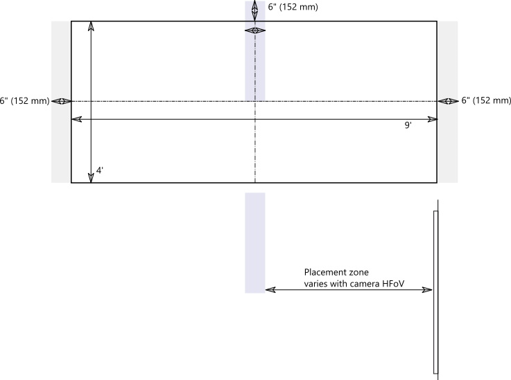

# Caméras de contenu

Vous pouvez maintenant utiliser une caméra de contenu avec un système Salles Microsoft Teams. Une caméra de contenu interagit avec un logiciel spécial de traitement d’images et un tableau blanc pour permettre à un présentateur de dessiner sur un tableau blanc analogique et de partager le contenu avec des participants distants.

Consultez la vidéo suivante pour obtenir des exemples de fonctionnalités de caméra de contenu.

> [!VIDEO https://www.microsoft.com/videoplayer/embed/RE3E7fy]

## Configurer une caméra de contenu

> [!NOTE]
> Respectez toujours le code du bâtiment de votre pays ou de votre région, qui peut définir une distance minimale par rapport au plancher ou une exigence de sécurisation de l’équipement monté au plafond sur un chevron ou une autre structure. Suivez les instructions de montage pour le matériel fourni avec l’appareil photo que vous avez sélectionné. Les kits de montage de caméra OEM incluent une caméra, des extendeurs USB 2.0 et le câblage requis.

La taille du tableau blanc utilisé pour le partage affecte le positionnement de l’appareil photo. Les recommandations relatives à la taille du tableau sont les suivantes :

- 3 à 6 pieds (0,9 à 1,8 m) de large — Pris en charge
- 6 à 9 pi (1,8 à 2,7 m) de large — Recommandé
- 9 à 12 pieds (2,7 à 3,6 m) de large — Pris en charge
- Au-dessus de 12 pi (3,6 m) — la caméra couvre de 9 à 12 pi (2,7 à 3,6 m) et rogne le reste.

## Emplacement de l’appareil photo

L’emplacement idéal d’une caméra de contenu est centré verticalement et horizontalement sur le tableau blanc. Les codes de construction locaux peuvent avoir des restrictions de hauteur qui exigent que l’appareil photo soit élevé plus haut que le haut de la carte blanche.

Vous pouvez installer la caméra jusqu’à 6 pouces. (152 mm) plus haut que le haut du tableau blanc, et centré sur le tableau blanc comme indiqué. Assurez-vous que l’image de l’appareil photo inclut au moins un 6 pouces. bordure (152 mm) des deux côtés horizontalement. Vous pouvez utiliser l’aperçu de l’appareil photo dans l’application Salles Microsoft Teams pour déterminer le positionnement final de l’appareil photo.

### Distances de l’appareil photo

À l’aide de marqueurs de tableau blanc classiques, l’expérience utilisateur à distance optimale consiste à partager des traits d’encre dans la plage de 1 à 2 mm par pixel dans l’image de la caméra de contenu, et les meilleurs résultats utilisent 1,5 mm par pixel. Toutes les caméras prises en charge fournissent une résolution de 1920 x 1 080, et certaines peuvent dépasser cette résolution.

La distance de l’appareil photo par rapport au tableau blanc se combine avec la résolution de la caméra et le champ de vue horizontal (HFoV) pour déterminer la distance par rapport au tableau blanc. Le tableau suivant montre des exemples de distances pour différentes tailles de tableau blanc. Vous pouvez utiliser ces valeurs comme points de départ pour déterminer le positionnement final de la caméra de contenu.

**Distance de l’appareil photo par rapport au tableau blanc**

| Caméra HFoV |3 pi (0,91 m)     | 6 pi (1,8 m)    | 9 pi (2,74 m)        |12 pi.  (3,65 m)         | Distance maximale par rapport au Tableau blanc  |
|:---         |:---               |:---                |:---                 |:---             | :--- |
| 80°         | 1,79 pi (0,54 m) | 3,58 pi (1,09 m)  | 5,36 pi (1,6 m)    |7,15 pi (2,17 m) |7,51 pi (2,28 m) |
| 90°         | 1,5 pi (0,45 m) | 3,00 pi (0,91 m)   | 4,5 pi (1,37 m)    |6,0 pi (1,82 m)    |6,3 pi (1,92 m) |
| 100°        | 1,26 pi (0,38 m)| 2,52 pi (0,77 m)   | 3,78 pi (1,15 m)   |5,03 pi (1,53 m)   |5,29 pi (1,61 m) |
| 110°        | 1,05 pi (0,32 m)| 2,10 pi (0,64 m)   | 3,15 pi (0,96 m)   |4,2 pi (1,28 m)    |4,41 pi (1,31 m) |
| 120°        | 0,87 pi (0,26 m)| 1,73 pi (0,52 m)   | 2,60 pi (0,79 m)   |3,46 pi (1,05 m)   |3,64 pi (1,10 m) |
             

La distance entre la caméra de contenu et le mur sur lequel le tableau blanc est monté dépend du HFoV pour ce modèle de caméra, qui varie. Installez des caméras avec un HFoV plus grand (120 degrés par exemple) plus près du mur, et des caméras avec un HFoV plus étroit plus loin du mur. Vérifiez le HFoV avant de commencer à installer l’appareil photo choisi.

Si vous avez des tableaux blancs de plus de 12 pi (3,65 m) ou sans coins (comme des tableaux blancs muraux complets), vous pouvez placer l’appareil photo n’importe où au milieu. Le logiciel d’amélioration sélectionne une zone au milieu s’il ne parvient pas à trouver les angles du tableau blanc.

> [!NOTE]
> Vous pouvez utiliser une bande de couleur foncée ou d’autres éléments pour créer une zone de caméra de contenu définie sur un tableau blanc mur entier. Cela permet aux participants en salle de savoir quand ils dessinent dans une zone capturée par la caméra de contenu.
>
> Vous pouvez choisir d’avoir l’appareil photo monté sur un reflexe amovible au lieu d’un montage permanent. Placez le trépied centré sur le tableau blanc. Cette configuration peut être temporaire ou utilisée là où il y a peu de chances de frapper l’équipement. Si vous utilisez un montage temporaire, n’oubliez pas que l’amélioration du contenu sera affectée si vous déplacez l’appareil photo après le partage initial et que vous devrez le partager à nouveau pour corriger le déplacement.
>
> Un tableau d’écriture qui n’est pas blanc n’est pas pris en charge.

## Caméras prises en charge

Pour déterminer si vous pouvez utiliser une caméra comme caméra de contenu, reportez-vous aux [versions de microprogramme certifiées pour les périphériques audio et vidéo USB](requirements.md#certified-firmware-versions-for-usb-audio-and-video-peripherals).

Ou, reportez-vous à la Place de marché des appareils Microsoft Teams pour obtenir les kits de caméra de contenu pris en charge à [aka.ms/teamsdevices](https://aka.ms/teamsdevices).

## Paramètres de l’appareil photo

Une fois l’appareil photo installé dans la salle, configurez-le sur la console Salles Microsoft Teams de cette salle :

1. Sélectionnez l’icône **Paramètres** connectez-vous en tant que Administration, puis sélectionnez **Périphériques**.
2. Dans la section **Caméra de** contenu, sélectionnez la caméra de contenu et assurez-vous que l’option **Améliorations du contenu** est sélectionnée.
3. (Facultatif) Si l’appareil photo a été installé à l’envers parce que l’appareil photo a été monté à partir du plafond, vérifiez l’option **Faire pivoter la caméra de contenu à 180°** .
4. Sélectionnez **Enregistrer et quitter**.

Vous pouvez également ajuster ces paramètres à distance à l’aide d’un [fichier de configuration XML](xml-config-file.md).

## Voir aussi

[Gérer à distance les paramètres d’une console Salles Microsoft Teams avec un fichier de configuration XML](xml-config-file.md)

[Spécifications des salles Microsoft Teams](requirements.md)

