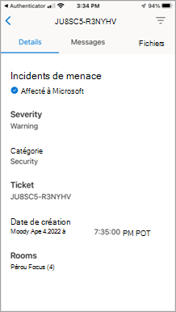
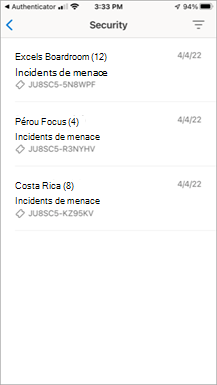
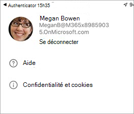

# salles Teams fonctionnalités d’application cliente mobile

Il peut arriver que vous deviez gérer salles Teams Services managés (MTMS) à partir de votre appareil mobile. L’application mobile offre de nombreuses fonctionnalités que vous pouvez gérer à partir de votre appareil mobile ou tablette.
## Avant de commencer

Vous devez être administrateur dans une organisation Microsoft 365 pour utiliser l’application mobile salles Teams.
Téléchargez l’application mobile salles Teams à partir [d’Apple App Store](https://apps.apple.com/app/apple-store/id761397963?pt=80423&ct=docsaboutadminapp&mt=8) ou du [Google Play Store](https://play.google.com/store/search?q=Microsoft%20Teams%20Rooms&c=apps).

**Pour obtenir l’application mobile MTMS**

1. Recherchez salles Teams Services managés dans l’App Store pour votre appareil et installez-le.
2. Connectez-vous avec votre adresse e-mail d’administrateur général et affichez le tableau de bord pour afficher l’intégrité du service, surveiller les licences utilisateur et afficher les messages et les demandes de service.
## Gestion des incidents

Voici quelques-unes des fonctionnalités dont vous disposez sur l’application mobile pour gérer les incidents.

- Recevoir des notifications Push pour les nouveaux incidents.
- Appuyez sur la notification pour ouvrir et afficher immédiatement les détails de l’incident.
- Répertoriez tous les incidents actifs et résolus, y compris l’état lu et non lu sur les messages.
- Affichez les détails de base de l’incident avec les informations de ticket, y compris les messages.
- Afficher les pièces jointes et les fichiers de ticket.
- Déconnexion à partir d’un panneau utilisateur (les notifications/messages sont désactivés s’ils sont déconnectés).

### Incidents Page

La page Incidents affiche les types d’incidents ouverts.

<!-- Image approuvée par author.>

## Gestion des tickets
Voici quelques-unes des fonctionnalités que vous avez sur l’application mobile pour gérer les tickets.

- Accusé de réception de l’incident (marquer comme lu).
- Lisez, publiez et répondez aux messages sur un ticket.
- Basculez en mode sombre.
- Ajoutez une pièce jointe (prenez et chargez des images).
- Signaler un incident (créer un ticket).

### Messages de ticket

### Détails du ticket

### Signaler un incident

### Afficher un incident par catégorie

<!-- Image approuvée par author.>
### Sécurité managée avec Microsoft Defender

### Communication avec des experts

### Se déconnecter

<!-- Image approuvée par author.>
## Questions fréquentes (FAQ)

Vous trouverez ci-dessous des réponses aux questions fréquemment posées.

**Que dois-je faire pour pouvoir utiliser l’application ?**

Pour utiliser l’application, vous devez disposer d’autorisations d’administrateur et d’un abonnement Microsoft 365 valide.

**Quelles langues sont prises en charge par l’application ?**

**Comment partager les incidents et les messages avec le reste de mon organisation ?**

**Puis-je utiliser cette application avec plusieurs comptes ou locataires ?**

**Je ne parviens pas à me connecter ou mon application se comporte drôlement. Que puis-je faire pour résoudre ou résoudre le problème ?**

Vous pouvez essayer certaines étapes courantes de résolution des problèmes liés aux applications mobiles :
- Fermez et rouvrez l’application.
- Désinstallez et réinstallez l’application. Vérifiez que vous êtes sur la dernière version de l’application.
- Si vous avez installé Microsoft Authenticator ou l’application Portail d’entreprise sur votre appareil, essayez de la réinstaller ou de la mettre à jour vers la dernière version. Si cela ne fonctionne pas, vous pouvez nous envoyer un e-mail à feedback365@microsoft.com pour nous en informer.

**Que dois-je faire si ma question n’est pas répondue ?**

## Étapes suivantes

Le client mobile offre à la fois la création de tickets et la gestion des fonctionnalités d’incidents au sein de votre organisation.

**Pour utiliser l’application mobile salles Teams**

1. Téléchargez l’application à partir de [l’apple App Store]() ou du [Google Play Store]()
1. Vérifiez que vous disposez d’un abonnement Microsoft 365 valide.
1. Utilisez vos informations d’identification professionnelles que vous utilisez pour accéder à l’application de bureau salles Teams.
