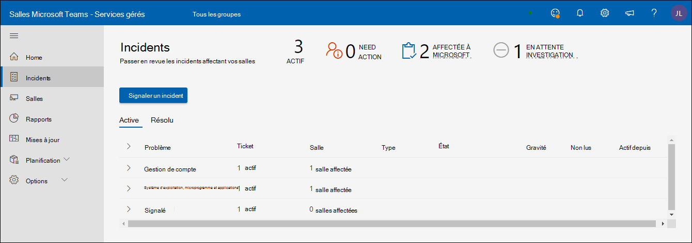
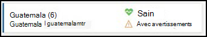
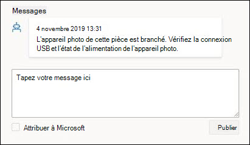
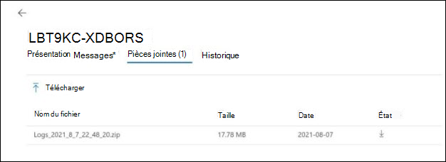

# Portail des salles de réunion gérées Par Microsoft

## Vue d’ensemble

Le portail des salles de réunion gérées (« Portail des salles ») fournit une vue d’ensemble de l’intégrité de vos salles de réunion. Une vue client de ce portail est destinée à votre visibilité et à vos commentaires, et à faciliter vos outils/pratiques de supervision existants.

L’étendue de la surveillance est

- Vue des incidents
  - Principaux problèmes affectant vos chambres
  - Actions nécessaires pour rétablir l’état sain des salles
  - Problèmes faisant l’objet d’une enquête par Microsoft
- Affichage des appareils Salle Microsoft Teams
  - Capture instantanée de l’état au niveau de l’appareil Salles Microsoft Teams (MTR)
  - Historique de base et détails pour chaque appareil

**Affichage des appareils Salle Microsoft Teams**

- Capture instantanée de l’état au niveau de l’appareil Salles Microsoft Teams (MTR)
- Historique de base et détails pour chaque appareil

> [!Important]
> Passez en revue [**Affecter des utilisateurs au rôle Administrateur de service administré**](enrolling-mtrp-managed-service.md#assign-users-to-the-managed-service-administrator-role) et assurez-vous que l’accès au portail est limité en fonction des besoins de votre entreprise.

## Terminologie

Voici les termes fréquemment utilisés dans le portail.

|Terme |Signification |
| :- | :- |
|**Logiciel de surveillance** |Agent de surveillance déployé sur chacun des appareils salle Microsoft Teams. |
|**Application** |Application système salle Microsoft Teams (qu’elle utilise Skype Entreprise ou Microsoft Teams comme service de collaboration. |
|**Salle/appareil** |Appareil système Microsoft Teams Room certifié. |
|**Non surveillé** | Les logiciels de surveillance Microsoft déployés dans le cadre de services gérés ne peuvent pas se connecter aux services cloud. Nous ne recevons pas de données de télémétrie sur l’appareil. |
|
**Sain /** 

**Malsain** 
|Anomalies dans l’appareil/périphérique. |
|**Supprimé** |Si un appareil est connu pour être en maintenance et que ses alertes doivent être ignorées, l’appareil peut être supprimé délibérément. |
|**Intégration** |État d’un appareil de salle pendant qu’il est configuré, mais n’est pas prêt en tant que salle prise en charge régulièrement. |
|**Incident** |Problème affectant les expériences de réunion des utilisateurs finaux qui ont besoin d’une action. |
|**Mal configuré** |La configuration détectée n’est pas correcte/ couramment utilisée. |
|**Support Ticket** |Identificateur de suivi Microsoft interne qui effectue le suivi de toutes les communications/actions concernant un incident. |

## Vue Incidents

Cette vue est une vue d’ensemble de l’onglet Incidents dans le portail des salles gérées. Cette page est la page d’accueil par défaut du portail.

### Résumé de niveau supérieur 
Le résumé de niveau supérieur montre en un coup d’œil les problèmes qui affectent vos salles, ce que vous devez faire et ce que Microsoft fait à leur sujet :

|# |Explication |
| :- | :- |
|1 |Types d’incidents affectant vos salles |
|2 |**NEED ACTION** : Éléments qui nécessitent votre intervention pour résoudre. |
|3 |**AFFECTÉ À MICROSOFT** : Éléments actuellement examinés par le personnel de Microsoft. |
|4 |**ENQUÊTE EN ATTENTE** : Éléments de la file d’attente à examiner par le personnel de Microsoft. |

Les incidents sont censés se trouver dans l’un des trois états suivants :

- **Action de besoin** : affectée à vous pour l’action
- **Affecté à Microsoft** : Affecté à Microsoft pour l’action suivante
- **Enquête en attente** : En cours d’investigation pour les étapes suivantes

### Examen des incidents

L’image suivante répertorie tous les incidents actuellement actifs dans vos salles. Celles qui vous sont affectées *sont en haut* : voici ce que vous devez examiner pour les étapes suivantes. En outre, celles affectées à Microsoft ou en attente d’investigation ont des détails que vous pouvez utiliser pour intervenir.

Le fait de cliquer sur l’un des éléments dont l’état est « **Action Des besoins** » affiche des détails supplémentaires sur l’incident.

## Types d’incidents

Les incidents sont classés en deux types de gravité larges :

- **Important** : Incidents susceptibles de provoquer des problèmes lors de réunions et qui doivent être classés par ordre de priorité.
- **Avertissement** : incidents qui sont des notifications pour planifier des actions de maintenance. Si ces derniers ne sont pas pris en charge, puis au fil du temps les chambres sont plus susceptibles de frapper un problème. Les avertissements sont destinés à vous donner le temps de planifier et d’orchestrer le support.

Un avertissement peut passer à « **Important** » s’il n’est pas pris en charge pendant un certain temps.

## État d’intégrité de l’appareil et des incidents

Les incidents classés **comme « Importants »** dans la gravité affectent l’état d’intégrité d’un appareil. S’il existe au moins un incident de **gravité = « Important »** associé à un appareil, il est classé comme **_étant défectueux_** .

Les incidents classés comme **gravité « Avertissement »** n’affectent pas l’état d’intégrité signalé sur un appareil. Toutefois, si un appareil est associé à des incidents de niveau d’avertissement, l’état d’intégrité de l’appareil s’affiche comme suit.

Voici quelques-uns des types d’incidents que vous pouvez voir et les explications pour chaque type. Pour chaque type, l’action associée à l’incident sera plus spécifique en fonction du problème.

**Tableau 1 : Incidents avec gravité « Important »**

|Type |Explication |
| :- | :- |
|**Affichage** |L’affichage connecté à l’appareil ne semble pas sain.|
|**Microphone de conférence, présentateur de conférence** |Les périphériques audio (microphone/haut-parleur) semblent être mal configurés. |
|**Caméra** |La caméra connectée à l’appareil ne semble pas saine. |
|**Ingestion HDMI** |L’ingestion HDMI n’est pas saine. |
|**Connexion** (Exchange) |Salles Microsoft Teams’application accède aux informations du calendrier à partir d’Exchange et tout problème de réussite de la connexion est signalé par un incident de connexion. |
|**Connexion** (Teams) |Salles Microsoft Teams application se connecte à l’appareil et l’échec de connexion est signalé avec cet incident (si le client utilise Teams). |
|**Connexion** (Skype Entreprise) |Salles Microsoft Teams application se connecte à l’appareil et l’échec de connexion est signalé avec cet incident (si le client utilise Skype Entreprise). |
|**Capteur de proximité** |Salles Microsoft Teams’application invite les participants à participer à une réunion s’ils sont à proximité. Les défaillances de cette fonctionnalité sont signalées dans le cadre de cet incident. |

**Tableau 2 : Incidents avec gravité « Avertissement »**

|Type |Explication |
| :- | :- |
|**Version de l’application** |La version de l’application salle Microsoft Teams s’exécutant sur l’appareil n’est pas à jour. Les versions obsolètes sont des causes connues des problèmes rencontrés par les utilisateurs. |
|**Version du système d’exploitation** |La version du système d’exploitation Windows s’exécutant dans la salle de réunion n’est plus recommandée. |
|**Réseau** |Ce type d’avertissement sera supprimé à court terme en raison d’un travail supplémentaire requis après l’évaluation. |

## Réponse aux incidents

Les incidents se répartissent en trois catégories : Action requise, Enquête en attente ou Affectation à Microsoft.

### Incidents « Nécessite une action »

Les incidents dont l’état est défini sur **« Needs Action »** vous sont affectés pour prendre une action corrective.

Chaque incident de ce type aura un champ d’action avec une action recommandée par Microsoft comme suit :

- Si vous avez effectué l’action, vous pouvez répondre à l’incident avec vos notes dans la zone Répondre, puis choisir « Affecter à Microsoft » avant de publier.
- Il est également possible que la notification soit incorrecte en fonction de votre révision. Dans ce cas, fournissez ce commentaire et affectez-le à Microsoft.
- Enfin, si vous souhaitez ajouter un commentaire pour fournir un contexte supplémentaire pour votre propre équipe ou pour l’équipe Microsoft, publiez le message sans activer « Affecter à Microsoft ».

>[!NOTE]
>Votre action corrective peut résoudre le problème et la surveillance des salles gérées efface cet incident de votre liste. Dans la situation ci-dessus, vous n’aurez peut-être pas l’occasion de résoudre le problème et de l’affecter à Microsoft. Ce problème sera résolu dans une version ultérieure.

### Incidents d'« enquête en attente »

Pour les incidents en cours d’investigation, le champ de description contient des informations sur l’incident, les causes typiques et les résolutions qui peuvent être utiles pour résoudre certains problèmes afin que vous puissiez agir sans délai.

### Incidents « Affectés à Microsoft »

Pour les incidents affectés à Microsoft, le champ « Action » contient de brefs détails sur les étapes correctives planifiées ou avancées. Ces étapes peuvent nécessiter une collaboration avec votre équipe et une collaboration étendue sera effectuée par e-mail/appels en fonction des besoins. Une fois ces problèmes résolus, ils disparaîtront du portail et, à l’avenir, il y aura un historique pour suivre ces incidents et leur résolution.

## Vue Salles

Chaque appareil est un proxy pour une salle et ses périphériques connectés. Un appareil sain représente une salle saine et un appareil défectueux représente une salle susceptible de provoquer des problèmes pendant les réunions. En plus de la vue Incidents, le portail des salles gérées fournit également une vue d’ensemble de l’intégrité des salles et vous aide à résoudre les problèmes de l’appareil et à comprendre les échecs répétés avec l’historique des incidents.

**Sain, non sain, déconnecté** Le panneau supérieur de la vue Salles fournit un instantané rapide du nombre de vos appareils dans un état correct (« Sain »), du nombre d’appareils affectés par des problèmes (« Non sains »), du nombre d’appareils qui ne fournissent pas de données de télémétrie (« Déconnectés ») et du nombre d’appareils supprimés des alertes (en guise de remplacement). Les chambres sont surveillées pour la santé à l’aide de critères évolutifs et heuristiques. L’objectif est de refléter la réalité de l’expérience utilisateur dans la salle aussi précisément que possible et de la rendre exploitable.

**Salles saines/non saines** :

Les appareils/périphériques qui n’ont pas d’incidents de gravité « Important » répondent aux critères d’intégrité actuels sont marqués comme sains. Toutefois, cela n’implique pas qu’il y ait une panne de pièce pour chaque appareil défectueux dans le portail. La partie description et action de l’incident contient des détails plus spécifiques sur le problème et l’impact potentiel sur l’expérience utilisateur.

**Appareil déconnecté :**

L’agent de supervision Microsoft déployé dans le cadre du pilote Salles gérées est déconnecté des services cloud Managed Room. Nous ne recevons pas de données de télémétrie sur la salle et n’avons pas l’état d’intégrité le plus récent. Cela peut se produire en raison de problèmes réseau, de modifications de stratégie de pare-feu ou de modifications apportées à l’image de l’appareil.

## Détails de la salle : État et modifications

**Détails de la salle : État** L’onglet *État* de l’appareil fournit une vue consolidée de l’état d’un appareil, de tous les problèmes actifs pour l’appareil, des actions nécessaires pour les résoudre ou qui sont en cours. L’onglet État contient également la répartition des différents composants d’intégrité de l’appareil sous *l’onglet Incidents*. Si un appareil est déconnecté, les détails de l’état ne sont pas disponibles.

**Afficher tous les signaux :** Pour afficher tous les signaux contenus dans une catégorie de signal, activez le bouton Bascule Afficher tous les signaux. Les flèches d’expansion s’affichent en regard des en-têtes de catégorie sur lesquels vous pouvez cliquer pour développer l’affichage accordéon.

**Supprimer/annuler la suppression d’un ticket** Quand une salle est inscrite, vous indiquez que vous souhaitez recevoir des notifications pour les modifications apportées à la télémétrie de la salle. Il arrive qu’un appareil ou périphérique particulier se trouve dans un état connu où vous ne souhaitez pas que des tickets ou des notifications soient générés. L’utilisation de la fonctionnalité Supprimer le ticket fait taire toute notification concernant ce signal particulier. Lorsque vous êtes prêt à ce que le service vous surveille et vous informe de ce signal, supprimez simplement le signal individuel.

**Expansion des catégories de tickets actifs** Sous chaque catégorie de ticket, tout ticket actif ou le dernier ticket résolu s’affiche avec la gravité et la date de la dernière mise à jour du ticket. En cliquant sur la flèche d’expansion, tous les tickets s’affichent avec un lien actif vers les informations de ticket.

Extension de catégorie de ticket actif : sous chaque catégorie de ticket, tout ticket actif ou le dernier ticket résolu s’affiche avec la gravité et la date de la dernière mise à jour du ticket. En cliquant sur la flèche d’expansion, tous les tickets s’affichent avec un lien actif vers les informations de ticket.

## Ticket actif : Vue d’ensemble

Chaque incident créé identifie le problème détecté et l’action corrective à prendre pour rétablir l’état sain de la salle. Le ticket généré transmet une vue d’ensemble des incidents avec tous les messages générés par l’IA des services managés, ainsi que par l’équipe d’ingénierie des services Microsoft chargée d’examiner le problème. Toutes les pièces jointes collectées pour la résolution des problèmes d’incident sont répertoriées. L’onglet Historique indique les dates auxquelles les problèmes ont été identifiés.

Ticket actif : messages L’interface utilisateur des messages est le principal outil de communication pour interagir avec les ingénieurs du service Microsoft qui travaillent à résoudre le problème identifié. Il est important de reconnaître les communications de Microsoft pour vous assurer que nous vous fournissons le meilleur service possible. Si vous avez effectué les actions recommandées, répondez à cet incident avec vos notes dans la zone Répondre et affectez-la à Microsoft en cliquant sur « Affecter à Microsoft » avant de publier.
Il est également possible que la notification soit incorrecte en fonction de votre révision. Dans ce cas, fournissez ce commentaire et affectez-le à Microsoft.
Enfin, si vous souhaitez ajouter un commentaire pour fournir un contexte supplémentaire pour votre propre équipe ou pour l’équipe Microsoft, il vous suffit de publier le message sans activer « Affecter à Microsoft ».

Ticket actif : pièces jointes Dans certains cas, les ingénieurs du service Microsoft ont besoin d’informations supplémentaires pour approfondir leur investigation du problème. L’onglet Pièce jointe vous permet de charger des images, des vidéos ou des journaux d’activité qui sont demandés.

Ticket actif : Historique Chaque signal de salle n’a qu’un seul numéro de ticket qui lui est affecté exprès. Un périphérique ou un périphérique de salle persiste dans une pièce et peut rencontrer des problèmes au fil du temps. En conservant ces informations sous un ID de ticket unique spécifique, toutes les informations historiques sont conservées et peuvent être analysées pour les modèles de comportement. L’interface utilisateur de l’historique fournit une vue de toutes les actions de tickets créées et résolues pour ce signal.

FAQ Comment les tickets dynamiques ont-ils un impact sur moi et sur le fonctionnement de mes chambres ?  
Les clients verront la création de tickets et de corrections plus intelligents qui s’étendent au-delà d’un simple ticket de signal binaire. Par exemple, il peut y avoir jusqu’à trois affichages dans une salle de réunion (affichage 1, affichage 2 & l’affichage du panneau tactile MTR). Toutefois, il n’y a qu’un seul signal d’affichage sain ou non sain. Avec les nouveaux tickets dynamiques, nous pouvons désormais générer des tickets uniques à chaque signal d’affichage.
