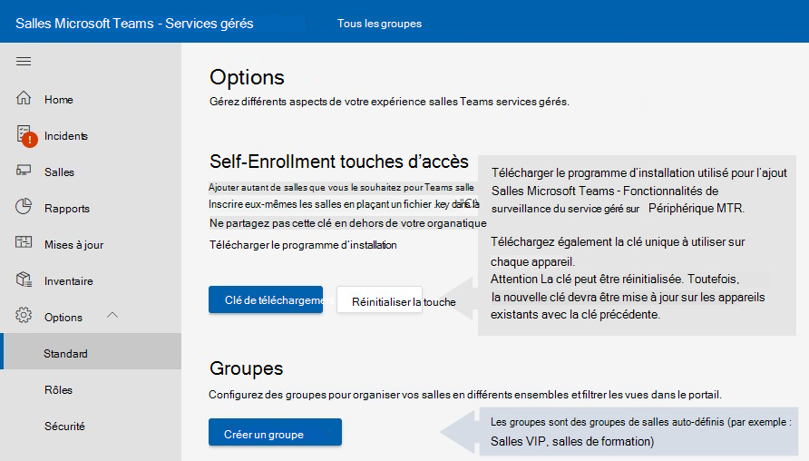

# Surveiller l’installation des logiciels de l’appareil

Le déploiement nécessite l’intégration Salles Microsoft Teams appareils aux services gérés Salles Microsoft Teams’équipe. L’agent du service de surveillance peut être utilisé avec des systèmes et périphériques Microsoft Teams salle de production (MTR).

## Opérations en tant qu’utilisateur administrateur de l’appareil MTR

Certaines procédures de configuration/installation nécessitent que vous vous connectiez à l’appareil en tant qu’administrateur.

Pour vous connecter à l’appareil en tant qu’administrateur (administrateur local) :

1. Assurez-vous de raccrocher les appels en cours et de revenir à l’écran d’accueil.
1. Dans l’interface utilisateur de Microsoft Teams Room, sélectionnez **Plus,** puis **Paramètres**, où vous êtes invité à sélectionner le mot de passe administrateur local sur l’appareil (le mot de passe par défaut est **_sfb)._**
1. Sélectionnez **Paramètres,** puis **sélectionnez Windows Paramètres** pour accéder Windows administrateur local.  

1. Dans la liste des utilisateurs affichée dans l’écran Windows connexion, sélectionnez Administrateur **(ou** administrateur local de votre appareil).

> [!NOTE]
> Si l’ordinateur est joint au *domaine,* sélectionnez Autre **utilisateur,** puis **utilisez .\admin,** ou le nom d’utilisateur de l’administrateur local configuré sur l’appareil en tant que nom d’utilisateur.  

Pour revenir à l’application Salle Microsoft Teams après avoir effectué les tâches d’administration nécessaires :

1. Dans la Windows ***menu Démarrer,*** connectez-vous à partir du compte administrateur.
1. Revenir à Microsoft Teams salle en sélectionnant l’icône de compte d’utilisateur à l’extrême gauche de l’écran, puis **Skype.**

> [!NOTE]
> Si l’Skype n’est pas répertorié, sélectionnez Autre utilisateur, entrez ***.\skype*** comme nom d’utilisateur, puis connectez-vous.

## Conditions préalables

Suivez les procédures ci-après pour configurer votre matériel avant d’essayer le processus d’inscription :

### Ajout de paramètres proxy (facultatif)

1. Connectez-vous en tant qu’administrateur en suivant les opérations effectuées en tant qu’utilisateur [administrateur de l’appareil MTR.](#performing-operations-as-the-admin-user-of-the-mtr-device)
1. Dans la Windows ***Rechercher** _ champ (section inférieure gauche de l’écran), entrez _ *cmd** (appuyez longuement sur l’écran ou sélectionnez à droite, puis sélectionnez Exécuter en tant qu’administrateur). ****  
1. Exécutez la commande suivante (les guillemets doubles à la fin de la commande sont importants) :
   - Si vous utilisez un ***serveur proxy*** unique : bitsadmin /Util /SetIEProxy LOCALSYSTEM MANUAL PROXY \_ : <proxyserver> <port> «  »

      *Exemple :* bitsadmin /Util /SetIEProxy LOCALSYSTEM MANUAL \_ PROXY contosoproxy.corp.net:8080 «  »
      

   - Si vous utilisez ***un fichier pac*** : bitsadmin /Util /SetIEProxy LOCALSYSTEM AUTOSCRIPT <pac file url> «  »

      
      *Exemple :* bitsadmin /Util /SetIEProxy LOCALSYSTEM AUTOSCRIPT `http://contosoproxy.corp.net/proxy.pac` «  »
      

### Activation des paramètres TPM

Si la fonction TPM sur un appareil Intel NUC est désactivée, activez la fonction TPM sur ces appareils comme suit :  

1. Branchez le clavier sur un périphérique NUC.  
1. Redémarrez l’appareil.  
1. Pour afficher l’écran BIOS, appuyez rapidement sur **F2.**  
1. Sélectionnez **Avancé.**  
1. Sélectionnez **Sécurité.**  
1. À droite, en dessous des fonctionnalités de sécurité, activez la technologie De confiance **de plateforme Intel.**  
1. Pour enregistrer vos paramètres, appuyez **sur F10.**  
1. Dans la zone de confirmation, sélectionnez **Oui.**  

## URL requises pour la communication

 > [!NOTE]
 > Tout le trafic réseau entre l’agent des périphériques MTR et le Salles Microsoft Teams – Portail de service géré est SSL sur le port 443.  Voir [Office 365 URL et plages d’adresses IP - Microsoft 365 Entreprise | Microsoft Docs.](/microsoft-365/enterprise/urls-and-ip-address-ranges?view=o365-worldwide&preserve-view=true)

Les hôtes suivants doivent  être autorisés si la liste d’utilisateurs du trafic est activée au sein de votre environnement d’entreprise :

agent.rooms.microsoft.com 
global.azure-devices-provisioning.net 
gj3ftstorage.blob.core.windows.net 
iothubsgagwt5wgvwg6.azure-devices.net 
blobssgagwt5wgvwg6.blob.core.windows.net 
mmrstgnoamiot.azure-devices.net 
mmrstgnoamstor.blob.core.windows.net 
mmrprodapaciot.azure-devices.net 
mmrprodapacstor.blob.core.windows.net 
mmrprodemeaiot.azure-devices.net 
mmrprodemeastor.blob.core.windows.net 
mmrprodnoamiot.azure-devices.net 
mmrprodnoamstor.blob.core.windows.net

## Procédure

Le processus d’inscription implique quelques étapes :  

1. Dans la barre de navigation gauche du Salles Microsoft Teams – Services gérés, développez Paramètres [http://portal.rooms.microsoft.com](https://portal.rooms.microsoft.com/) puis sélectionnez **Général.**   
1. Sous Clés *auto-inscription, sélectionnez* **Télécharger le** lien hypertexte du programme d’installation https://aka.ms/serviceportalagentmsi pour télécharger le logiciel de l’agent de surveillance.
1. Sélectionnez **La clé de téléchargement.** Placez le fichier clé sous le **dossier C:\Rigel** sur chaque appareil que vous inscrivez.  
1. **Facultatif :** Configurer les paramètres proxy de l’agent voir [Ajout de paramètres proxy (facultatif).](#adding-proxy-settings-optional)
1. Installez le programme d’installation de l’agent (téléchargé à l’étape 2) sur des unités MTR, soit en exécutant la MSI localement sur un appareil MTR, soit via votre moyen normal de publication d’applications MSI en masse sur les appareils de votre environnement (stratégie de groupe, etc.).  
1. La salle s’affiche dans le portail dans les 5 à 10 minutes. Si ce n’est pas le cas, contactez managedroomsupport@microsoft.com.  

## Installation

Après avoir téléchargé le programme d’installation à partir de Microsoft (à partir du portail ou à l’aide de l’URL AKA.ms fournie ci-dessus), dézipez son contenu pour accéder au fichier **ManagedRoomsInstaller.msi.**

Il existe deux modes d’installation : l’installation d’ordinateurs locaux individuels et le mode de déploiement en masse (généralement à l’aide d’une stratégie de groupe de la même méthode). Nous vous recommandons d’installer individuellement des ordinateurs qui ne sont pas joints à un domaine ou des ordinateurs dont vous n’avez aucun moyen d’utiliser des programme d’installation MSI à distance.  

En raison des nombreuses façons dont les clients peuvent exécuter des applications MSI en mode de déploiement en masse, ce document ne parcourira l’installation qu’en mode individuel.  

 > [!NOTE]
 > Le flux du programme d’installation est le même, quel que soit le mode exécuté. La seule différence est que l’installation ne demande pas à l’utilisateur d’appuyer sur les boutons suivant et fermer en mode de déploiement en masse.  

## Ough pas à pas joint &mdash; au domaine de l’appareil individuel

1. Connectez-vous à l’appareil en tant qu’administrateur : assurez-vous que les opérations d’administration effectuées en tant qu’utilisateur *de l’appareil* sont suivies.

1. Copiez les fichiers suivants sur l’appareil MTR :

   - Placez la « clé d’inscription automatique » (précédemment téléchargée à partir du portail) dans le répertoire **C:\Rigel** de l’appareil.
   - Copiez le **ManagedRoomsInstaller.msi** (précédemment téléchargé à partir du portail ou du AKA.MS) vers l’appareil.

1. Lors de l’exécution **de lManagedRoomsInstaller.msi** _, un écran de contrat de licence s’affiche. Après avoir lu le contrat, vérifiez _*_que j’accepte_*_ les termes dans le contrat de licence et j’appuie sur le bouton _ *Installer**.  

    Cette situation commence à l’installation Salles Microsoft Teams l’installation du logiciel de surveillance des services gérés. Une invite à une élévation (exécuter en tant qu’administrateur) s’affiche.
 1. Sélectionnez ***Oui.***

    L’installation se poursuit. Au cours de la procédure d’installation, une fenêtre de console s’ouvre et commence l’étape finale de la Salles Microsoft Teams – Installation du logiciel de surveillance des services gérés.  

    > [!NOTE]
    > Ne fermez pas la fenêtre. Une fois l’installation terminée, l’Assistant affiche un bouton « Terminer ».

## Fin de l’inscription

Une fois l’installation terminée, patientez 5 à 10 minutes et actualisez le portail. L’appareil est répertorié comme état *d’intégration.*

Dans *l’état* d’intégration, l’état de la salle est affiché et mis à jour, mais il ne élève aucune alerte ou ne crée pas de tickets de investigation.

Sélectionnez la salle, puis **sélectionnez S’inscrire**  pour recevoir des alertes d’incident, des tickets d’examen ou pour signaler un incident.

Pour toute question ou problème, ouvrez un client qui a signalé un incident dans le portail ou contactez le managedroomsupport@microsoft.com.

### Désinscrire et désinstaller un logiciel de surveillance

Pour désinscrire l’appareil, supprimez l’agent de surveillance du périphérique MTR comme suit :

1. Sur l’appareil surveillé, connectez-vous à l’appareil en tant qu’administrateur. N’oubliez pas de suivre les étapes d’opérations *effectuées en tant qu’utilisateur administrateur de l’appareil.*
1. Télécharger le script de réinitialisation [à partir aka.ms/MTRPDeviceOffBoarding.](https://aka.ms/MTRPDeviceOffBoarding)
1. Extrayez le script quelque part sur l’appareil et copiez le chemin d’accès.
1. Ouvrez PowerShell en tant qu’administrateur : dans le champ Windows ***Search** _ (section inférieure gauche de l’écran), entrez « Powershell », puis cliquez avec le bouton droit sur _*_Windows PowerShell_**.
1. Sélectionnez *« Exécuter en tant qu’administrateur* », puis acceptez l’invite UAC.
1. Entrez *Set-ExecutionPolicy –ExecutionPolicy RemoteSigned,* puis appuyez **sur Y** à l’invite suivante.  
1. Collez ou tapez le chemin d’accès complet du script de débordage décompressé dans la fenêtre PowerShell, puis appuyez sur **Entrée.**

   Par exemple :

   *C:\Users\admin\Downloads\MTRP \_ Device \_ Offboarding\MTRP \_ Device \_Offboarding.ps1*  

   Cette procédure rétablit les mises à jour MTR standard de l’appareil et supprime l’agent de surveillance et les fichiers MTRP.

1. Dans le menu de gauche de la Salles Microsoft Teams – Services gérés, sélectionnez **Salles.**  
1. Dans la liste des salles fournies, sélectionnez la  salle que vous voulez désinscrire, puis sélectionnez Désinscrire pour arrêter de recevoir des alertes d’incident ou des tickets de recherches, ou pour signaler un incident pour la salle.

## Tableau de dépannage

> [!NOTE]
> Tous les Salles Microsoft Teams – Les erreurs de surveillance des services gérés sont enregistrées sur un fichier de journal des événements spécifique nommé **Salles gérées Microsoft.** 

### ***Emplacement du fichier journal runtime de l’application*** =  

C:\Windows\ServiceProfiles\LocalService\AppData\Local\ServicePortalAgent\ app-x.x.x\ServicePortalAgent\ServicePortal \_ \_ Verbose LogFile.log, où **x.x.x** est le numéro de version de l’application.

|**Symptôme**  |**Procédure recommandée**  |
| :- | :- |
|
Vous recevez un message d’erreur indiquant   

***ERREUR : Exécutez cette application avec** _ 

_ *_privilèges élevés_**  
|Exécuter l’application avec des privilèges croissants et essayer à nouveau  |
|  |  |
|
Vous recevez un message d’erreur indiquant   

***Impossible de trouver les données TPM***  
|Assurez-vous que la fonction TPM (Module de plateforme approuvé) est mise en place sur votre appareil dans sa fonction BIOS. Cela se trouve généralement dans les paramètres de sécurité de l’appareil BIOS  |
|  |  |
|
Vous recevez un message d’erreur  

` `***ERREUR : Le compte d’utilisateur local nommé « Administrateur » ou « Skype » in trouvé***  
|Assurez-vous que les comptes d’utilisateur existent sur l’appareil Microsoft Teams systèmes de salle certifiés.  |
|  |  |
|Vous recevez des messages d’état d’erreur qui ne sont pas couverts ci-dessus  |Veuillez fournir une copie du journal d’installation à votre Microsoft Teams support système. |
