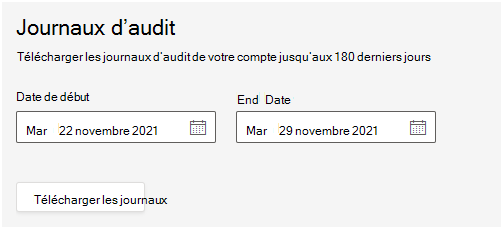

# Enregistrement d’audit dans salles Teams service géré

L’audit salles Teams service géré (TRM) vous permet de rechercher des enregistrements d’audit pour les activités effectuées dans le portail par les utilisateurs et les administrateurs. Cette fonctionnalité est activée par défaut. Seul l’administrateur du service géré est autorisé à exporter, puis à afficher les journaux.

> [!NOTE]
> Les actions effectuées dans le service TRM ne sont pas enregistrées dans les Microsoft 365'Office 365 audit 

## Exportation de journaux

Lorsque vous exportez tous les résultats pour une recherche dans le journal d’audit, les données brutes du journal d’audit unifié sont copiées dans un fichier de valeurs séparées par des virgules (CSV) téléchargé sur votre ordinateur local. 

**Pour télécharger les journaux** 

1. Voir les **journaux Paramètres >'audit >'équipe.**
1. Pour définir la plage de dates des journaux d’intérêt, entrez la **date de** début et la **date de fin.**

   > [!NOTE]
   > Les journaux ne sont disponibles que pendant 180 jours.

1. Sélectionnez **Les journaux de téléchargement.**

   

   Un message affiché en bas de la fenêtre vous invite à ouvrir ou enregistrer le fichier CSV. 

1. Sélectionnez   >  **Enregistrer sous,** puis enregistrez le fichier CSV sur votre ordinateur local. 

1. Le téléchargement de nombreux résultats de recherche lors de la recherche de toutes les activités ou sur une plage de dates étendue prend du temps. Une fois le téléchargement du fichier CSV terminé, un message s’affiche en bas de la fenêtre.

## Propriétés détaillées dans le journal d’audit

Le tableau suivant décrit les propriétés incluses dans le tableau CSV.

|Propriété|Description|
| - | - |
|activity.category|
Catégorie de l’objet sur lequel l’action a été effectuée. Valeurs possibles ;

**Utilisateur, Affectation, Invitation partenaire, Rôle**
|
|activity.objectName|Nom de l’objet modifié.|
|activity.operation|Type d’opération effectuée. Valeurs possibles : **Créer, Mettre à jour, Supprimer** |
|activity.resultStatus|
Indique si l’action (spécifiée dans la propriété **activity.operation)** a réussi ou non.

La valeur est Réussi **ou** **Échoué.**
|
|activity.tenantId|GUID du client sur lequel l’action a été effectuée|
|creationTime|Date et heure en temps universel coordonné (UTC) au format ISO lorsque l’utilisateur a effectué l’activité.|
|user.userId|Utilisateur ayant effectué l’action ayant entraîné la journalisé de l’enregistrement.|
|user.userTenantId|GUID du client de l’utilisateur qui a exécuté l’action|

