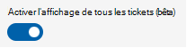

# Gestion des clients multilocataires pour les partenaires

La gestion multilocataire (MTM) dans le service de gestion Salles Teams Pro permet aux organisations partenaires de gérer plusieurs clients au même endroit, avec leurs propres informations d’identification de domaine. Les utilisateurs partenaires voient uniquement les salles client qu’ils sont chargés de gérer. Il est possible d’appliquer des rôles personnalisés pour chaque client dans le portail MTM, ce qui donne aux organisations partenaires un contrôle précis des autorisations sur les ressources du client. 

Le portail MTM est accessible via ce [lien](https://partner.rooms.microsoft.com/).

> [!Note] 
> Les organisations partenaires ne peuvent pas gérer leurs propres salles via le portail MTM. Ces salles peuvent être gérées dans le [portail Pro Management](https://portal.rooms.microsoft.com/). 

## Conditions préalables à la gestion de vos clients grâce à l’expérience MTM

Pour accéder au portail MTM, votre organisation doit être intégrée en tant que partenaire Elite pour MTR Pro Management. Pour devenir partenaire Elite, contactez askelite@microsoft.com.

## Clients d’intégration

Pour gérer les clients via le portail Pro Management-MTM, une relation doit être établie entre le locataire de l’organisation partenaire et le client via une invitation envoyée par le client. 

## Gestionnaires de locataires

Ce rôle intégré n’est configurable que dans le portail Pro Management-MTM. Ce rôle vous permet d’affecter un groupe d’utilisateurs qui acceptent les invitations, mais qui ne sont pas impliqués dans la gestion des salles client. Il est recommandé de configurer le rôle. Dans le cas contraire, seuls les utilisateurs disposant du rôle Administrateur de services gérés dans votre locataire pourront accepter les invitations.

**Pour configurer les gestionnaires de locataires**
 
1.  Connectez-vous au portail Pro Management-MTM en tant qu’administrateur général ou administrateur de service managé.
2.  Accédez à Gestionnaires de locataires.
3.  Sélectionnez **Ajouter des gestionnaires de locataires**.
4.  Dans le volet d’informations, recherchez les utilisateurs ou les groupes de sécurité.
5.  Sélectionnez l’utilisateur ou le groupe.
6.  Sélectionnez **Ajouter**.

### Invitation du client

Le partenaire doit fournir le nom de domaine aux clients. Seuls les rôles Administrateur général, Administrateur de service géré et Gestionnaires de locataires peuvent voir et accepter l’invitation lorsqu’ils se connectent au portail Pro Management-MTM. 

> [!Note]
> Même si ces rôles peuvent voir les invitations et les métadonnées de locataire de haut niveau, vous ne verrez pas les données du client tant qu’un rôle n’est pas attribué à ce client.

Les détails de l’invitation du client sont décrits dans [Gestion multilocataire pour les clients](multi-tenant-management-customer.md).

**Pour accepter une invitation en attente**

1. Connectez-vous au portail Pro Management-MTM en tant qu’administrateur général, administrateur de service géré ou gestionnaire de locataire.
1. Accédez à **Locataires**.
1. Sélectionnez l’invitation affichée avec l’état « En attente ».
1. Passez en revue les détails de l’invitation.
1. Affectez des utilisateurs qui seront les administrateurs principaux de ce client.
1. Sélectionnez **Accepter** pour établir la relation partenaire-client.

   La sélection de **Refuser** supprime l’invitation.

   > [!Note]
   > Il n’existe aucune association permanente avec l’utilisateur qui accepte l’invitation.

   > [!Note]
   > *Si l’invitation se voit refuser accidentellement l’invitation, le client doit créer une invitation.* 

**Pour passer en revue la configuration ou ajouter d’autres administrateurs principaux pour un locataire**

1. Sélectionnez le client dans la liste **Locataires** .
1. Dans le volet d’informations, sélectionnez **Administrateurs principaux**.
1. Recherchez l’utilisateur ou le groupe.
1. Sélectionnez **Ajouter** pour confirmer la sélection.

## Clients débardants

Pour ne pas intégrer un client, vous devez le supprimer de la liste **Locataires** .

**Pour supprimer un client** 

1. Connectez-vous au portail Pro Management-MTM en tant qu’administrateur principal pour le client que vous souhaitez supprimer.
1. Accédez à **Locataires**.
1. Sélectionnez le client que vous souhaitez supprimer.
1. Dans le volet détails du client, sélectionnez **Supprimer le client**.
1. Sélectionnez **Supprimer** dans l’invite de confirmation pour mettre fin à l’association entre vous et le locataire du client.

## Gestion des rôles de partenaires

Les rôles de partenaire permettent de déléguer les responsabilités à d’autres membres du personnel. Le concept de ces rôles est le même que celui décrit dans [Contrôle d’accès en fonction](rooms-pro-rbac.md) du rôle, mais dans le contexte de chaque client. En outre, il est important de noter que les rôles de partenaire sont distincts des rôles du client. Les rôles de partenaire peuvent être supprimés par le client. 

Le rôle **Administrateurs principaux** est le seul rôle intégré pour chaque client intégré et dispose de presque toutes les autorisations (dans le contexte du client) pour le service Pro Management (voir le tableau 1). Les autorisations de rôle partenaire** s’étendent uniquement jusqu’aux salles désignées par le client. Par exemple, si le client est une organisation mondiale et attribue au partenaire la gestion de toutes les salles américaines, l’administrateur principal peut uniquement gérer et déléguer des autorisations pour ces salles. Le Partenaire n’a aucune visibilité sur les autres salles que le Client peut avoir dans d’autres pays. 

**Pour gérer les utilisateurs dans le rôle **Partenaire** d’un client**

1. Accédez à **Paramètres > Rôles**. 
1. Sélectionnez le client dans la liste déroulante pour lequel vous souhaitez modifier le rôle de partenaire.
1. Sélectionnez le rôle intégré **Administrateurs principaux** dans la liste.
1. Sélectionnez **Affectations.**
1. Dans la liste, sélectionnez **Administrateurs affectés.**
1. Sélectionnez **Membres.**
1. Sélectionnez **Modifier.** 
1. Recherchez l’utilisateur ou le groupe de sécurité que vous souhaitez ajouter dans la barre de recherche.
1. Sélectionnez l’utilisateur ou le groupe.
1. Sélectionnez **Enregistrer** pour confirmer les modifications.

### Gestion des rôles de partenaires personnalisés pour un client

En tant que partenaire, vous pouvez créer des rôles personnalisés en fonction de vos besoins opérationnels. Par exemple, vous pouvez créer un rôle de support technique qui doit uniquement disposer des autorisations de gestion des incidents. 

**Pour gérer les rôles**

1. Accédez à **Paramètres > Rôles**. 
1. Sélectionnez le client dans le menu déroulant pour lequel vous souhaitez modifier le rôle de partenaire.
1. Créez un [rôle personnalisé](rooms-pro-rbac.md#built-in-roles).

|Fonctionnalité|Autorisation|**Administration MMR**|**Responsable de site**|**Technique du site**|**Administrateurs principaux**|
| :- | :- | :- | :- | :- | :- |
|Chambres|Afficher| &#10004;|&#10004;|&#10004;|&#10004;|
||Modifier|&#10004;|&#10004;|&#10004;|&#10004;|
||Réinitialiser la clé|&#10004;||||
||Télécharger la clé|&#10004;|&#10004;|&#10004;||
||Désinscription|&#10004;|&#10004;|&#10004;||
||Create |&#10004;|&#10004;|||
|Gestion des groupes|Afficher|&#10004;|&#10004;||&#10004;|
||Modifier|&#10004;|&#10004;|||
||Create |&#10004;|&#10004;|||
|Mettre à jour la gestion des anneaux|Afficher|&#10004;|&#10004;||&#10004;|
||Modifier|&#10004;|&#10004;||&#10004;|
|Rapports|Afficher|&#10004;|&#10004;||&#10004;|
||Créer un incident client|&#10004;|&#10004;|&#10004;|&#10004;|
|Gestion des tickets|Afficher|&#10004;|&#10004;|&#10004;|&#10004;|
||Mettre à jour|&#10004;|&#10004;|&#10004;|&#10004;|
|Paramètres MMR|Afficher|&#10004;||||
||Modifier|&#10004;||||
|Gestion des rôles|Afficher |&#10004;|||&#10004;|
||Modifier|&#10004;|||&#10004;|

> [!Note]
> Un utilisateur affecté en tant qu’administrateur principal pour le client A dispose d’autorisations complètes dans le service Pro Management pour ce client uniquement. Les autorisations de l’utilisateur dans le client A n’ont aucune influence sur les autres clients.

## Sécurité

Les clients finaux conservent le contrôle de l’accès à leurs données et peuvent supprimer complètement un partenaire ou des rôles spécifiques à tout moment.

Avec la fonctionnalité d’accès délégué, un partenaire n’a pas d’autres privilèges en dehors du portail Pro Management. Par exemple, en utilisant cette fonctionnalité pour inviter un partenaire à gérer des salles dans le portail Pro Management, aucune autorisation n’est accordée à AAD, au Centre Administration Teams ou à tout autre produit Microsoft. En outre, les partenaires n’ont pas accès à l’affichage ou à la modification des salles non définies dans l’étendue de l’invitation.

Une fois que la relation partenaire(client) est établie, comme décrit dans la section « Intégration des clients » de ce document, le partenaire peut afficher les données de salle dans le portail Pro Management. Cela inclut toutes les données présentes dans le portail de gestion Pro, mais dérivées d’autres produits Microsoft. Par exemple, les rapports de qualité des appels dans le portail Pro Management sont dérivés des données de qualité des appels Teams.

Les données résident dans le locataire du client et ne sont pas copiées vers le locataire du partenaire. 

Le portail MTM utilise l’authentification AAD pour valider les informations d’identification de connexion du partenaire. Il est important de noter qu’à ce stade, les stratégies d’authentification du client ne s’appliquent pas au partenaire. Par exemple, si le client dispose d’une stratégie d’authentification multifacteur, elle ne se traduit pas par le partenaire.

Le client peut extraire les journaux d’audit pour le portail Pro Management, qui inclut l’activité des partenaires. Consultez [Journalisation d’audit dans le service managé salles Teams](multi-tenant-auditing.md).

> [!Note]
> L’audit AAD et l’audit O365 ne capturent pas les journaux à partir du portail Pro Management.

## Navigation dans le portail MTM

Le portail MTM dispose de deux modèles interactifs pour naviguer entre les données client :

- Vues agrégées où les données de tous vos clients sont regroupées dans une liste unique et peuvent être filtrées.

  > [!Note]
  > Cette vue n’est prise en charge que dans la page **Incidents** lorsque **l’affichage Activer tous les tickets** est activé.
  >
  > 

 - Changement de locataire où seules les données du **client** sélectionné dans la liste déroulante sont affichées.
