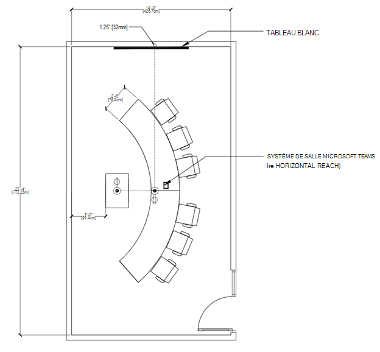

# Conseils pour les salles de réunion pour Teams

Cet article est destiné à guider les utilisateurs sur la façon d’optimiser les espaces de réunion avec des solutions et des appareils Salles Microsoft Teams. Il inclut des informations sur salles Teams’utilisation de l’appareil et de la solution, les dispositions et les spécifications.

# [Utilisations et dispositions des salles de réunion](#tab/uses)

## Vue d’ensemble

Salles Microsoft Teams solutions offrent une flexibilité d’objectif et même une flexibilité de déplacement dans un espace que les salles de réunion traditionnelles ne le font pas. Par exemple, avec salles Teams appareils, les utilisateurs peuvent améliorer leur collaboration avec un tableau blanc numérique, et des caméras intelligentes de suivi des personnes permettent de s’assurer que chaque participant local peut être vu, quel que soit l’endroit où il se trouve dans la salle. N’importe quel type d’espace et tout type de réunion peuvent être optimisés avec des appareils salles Teams ou des solutions salles Teams.

### Réunions axées sur la présentation

Les réunions de réunion et de présentation sont le premier compartiment, et cette réunion est généralement plus formelle. L’audio-visuel est une priorité et l’accent est mis sur la présentation du contenu. L’appareil est généralement fixe, ce qui permet aux utilisateurs de rester assis tout en interagissant avec l’appareil à partir d’une console au centre de table.

Les espaces de réunion et de présentation donnent la priorité à la présentation et à la discussion, ce qui signifie que la disposition et la technologie doivent être optimisées pour le partage de contenu et la co-création à distance. Tout le monde doit être impliqué dans la discussion et doit être en mesure de voir et d’interagir avec le contenu partagé.

**Disposition** des espaces de réunion et de présentation : les tables doivent être **fixes et situées** devant les écrans de salle. Dans les salles plus petites, les tables peuvent être attachées au mur, mais dans des espaces plus grands, elles doivent être séparées pour tenir compte des considérations de caméra.

### Réunions axées sur la co-création

Les réunions de réunion et de co-création sont généralement moins formelles avec une priorité sur la cocréation, l’entrée manuscrite et le tableau blanc. L’accès aux fichiers personnels est également au centre de ce compartiment. L’appareil peut être mobile, ce qui encourage les utilisateurs à se lever, à rassembler et à interagir avec l’appareil.

L’espace approprié relie les utilisateurs et la technologie en toute transparence et élimine les frictions pour les utilisateurs les plus novices. Les appareils Teams sont conçus pour être suffisamment conviviaux pour permettre aux jeunes étudiants ou aux nouveaux utilisateurs denaviguernerer, et pour permettre aux enseignants ou à l’administrateur de contrôler et de personnaliser dès la première utilisation.

**Rencontrez et co-créez des dispositions d’espace :** Les tables et l’équipement de cocréation peuvent avoir des positions flexibles et doivent accueillir des groupes de personnes travaillant aux tables ou à l’équipement.

### Présentation et réunions axées sur la co-création

N’oubliez pas que les deux types de salles peuvent gérer les deux types d’expériences si nécessaire. Les chambres peuvent également être conçues pour s’adapter facilement à la fois en ayant une technologie pour chaque utilisation. La chose importante à retenir est que quel que soit l’espace que vous équipez, d’un bureau privé à une salle de conférence, il doit être activé teams.

**Combinaison de dispositions d’espace de présentation et de co-création :** Une combinaison de cas d’usage d’autres scénarios de réunion peut être combinée pour former des salles polyvalentes où les réunions axées sur la présentation, ainsi que la co-création, peuvent être réalisées avec la même efficacité, souvent simultanément.

## Optimisation de l’expérience de réunion

Une grande expérience de réunion est le résultat de l’utilisation de la meilleure technologie possible pour un espace de réunion de manière à faciliter l’échange d’idées sans être intrusif.

### Expériences salles Teams natives par rapport à d’autres appareils

salles Teams aller au-delà de ce qui peut être fait avec Teams sur les appareils personnels en fournissant des fonctionnalités uniques dans la salle, telles que la jointure à une seule interaction tactile, des caméras de contenu pour partager des tableaux blancs physiques dans la réunion de manière intelligente, et des fonctionnalités de proximité telles que le transfert en toute transparence d’une réunion Teams de votre appareil personnel vers la salle.

Les systèmes non natifs et auto-construits qui s’appuient sur des services externes, ou une connexion apportez votre propre appareil, ne correspondront jamais vraiment à la facilité d’utilisation ou à la qualité immersive d’une salle Teams native.

Il est entendu qu’au cours d’un déploiement, des étapes intermédiaires (telles que le déploiement rapide de salles de réunion bring-your-own-device) peuvent être implémentées sur votre chemin vers une expérience Teams entièrement native dans vos espaces de réunion.

### Utilisation de Teams pour créer la meilleure expérience de réunion possible

En plaçant Teams sur tous vos appareils personnels et en déployant correctement Salles Microsoft Teams dans tous vos espaces, vous serez en mesure de faciliter la meilleure expérience de réunion possible pour chacun de vos utilisateurs. Au fur et à mesure que vous prévoyez d’obtenir la meilleure expérience possible, vous devrez traiter tous vos espaces en termes de déploiement technologique et d’aide et de formation pour les utilisateurs finaux.

Il est normal lors de la planification d’un déploiement à grande échelle à l’échelle de l’entreprise qu’il se produise par étapes avec certaines salles voyant la technologie ajoutée à des moments différents, ou même certains composants étant installés plus tôt que d’autres (par exemple, le déploiement de panneaux Teams pour la planification dans chaque salle d’un bâtiment particulier tout en installant des solutions salles Teams un étage ou même une pièce à la fois).

Préparez vos utilisateurs à le faire par étapes afin d’optimiser votre expérience de réunion Teams à chaque étape du processus.

#### Bonne expérience : appareils personnels seuls dans un espace de réunion

Vous pouvez commencer par ce plan en traitant tous vos espaces de réunion non-AV ou non équipés de collaboration. Vous pouvez toujours tirer parti de Teams dans vos salles de réunion, même si ces salles de réunion n’ont pas encore installé d’appareils Teams.

*Audio:* Un excellent pont vers un salles Teams complet consiste à planifier la technologie de réunion en fournissant à vos utilisateurs individuels des appareils audio certifiés Teams pour des salles et des groupes plus petits, ou en les déployant dans des salles avant une solution complète salles Teams pour les grands espaces destinés aux grands groupes où un petit appareil ne le coupe pas.

*Vidéo:* Lorsque ces salles sont utilisées, les utilisateurs individuels peuvent apporter leurs propres appareils pour partager le contenu de la réunion Teams et capturer leurs expressions avec leurs caméras individuelles. Les utilisateurs peuvent ensuite désigner une personne comme source d’audio unique pour le groupe local, en connectant cet appareil personnel au périphérique audio certifié, afin que tout le monde (local et distant) ait une expérience positive de l’audio de la réunion.

*Engagement :* L’activation de vos salles de réunion pour une meilleure expérience de réunion Teams, même si cela nécessite l’utilisation d’appareils personnels et de périphériques, permet toujours à vos utilisateurs de développer ce qu’ils peuvent faire avec Teams. Lorsque vos utilisateurs sont situés dans des bureaux privés et sur des stations de travail individuelles, Teams facilite les discussions en personne en plus d’interagir avec les participants distants.

#### Meilleure expérience : solutions salles Teams et pas d’appareils personnels

Si vous installez salles Teams solutions ou si vous avez déjà des salles qui ont déjà été déployées avec des appareils de salles Teams appropriés pour leurs espaces respectifs, vous êtes en bonne voie d’avoir des expériences de réunion exceptionnelles.

*Audio:* L’audio de ces espaces de réunion sera géré par la solution salles Teams et ses appareils audio certifiés Microsoft.

*Vidéo:* La vidéo dans ces espaces sera gérée par la solution salles Teams et ses caméras certifiées Microsoft.

*Engagement :* Vos utilisateurs finaux pourront tirer parti de l’expérience de salles Teams complète pour leurs réunions, en veillant à ce que tout le monde puisse participer facilement aux réunions et dispose d’un excellent contenu audio et vidéo.

#### Meilleure expérience : solutions salles Teams utilisées conjointement avec des appareils personnels

La formation de vos utilisateurs à l’utilisation de la technologie dans la coordination mène au résultat le plus efficace et le plus rationalisé. Le meilleur scénario possible est une combinaison de technologies installées et d’appareils personnels.

*Audio:* La plupart des travaux audio-vidéo et de connectivité de salle de réunion seront gérés par la solution salles Teams, tandis que les utilisateurs individuels peuvent participer à la même réunion avec des caméras activées et l’audio désactivé pour une expérience totalement immersive.

*Vidéo:* Les utilisateurs distants pourront voir tout le monde participer à la réunion au-delà de la parole et du partage de contenu. Un utilisateur distant peut activer la vidéo personnelle pour obtenir une vue de n’importe où dans la salle avec la possibilité de se concentrer sur n’importe quel participant.

*Engagement :* La conversation peut rester dynamique avec tous les participants, locaux et distants, impliqués et engagés. Le partage de vidéos à partir de salles Teams et via des caméras individuelles permet aux participants à distance de se sentir engagés avec tout le monde.

L’utilisation de Teams sur tous les appareils garantit que les utilisateurs des salles locales et les utilisateurs distants se sentent également impliqués dans les réunions.

## Considérations relatives à la technologie

Les bons choix de technologie audio et vidéo aideront les utilisateurs à tirer le meilleur parti de leurs réunions Microsoft Teams.

### Audio

Les considérations audio sont essentielles pour s’assurer que les participants à distance et dans la salle peuvent être clairement entendus et compris. La couverture du microphone et du haut-parleur doit inclure tous les sièges de la pièce sans laisser de vides.

*Les périphériques audio appropriés pour chaque espace* :

Une seule source d’audio pour un espace est nécessaire pour s’assurer qu’il n’y a pas de problèmes audio dans une salle de réunion.

Le fait de coupler le microphone et les haut-parleurs appropriés pour chaque espace donnera les meilleurs résultats possibles pour être entendu clairement sans distraction.

- Dans les espaces partagés, les options s’étendent, mais les mêmes principes demeurent : les participants à la réunion doivent être entendus et entendre clairement les autres.

  - Les périphériques audio tout-en-un sont des options faciles à déployer et de haute qualité pour les **espaces plus petits** avec un nombre limité de participants assis relativement près de l’appareil audio.

  - Dans les **grands espaces**, les microphones et les haut-parleurs se séparent pour garantir une couverture maximale entre tous les participants dans l’espace. De nombreuses solutions pour les salles de taille moyenne à grande sont disponibles dans le cadre d’un kit qui ne nécessite aucune configuration, seulement l’installation physique de microphones et de haut-parleurs.

  - Dans **les espaces les plus vastes et les plus complexes**, des solutions sont disponibles qui permettent d’utiliser une variété de types de microphone et d’orateur, comme capturer un conférencier et la voix du public à partir d’une grande salle tout en apportant simultanément l’appel à tout le monde. Ces solutions sont mieux réalisées lorsqu’elles sont déployées avec un partenaire Microsoft qui a une expertise dans la conception et le déploiement de solutions plus techniques.

### Vidéo

La vidéo est tout aussi importante que l’audio. La capture de la communication physique et non verbale, comme les expressions faciales ou les gestes, est aussi importante que le contenu de la salle de classe ou de la réunion pour garantir un engagement et une compréhension maximums. Les salles doivent être équipées de la taille d’affichage appropriée pour que tout le monde puisse vivre la réunion correctement, que ce soit dans la salle ou à distance. C’est pourquoi les salles doivent également disposer de la bonne couverture de caméra et du champ de vue (FOV) pour capturer efficacement tous les participants à la réunion dans la salle pour ceux qui rejoignent à distance.

*Les caméras appropriées pour chaque espace* :

Aussi importante que la qualité de l’audio, la vidéo de haute qualité est une nécessité pour la collaboration teams moderne. La technologie pour les caméras a considérablement avancé avec des caméras de haute qualité désormais disponibles pour tous les espaces.

- Les caméras incluses dans les appareils tels que les ordinateurs portables et les tablettes doivent être utilisées dans toutes les réunions pour s’assurer que tout le monde est vu et entendu. Pour les utilisateurs qui souhaitent offrir une expérience vidéo plus riche à **un** **espace personnel**, les caméras externes représentent un pas en avant par rapport aux appareils incorporés et peuvent être utilisées dans un plus grand nombre de scénarios et de configurations, garantissant ainsi que les participants aux appels partagent la meilleure qualité d’affichage d’eux-mêmes. Ces appareils s’installent facilement avec une connexion USB simple trouvée sur chaque PC.

- Dans les espaces partagés, les options et les fonctionnalités se développent. **Les salles plus petites** peuvent être couvertes par des caméras incluses dans des périphériques audio tout-en-un, tels que des barres de son. Ces caméras disposent généralement d’un large champ de vision, garantissant qu’elles capturent chaque participant dans l’espace en une seule prise de vue. Beaucoup de ces caméras comportent également des éléments tels que l’encadrement intelligent de l’image, de sorte que la caméra montre uniquement les personnes de la réunion et non des chaises vides, ou les personnes qui comptent, pour suivre et comprendre l’utilisation de l’espace.

- Dans les **grandes salles**, les caméras disposent de la technologie nécessaire pour capturer les participants dans une variété d’emplacements à des distances variables. Ces caméras peuvent capturer des groupes ou se concentrer sur des individus spécifiques tout en conservant une grande clarté visuelle. Les appareils qui peuvent suivre et ne présenter que des orateurs actifs sont régulièrement utilisés dans des espaces plus grands afin que de nombreux participants puissent être présentés individuellement tout au long d’une réunion à mesure qu’ils contribuent à leurs réflexions.

# [Salle Teams de signature](#tab/emtr)

## Salle Teams de signature

Cette section explore comment Microsoft transforme les salles de conférence standard en Salles Microsoft Teams Signature qui apportent le meilleur de la nouvelle expérience de première ligne Teams. Utilisez cet article pour obtenir des conseils sur la conception et la technologie des salles, les produits recommandés et les spécifications de référence microsoft Corporate Facilities.

## La vision de Microsoft pour l’avenir des salles de réunion

L’avenir du travail sera fluide, dynamique et alimenté par le cloud. Microsoft permet des expériences de réunion qui permettent aux personnes d’être là, où qu’elles soient et à tout moment. Ces réunions sont hybrides, ce qui signifie que vous pouvez les rejoindre en toute transparence. Les réunions qui utilisent des appareils optimisés pour signature salles Teams sont inclusives ; chaque voix est entendue et tout le monde est clairement représenté.

Microsoft voit un avenir où les réunions sont immersives et où les espaces sont conçus autour des personnes. Nos vues de réunion dynamiques maintiennent tout le monde connecté au contenu et entre eux : les présentations formelles sont associées à des conversations collaboratives. Les canevas numériques libèrent la créativité de groupe. Tout le monde peut se connecter en face à face où qu’il se trouve.

La vision de l’avenir des réunions repose sur une croyance simple : les réunions doivent offrir bien plus qu’une simple transaction ponctuelle. Les réunions seront conçues pour tout le monde, qu’ils soient dans la salle ou dans le monde entier.

## Qu’est-ce qu’une salle Teams signature ?

Dans l’espace de travail hybride de Microsoft, la nouvelle génération de normes de salle est informée par les besoins des participants à distance et dans la salle. Une salle Teams signature est conçue pour offrir une expérience de réunion hybride *élevée* , favorisant des connexions plus naturelles et immersives tout en permettant à tous les participants à la réunion de se sentir inclus, représentés et productifs. La salle suit un ensemble de principes concrets grâce à une combinaison de fonctionnalités logicielles et matérielles salles Teams et de conseils de configuration de la salle.

Le concept de la salle Signature Teams est conçu autour de deux objectifs clés qui sont pris en charge par un ensemble de principes d’expérience.

**Objectif 1 : Tous les participants à la réunion se sentent inclus, représentés et productifs.**

Principes de conception :

- Les participants à distance peuvent établir une présence authentique dans la salle

- Les participants dans la salle peuvent conserver leur identité individuelle dans la réunion

- Tous les participants à la réunion peuvent s’engager dans une collaboration sans limites.

**Objectif 2 : Les connexions semblent naturelles et immersives.**

Principes de conception :

- Les expériences sont mises à l’échelle pour la connexion humaine, ce qui permet des interactions qui ont l’impression que tout le monde se trouve dans la même pièce.

Une expérience de salle Teams signature est l’ensemble des composants et idées rassemblés sans aucune fonctionnalité unique définissant l’expérience. Les fonctionnalités et concepts individuels figurant dans notre salles Teams signature peuvent également être déployés eux-mêmes.

Exemples de déploiement de fonctionnalités spécifiques :

- Tirez parti de notre nouvelle expérience d’affichage front-of-room dans tous les types d’espaces de réunion où il existe une solution de salle Microsoft Teams qui la prend en charge.

- Implémentez des tables courbes et des dispositions frontales avec des expériences de salle Microsoft Teams traditionnelles pour promouvoir une meilleure connexion humaine dans la salle tout en conservant la continuité de l’expérience dans tous les espaces de réunion.

## Quand devez-vous déployer ce type de salle ?

Les salles Teams de signature ne sont pas destinées à remplacer tous les autres espaces de réunion au sein de votre organisation, mais plutôt à servir de complément aux espaces de réunion existants qui utilisent Microsoft Teams. Elles doivent être déployées stratégiquement au sein de votre organisation dans les espaces et les emplacements où les interactions en face à face avec les participants à la réunion à distance seront les plus appréciées.

Salles Microsoft Teams continueront à fournir des expériences de réunion hybrides centrées sur les personnes mises à disposition par le biais de mises à jour logicielles. Toutefois, il existe des technologies matérielles et des conseils de configuration de salle qui jouent un rôle clé dans l’optimisation de certaines expériences de salle Teams Signature. Il s’agit de la combinaison de ces composants qui composent une salle Teams signature. Lorsque vous évaluez le nombre de Salles Microsoft Teams que vous souhaitez passer à une salle Teams signature, tenez compte des éléments suivants :

- Quelles mises à niveau matérielles et/ou quels investissements doivent être effectués.

- La plupart des salles de conférence sont conçues pour optimiser la superficie en pieds carrés avec une relation étroite entre la dimension de la salle et la capacité de la salle. Une salle Teams signature hiérarchise l’expérience de réunion au-dessus de l’optimisation de la superficie en pieds carrés. Toutes les organisations ne peuvent pas hiérarchiser cette méthode pour chaque espace de réunion, car cela pourrait réduire le nombre de salles de réunion qu’elles peuvent avoir.

### Comprendre cet espace

*Équilibrer la flexibilité hybride avec l’inclusion* :

Chez Microsoft, nos règles de travail flexibles donnent la priorité aux employés de choisir et de flexibilité quant à l’endroit et au moment de leur travail. Ce changement fondamental de politique nous a fait repenser l’évolution de nos espaces de réunion et de nos technologies.

Notre recherche a montré que les réunions à distance pendant la pandémie ont eu de nombreux avantages, en particulier en ce qui concerne le sentiment accru d’équité et d’inclusion. Alors que nous envisageons de revenir dans un environnement hybride, avec une collaboration à distance et en personne qui se produit simultanément, nous avons cherché à créer des espaces de réunion qui prennent mieux en charge nos politiques de travail flexibles tout en maintenant des conditions de concurrence égales pour tous les participants grâce à la conception et à la technologie des salles.

### À quoi sert cet espace ?

Cet espace est dédié à l’expérience de réunion Teams la plus immersive pour un petit groupe de personnes dans la salle physique.

Tout comme une salle Microsoft Teams classique, les participants à la réunion peuvent se rencontrer à distance et localement pour travailler ensemble en toute transparence lors de la présentation et de la co-création de contenu.

### Comment cet espace est-il aménagé ?

La disposition de la salle est conçue pour une visibilité et un engagement maximum avec les participants distants et le contenu.

La disposition comporte une table courbée pour le contact visuel en personne et l’orientation des participants distants avec toutes les chaises face à l’écran afin que les participants puissent suivre le cours.

### Comment fonctionne l’audio ?

Grâce à des solutions audio certifiées pour Salles Microsoft Teams, les gens peuvent entendre et être entendus clairement.

À l’avenir, salles Teams prendra en charge les systèmes audio qui utilisent un concept appelé audio spatial. Avec l’audio spatial, le son émane de la direction de la personne qui parle. Par exemple, si une personne située sur le côté droit de la galerie de réunion parle, l’audio provient de l’orateur le plus proche de cet emplacement. Ce type d’expérience audio immersive permet aux réunions de ressembler davantage à une conversation en personne.

### Comment fonctionne la caméra ?

Une caméra ultra-large est positionnée à l’avant de la pièce sous les écrans pour capturer tout le monde dans l’espace.

La caméra ultra-large dispose d’un suivi intelligent des participants à la réunion afin qu’ils puissent être représentés individuellement dans une grande vue au lieu d’être des visages dans une grande image de l’ensemble de la salle.

### Comment fonctionnent les écrans à l’avant de la salle ?

Cette salle est optimisée pour la disposition Salles Microsoft Teams appelée première ligne et s’affiche à l’aide d’un projecteur haute résolution spécialisé à courte levée, créant ainsi une expérience immersive en face de la salle conçue spécifiquement pour les réunions Teams.

### Qu’est-ce que la première ligne ?

Pour donner aux personnes de la salle un meilleur sentiment de connexion aux participants distants et prendre en charge la collaboration avant, pendant et après les réunions, Microsoft a introduit une nouvelle disposition de contenu pour Salles Microsoft Teams appelée première ligne. Visuellement, cette nouvelle disposition déplace la galerie de vidéos vers le bas de l’écran et est fixée à un ratio spécifique pour garder les visages réalistes en taille. Avec cette disposition, les participants dans la salle peuvent voir des collègues distants face à face sur un plan horizontal, comme s’ils se trouvaient dans la même pièce.

Le contenu de la réunion est entouré de composants contextuels fluides tels que l’ordre du jour, les tâches et les notes, qui peuvent être mis à jour en temps réel, ce qui permet aux participants de rester impliqués et productifs. En outre, la conversation de réunion est clairement visible de sorte que lorsque vous rejoignez une réunion Teams à partir d’une salle Teams, vous pouvez facilement voir et participer à la conversation en temps réel. Dans une salle Signature Teams, ce contenu s’affiche sur un écran de proportions larges pour optimiser la taille du contenu de la réunion et le nombre de participants qui peuvent être affichés simultanément.

Cette disposition est prise en charge dans les configurations à affichage unique et double. Bien que la disposition de la première ligne soit particulièrement percutante dans une salle Teams signature, la première ligne peut être utilisée dans n’importe quelle salle Teams s’exécutant sur Windows, quelle que soit la configuration du mobilier et du matériel.

### Comment co-créez-vous du contenu ?

Dans Salles Microsoft Teams, les utilisateurs peuvent tirer parti du tableau blanc analogique traditionnel à l’aide de la fonctionnalité de capture intelligente. Pour une expérience modernisée où tous les participants peuvent dessiner et faire des entrées manuscrites ensemble, le Tableau blanc Microsoft est accessible à l’aide d’un écran tactile devant la salle, d’appareils complémentaires tels qu’un PC, un téléphone ou une tablette, et via Microsoft Surface Hub.

## Conseils de conception de salles Teams signature

Cette section est destinée à couvrir la construction d’une pièce à partir de zéro.

### Disposition de la salle

#### Taille de la chambre

25 pi x 14 pi

#### Capacité de la salle

Cette salle Signature Teams est optimisée pour entre 6 et 8 personnes.

#### Meubles de chambre

Cette salle dispose d’une table incurvée avec les participants assis d’un côté, ce qui permet aux participants dans la salle de conserver la visibilité les uns des autres et d’être placés face à face avec les participants distants.

Cette salle dispose d’une table de salle de réunion standard avec une hauteur de 30 pouces ou 76 cm.

#### Montage de l’équipement

La sélection d’un emplacement pour le matériel est généralement pilotée par la sélection du matériel certifié salle Teams utilisé dans un espace de réunion donné.

Pour les déploiements initiaux de Signature salles Teams au sein de nos installations Microsoft, nous avons choisi de monter la console de calcul et tactile Salles Microsoft Teams à la table, avec une caméra intégrée et un périphérique de barre de son (avec un son discret de droite et de gauche pour l’audio spatial) monté sur des meubles spécialisés, situés sous l’image affichée ainsi qu’entre le devant de la salle  projection et la table. Il est important de garder la console à la portée des participants sans empêcher leur utilisation de la table pour les appareils personnels et/ou les documents. Pour l’affichage, un projecteur haute résolution à courte durée est utilisé.

La plupart des participants choisissent de partager du contenu dans ce type de salle de réunion en rejoignant la réunion Teams via un appareil personnel. Toutefois, la présentation vidéo locale dans la salle doit également être mise à la disposition de la table de manière facilement accessible pour ceux qui ne peuvent pas participer à l’appel de réunion.

#### Positionnement de la console tactile

La console tactile Salles Microsoft Teams doit être montée au centre de la table à portée de main des participants à la réunion sans bloquer l’utilisation de la table pour les appareils ou les documents personnels.

#### Présentation vidéo locale

Bien que de nombreux participants puissent choisir de partager du contenu dans ce type de salle de réunion en rejoignant la réunion Teams via un appareil personnel à l’appel Teams, la présentation vidéo locale dans la salle doit également être mise à disposition à la table de manière facilement accessible.

## Infrastructure

### Puissance de l’infrastructure

Au minimum, les raccordements électriques doivent être fournis à la table (pour les utilisateurs finaux) et à l’emplacement de montage de l’équipement. Si des appareils de co-création sont utilisés dans l’espace, des connexions d’alimentation électrique peuvent également être nécessaires à leur emplacement(s).

### Données d’infrastructure

Les connexions réseau doivent être fournies à la fois à la table (pour les utilisateurs finaux) et à l’emplacement de montage de l’équipement (pour le réseau principal de la solution salles Teams). Si des appareils de co-création sont utilisés dans l’espace, des connexions réseau sont également requises pour se connecter au réseau principal pour la solution salles Teams.

### Traitements acoustiques des murs

Au moins deux murs d’une salle de ce type doivent être traités acoustiquement pour éviter les problèmes d’écho et de bruit ambiant pendant les réunions.

### Traitements de fenêtre

La lumière des fenêtres d’une pièce de ce type peut affecter négativement l’éclairage et introduire des reflets et des ombres à l’image de l’appareil photo et à l’affichage à l’avant de la pièce. Tout espace comportant des fenêtres doit également comporter des traitements de fenêtre qui permettent de bloquer la lumière externe pendant les réunions.

### Traitements de sol

Le sol d’une pièce de ce type doit être tapissé ou traité d’une autre manière acoustique pour éviter les problèmes d’écho et de bruit ambiant pendant les réunions.

### Éclairage

Des lumières au-dessus doivent être fournies pour éclairer l’espace uniformément, les participants à la salle de réunion ne semblent pas être lavés ou assis dans un espace sombre. Des efforts doivent être faits pour réduire au minimum l’éclairage direct sur les écrans devant les salles, les dispositifs de co-création ou d’autres surfaces réfléchissantes dans l’espace afin d’éviter d’introduire des reflets.

## Conseils sur la technologie

### Salles Microsoft Teams solution

Les salles Teams de signature nécessitent l’utilisation de Salles Microsoft Teams sur Microsoft Windows.

### Caméras

#### Options de l’appareil photo

Une pièce de ce type nécessite l’utilisation d’une caméra avant intelligente et ultra-large qui est correctement évaluée pour la largeur et la profondeur de l’espace.

#### Positionnement de la caméra

La caméra doit être placée à l’avant de la salle sous la projection avant de la salle, mais au-dessus du haut de la table pour capturer tous les participants à la salle de réunion au niveau le plus proche possible des yeux.

### Microphones

#### Options du microphone

Les réseaux de microphones avant-pièce et les microphones de table et de dessus de table fonctionnent pour ce type d’espace.

#### Positionnement du microphone

Les réseaux de microphones doivent être positionnés pour assurer la couverture de tous les participants à la salle de réunion dans la plage certifiée de l’appareil.

### Haut-parleurs

#### Options de l’orateur

Les tableaux de haut-parleurs et les haut-parleurs au-dessus de la salle fonctionnent pour ce type d’espace.

Remarque : L’audio spatial n’est pas encore disponible et peut nécessiter des périphériques audio spécifiques.

#### Positionnement de l’orateur

Les intervenants doivent être positionnés pour fournir une couverture à tous les participants à la salle de réunion dans la plage certifiée du ou des appareils utilisés.

### Affichage à l’avant de la salle

#### Type d’affichage

Une pièce de ce type nécessite l’utilisation d’un rapport d’aspect ultra-large, écran haute résolution devant de la pièce qui est dimensionné de manière appropriée pour la largeur et la profondeur de l’espace afin d’assurer une visibilité et une clarté maximales.

Voici quelques exemples de types d’affichage :

- Projecteurs laser

- Murs vidéo LED

- Écrans plats LCD ou OLED spécialisés

#### Fonctions d’affichage

Les salles Teams de signature, comme avec toutes les autres solutions Salles Microsoft Teams, nécessitent l’utilisation d’écrans capables de prendre en charge les fonctionnalités suivantes pour un bon fonctionnement :

- Veille et réveil rapide à partir du sommeil basé sur la synchronisation HDMI.

  - Pour les projecteurs, les périodes de préchauffement et de refroidissement automatiques doivent être prises en charge sans intervention de l’utilisateur.

- Les écrans doivent prendre en charge l’EDID et les résolutions appropriées requises par la conception Salles Microsoft Teams.

#### Positionnement de l’affichage

Une salle Teams signature nécessite que l’affichage soit placé devant tous les participants à la réunion dans la salle, directement en face de la table.

La ligne centrale horizontale de l’affichage doit être centrée sur la même ligne centrale que la table.

La ligne centrale verticale de l’affichage ne doit pas être décalée de +/- 15 degrés par rapport à la ligne d’œil d’un participant à la réunion dans la salle classique assis à la table.

#### Nombre d’affichages

Une salle Signature Teams nécessite que l’affichage soit un seul affichage de proportions larges, soit une combinaison combinée d’écrans qui peuvent avoir l’effet d’être un affichage unique lorsqu’ils sont vus par les participants à la réunion dans la salle.

### Options de co-création

#### Tableau blanc Microsoft

Tous les salles Teams sont en mesure de tirer parti du Tableau blanc Microsoft via un appareil de collaboration interactif tel qu’un Microsoft Surface Hub, un écran tactile devant la salle et des appareils complémentaires tels qu’un PC, un téléphone ou une tablette.

#### Tableau blanc traditionnel

Tous les salles Teams sur Windows peuvent tirer parti des tableaux blancs traditionnels dans une réunion Teams à l’aide de la fonctionnalité de capture intelligente et d’une caméra de contenu secondaire.

## Produits recommandés pour cet espace

### Console de salle Microsoft Teams et calcul

- Solution de Salles Microsoft Teams basée sur Windows.

Comme indiqué :

[Tap Logitech pour la console tactile associée à un appareil de calcul Lenovo.](https://www.microsoft.com/en-us/microsoft-teams/across-devices/devices/product/logitech-tap-room-systems-with-thinksmart-edition-tiny/523)

Autres options :

- [Lenovo ThinkSmart Core + Controller](https://www.microsoft.com/en-us/microsoft-teams/across-devices/devices/product/lenovo-thinksmart-core-controller/948)

- [Système de conférence personnalisable Crestron Flex](https://www.microsoft.com/en-us/microsoft-teams/across-devices/devices/product/crestron-flex-customizable-conference-system/849)

- [Système de conférence personnalisable Crestron Flex Avancé](https://www.microsoft.com/en-us/microsoft-teams/across-devices/devices/product/crestron-flex-customizable-conference-system/849)

- [Poly G10-T](https://www.microsoft.com/en-us/microsoft-teams/across-devices/devices/product/poly-g10-t/564)

### Caméra

- Une caméra ultra-large avec un cadrage intelligent.

Comme indiqué :

[Jabra Panacast 50](https://www.microsoft.com/en-us/microsoft-teams/across-devices/devices/product/jabra-panacast-50-series/922)

Autres options :

- [Jabra PanaCast](https://www.microsoft.com/en-us/microsoft-teams/across-devices/devices/product/jabra-panacast/353)

- [Yealink UVC30](https://www.microsoft.com/en-us/microsoft-teams/across-devices/devices/product/yealink-uvc30-room/409)

- [Yealink UVC40](https://www.microsoft.com/en-us/microsoft-teams/across-devices/devices/product/yealink-uvc40/648)

- [Bose Videobar VB1](https://www.microsoft.com/en-us/microsoft-teams/across-devices/devices/product/bose-videobar-vb1/809)

- [Poly Studio](https://www.microsoft.com/en-us/microsoft-teams/across-devices/devices/product/poly-studio/206)

- Poly Studio E70

- [Logitech Rally](https://www.logitech.com/product/rally-ultra-hd-conferencecam)

- [Barre de rallye de Logitech](https://www.logitech.com/products/video-conferencing/room-solutions/rallybar.960-001308.html)

- [Logitech Rally Bar Mini](https://www.logitech.com/products/video-conferencing/room-solutions/rallybarmini.960-001336.html)

### Microphone

- Une solution de microphone certifiée qui capturera clairement tous les participants à la réunion dans la salle.

Comme indiqué :

[Jabra Panacast 50](https://www.microsoft.com/en-us/microsoft-teams/across-devices/devices/product/jabra-panacast-50-series/922)

Autres options :

- [Yealink UVC40](https://www.microsoft.com/en-us/microsoft-teams/across-devices/devices/product/yealink-uvc40/648)

- [Bose Videobar VB1](https://www.microsoft.com/en-us/microsoft-teams/across-devices/devices/product/bose-videobar-vb1/809)

- [Poly Studio](https://www.microsoft.com/en-us/microsoft-teams/across-devices/devices/product/poly-studio/206)

- [Lenovo ThinkSmart Bar](https://www.microsoft.com/en-us/microsoft-teams/across-devices/devices/product/lenovo-thinksmart-bar/949)

- [Lenovo ThinkSmart Bar XL](https://www.microsoft.com/en-us/microsoft-teams/across-devices/devices/product/lenovo-thinksmart-bar/949)

- [Hub de salle de conférence Biamp Devio avec micro de plafond Parle](https://www.microsoft.com/en-us/microsoft-teams/across-devices/devices/product/biamp-devio-conference-room-hubs/920)

- [Hub de salle de conférence Biamp Devio avec micro de table Parle](https://www.microsoft.com/en-us/microsoft-teams/across-devices/devices/product/biamp-devio-conference-room-hubs/920)

- [Système audio à montage mural Shure MXA710-4FT](https://www.microsoft.com/en-us/microsoft-teams/across-devices/devices/product/shure-mxa710-audio-systems/967)

- [Système d’audioconférence Nureva HDL300](https://www.microsoft.com/en-us/microsoft-teams/across-devices/devices/product/nureva-hdl300-audio-conferencing-system/739)

- [Audio de la salle de réunion QSC : haut-parleurs au plafond](https://www.microsoft.com/en-us/microsoft-teams/across-devices/devices/product/qsc-meeting-room-audio-in-ceiling-speakers/700)

- [Audio directionnel QSC - audio de plafond](https://www.microsoft.com/en-us/microsoft-teams/across-devices/devices/product/qsc-directional-audio/704)

- [Audio de la salle de réunion QSC : haut-parleurs suspendus](https://www.microsoft.com/en-us/microsoft-teams/across-devices/devices/product/qsc-meeting-room-audio-pendant-speakers/711)

- [Audio biamp avec micro de plafond Parlé](https://www.microsoft.com/en-us/microsoft-teams/across-devices/devices/product/biamp-complete-room-audio-with-parle-ceiling-mic/613)

- [Audio biamp avec micros de table Parlé](https://www.microsoft.com/en-us/microsoft-teams/across-devices/devices/product/biamp-complete-room-audio-with-parle-ceiling-mic/613)

- [Solution audio de plafond Bose DS4](https://www.microsoft.com/en-us/microsoft-teams/across-devices/devices/product/bose-ds4-ceiling-audio-solution/694)

- [Solution audio de plafond Bose ES1](https://www.microsoft.com/en-us/microsoft-teams/across-devices/devices/product/bose-es1-ceiling-audio-solution/506)

- [Shure Microflex Advance MXA910 + IntelliMix P300](https://www.microsoft.com/en-us/microsoft-teams/across-devices/devices/product/shure-microflex-advance-mxa910-intellimix-p300/429)

- [Biamp Tesira DSP & Sennheiser TeamConnect Ceiling 2](https://www.microsoft.com/en-us/microsoft-teams/across-devices/devices/product/biamp-tesira-dsp-sennheiser-teamconnect-ceiling-2/359)

### Haut-parleurs

- Solution d’orateur certifié qui fournira un son clair et intelligible à tous les participants à la réunion dans la salle.

Comme indiqué :

[Jabra Panacast 50](https://www.microsoft.com/en-us/microsoft-teams/across-devices/devices/product/jabra-panacast-50-series/922)

Autres options :

- [Yealink UVC40](https://www.microsoft.com/en-us/microsoft-teams/across-devices/devices/product/yealink-uvc40/648)

- [Bose Videobar VB1](https://www.microsoft.com/en-us/microsoft-teams/across-devices/devices/product/bose-videobar-vb1/809)

- [Poly Studio](https://www.microsoft.com/en-us/microsoft-teams/across-devices/devices/product/poly-studio/206)

- [Lenovo ThinkSmart Bar](https://www.microsoft.com/en-us/microsoft-teams/across-devices/devices/product/lenovo-thinksmart-bar/949)

- [Lenovo ThinkSmart Bar XL](https://www.microsoft.com/en-us/microsoft-teams/across-devices/devices/product/lenovo-thinksmart-bar/949)

- [Hub de salle de conférence Biamp Devio avec micro de plafond Parle](https://www.microsoft.com/en-us/microsoft-teams/across-devices/devices/product/biamp-devio-conference-room-hubs/920)

- [Hub de salle de conférence Biamp Devio avec micro de table Parle](https://www.microsoft.com/en-us/microsoft-teams/across-devices/devices/product/biamp-devio-conference-room-hubs/920)

- [Système audio à montage mural Shure MXA710-4FT](https://www.microsoft.com/en-us/microsoft-teams/across-devices/devices/product/shure-mxa710-audio-systems/967)

- [Système d’audioconférence Nureva HDL300](https://www.microsoft.com/en-us/microsoft-teams/across-devices/devices/product/nureva-hdl300-audio-conferencing-system/739)

- [Audio de la salle de réunion QSC : haut-parleurs au plafond](https://www.microsoft.com/en-us/microsoft-teams/across-devices/devices/product/qsc-meeting-room-audio-in-ceiling-speakers/700)

- [Audio directionnel QSC - audio de plafond](https://www.microsoft.com/en-us/microsoft-teams/across-devices/devices/product/qsc-directional-audio/704)

- [Audio de la salle de réunion QSC : haut-parleurs suspendus](https://www.microsoft.com/en-us/microsoft-teams/across-devices/devices/product/qsc-meeting-room-audio-pendant-speakers/711)

- [Audio biamp avec micro de plafond Parlé](https://www.microsoft.com/en-us/microsoft-teams/across-devices/devices/product/biamp-complete-room-audio-with-parle-ceiling-mic/613)

- [Audio biamp avec micros de table Parlé](https://www.microsoft.com/en-us/microsoft-teams/across-devices/devices/product/biamp-complete-room-audio-with-parle-ceiling-mic/613)

- [Solution audio de plafond Bose DS4](https://www.microsoft.com/en-us/microsoft-teams/across-devices/devices/product/bose-ds4-ceiling-audio-solution/694)

- [Solution audio de plafond Bose ES1](https://www.microsoft.com/en-us/microsoft-teams/across-devices/devices/product/bose-es1-ceiling-audio-solution/506)

- [Shure Microflex Advance MXA910 + IntelliMix P300](https://www.microsoft.com/en-us/microsoft-teams/across-devices/devices/product/shure-microflex-advance-mxa910-intellimix-p300/429)

- [Biamp Tesira DSP & Sennheiser TeamConnect Ceiling 2](https://www.microsoft.com/en-us/microsoft-teams/across-devices/devices/product/biamp-tesira-dsp-sennheiser-teamconnect-ceiling-2/359)

### Affiche

- Un projecteur laser à courte ou très courte durée, haute résolution et haute luminosité avec éveil automatique lors de la synchronisation et de refroidissement pendant la fonction de veille. Un écran de projecteur à faible gain avec des propriétés de rejet de la lumière ambiante fournira la meilleure qualité d’image dans les pièces lumineuses.

Comme indiqué :

- [Projecteur Eb-PU1007 avec objectif ELPLX01S Ultra Short Throw](https://epson.com/For-Work/Projectors/Large-Venue/EB-PU1007B-WUXGA-3LCD-Laser-Projector-with-4K-Enhancement/p/V11HA34820)
- [Da-Lite UTB Contour Screen | | d’écran HD Progressive 0.6 Cinemascope 138 » Diagonale](https://www.legrandav.com/products/da-lite/screens/fixed_frame_screens/utb_contour)

Autres options :

Pour le scénario idéal, d’autres options d’affichage (projecteurs alternatifs, murs LED et écrans plats) doivent être en mesure de créer une image de tableau couvrant, prendre en charge une image 4k et un rapport d’aspect 21:9.

### Options de co-création

- Un tableau blanc analogique avec une caméra de contenu OU

- Un écran tactile interactif compatible.

Comme indiqué :

[Logitech Scribe](https://www.microsoft.com/en-us/microsoft-teams/across-devices/devices/product/logitech-scribe/966)

Autres options :

Caméras de contenu :

- [Caméra de contenu Yealink UVC30](https://www.microsoft.com/en-us/microsoft-teams/across-devices/devices/product/yealink-uvc30-content-camera/647)

- [Canevas Huddly](https://www.microsoft.com/en-us/microsoft-teams/across-devices/devices/product/huddly-canvas/568)

- [Kit de caméra de contenu Logitech BRIO](https://www.microsoft.com/en-us/microsoft-teams/across-devices/devices/product/logitech-brio-content-camera-kit/349)

Appareils tactiles interactifs :

[Microsoft Surface Hub 2S](https://www.microsoft.com/en-us/microsoft-teams/across-devices/devices/product/microsoft-surface-hub-2s/822?)
