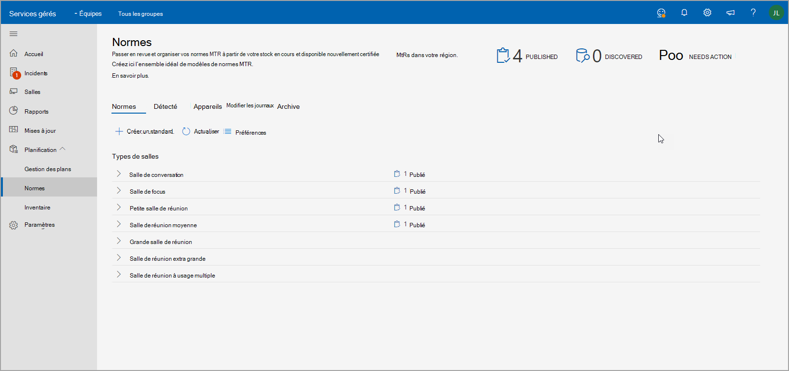
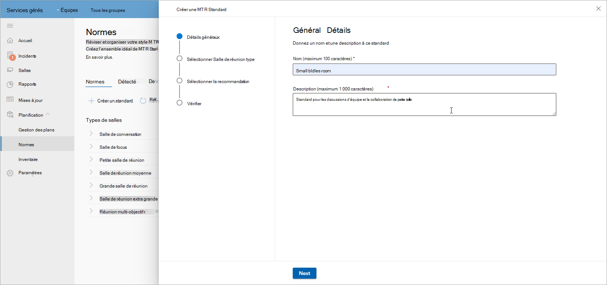
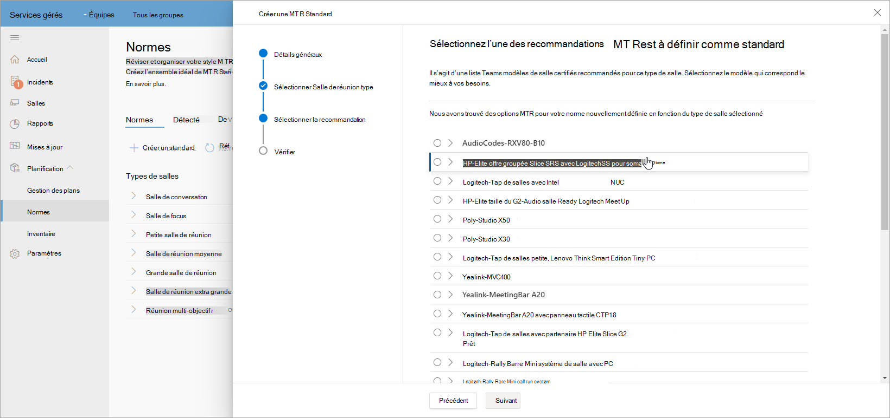
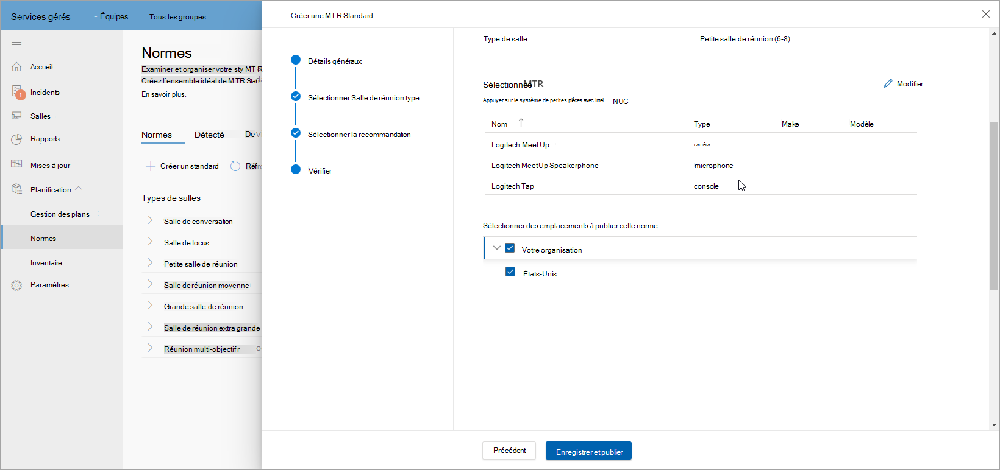
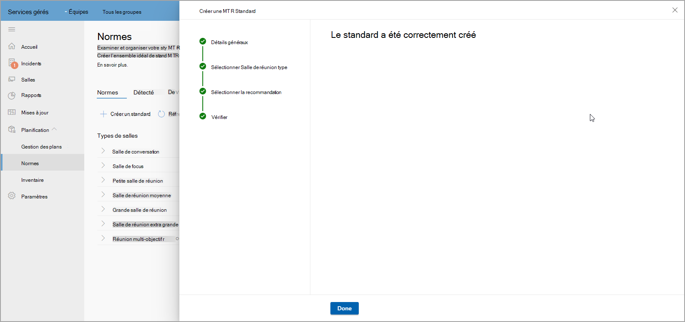
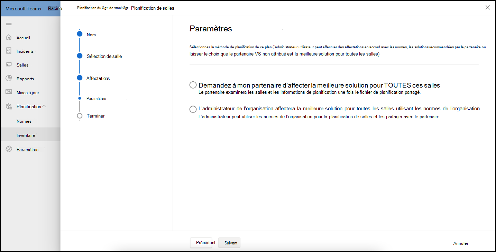
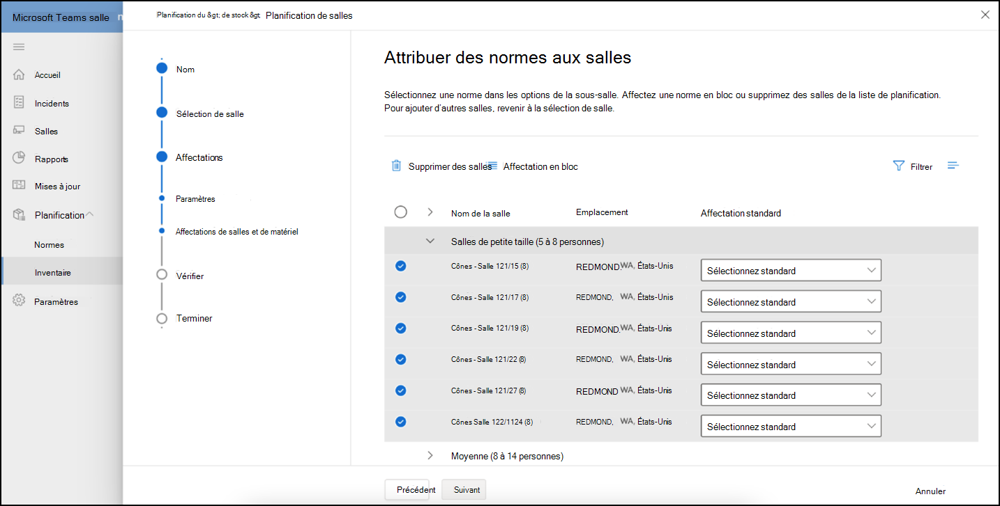
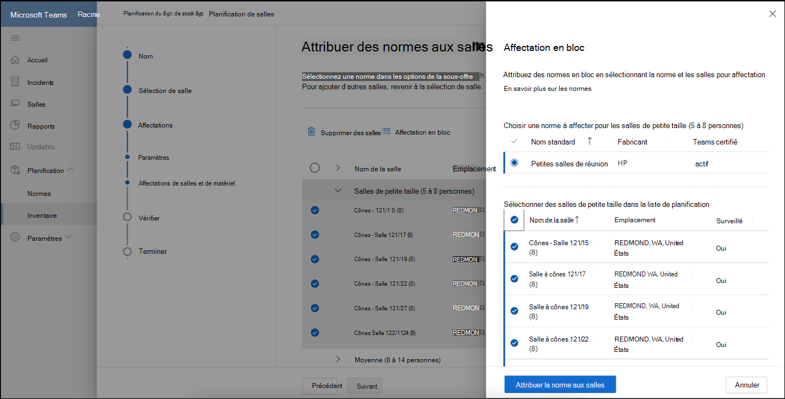
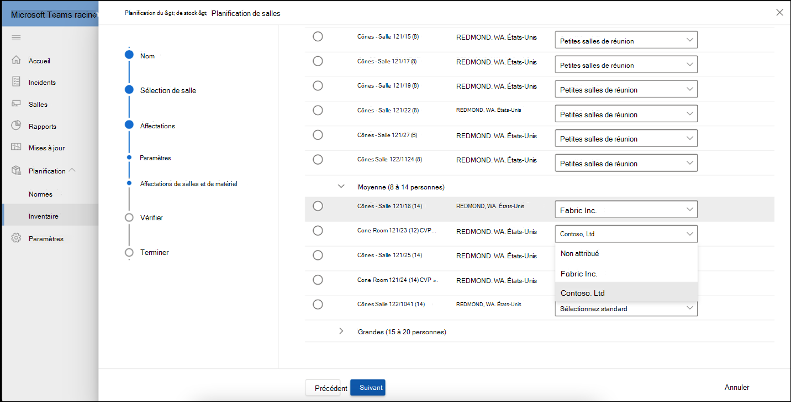

# Normes et planificateur de salles

En utilisant les recommandations intelligentes de votre environnement, vous pouvez créer et organiser des normes. Vous pouvez ensuite publier vos normes sur une région, un site, un bâtiment ou une salle de réunion spécifique pour partager des salles planifiées avec des partenaires afin de suivre les déploiements de salles.

## Afficher les types de salles de réunion

Sur cette page, vous pouvez afficher les types d’espaces de réunion ou de salle au sein de votre organisation. Bref aperçu du nombre de normes que vous avez pour les salles de réunion, du nombre de nouveaux appareils découverts et du nombre de périphériques nécessitant une action.

Cette page comprend également une barre de commandes à partir de laquelle vous pouvez lancer le flux de travail  **Créer un flux** de travail standard ou accéder aux appareils découverts, modifier les journaux et archiver.

### Créer des normes

Utilisez le **flux de travail Créer un** flux de travail standard pour créer un flux de travail standard.

**Pour lancer le flux de travail**

1. **Sélectionnez Créer un standard MTR**, puis fournissez des détails généraux tels que le nom et la description de la norme.

   

1. Sélectionnez le type de salle de réunion pour cette norme.

   

1. Sélectionnez l’un Teams modèles de salle certifiés dans votre inventaire de matériel. La liste varie en fonction du type de salle sélectionné à l’étape précédente.

   

1. Examinez les informations standard de latr.

   

1. Publiez vos normes sur une région, un site, un bâtiment ou une salle de réunion spécifique.

   

Une fois publiées, les normes sont utilisées à des fins de planification.

### Périphériques détectés

Dans les normes, sélectionnez **Périphériques découverts** pour afficher tous les périphériques découverts non standard au sein de votre organisation.

Vous pouvez prendre des mesures pour examiner et créer des normes à partir de ces appareils détectés dans votre inventaire.

## Planification de salles

Planifiez des salles avec des normes pour l’extension des réunions à l’aide de **l’Assistant Planificateur de** salles.

Pour lancer le planificateur de salle avec l’expérience guidée :

1. Dans la barre de navigation gauche, sélectionnez Inventaire, puis **choisissez Salles de plan**.

   

1. Ajoutez des salles au planificateur à partir de votre annuaire d’emplacements.

   

1. Définissez vos préférences de devoir de normes comme suit :

   - Si vous avez enregistré un partenaire de planification, vous pouvez sélectionner l’attribution de la meilleure solution à mon partenaire **pour toutes ces salles**. Cette option permet au partenaire de sélectionner la solution la plus trouvée localement pour son client.

   - Si vous prévoyez un développement des réunions en interne, sélectionnez Administrateur de l’organisation pour affecter la meilleure solution à toutes les salles en utilisant les **normes de l’organisation**. Les normes sont automatiquement attribuées à partir de ce qui a été approuvé et publié par l’organisation dans l’affichage Normes.

1. **Sélectionnez l’administrateur de l’organisation pour affecter la meilleure solution...**

   

Vous pouvez affecter des normes en bloc à plusieurs salles.

1. Vérifiez plusieurs salles sous **le nom de la salle**.

   

   

Si plusieurs normes sont disponibles pour un emplacement, une région ou un site, sélectionnez une norme dans la  liste des affectations standard à affecter à une salle de réunion affichée sous son **nom.**

Examinez les affectations standard et terminez le plan. Vous pouvez imprimer le plan au format PDF afin de le partager avec des partenaires.

## Contrôle Access

L’Assistant Planificateur de salle est activé par défaut pour le rôle Administrateur de service géré. Pour le client et tous les autres rôles intégrés, définissez les autorisations pour la gestion des stocks sous **l’onglet Autorisations** .

