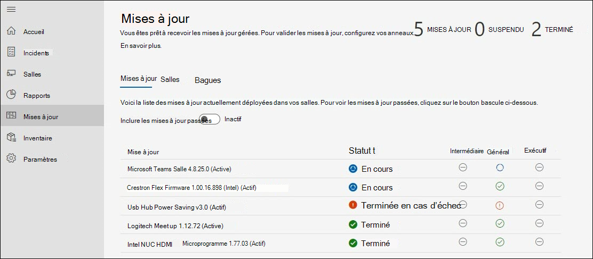
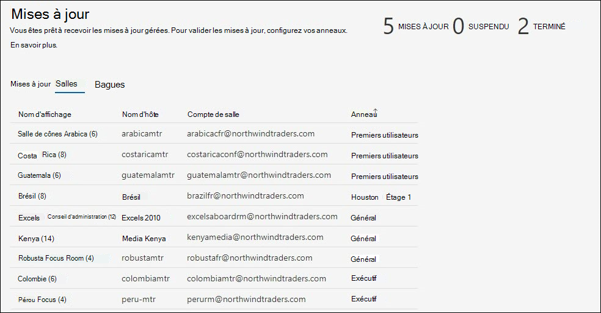

# Gestion des mises à jour 
Une salle de réunion moderne est équipée d’un appareil Salles Microsoft Teams et d’autres périphériques tels qu’une caméra, un microphone ou un haut-parleur, et peut-être davantage de périphériques pour créer une expérience de réunion inclusive et efficace. L’équipement de différents types de TYPES DEXX FOURNIT l’expérience organisationnelle exacte souhaitée ; toutefois, ils doivent être conservés régulièrement avec le logiciel et le microprogramme.  

Les services gérés pour Salles Microsoft Teams vous assurent que chaque salle de votre organisation sera gérée aux niveaux recommandés afin de remettre une salle toujours prête et qui fonctionne correctement. L’objectif de Microsoft est de réduire la complexité et le travail pour votre personnel opérationnel avec l’intelligence et l’automatisation. La résolution des problèmes ou les diagnostics sont effectués le plus rapidement possible. 

## Transition d’un appareil vers des services gérés 
Les intégrations des appareils de salle aux services gérés ont généralement un historique et une pratique de gestion des changements qui est différent de nos recommandations.  

- Pour tirer parti des services gérés, vous devez gérer les changements pour toutes les mises à jour du portefeuille Services gérés.
- Plusieurs sources de gestion des changements ont un impact sur les S SLA, car il existe une détection et une correction qui redémarreront de nouveau en cas d’incident dans la salle.
- Microsoft a implémenté des contrôles et des vérifications pour implémenter des stratégies qui peuvent différer d’une organisation à l’autre, et la possibilité d’intervenir dans des situations exceptionnelles.
- Finalement, les appareils de salle seront mis à jour selon les normes communes, à l’exception des exceptions en raison de problèmes d’installation matérielle spécifique.  

## Transition des appareils : vérifications de disponibilité de base 
La plupart des échecs inattendus sont dus à des changements dans l’image de base et à l’historique historique de gestion des modifications. 

Nous vous recommandons de suivre les vérifications simples de disponibilité :  

- **Image de base**: L’image de base doit être du OEM spécifique. Si l’appareil a été ré reconstruire dans le passé et montre des échecs inattendus ou des comportements sur les tâches courantes, l’image de base doit être restaurée. Nous pouvons fournir une assistance, mais nous ne pouvons pas reconstruire à distance l’appareil de la salle. Vous aurez donc besoin d’un technicien de site local.  
- **Base OS, Edition :** Le système d’exploitation de base et l’édition doivent correspondre aux besoins des Salles Microsoft Teams appareils mobiles. Si ce n’est pas le cas, il doit être corrigé dans le cadre de l’intégration. Salles Microsoft Teams requiert l’Windows 10 IoT Entreprise ou Windows 10 Entreprise s'Semi-Annual les options de service de canal. Pour plus d’informations, consultez les [conseils officiels](rooms-lifecycle-support.md#windows-10-release-support) sur latr.

## Vérifications de disponibilité

Plusieurs conditions préalables s’offrent à vous pour recevoir les mises à jour des services gérés : 

|Logiciels |Aide |
| :- | :- |
|Logitech Sync Services  |Doit être installé et en cours d’exécution sur les appareils de salle de réunion Logitech. Les services de synchronisation requis seront automatiquement installés à partir de Windows à moins d’être bloqués. Le package de synchronisation complet peut également être installé. |
|Windows mises à jour du système d’exploitation |Doivent être activés et ne doivent pas être redirigés vers WSUS, ni bloqués à partir d’une perspective de réseau. Ni les stratégies d’stratégie de groupe ni les stratégies de gestion des stratégies de groupe ne doivent être utilisées pour gérer les mises à jour du système d’exploitation. |
|Microsoft Store mises à jour   |Devraient être désactivés. Les services gérés désactivera les mises à jour du Store si ces mises à jour sont activer. |
|Antivirus |Si vous exécutez des logiciels AV sur ces appareils, vous devez vous assurer qu’AV inséraient des exclusions pour les Teams et Skype dll. Pour plus d’informations, voir ici. |
|Logiciels supplémentaires |Les logiciels supplémentaires tels que l’affichage du Bureau à distance tiers, etc., doivent être examinés avec les services gérés pour écarter les effets secondaires. |
|Gestion des changements supplémentaire|Peut interférer avec les mises à jour couverts et ne devrait pas être introduite. |

## Mises à jour gérées - Fonctionnement 
Il existe deux manières principales de gérer les mises à jour :  

- **Géré automatiquement : les** mises à jour sont installées sur votre périphérique de salle en fonction de l’évaluation des services gérés. Aucune intervention n’est requise pour les mises à jour gérées dans notre portefeuille.
- **Anneau validé :** configurer un système de sonneries pour afficher un aperçu des mises à jour sur des appareils spécifiques afin de pouvoir les surveiller sans le travail de la partie associée. La configuration de l’anneau fournit une couche supplémentaire de fin avant les déploiements à grande échelle.  

### Géré automatiquement

Si vous choisissez d’être géré automatiquement, aucune action n’est requise pour les mises à jour de votre part. Toutefois, vous devez examiner le portefeuille actuel de mises à jour pris en charge par les services gérés. Le portefeuille ne cesse de recevoir de nouveaux ajouts. Il s’agit de notre priorité de couvrir les mises à jour les plus fréquentes et les plus importantes pour garantir la stabilité de votre pièce. Consultez la liste actuelle (sous la section « Gestion des mises à jour » de ce document) pour planifier toute gestion des changements supplémentaire requise pour votre organisation.  

**Recommandation :** N’installez pas les mises à jour couvertes par les services gérés sur n’importe quel appareil géré vous-même. En cas de problème, signalez un incident dans le portail.

### Validation de sonnerie

Lorsque vous choisissez la validation d’anneau, examinez les sections suivantes sur le fonctionnement des anneaux dans les services gérés et les options disponibles pour la personnaliser pour votre organisation. Même avec la validation de l’anneau, les services gérés tentent de s’assurer que les salles ne se sont pas passées en raison des mises à jour recommandées. En fonction de la situation, une salle peut recevoir des mises à jour « en cours » pour s’assurer qu’elle soit conforme aux recommandations du service géré.  

 Recherchez les annonces dans la page d’accueil du portail et dans la documentation des services gérés à mesure que de nouveaux types de logiciels et de microprogrammes deviennent disponibles dans le portefeuille. Étant donné que les experts des services gérés examinent les versions de mise à jour quotidiennement sur notre portefeuille d’appareils, ils gèrent des problèmes spécifiques et ciblent les mises à jour en fonction des besoins.  

### Planification 
Les mises à jour gérées sont prévues pour les salles en fonction de l’équipement dans la salle et si elles ne sont pas en fonction des normes des services gérés pour les logiciels et microprogrammes applicables.  

- Pour aider nos clients à répondre aux exigences de gestion des **changements,** mettez à jour le début du déploiement le mercredi, soit l’anneau intermédiaire. Si une mise à jour critique est requise, nous ignorerons ce planning et publierons la mise à jour dès qu’elle sera disponible. 

- Les mises à jour sont séquences en fonction des besoins d’une salle spécifique. 
- Si vous avez des anneaux de configuration pour valider les mises à jour, la mise à jour se fera dans l’ordre des sonneries. 
- Une nouvelle mise à jour peut être mise en file d’attente si nous déterminons que la stabilité de la pièce est améliorée en fonction de votre situation.  
- Les mises à jour sont généralement appliquées dans la fenêtre de maintenance nocturne, c’est-à-dire l’heure locale de **12:00 à 5:00** pour éviter tout type d’interruption. 

## Microsoft Teams politique de cycle de vie de l’application Salle 
La politique de support de l’équipe d’ingénierie MTR indique que tout le support prend fin après le cycle de vie de douze (12) mois expiré pour une version ou si plus de deux mises à jour ont été publiées depuis. Ensuite, les clients doivent mettre à jour vers une version prise en charge. Veuillez nous faire référence [Salles Microsoft Teams prise en charge de la version de l’application - Microsoft Teams | Microsoft Docs pour ](rooms-lifecycle-support.md)une description détaillée du service.

Afin d’uniformiser la norme dans toutes les salles gérées et de nous permettre d’identifier efficacement les problèmes tendance, nous tenez compte de la prise en charge et du déploiement des deux dernières mises à jour majeures ou mineures (N, N-1) du logiciel d’application MTR selon les conditions générales des services d’assistance et d’abonnement. Nous actualiserons automatiquement les salles non conformes, en contournant les anneaux de mise à jour si nécessaire. 

La stratégie N-1 s’applique également aux logiciels tiers.  

## Expérience de gestion des mises à jour en cours  
Pour afficher les mises à jour, connectez-vous au portail des services gérés et accédez à la page Mises à jour.

Le volet Mises à jour donne une vue d’ensemble générale de la gestion des mises à jour de vos salles avec les onglets suivants :

- **Mises à jour**: mises à jour logicielles ou de microprogrammes que les services gérés sont en cours de gestion dans votre organisation.  
- **Salles**: L’onglet Salles offre une vue des salles et des anneaux à lesquels chacune appartient.
- **Anneaux**: L’onglet Anneaux affiche les anneaux des salles pour votre organisation.

### Mises à jour  

Cet affichage présente les mises à jour pertinentes pour votre client et son état respectif. Pour afficher les mises à jour passées qui ne sont plus **actives,** activez le bascule Inclure les mises à jour passées sur Actif.  

Les mises à jour peuvent être dans l’un des états suivants :

| État | Description |
| :- | :- |
| Prévu | Une mise à jour est prévue pour les salles dans un anneau donné. N’oubliez pas qu’une mise à jour ne s’affiche que lorsque la progression atteint l’anneau de la salle. Par exemple, si une nouvelle mise à jour est dans l’anneau intermédiaire, seules les salles de l’anneau intermédiaire sont prévues. 
 Les autres anneaux auront un état « Non requis » jusqu’à ce que la mise à jour progresse vers cet anneau.
 |
| En cours | Une mise à jour est en cours et des anneaux individuels indiquent l’état. Cet état indique l’état global de l’anneau. Par conséquent, si une mise à jour s’applique à une seule salle de l’anneau intermédiaire de votre client, la mise à jour est en cours jusqu’à ce que l’anneau exécutif soit atteint. |
| Terminée en cas d’échec | Une mise à jour a terminé la progression de tous vos anneaux configurés et a échoué dans au moins une salle. |
| Terminé | Une mise à jour a terminé la progression de tous vos anneaux configurés et s’est correctement installée sur toutes les salles applicables.|
| Deprecated | Une mise à jour a été désactivée. Tout autre déploiement est suspendu. C’est classique car la mise à jour a été modifiée par une nouvelle version. |
| Suspendu | Une mise à jour est en état suspendu. |
| Non obligatoire | La mise à jour n’est pas encore évaluée pour la salle ou ne s’applique pas à la salle. |

### Salles  

L’onglet Salles affiche toutes les salles de votre client et l’anneau auquel elles appartiennent.  

Pour configurer la sonnerie à laquelle une salle doit appartenir :  

1. Cliquez sur la salle pour afficher la vue détaillée.  
1. Sous **Sonnerie,** cliquez **sur Modifier.**  
1. Sélectionnez l’anneau auquel la salle doit appartenir.  
1. Cliquez **sur Attribuer.**  

La vue détaillée de la salle affiche les mises à jour pertinentes et leur état sous le nœud **Mises** à jour.  

### Anneaux  

Les anneaux servent à réduire le risque de problèmes dérivé du déploiement des mises à jour de fonctionnalités. À cette fin, vous déployez progressivement la mise à jour sur l’ensemble du site. Chaque anneau doit avoir une liste de salles Microsoft Teams et un échéancier de déploiement correspondant. La définition d’anneaux est généralement un événement unique (ou au moins rare), mais le it doit de temps à autre revisiter ces groupes pour s’assurer que l’ordre de rendez-vous est toujours correct.  

**L’onglet** Anneaux répertorie tous les anneaux de votre client. Il existe trois anneaux préconfigurés :  

**Intermédiaire**

Affectez des salles à l’anneau intermédiaire, qui est votre espace de test. Toutes les nouvelles mises à jour seront tout d’abord mises à jour ici. En règle générale, vous devez vous assurer que votre anneau intermédiaire représente des salles de la diversité des types d’appareils de votre environnement. S’il existe certains types de salles avec une configuration inhabituelle ou un historique de réception de problèmes, pensez à les représenter en vue de l’étape intermédiaire.

**Général**

Par défaut, toutes les salles sont placées dans cet anneau. La plupart des appareils de salle utilisés dans l’entreprise sont de cette catégorie. 

**Direction**

Ce groupe doit inclure les salles dont vous avez le plus haut profil dans laquelle vous voulez minimiser les perturbations de manière proactive. Par exemple, une grande salle de conférence est utilisée pour les réunions de direction ou les réunions d’équipe de grande taille. 

### Spécification de la chronologie de déploiement

La mise à jour ne peut pas dépasser 60 jours pour être complètes pour tous les anneaux.  

|**Paramètre** |**Explication** |
| :- | :- |
|
 

Différer la période 
|
Lorsqu’une mise à jour commence par le premier anneau, le délai de report est le délai en jours avant le démarrage de la mise à jour sur cet anneau.  

 
|
|
 

Durée du déploiement  

 
|
Une fois la mise à jour commencée sur cet anneau, il est temps de déployer sur cet anneau. Par exemple, si la durée est de 5 jours, il sera déployé sur 5 jours vers les salles de cet anneau une fois la mise à jour commencée sur cet anneau. 

 
|
|
 

Période de test 
|

Nombre de jours pendant 2010 pour tester/valider la mise à jour dans un anneau une fois qu’elle a été appliquée à l’anneau. La période de test démarre une fois le déploiement terminé et une fois la mise à jour terminée, la mise à jour passe à l’anneau suivant. 

 
|
|
 

Durée d’achèvement 
|
 

La colonne « Durée d’achèvement » indique le nombre total de jours (durée du déploiement + période de test) pour l’exécution de cet anneau.  

 
|
|
 

Durée totale 
|
 

La ligne « Total » se trouve en bas, ce qui indique le temps d’effectuer une mise à jour, du premier au dernier anneau. 

 

 
|

### Création d’anneaux personnalisés

1. Accédez à **l’onglet** Anneaux.  
1. Cliquez **sur Ajouter un anneau.**  
1. Spécifiez l’ordre dans lequel cet anneau recevra la mise à jour, où 1 est le premier et 9 est le dernier.  
1. Donnez un nom à cette sonnerie.  
1. Fournissez une description si vous le souhaitez.  
1. Spécifiez le nombre de jours pendantront la mise à jour pour cet anneau.  
1. Spécifiez la période de test.  
1. Cliquez **sur Envoyer.**  

> [!NOTE]
> Le « Nombre de jours réglé par d’autres anneaux » est le nombre total de jours qu’une mise à jour met pour terminer l’ensemble des anneaux. Le « Nombre de jours restants » indique le nombre maximal de jours *pour* la fin de cette anneau. La somme de « Durée du déploiement en jours » et de « Période test en jours » ne peut pas dépasser ce montant.  

**Modifier un anneau**

1. Accédez à **l’onglet** Anneaux.
1. Cliquez sur l’anneau pour supprimer.  
1. Cliquez **sur Modifier l’anneau.**  
1. Modifiez le nombre de jours de déploiement et de test, si nécessaire.

**Supprimer un anneau**

1. Accédez à **l’onglet** Anneaux.  
1. Cliquez sur l’anneau pour supprimer.  
1. Cliquez **sur Supprimer l’anneau.**  

> [!NOTE]
> Les anneaux par défaut ne peuvent pas être supprimés.  

**Déplacer des salles**

Il est possible de déplacer des salles d’une sonnerie à l’autre de deux façons :

1. Accédez à **l’onglet** Anneaux.  
1. Cliquez sur l’anneau d’où vous souhaitez déplacer les salles  
1. Cliquez sur **Déplacer les salles.**  
1. Sélectionnez les salles que vous voulez déplacer dans la **liste de salles.**  
1. Sélectionnez l’anneau cible vers lequel les salles sélectionnées seront m déplacer dans la dropdown.  
1. Cliquez sur **Déplacer les salles.**  

**Ou**

1. Ouvrez les détails de la salle que vous souhaitez déplacer (incidents, salles ou mises à jour > salles).
1. Cliquez sur **l’onglet Mises à** jour.  
1. Sous **Anneau affecté,** cliquez sur **Modifier.**
1. Dans la dropdown, sélectionnez le nouvel anneau.  
1. Cliquez **sur Attribuer.**

## Mises à jour gérées : visibilité et contrôle

Les services gérés sont mis à jour lors de l’actualisation dans l’ensemble de votre organisation. Toutefois, vous avez la visibilité et le contrôle nécessaires pour intervenir si nécessaire. Voici comment faire : 

- En cas d’échec de la mise à jour, un ticket est généré automatiquement avec l’équipe des opérations de service géré par Microsoft. L’équipe des opérations prend des mesures pour y remédier et vous engager si nécessaire.  
- Si une mise à jour est à l’origine de problèmes, vous pouvez suspendre la mise à jour avec le **bouton Pause.** Appuyer sur le bouton Pause crée un ticket à examiner par le centre des opérations. N’oubliez pas de fournir des détails tout en arrêtant une mise à jour afin d’accélérer la réponse aux incidents.  
- Si vous constatez qu’une mise à jour a échoué dans une salle et que  vous avez corrigé une raison telle que la déconnexion du réseau, vous pouvez réessayer la mise à jour avec le bouton Réessayer de tous les échec.  
- Il peut y avoir des situations urgents quand vous pouvez décider de rendre une mise à jour disponible plus tôt. Dans ce cas, vous pouvez utiliser le **bouton Forcer les mises à** jour. Lorsque vous utilisez l’option Force Update, vous avez la possibilité de forcer la mise à jour immédiatement ou lorsque la salle suivante est disponible.  

> [!NOTE]
> **Nous ne recommandons pas de « Forcer les mises à jour »** comme stratégie de gestion des mises à jour d’ordre général. Si vous appuyez sur une mise à jour toujours en cours de validation, vous risquez de rencontrer des problèmes que nous connaissons déjà. Dans ce cas, la résolution des incidents pour ces salles est la meilleure solution possible.  

- Par ailleurs, pour garantir de bonnes pratiques de gestion des changements, nous enregistrerons toutes les mises à jour de force en interne dans le service. À l’avenir, nous nous attendons à ce que ce soit également visible pour vous.