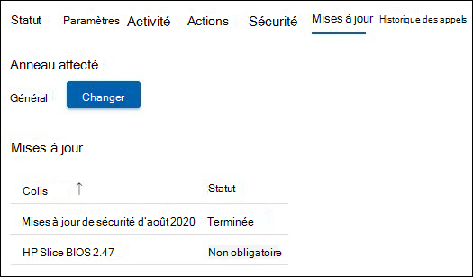

# Gestion des mises à jour 
Une salle de réunion moderne est équipée d’un appareil Salles Microsoft Teams et d’autres périphériques tels qu’une caméra, un microphone ou un haut-parleur, et potentiellement d’autres appareils pour créer une expérience de réunion inclusive et efficace. L’équipement de différents types d’OEM fournit l’expérience organisationnelle exacte souhaitée; toutefois, ils doivent être conservés avec des logiciels et des microprogrammes de façon continue.  

Salles Microsoft Teams Pro Management fournit l’assurance que chaque salle de votre organisation sera conservée aux niveaux recommandés pour fournir une salle qui est toujours prête et fonctionne correctement. L’objectif de Microsoft est de réduire la complexité et le travail de votre personnel opérationnel grâce à l’intelligence et à l’automatisation. La résolution des problèmes ou les diagnostics sont effectués aussi rapidement que possible. 

## Transition d’un appareil vers Pro Management 
L’intégration des appareils de salle à Pro Management a généralement un historique et une pratique de gestion des modifications qui sont différents de nos conseils.  

- Pour tirer parti de Pro Management, vous devez effectuer la transition de la gestion des modifications pour toutes les mises à jour sous le portefeuille Pro Management.
- Plusieurs sources de gestion des modifications ont un impact sur les contrats SLA d’incident, car il existe une découverte et une correction qui redémarrent à nouveau si un incident se produit dans la salle.
- Microsoft a implémenté des contrôles et des vérifications pour implémenter des stratégies qui peuvent différer d’une organisation à l’autre et la capacité d’intervenir dans des situations exceptionnelles.
- À terme, les appareils de salle seront mis à jour selon les normes courantes, à l’exception des exceptions dues à des problèmes liés à une installation matérielle spécifique.  

## Appareils de transition : vérifications de préparation de base 
La plupart des échecs inattendus proviennent de modifications apportées à l’image de base avec un historique incertain de la gestion des modifications. 

Il est recommandé de suivre des vérifications de préparation simples :  

- **Image de base** : l’image de base doit provenir de l’OEM spécifique. Si l’appareil a été reconstruit dans le passé et présente des défaillances ou des comportements inattendus sur des tâches courantes, l’image de base doit être restaurée. Nous pouvons vous aider, mais nous ne pouvons pas reconstruire à distance l’appareil de salle. Vous aurez donc besoin d’un technicien de site local.  
- **Système d’exploitation de base, Édition :** Le système d’exploitation de base et l’édition doivent correspondre aux exigences des appareils Salles Microsoft Teams. Si ce n’est pas le cas, il doit être corrigé dans le cadre de l’intégration. Salles Microsoft Teams nécessite les références SKU Windows 10 IoT Entreprise ou Windows 10 Entreprise sous les options de maintenance du canal Semi-Annual. Pour plus d’informations, consultez le [guide officiel du MTR](rooms-lifecycle-support.md#windows-10-release-support) .

## Vérifications de la préparation

Il existe quelques conditions préalables pour recevoir des mises à jour via le service Pro Management : 

|Logiciels |Aide |
|:- |:- |
|Services de synchronisation de Logitech  |Doit être installé et en cours d’exécution sur les appareils de la salle de réunion Logitech. Les services de synchronisation requis sont installés automatiquement à partir de Windows Mises à jour, sauf s’ils sont bloqués. Le package de synchronisation complet peut également être installé. |
|Mises à jour du système d’exploitation Windows |Doit être maintenu activé et non redirigé vers WSUS, ni bloqué du point de vue de la mise en réseau. Ni les stratégies GPO ni GPM ne doivent être utilisées pour gérer les mises à jour du système d’exploitation. |
|Mises à jour du Microsoft Store   |Doit être désactivé. Les services gérés désactivent les mises à jour du Windows Store si elles sont activées. |
|Logiciel antivirus |Si vous exécutez des logiciels AV sur ces appareils, vous devez vous assurer que l’antivirus dispose d’exclusions pour les DLL Teams et Skype. Pour plus [d’informations, consultez Comment inclure ou exclure Teams des applications antivirus ou DLP](/microsoftteams/troubleshoot/teams-administration/include-exclude-teams-from-antivirus-dlp) . |
|Logiciels supplémentaires |Les logiciels supplémentaires tels que l’affichage du Bureau à distance tiers, etc. doivent être examinés avec Managed Services pour exclure les effets secondaires. |
|Gestion des modifications supplémentaire|Peut interférer avec les mises à jour couvertes et ne doit pas être introduit. |

## Mises à jour gérées : fonctionnement 
Il existe deux méthodes principales de gestion des mises à jour :  

- **Géré automatiquement** : Mises à jour sont installés sur votre appareil de salle en fonction de l’évaluation Pro Management. Aucune intervention n’est nécessaire pour les mises à jour gérées dans notre portefeuille.
- **Sonnerie validée** : configurez un système en anneau pour afficher un aperçu des mises à jour sur des appareils spécifiques afin de pouvoir les surveiller sans le travail de jambe associé. La configuration de l’anneau fournit une couche supplémentaire de diligence raisonnable avant les déploiements à grande échelle.  

### Géré automatiquement

Si vous choisissez d’être géré automatiquement, aucune action n’est nécessaire pour les mises à jour de votre part. Toutefois, vous devez passer en revue le portefeuille actuel des mises à jour prises en charge par le service Pro Management. Le portefeuille reçoit constamment de nouveaux ajouts, et il est prioritaire de couvrir les mises à jour les plus fréquentes et les plus percutantes pour garantir la stabilité de votre salle. Consultez la liste actuelle (sous la section « Update Management » de ce document) pour planifier toute autre gestion des modifications nécessaire pour votre organisation.  

**Recommandation:** N’installez pas les mises à jour couvertes par le service Pro Management sur un appareil géré par vous-même. 

### Validation en anneau

Lorsque vous choisissez la validation en anneau, passez en revue les sections suivantes sur le fonctionnement des anneaux dans le portail Pro Management et les options disponibles pour la personnaliser pour votre organisation. Même avec la validation en anneau, des tentatives sont effectuées pour s’assurer que les salles ne sont pas dépassées en raison des mises à jour recommandées. Selon la situation, une salle peut recevoir des mises à jour de « rattrapage » pour s’assurer qu’elle est conforme aux recommandations de Microsoft.  

 Recherchez les annonces sur la page d’accueil du portail et dans la documentation Pro Management à mesure que de nouveaux types de logiciels et de microprogrammes deviennent disponibles dans le portefeuille. 

### Planification 
Mises à jour sont planifiées pour les salles en fonction de l’équipement de la salle et si elles ne répondent pas aux normes recommandées pour les logiciels et microprogrammes applicables. 

- Pour aider nos clients à répondre aux exigences de gestion des modifications, le déploiement des mises à jour commence **le mercredi** dans l’anneau intermédiaire. Si une mise à jour critique est requise, cette planification est ignorée et la mise à jour est publiée dès qu’elle est disponible. 
- Mises à jour sont séquencées en fonction des besoins dans une pièce particulière. 
- Si vous avez des anneaux d’installation pour valider les mises à jour, la mise à jour progresse dans l’ordre d’anneau. 
- Une nouvelle mise à jour peut remplacer une mise à jour mise en file d’attente s’il est déterminé que la stabilité de la salle s’améliorera en fonction de votre situation.  
- Mises à jour sont généralement appliqués pendant notre fenêtre d’entretien nocturne, qui est l’heure locale **de 12h00 à 5h00** pour éviter tout type d’interruption. 

## Salles Microsoft Teams stratégie de cycle de vie des mises à jour des applications 
La stratégie de support de l’équipe d’ingénierie MTR indique que tout le support se termine après l’expiration du cycle de vie de douze (12) mois d’une version ou si plus de deux mises à jour ont été publiées depuis lors. Ensuite, les clients doivent effectuer une mise à jour vers une version prise en charge. Reportez-vous [à Salles Microsoft Teams prise en charge des versions d’application - Microsoft Teams | Microsoft Docs](rooms-lifecycle-support.md) pour obtenir une description détaillée du service. 

## Procédure pas à pas détaillée de l’expérience Update Management  
Pour afficher les mises à jour, connectez-vous au portail Pro Management et accédez à la page Mises à jour.

Le volet Mises à jour affiche une vue d’ensemble générale de la gestion des mises à jour pour vos salles avec les onglets suivants :

- **Mises à jour** : mises à jour logicielles ou de microprogramme applicables à votre organisation.  
- **Salles** : l’onglet Salles offre une vue des salles et des sonneries auxquelles chaque chambre appartient.
- **Anneaux** : l’onglet Anneaux affiche les anneaux de salles de votre organisation.

### Mises à jour  

Cette vue affiche les mises à jour pertinentes pour votre locataire et leur état respectif. Pour afficher les mises à jour passées qui ne sont plus actives, sélectionnez le bouton bascule **Inclure les mises à jour passées** sur ACTIVÉ.  

Toute mise à jour peut se trouver dans l’un des états suivants :

| Statut | Description |
|:- |:- |
| Prévue | Une mise à jour est prévue pour les salles d’un anneau donné. N’oubliez pas qu’une mise à jour n’affichera Planifié qu’une fois que la progression a atteint l’anneau dans lequel se trouve la pièce. Par exemple, si une nouvelle mise à jour se trouve dans l’anneau de préproduction, elle affiche uniquement Planifié pour les salles dans l’anneau de préproduction.  
 Les autres anneaux ont l’état « Non requis » jusqu’à ce que la mise à jour passe à cet anneau.
 |
| En cours | Une mise à jour est en cours et les anneaux individuels affichent l’état. Cet état affiche l’état global de l’anneau. Par conséquent, si une mise à jour s’applique à une seule pièce dans l’anneau intermédiaire de votre locataire, la mise à jour aura l’état « En cours » jusqu’à ce que l’anneau Exécutif soit atteint. |
| Terminé avec des échecs | Une mise à jour a terminé la progression de tous vos anneaux configurés et a échoué dans au moins une salle. |
| Terminé | Une mise à jour a terminé la progression dans tous vos anneaux configurés et a été correctement installée sur toutes les salles applicables.|
| Déconseillée | Une mise à jour a été désactivée. Le déploiement ultérieur est interrompu. Cela est généralement dû au fait que la mise à jour a été remplacée par une nouvelle version. |
| Pause | Une mise à jour est en pause. |
| Non obligatoire | La mise à jour n’est pas encore évaluée pour la salle ou ne s’applique pas à la salle. |

### Chambres  

L’onglet Salles affiche toutes les salles de votre locataire et leur sonnerie.  

Pour configurer l’anneau auquel une pièce doit appartenir :  

1. Cliquez sur la salle pour afficher la vue détaillée.  
1. Sous **Sonnerie**, cliquez sur **Modifier**.  
1. Sélectionnez l’anneau auquel la pièce doit appartenir.  
1. Cliquez sur **Attribuer**.  

La vue détaillée de la salle affiche les mises à jour pertinentes et leur état sous le nœud **Mises à jour**.  

### Anneaux  

Les anneaux sont utilisés pour réduire le risque de problèmes dérivés du déploiement des mises à jour des fonctionnalités. Pour ce faire, déployez progressivement la mise à jour sur l’ensemble du site. Chaque anneau doit avoir une liste de salles Microsoft Teams et une planification de déploiement correspondante. La définition d’anneaux est généralement un événement unique (ou du moins peu fréquent), mais le service informatique doit revoir ces groupes de temps à autre pour s’assurer que le séquencement est toujours correct.  

**L’onglet Anneaux** répertorie tous les anneaux de votre locataire. Il existe trois anneaux préconfigurés :  

- **Préproduction** : attribuez des salles à l’anneau de préproduction, qui est votre banc de test. Toutes les nouvelles mises à jour seront déployées ici en premier. En règle générale, vous devez vous assurer que votre anneau de préproduction représente les salles avec la diversité des types d’appareils dans votre environnement. S’il existe certains types de salles avec une configuration inhabituelle ou un historique de problèmes, envisagez de les représenter dans préproduction.

- **Général** : Par défaut, toutes les salles sont placées dans cet anneau. La plupart des appareils de salle utilisés dans l’entreprise appartiennent à cette catégorie. 

- **Cadre** : ce groupe doit inclure vos salles les plus importantes où vous souhaitez réduire les interruptions de manière proactive. Un bon exemple est une grande salle de conférence utilisée pour des réunions de direction ou de grandes réunions d’équipe. 

### Spécification de la chronologie de déploiement

Mises à jour ne peut pas dépasser 60 jours sur tous les anneaux.  

|Paramètre |Explication |
|:- |:- |
|Période de report|Une fois qu’une mise à jour commence par le premier anneau, la période de report est le délai en jours avant que la mise à jour ne soit lancée sur cet anneau.|
|Durée du déploiement|
Une fois la mise à jour commencée sur cet anneau, il est temps de déployer dans cet anneau. Par exemple, si la durée est de 5 jours, il sera déployé sur 5 jours dans les salles de cet anneau une fois la mise à jour démarrée sur cet anneau.|
|Période de test|Nombre de jours pendant lesquels tester/valider la mise à jour dans un anneau une fois appliquée à l’anneau. La période de test commence une fois le déploiement terminé, et une fois terminé, la mise à jour passe à l’anneau suivant.|
|Heure d’achèvement|La colonne « Durée d’achèvement » indique le nombre total de jours (durée de déploiement + période de test) pour que cet anneau se termine.|
|Durée totale|En bas se trouve la ligne « Total » qui indique le temps nécessaire à une mise à jour pour se terminer du premier au dernier anneau.|

### Création d’anneaux personnalisés

1. Accédez à l’onglet **Anneaux** .  
1. Cliquez sur **Ajouter un anneau**.  
1. Spécifiez l’ordre dans lequel cet anneau recevra la mise à jour, où 1 est premier et 9 est le dernier.  
1. Donnez un nom à cet anneau.  
1. Fournissez une description si vous le souhaitez.  
1. Spécifiez le nombre de jours pendant lesquels la mise à jour sera déployée dans cet anneau.  
1. Spécifiez la période de test.  
1. Cliquez sur **Envoyer**.  

> [!NOTE]
> Les « jours définis par d’autres anneaux » sont le nombre total de jours qu’une mise à jour prendra pour se terminer sur tous les anneaux. La valeur « Jours restants » indique le nombre maximal de jours pendant lesquels *cet* anneau doit se terminer. La somme de « Durée de déploiement en jours » et « Période de test en jours » ne peut pas dépasser ce montant.  

**Modifier un anneau**

1. Accédez à l’onglet **Anneaux** .
1. Cliquez sur l’anneau à supprimer.  
1. Cliquez sur **Modifier l’anneau**.  
1. Modifiez le nombre de jours de déploiement et de test, si nécessaire.

**Supprimer un anneau**

1. Accédez à l’onglet **Anneaux** .  
1. Cliquez sur l’anneau à supprimer.  
1. Cliquez sur **Supprimer l’anneau**.  

> [!NOTE]
> Les anneaux par défaut ne peuvent pas être supprimés.  

**Déplacer des salles**

Le déplacement des pièces d’un anneau à l’autre est possible de deux manières :

1. Accédez à l’onglet **Anneaux** .  
1. Cliquez sur l’anneau à partir duquel vous souhaitez déplacer des salles  
1. Cliquez sur **Déplacer les salles**.  
1. Sélectionnez les salles que vous souhaitez déplacer dans la **Liste des salles**.  
1. Choisissez l’anneau Cible vers lequel les salles sélectionnées seront déplacées dans la liste déroulante.  
1. Cliquez sur **Déplacer les salles**.  

**Ou**

1. Ouvrez les détails de la salle que vous souhaitez déplacer (incidents, salles ou Mises à jour -> salles).
1. Cliquez sur l’onglet **Mises à jour**.  
1. Sous **Anneau affecté**, cliquez sur **Modifier**.
1. Dans la liste déroulante, sélectionnez le nouvel anneau.  
1. Cliquez sur **Attribuer**.

## Mises à jour automatisées : Visibilité et contrôle

Les mises à jour automatisées dans Pro Management orchestrent les mises à jour au sein de votre organisation. Toutefois, vous disposez de la visibilité et du contrôle nécessaires pour intervenir si nécessaire. Voici les méthodes suivantes : 

- En cas d’échec de mise à jour, un ticket est automatiquement généré pour le suivi. 
- Si vous voyez une mise à jour à l’origine de problèmes, vous pouvez suspendre la mise à jour à l’aide du bouton **Suspendre** . Le fait d’appuyer sur le bouton Suspendre vous invite à créer un ticket Enregistrer un problème pour que votre équipe examine.
- Si vous voyez qu’une mise à jour a échoué dans une salle et que vous avez corrigé une raison plausible telle que la déconnexion du réseau, vous pouvez réessayer la mise à jour avec le bouton **Réessayer tout échec** .  
- Il peut y avoir des situations urgentes où vous pouvez décider de rendre une mise à jour disponible plus tôt. Dans ce cas, vous pouvez utiliser le bouton **Forcer les mises à jour** . Lorsque vous utilisez l’option Forcer la mise à jour, vous avez le choix de forcer la mise à jour immédiatement ou lorsque la salle est disponible à côté.  

> [!NOTE]
> **Nous vous déconseillons de « Forcer l’Mises à jour »** comme stratégie générale de gestion des mises à jour, car vous pouvez rencontrer des problèmes connus avec ces mises à jour.

- En outre, pour garantir de bonnes pratiques de gestion des modifications, nous journaliserons chaque mise à jour forcée en interne dans le service. À l’avenir, nous prévoyons de rendre cela visible pour vous aussi.
