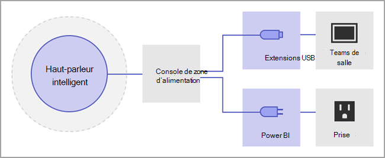
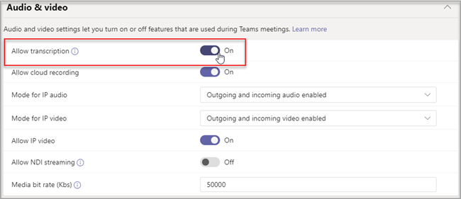

# Gérer les contrôles de technologie de reconnaissance vocale pour un haut-parleur intelligent

Un orateur intelligent utilise des informations de profil vocal pour reconnaître qui a dit quoi dans la transcription en direct. Lorsqu’un Salles Microsoft Teams pour la salle de réunion Windows est équipé d’un orateur intelligent, la transcription en direct peut être utilisée pendant la réunion. Cet article explique comment vous, administrateur de locataire, contrôlez le profilage vocal utilisé pour la reconnaissance vocale afin de générer une transcription en direct. Vous pouvez contrôler dans quelle mesure l’organisation utilise la reconnaissance vocale et les fonctionnalités suivantes :

- Modifiez le nom de l’orateur dans les transcriptions.
- Modifiez l’orateur d’un seul énoncé dans la transcription ou modifiez-le dans tous les énoncés de la transcription (mais pas sur les transcriptions futures).
- Modifiez l’identification de l’orateur pour les personnes qui sont répertoriées dans la réunion.
- Supprimez l’identification d’un ou de plusieurs énoncés identifiés en tant qu’orateur, sur chaque transcription.

## Passer en revue les exigences de l’orateur intelligent

Un haut-parleur intelligent comprend un tableau spécial de sept microphones. Le système utilise les informations de profil vocal pour identifier les voix de 10 personnes maximum dans les salles de réunion.

Les éléments suivants sont les exigences de l’orateur intelligent :

- La salle de réunion doit avoir un maximum de 10 personnes présentes en personne.
- La salle de réunion dispose d’un lien de chargement d’au moins 7 Mbits/s.

Les haut-parleurs intelligents Epos, Sennheiser et Yealink sont pris en charge.

> [!NOTE]
> Intelligent Speaker est disponible dans tous les pays et régions. Consultez [les paramètres régionaux pris en charge](#supported-locales) pour obtenir la liste des paramètres régionaux actuellement pris en charge pour l’inscription biométrique et la transcription en réunion.

## Configurer un haut-parleur intelligent

Un haut-parleur intelligent se connecte directement à l’aide de l’USB à la console salles Teams.

> [!NOTE]
> Un haut-parleur intelligent Yealink **doit** être utilisé avec une console Yealink.

> [!NOTE]
> Nous ne prenons pas en charge un haut-parleur intelligent connecté à Logitech Surface Pro Salles Microsoft Teams. Il existe un problème connu qui salles Teams ne peut pas reconnaître l’orateur intelligent par le dock.

Un haut-parleur intelligent doit être placé à au moins 8 pouces (20 cm) des murs et des objets volumineux, tels que des ordinateurs portables. Si le câble USB Intelligent Speaker n’est pas assez long pour votre installation, utilisez des extendeurs de câble.

1. Connectez-vous à la console en tant qu’administrateur.
2. Définissez les paramètres de l’appareil Teams pour qu’ils correspondent au microphone et à l’haut-parleur Intelligent Speaker.
   Vous pouvez également le faire via le portail TAC au lieu de la console de salle.

   Le diagramme montre comment l’orateur intelligent est connecté à l’appareil si l’appareil inclut une zone de données.

   

   Le diagramme montre comment l’orateur intelligent est connecté à l’appareil si l’appareil n’inclut pas de zone de données.

   

> [!Note]
> Les appareils EPOS et Yealink doivent avoir le préfixe « EPOS » ou « Yealink » et contenir « UAC2_RENDER » dans le nom du haut-parleur et « UAC2_TEAMS » dans le nom du microphone. Si vous ne trouvez pas ces noms de microphone et de haut-parleur dans le menu déroulant, redémarrez l’appareil Intelligent Speaker.

## Activer une reconnaissance d’utilisateur Intelligent Speaker

Les données de profil vocal peuvent être utilisées dans n’importe quelle réunion avec un orateur intelligent. Pour plus d’informations sur [les paramètres de réunion, consultez les stratégies de réunion Teams](../meetings-policies-recording-and-transcription.md#allow-transcription) et les [applets de commande de réunion PowerShell](/powershell/module/skype/set-csteamsmeetingpolicy) .

Les données de profil vocal de l’utilisateur sont créées lorsque la stratégie est définie pour distinguer ou lorsqu’un invité qui n’est pas invité à une réunion se présente pendant la réunion. Les données de profil vocal sont ignorées à la fin de la réunion.

Voici les stratégies requises pour définir un haut-parleur intelligent et la reconnaissance utilisateur.

|Stratégie|Description|Valeurs et comportement|
|-|-|-|
|enrollUserOverride|Permet de définir la capture ou l’inscription des profils vocaux dans les paramètres Teams d’un locataire. |**Désactivé** <ul><li> Les utilisateurs qui ne se sont jamais inscrits ne peuvent pas afficher, inscrire ou réinscrivez.<li>Le point d’entrée du flux d’inscription est masqué.<li>Si les utilisateurs sélectionnent un lien vers la page d’inscription, ils voient un message indiquant que cette fonctionnalité n’est pas activée pour leur organisation.  <li>Les utilisateurs inscrits peuvent afficher et supprimer leur profil vocal dans les paramètres Teams. Une fois qu’ils ont supprimé leur profil vocal, ils ne pourront pas afficher, accéder ou terminer le flux d’inscription.</li></ul> **Activé** <ul><li> Les utilisateurs peuvent afficher, accéder et terminer le flux d’inscription.<li>Le point d’entrée s’affiche sur la page paramètres teams sous l’onglet **Reconnaissance** .</li></ul>|
|roomAttributeUserOverride|Contrôlez l’identification de l’utilisateur par voix dans les salles de réunion. Ce paramètre est requis pour salles Teams comptes.| **Désactivé** <ul><li>L’appareil salles Teams n’envoie pas de bande passante d’enregistrement de flux audio à partir de la salle. <li>Les utilisateurs de salle de réunion ne seront pas attribués ou distingués, et leurs signatures vocales ne seront pas récupérées ou utilisées du tout.<li>Les utilisateurs de salle de réunion sont inconnus.</li></ul>  **Attribut** <ul><li>Les utilisateurs des salles seront attribués en fonction de leur état d’inscription.<li>Les utilisateurs inscrits s’affichent avec leur nom dans la transcription.  <li>Les utilisateurs qui ne sont pas inscrits s’affichent en tant qu’orateur \<n>.<li>L’appareil salles Teams envoie sept flux audio à partir de la salle.</ul>  **Distinguer**  <ul><li>Les utilisateurs des salles seront distingués et séparés en tant qu’orateur 1, orateur 2, .... dans \<n> la transcription.</li><li>Quel que soit l’état d’inscription de l’utilisateur, son nom n’apparaîtra pas dans la transcription.</li><li>L’appareil salles Teams envoie sept flux audio à partir de la salle.</li></ul>
|AllowTranscription|Obligatoire pour les comptes d’utilisateurs et de salles Teams.|**True** et **False**|
||||

Dans le Centre d’administration Teams, définissez la **stratégie de transcription** . Les paramètres sont **désactivés** par défaut.

  
> [!NOTE]
> Une fois qu’une stratégie est affectée, elle peut prendre jusqu’à 48 heures pour prendre effet. Pour que la stratégie prenne effet plus tôt, les comptes doivent être déconnectés et connectés.

## Forum aux questions (FAQ)

**Où sont stockées les données du profil vocal ?**

Les données de profil vocal sont stockées dans Office 365 cloud avec du contenu utilisateur.

**Quelle est la chronologie et la stratégie de rétention ?**

La stratégie de rétention générale est indiquée dans la [vue d’ensemble de la conservation des données](/compliance/assurance/assurance-data-retention-deletion-and-destruction-overview). En outre, les données de profil vocal d’un utilisateur seront supprimées au bout d’un an si l’utilisateur n’est invité à aucune réunion avec un orateur intelligent au cours de cette période d’un an. Les données ne sont utilisées dans aucune réunion pour les employés existants. Si un employé a quitté l’entreprise, les données de profil vocal sont considérées comme du contenu utilisateur et sont traitées comme telles par Office 365 stratégie de rétention des données décrite dans la [vue d’ensemble de la conservation des données](/compliance/assurance/assurance-data-retention-deletion-and-destruction-overview).

**Les données de profil vocal sont-ils utilisées dans les services Microsoft ?**

Non, les données de profil vocal sont utilisées uniquement à des fins pour lesquelles l’utilisateur a donné son consentement. Microsoft n’utilisera pas les données de profil vocal, sauf dans les scénarios de reconnaissance vocale Teams.

Par exemple, Microsoft n’utilise pas les données dans les situations suivantes :

**Mes données de profil vocal sont-elles utilisées lorsque je participe à une réunion dans une autre organisation ?**

Non seulement dans les réunions organisées par un utilisateur de votre organisation.

**Comment exporter mon profil vocal ?**

Votre administrateur informatique peut exporter vos données audio à tout moment.

## Paramètres régionaux pris en charge

Les paramètres régionaux d’inscription et de transcription en réunion suivants sont pris en charge dans tous les pays et régions.

### Paramètres régionaux d’inscription

Les utilisateurs finaux peuvent inscrire leurs voix pour la reconnaissance dans les paramètres régionaux suivants :

|**Langue**|**Pays/Région**|**Culture ID**|
|:-----|:-----|:-----|
|Anglais    |Australie   |en-AU    |
|Anglais    |Canada    |en-CA   |
|Anglais    |Inde    |en-IN    |
|Anglais    |Nouvelle-Zélande    |en-NZ    |
|Anglais    |Royaume-Uni    |en-GB    |
|Anglais    |États-Unis    |en-US    |

### Paramètres régionaux de transcription en réunion

Une fois qu’un utilisateur final s’inscrit, sa voix peut être reconnue pendant les réunions et identifiée dans la transcription lorsque la réunion est définie sur l’un des paramètres régionaux suivants :

|**Langue**|**Pays/Région**|**Culture ID**|
|:-----|:-----|:-----|
|Chinois (simplifié)    |Chine    |zh-CN    |
|Anglais    |Australie   |en-AU    |
|Anglais    |Canada    |en-CA   |
|Anglais    |Inde    |en-IN    |
|Anglais    |Nouvelle-Zélande    |en-NZ    |
|Anglais    |Royaume-Uni    |en-GB    |
|Anglais    |États-Unis    |en-US    |
|Français    |Canada    |fr-CA    |
|Français    |France    |fr-FR    |
|Allemand    |Allemagne    |de-DE    |
|Italien    |Italie    | it-IT   |
|Japonais    |Japon    |ja-JP    |
|Coréen    |Corée    |ko-KR    |
|Portugais    |Brésil    |pt-BR    |
|Espagnol    |Mexique    |es-MX    |
|Espagnol    |Espagne    |es-ES    |

## Voir aussi

[Article de support : Utiliser des haut-parleurs intelligents pour identifier les participants en salle ](https://support.microsoft.com/office/use-teams-intelligent-speakers-to-identify-in-room-participants-in-meeting-transcription-a075d6c0-30b3-44b9-b218-556a87fadc00)
