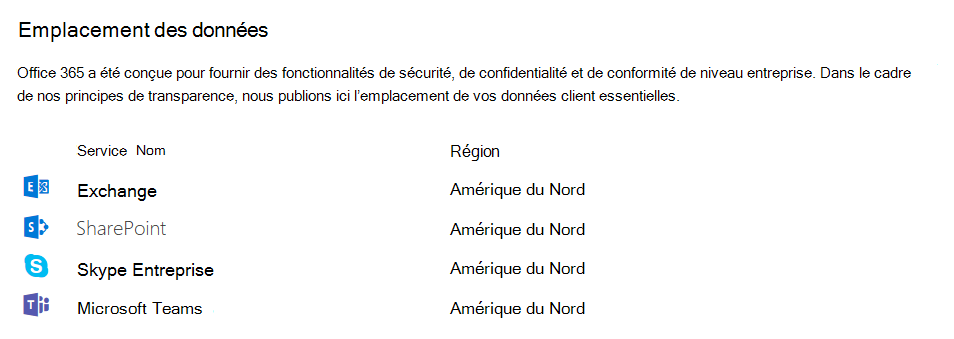

# Sécurité et conformité dans Microsoft Teams

> [!IMPORTANT]
> Pour savoir comment assurer au mieux la **sécurité pendant que tout le monde travaille à domicile pendant l’épidémie de COVID-19**, lisez les articles suivants :
>  - [12 premières tâches pour les équipes de sécurité qui prennent en charge le travail à domicile](/microsoft-365/security/top-security-tasks-for-remote-work)
>  - [Optimiser la connectivité de Microsoft 365 ou Office 365 pour les utilisateurs à distance à l’aide de la segmentation de tunnel VPN](/Office365/Enterprise/office-365-vpn-split-tunnel)
>  - Mise à jour du 2 avril 2020 : [guide de sécurité Teams](teams-security-guide.md)

Microsoft Teams repose sur les Microsoft 365 et Office 365 cloud de niveau entreprise à grande échelle, offrant les fonctionnalités avancées de sécurité et de conformité attendues par nos clients. Pour plus d’informations sur la planification de la sécurité dans Microsoft 365 ou Office 365, [la feuille de route de sécurité](/microsoft-365/security/office-365-security/security-roadmap) est un bon point de départ. Pour plus d’informations sur la planification de la conformité dans Microsoft 365 ou Office 365, vous pouvez commencer par [Planifier la sécurité & la conformité](/microsoft-365/compliance/plan-for-security-and-compliance).

Cet article fournit des informations supplémentaires sur la sécurité et la conformité propres à Teams. Ne manquez pas ces vidéos Microsoft Mechanics sur la sécurité et la conformité :

- [Microsoft Teams Essentials pour l’informatique : sécurité et conformité](https://youtu.be/91lHNKVVvQ4) (12:42 min)
- [contrôles Microsoft Teams pour la sécurité et la conformité](https://www.youtube.com/watch?v=Km4T4hMM__k) (10:54 min)

> [!IMPORTANT]
> En tant que client de Microsoft 365 ou de Office 365, vous possédez et contrôlez vos données. Microsoft n’utilise pas vos données pour autre chose que de vous fournir le service auquel vous vous êtes abonné. En tant que fournisseur de services, nous n’analysons pas vos e-mails, documents ou équipes à des fins publicitaires ou non liées au service. Microsoft n’a pas accès au contenu chargé. Comme OneDrive et SharePoint dans Microsoft 365, les données client restent dans le locataire. Vous pouvez en savoir plus sur nos informations relatives à la confiance et à la sécurité dans le Centre de gestion de la [confidentialité Microsoft](https://microsoft.com/trustcenter). Teams suit les mêmes conseils et principes que le Centre de gestion de la confidentialité Microsoft.

## Sécurité

Teams applique l’authentification à deux facteurs à l’échelle de l’équipe et à l’échelle de l’organisation, l’authentification unique via Active Directory et le chiffrement des données en transit et au repos. Les fichiers sont stockés dans SharePoint et sont sauvegardés par SharePoint chiffrement. Les notes sont stockées dans OneNote et sont sauvegardées par OneNote chiffrement. Les données OneNote sont stockées dans le site SharePoint d’équipe. L’onglet Wiki peut également être utilisé pour la prise de notes et son contenu est également stocké dans l’équipe SharePoint site.

Lisez les [modèles d’identité et l’authentification](identify-models-authentication.md) pour plus d’informations sur l’authentification et l’Teams, et [le fonctionnement de l’authentification moderne](sign-in-teams.md) vous aidera à utiliser l’authentification moderne en particulier.

Étant donné que Teams travaille en partenariat avec SharePoint, OneNote, Exchange, etc., vous devriez être à l’aise pour gérer la sécurité dans Microsoft 365 ou Office 365 tout. Pour en savoir plus, découvrez [comment configurer votre Microsoft 365 ou votre organisation Office 365 pour une sécurité accrue](/office365/securitycompliance/tenant-wide-setup-for-increased-security).

> [!NOTE]
> Actuellement, [les canaux privés](private-channels.md) prennent en charge des fonctionnalités de sécurité et de conformité limitées. La prise en charge de l’ensemble complet des fonctionnalités de sécurité et de conformité dans les canaux privés sera bientôt disponible.

### Microsoft Defender pour Office 365

Microsoft Defender pour Office 365 est disponible pour Microsoft Teams, ainsi que pour les applications SharePoint et OneDrive, qui s’intègrent à Teams pour la gestion de contenu. Defender pour Office 365 vous permet de déterminer si le contenu de ces applications est malveillant par nature et de bloquer l’accès utilisateur à ce contenu.

La façon dont le contenu affecté est géré après la détection dépend des paramètres que vous avez sélectionnés dans Microsoft 365 ou Office 365. Nous vous recommandons vivement de prendre en compte toutes les applications quand il s’agit de configurer Defender pour Office 365, et pour une lecture ultérieure, [une vue d’ensemble du fonctionnement des liens sécurisés et les étapes de configuration sont disponibles ici](/microsoft-365/security/office-365-security/safe-links?view=o365-worldwide) pour obtenir des informations détaillées pour commencer.

### liens Coffre dans Microsoft Teams

Defender pour Office 365 liens sécurisés sont disponibles dans Microsoft Teams. Pour obtenir plus d’informations sur les liens sécurisés et sur ce qu’il faut faire avec cette fonctionnalité, lisez [les paramètres liens sécurisés pour Teams](/microsoft-365/security/office-365-security/safe-links?view=o365-worldwide). Coffre liens sont disponibles dans [Defender pour Office 365 Plan 1 et Plan 2](/microsoft-365/security/office-365-security/overview?view=o365-worldwide).

### pièces jointes Coffre

Coffre pièces jointes est une fonctionnalité conçue pour améliorer la sécurité des utilisateurs en recherchant et en détectant les pièces jointes malveillantes. Les administrateurs généraux ou de sécurité [activent la fonctionnalité](/microsoft-365/security/office-365-security/turn-on-mdo-for-spo-odb-and-teams?view=o365-worldwide) et [créent des stratégies](/microsoft-365/security/office-365-security/set-up-safe-attachments-policies?view=o365-worldwide) pour gérer ces pièces jointes suspectes malveillantes afin de les empêcher d’être envoyées aux utilisateurs, de cliquer et d’agir.

Coffre protection contre les pièces jointes est disponible pour SharePoint, OneDrive et Microsoft Teams, et Microsoft 365 ou Office 365 dans [ Microsoft Defender pour Office 365 plan 1 et plan 2](/microsoft-365/security/office-365-security/overview?view=o365-worldwide). Pour plus d’informations sur Coffre pièces jointes et la façon dont elles peuvent aider à protéger votre organisation, consultez [cet article](/microsoft-365/security/office-365-security/set-up-safe-attachments-policies?view=o365-worldwide).

### Degré de sécurisation

Microsoft Secure Score est une mesure de la posture de sécurité d’une organisation, avec un nombre plus élevé indiquant plus d’actions d’amélioration prises. Il se trouve dans le [Centre de sécurité Microsoft 365](https://security.microsoft.com/securescore). Suivre les recommandations de degré de sécurisation peut protéger votre organisation contre les menaces. À partir d’un tableau de bord centralisé dans le Centre de sécurité Microsoft 365, les organisations peuvent surveiller et travailler sur la sécurité de leurs Microsoft 365 identités, applications et appareils. Microsoft Teams contient désormais des recommandations sur le degré de sécurisation et les administrateurs sont encouragés à surveiller leur position en matière de sécurité sur la plateforme.

Le degré de sécurisation aide les organisations à :
- Rapport sur l’état actuel de la posture de sécurité de l’organisation.
- Améliorez leur posture de sécurité en fournissant la détectabilité, la visibilité, les conseils et le contrôle.
- Comparez avec les benchmarks et établissez des indicateurs de performance clés (KPI).

### Fonctionnement des stratégies d’accès conditionnel pour Teams

Microsoft Teams s’appuie largement sur Exchange Online, SharePoint et Skype Entreprise Online pour les scénarios de productivité de base, tels que les réunions, les calendriers, les conversations d’interopérabilité et le partage de fichiers. Les stratégies d’accès conditionnel définies pour ces applications cloud s’appliquent à Microsoft Teams lorsqu’un utilisateur se connecte directement à Microsoft Teams sur n’importe quel client.

Microsoft Teams est pris en charge séparément en tant qu’application cloud dans Azure Active Directory stratégies d’accès conditionnel. Les stratégies d’accès conditionnel définies pour l’application cloud Microsoft Teams s’appliquent aux Microsoft Teams lorsqu’un utilisateur se connecte. Toutefois, sans les stratégies appropriées sur d’autres applications telles que Exchange Online et SharePoint, les utilisateurs peuvent toujours être en mesure d’accéder directement à ces ressources. Pour plus d’informations sur la configuration d’une stratégie d’accès conditionnel dans le Portail Azure, consultez [Azure Active Directory démarrage rapide](/azure/active-directory/active-directory-conditional-access-azure-portal-get-started).

Microsoft Teams clients de bureau pour Windows et Mac prennent en charge l’authentification moderne. L’authentification moderne permet la connexion basée sur la bibliothèque d’authentification Azure Active Directory (ADAL) pour Microsoft Office applications clientes sur plusieurs plateformes.

Microsoft Teams application de bureau prend en charge AppLocker.  Pour plus d’informations sur les prérequis d’AppLocker, consultez : Conditions requises pour utiliser [AppLocker](/windows/security/threat-protection/windows-defender-application-control/applocker/requirements-to-use-applocker).

## Conformité

Teams dispose d’un large éventail d’informations pour vous aider dans les domaines de conformité, notamment la conformité des communications pour les canaux, les conversations et les pièces jointes, les stratégies de rétention, la protection contre la perte de données (DLP), la découverte électronique et la conservation légale pour les canaux, les conversations et les fichiers, la recherche dans les journaux d’audit, ainsi que la gestion des applications mobiles avec Microsoft Intune. Nous avons fourni des informations sur toutes ces rubriques ci-dessous, et vous pouvez accéder à la [Centre de conformité Microsoft 365](https://compliance.microsoft.com) pour gérer ces paramètres.

### Obstacles à l’information

Les obstacles à l’information sont des stratégies mises en place par Teams administrateurs pour faire des choses comme empêcher des personnes ou des groupes de communiquer entre eux (lorsqu’il n’est pas nécessaire pour les entreprises de le faire, ou une raison réglementaire pour les empêcher de le faire), et il vous permet également de définir des stratégies relatives à des choses telles que les recherches et eDiscovery (voir ci-dessous). Ces stratégies peuvent avoir un impact sur les utilisateurs dans les conversations 1:1, les conversations de groupe ou au niveau de l’équipe. La fonctionnalité Barrière de l’information est disponible dans le cloud public et, à partir de janvier 2021, elle a été déployée dans le cloud Cloud de la communauté du secteur public.

Pour plus d’informations sur ce sujet, accédez aux [obstacles à l’information dans Microsoft Teams](information-barriers-in-teams.md).

### Conformité des communications

La conformité des communications dans Microsoft 365 vous permet d’ajouter des utilisateurs à des stratégies d’étendue qui peuvent être configurées pour examiner Microsoft Teams communications à la recherche d’un langage offensant, d’informations sensibles et d’informations relatives aux normes internes et réglementaires. Les communications de conversation et les pièces jointes associées dans les canaux Teams publics et privés, les conversations individuelles et les pièces jointes peuvent être analysées pour réduire les risques de communication au sein de votre organisation. Pour plus d’informations sur la façon dont vous pouvez configurer des stratégies pour vous aider à détecter, capturer et prendre des mesures pour les communications Teams inappropriées, consultez [La conformité des communications dans Microsoft 365](/microsoft-365/compliance/communication-compliance).

### Étiquettes de confidentialité

Appliquez [des étiquettes de confidentialité](/microsoft-365/compliance/sensitivity-labels) pour protéger et réglementer l’accès au contenu organisationnel sensible créé lors de la collaboration au sein des équipes. Par exemple, appliquez des étiquettes qui configurent la confidentialité (publique ou privée) des équipes, contrôlent l’accès invité et le partage externe, et gèrent l’accès à partir d’appareils non gérés. Pour plus d’informations, consultez [les étiquettes de confidentialité dans Microsoft Teams](sensitivity-labels.md).

### Protection contre la perte de données (DLP)

La protection contre la perte de données (DLP) dans Microsoft Teams, ainsi que la plus grande histoire DLP pour Microsoft 365 ou Office 365, tourne autour de la préparation de l’entreprise quand il s’agit de protéger des documents et des données sensibles. Que vous soyez préoccupé par les informations sensibles dans les messages ou les documents, les stratégies DLP pourront vous aider à vous assurer que vos utilisateurs ne partagent pas ces données sensibles avec les mauvaises personnes.

Pour plus d’informations sur la protection contre la perte de données dans Teams, consultez [DLP pour Microsoft Teams](/microsoft-365/compliance/dlp-microsoft-teams). Un bon article pour les préoccupations DLP O365 est [Vue d’ensemble de la protection contre la perte de données](/microsoft-365/compliance/data-loss-prevention-policies).

### Clé client

Microsoft 365 offre une couche supplémentaire de chiffrement par-dessus le chiffrement de service pour votre contenu. À l’aide des clés que vous fournissez, customer key chiffre plusieurs types de données différents dans Microsoft Teams. À l’aide de la clé client au niveau de l’application, la clé client chiffre Teams fichiers stockés dans SharePoint Online. Pour plus d’informations, consultez [Chiffrement de service avec la clé client](/microsoft-365/compliance/customer-key-overview). 

À l’aide de la clé client au niveau du locataire, la clé client chiffre :
- Teams messages de conversation (conversations 1:1, conversations de groupe, conversations de réunion et conversations de canal)
- Teams messages multimédias (images, extraits de code, vidéos et images wiki)
- Teams enregistrements d’appels et de réunions stockés dans Teams stockage
- Teams notifications de conversation
- Teams suggestions de conversation par Cortana
- Teams messages d’état Pour plus d’informations, consultez [Vue d’ensemble de la clé client pour les Microsoft 365 au niveau du locataire](/microsoft-365/compliance/customer-key-tenant-level) et lisez le blog Microsoft Teams qui traite de la [prise en charge de la clé client pour Microsoft Teams maintenant en préversion publique](https://techcommunity.microsoft.com/t5/microsoft-teams-blog/customer-key-support-for-microsoft-teams-now-in-public-preview/ba-p/1999893). Pour plus d’informations sur la version Protection des données Microsoft qui incluait la clé client au niveau du locataire, consultez [Annonce de nouvelles fonctionnalités de Protection des données Microsoft pour connaître et protéger vos données sensibles](https://techcommunity.microsoft.com/t5/microsoft-security-and/announcing-new-microsoft-information-protection-capabilities-to/ba-p/1999692).

### Stratégies de rétention

Les stratégies de rétention dans Microsoft Teams vous permettent à la fois de conserver les données qui sont importantes pour votre organisation, pour des raisons réglementaires, légales, commerciales ou autres, ainsi que de supprimer du contenu et des communications qui ne sont pas pertinents pour être conservés. Vous pouvez également utiliser des stratégies de rétention pour conserver les données pendant un certain temps, puis les supprimer. Pour plus d’informations, consultez [les stratégies de rétention dans Microsoft Teams](retention-policies.md).

### eDiscovery

La découverte électronique, ou eDiscovery, est l’aspect électronique de l’identification, de la collecte et de la production d’informations stockées électroniquement (ESI) en réponse à une demande de production dans le cas d’une poursuite ou d’une enquête. Les fonctionnalités incluent la gestion de cas, la conservation, la recherche, l’analyse et l’exportation de données Teams. Cela inclut la conversation, la messagerie et les fichiers, les résumés des réunions et des appels. Pour Teams réunions et appels, un résumé des événements qui se sont produits dans la réunion et l’appel sont créés et mis à disposition dans eDiscovery.

Pour plus d’informations sur l’utilisation des outils eDiscovery dans le Centre de conformité Microsoft 365 pour rechercher Teams contenu, consultez les liens ci-dessous :

- [eDiscovery](/microsoft-365/compliance/manage-legal-investigations)

- [Recherche de contenu](/microsoft-365/compliance/search-for-content)

Nous avons un article spécifique à Teams pour plus d’informations sur [la conduite d’une enquête eDiscovery de contenu dans Microsoft Teams](eDiscovery-investigation.md).

Les clients peuvent tirer parti d’eDiscovery ou [de Advanced eDiscovery](/microsoft-365/compliance/office-365-advanced-ediscovery) en fonction de leurs besoins. Le tableau suivant présente les différences entre les deux options :

|&nbsp; |eDiscovery  |eDiscovery avancée  |
|---------|---------|---------|
|Gestion des cas     |X        |X         |
|Contrôle d'accès  |X         |X         |
|Recherches de contenu     |X         | X        |
|Conservation(s)   |X         | X        |
|Exportation     |X         |X         |
|Détection de duplication     |-         |X         |
|Recherches de pertinence avec Machine Learning    |-         |X         |
|Analyse de données non structurées      |-         |X         |

### Conservation légale

Lors d’un litige, vous pouvez avoir besoin que toutes les données associées à un utilisateur (consignateur) ou à une équipe soient conservées comme immuables, afin qu’elles puissent être utilisées comme preuves de l’affaire. Pour ce faire, vous pouvez placer un utilisateur (boîte aux lettres utilisateur) ou une équipe en conservation légale. Pour une conservation légale d’équipe, la boîte aux lettres de l’équipe peut être placée sur les conservations suivantes :

- In-Place la conservation (un sous-ensemble de la boîte aux lettres ou de la collection de sites via des requêtes ciblées ou du contenu filtré est mis en attente) ou
- Conservation des litiges (l’intégralité de la boîte aux lettres ou de la collection de sites est mise en attente).

Dans les deux cas, une fois la conservation définie, elle garantit que, même si les utilisateurs finaux suppriment ou modifient les messages de canal qui se trouvent dans la boîte aux lettres de groupe, les copies immuables de ce contenu sont conservées et disponibles via la recherche eDiscovery. Les conservations légales sont généralement appliquées dans le contexte d’une affaire eDiscovery.

Consultez [vue d’ensemble des stratégies de rétention](/microsoft-365/compliance/retention-policies) pour en savoir plus sur la conservation et les conservations dans le Centre de conformité Microsoft 365. Pour obtenir des informations plus Teams spécifiques sur la conservation légale, nous avons également [mis un utilisateur ou une équipe Microsoft Teams en attente légale](legal-hold.md) pour vous permettre d’en savoir plus.

### Recherche de contenu

La recherche de contenu peut être utilisée pour rechercher toutes les données Teams par le biais de fonctionnalités de filtrage enrichies. Les données obtenues peuvent être exportées vers un conteneur spécifique pour la conformité et la prise en charge des litiges. Cela peut être fait avec ou sans cas eDiscovery. Cela permet aux administrateurs de conformité de collecter Teams données sur tous les utilisateurs, de les examiner et de les exporter pour un traitement ultérieur. Reportez-vous à [La Recherche](/microsoft-365/compliance/content-search) de contenu pour en savoir plus sur la façon d’effectuer une recherche de contenu de conformité pour Microsoft Teams et d’autres contenus Microsoft 365 ou Office 365 dans le Centre de conformité Microsoft 365.

> [!TIP]
> À l’aide de la recherche de contenu, vous pouvez filtrer jusqu’à Microsoft Teams contenu uniquement, tel que les messages de conversation et de canal, les réunions et les appels, si nécessaire.

Si vous souhaitez obtenir d’autres informations spécifiques à Teams sur la configuration de la recherche de contenu, passez [en revue la recherche de contenu dans Microsoft Teams](content-search.md).

### Audit

La recherche dans le journal d’audit se connecte directement au Centre de conformité Microsoft 365 et vous permet de définir des alertes, ainsi que des rapports sur les événements d’audit, en autorisant l’exportation d’ensembles d’événements spécifiques à la charge de travail ou génériques à des fins d’utilisation et d’investigation par l’administrateur dans une chronologie d’audit illimitée. Vous pouvez configurer des alertes pour toutes les données du journal d’audit dans le Centre de conformité Microsoft 365 et filtrer et exporter ces données pour une analyse plus approfondie. Pour en savoir plus sur la recherche d’événements Microsoft Teams dans le Centre de conformité Microsoft 365, consultez [rechercher des événements dans Microsoft Teams dans le journal d’audit](audit-log-events.md).

## Confidentialité

Chez Microsoft, la protection de vos données est notre priorité la plus élevée. Pour en savoir plus sur nos pratiques en matière de confidentialité, consultez :  

- [Confidentialité chez Microsoft](https://www.microsoft.com/trust-center/privacy)
- [Notre engagement en matière de confidentialité et de sécurité dans Microsoft Teams](https://www.microsoft.com/en-us/microsoft-365/blog/2020/04/06/microsofts-commitment-privacy-security-microsoft-teams/)
- [Pour les professionnels de l’informatique : confidentialité et sécurité dans Microsoft Teams](https://www.microsoft.com/en-us/microsoft-365/blog/2020/04/06/it-professionals-privacy-security-microsoft-teams/#:~:text=We%20safeguard%20your%20privacy%20by,and%20distribution%20of%20your%20data.)

## architecture Information Protection

La figure suivante indique le flux d’ingestion de données Teams à la fois vers Exchange et SharePoint pour les fichiers et les messages Teams.

> [!div class="mx-imgBorder"]
> 

La figure suivante indique le flux d’ingestion de réunions Teams et d’appels de données à Exchange.

> [!div class="mx-imgBorder"]
> 

> [!IMPORTANT]
> Il peut y avoir jusqu’à un délai de 24 heures pour découvrir Teams contenu.

## Gestion des licences

En ce qui concerne les fonctionnalités de protection des informations, Microsoft 365 abonnements, Office 365 abonnements et les licences autonomes associées déterminent l’ensemble de fonctionnalités disponibles.

Pour plus d’informations sur la détermination des besoins en matière de licences pour implémenter des fonctionnalités de sécurité et de conformité, consultez les [exigences de licence](/office365/servicedescriptions/microsoft-365-service-descriptions/microsoft-365-tenantlevel-services-licensing-guidance/microsoft-365-security-compliance-licensing-guidance) pour les fonctionnalités de sécurité et de conformité.

> [!NOTE]
> La recherche de contenu, core eDiscovery et Advanced eDiscovery n’ont pas besoin d’être activés dans le Centre de conformité Microsoft 365 pour fonctionner. Pour plus d’informations, consultez [Microsoft 365 solutions eDiscovery](/microsoft-365/compliance/ediscovery).

## Emplacement des données dans Teams

Les données dans Teams se situent dans la région géographique associée à votre organisation Microsoft 365 ou Office 365. Pour voir quelles régions sont actuellement prises en charge, consultez [l’emplacement des données dans Microsoft Teams](location-of-data-in-teams.md).

Si vous devez voir quelle région héberge les données de votre locataire, accédez au [profil Centre d'administration Microsoft 365](https://portal.office.com/adminportal/home) >  **Paramètres** >  **Organization**. Faites défiler vers le bas jusqu’à **Emplacement des données**.

> [!div class="mx-imgBorder"]
> 

## Normes de conformité

Teams utilise les normes suivantes : [ISO 27001](/microsoft-365/compliance/offering-iso-27001), [ISO 27018](/microsoft-365/compliance/offering-iso-27018), [SSAE18 SOC 1 et SOC 2](/microsoft-365/compliance/offering-soc), [HIPAA](/microsoft-365/compliance/offering-hipaa-hitech) et [EUMC.](/microsoft-365/compliance/offering-eu-model-clauses) Dans l’infrastructure de conformité Microsoft, Microsoft classifie Microsoft 365 et Office 365 applications et services en quatre catégories. Chaque catégorie est définie par des engagements de conformité spécifiques qui doivent être respectés pour qu’un service Microsoft 365 ou Office 365, ou un service Microsoft associé, soit répertorié dans cette catégorie.

Vous trouverez des détails dans les [ressources de protection des données](https://servicetrust.microsoft.com/ViewPage/TrustDocumentsV3?command=Download&downloadType=Document&downloadId=b7d05b86-c69b-41ba-8245-21161b9febf9&tab=7f51cb60-3d6c-11e9-b2af-7bb9f5d2d913&docTab=7f51cb60-3d6c-11e9-b2af-7bb9f5d2d913_Compliance_Guides). Teams prend également en charge la conformité de Cloud Security Alliance.

## Rubriques connexes

[sécurité Microsoft 365](/microsoft-365/security/)

[conformité Microsoft 365](/microsoft-365/compliance/)

[Offres de conformité Microsoft](/microsoft-365/compliance/offering-home)
