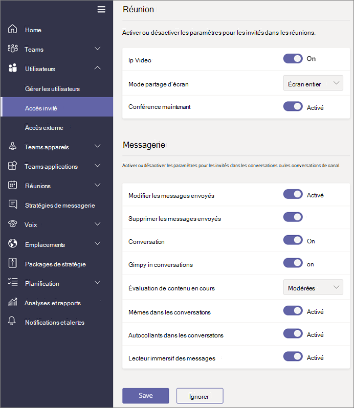

# Activer ou désactiver l'accès invité dans Microsoft Teams

> [!Note]
>
> **Jusqu’en février 2021,** l’accès invité est désactivé par défaut. Vous devez activer l'accès invité pour Teams avant que les administrateurs ou les propriétaires d'équipes puissent ajouter des invités. Une fois l’accès invité activer, l’application des modifications peut prendre quelques heures. Si les utilisateurs voient le **message** Contacter votre administrateur lorsqu’ils essaient d’ajouter un invité à leur équipe, il est probable que l’accès invité n’a pas été désactivé ou que les paramètres ne sont pas encore effectifs.
>
> Après **février 2021,** l’accès invité dans Microsoft Teams sera désactivé par défaut pour les nouveaux clients & clients existants qui n’ont pas configuré ce paramètre. Lorsque cette modification est implémentée, si vous n’avez pas encore configuré la fonctionnalité d’accès invité dans Microsoft Teams, cette fonctionnalité sera activée dans votre client. Si vous souhaitez que l’accès invité reste désactivé pour votre organisation, vous  devez confirmer que le paramètre d’accès invité est définie sur Désactivé au lieu de Service **par défaut.**

> [!IMPORTANT]
> L'activation de l'accès invité dépend des paramètres d'Azure Active Directory, de Microsoft 365, de SharePoint et de Teams. Pour plus d’information, consultez [Collaborer avec des invités dans une équipe](/microsoft-365/solutions/collaborate-as-team).

## Configurer l’accès invité dans le centre d’administration de Teams

1. Se connecter au [Centre d’administration de Microsoft Teams](https://admin.teams.microsoft.com/).

2. Sélectionnez **Accès**  >  **invité des utilisateurs.**

3. Définissez **Autoriser l’accès invité Teams** **sur.**

    

4. Sous **Appel,** **Réunion** et **Messagerie,**  sélectionnez **Sur** ou Off pour chaque fonctionnalité, selon ce que vous voulez autoriser pour les invités.

      - **Passer des appels privés** : mettre ce paramètre sur **On** pour permettre aux invités d’effectuer des appels privés.
      - **Vidéo IP** : activer ce **paramètre** pour permettre aux invités d’utiliser la vidéo dans leurs appels et réunions.
      - **Mode partage d’écran** : ce paramètre contrôle la disponibilité du partage d’écran pour les invités.
          - Mettre ce paramètre sur **Désactivé** pour supprimer la possibilité pour les invités de partager leurs écrans dans Teams.
          - Activez ce paramètre sur **Application unique** pour autoriser le partage d’applications individuelles.
          - Activez ce paramètre sur **Écran entier** pour autoriser le partage d’écran entier.
      - **Répondre maintenant** : activer ce **paramètre** pour permettre aux invités d’utiliser la fonctionnalité Meet Now dans Microsoft Teams.
      - **Modifier les messages envoyés** : mettre ce paramètre sur **On** pour permettre aux invités de modifier les messages électroniques qu’ils ont envoyés précédemment.
      - **Supprimer les messages envoyés** : activer ce **paramètre** pour permettre aux invités de supprimer les messages qu’ils ont envoyés précédemment.
      - **Conversation** : mettre ce paramètre sur **On** pour donner aux invités la possibilité d’utiliser la conversation dans Teams.
      - Giphy dans les conversations : activer ce **paramètre** pour autoriser les invités à utiliser des **Giphys** dans les conversations. Giphy est une base de données en ligne et moteur de recherche qui permet aux utilisateurs de rechercher et partager des fichiers GIF animés. Chaque Giphy est affecté à une évaluation du contenu.
      - **Évaluation du contenu Giphy** : sélectionner une note dans la liste déroulante :
          - **Autoriser tout le contenu** : les invités pourront insérer tous les Giphys dans des conversations, quelle que soit l’évaluation du contenu.
          - **Modéré** : les invités pourront insérer Giphys dans les conversations, mais seront relativement limités pour le contenu adulte.
          - **Strict** – Les invités peuvent insérer des Giphys dans les conversations, mais ne peuvent pas insérer de contenu pour adultes.
      - **Mèmes dans les conversations** : activer ce **paramètre** pour autoriser les invités à utiliser des mèmes dans les conversations.
      - **Autocollants dans les conversations** : activer ce **paramètre** pour permettre aux invités d’utiliser des autocollants dans les conversations.
      - **Lecteur immersif des messages** : activer ce **paramètre** pour permettre aux invités d’utiliser le lecteur [immersif dans Teams.](https://support.microsoft.com/topic/a700c0d0-bc53-4696-a94d-4fbc86ac7a9a)

    

5. Sélectionnez **Enregistrer**.

## Accès externe (fédération) et accès invité

[!INCLUDE [guest-vs-external-access](includes/guest-vs-external-access.md)]

## Voir aussi

[Configurer la collaboration sécurisée avec Microsoft 365](/microsoft-365/solutions/setup-secure-collaboration-with-teams)

[Bloquer les invités d’une équipe spécifique](/microsoft-365/solutions/per-group-guest-access)

[Set-CsTeamsClientConfiguration](/powershell/module/skype/set-csteamsclientconfiguration)
