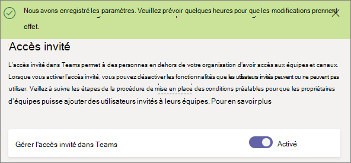

# Activation ou désactivation de l’accès invité à Microsoft teamsTurn on or turn off guest access to Microsoft Teams

Par défaut, l’accès invité est désactivé.By default, guest access is turned off. Vous devez activer l’accès invité pour les équipes pour que les administrateurs ou les propriétaires d’équipes puissent ajouter des invités.You must turn on guest access for Teams before admins or team owners can add guests.

Après avoir activé l’accès invité, il est possible que les modifications soient prises en compte.After you turn on guest access, it may take a few hours for the changes to take effect. Si un utilisateur voit le message « contactez votre administrateur » lorsqu’il essaye d’ajouter un invité à son équipe, il est probable que l’accès invité n’ait pas été activé ou que les paramètres ne soient pas encore effectifs.If a user sees the message "Contact your administrator" when they try to add a guest to their team, it's likely that either guest access hasn't been turned on or the settings aren't effective yet.

> [!IMPORTANT]
> L’activation de l’accès invité dépend des paramètres dans Azure Active Directory, Microsoft 365, SharePoint et Teams.Turning on guest access depends on settings in Azure Active Directory, Microsoft 365, SharePoint, and Teams. Pour plus d’informations, reportez-vous à [la rubrique collaborer avec des invités dans une équipe](https://docs.microsoft.com/microsoft-365/solutions/collaborate-as-team).For more information, see [Collaborate with guests in a team](https://docs.microsoft.com/microsoft-365/solutions/collaborate-as-team).

## Configurer l’accès invité dans le centre d’administration teamsConfigure guest access in the Teams admin center

1. Connectez-vous au [Centre d’administration Microsoft teams](https://admin.teams.microsoft.com/).Sign in to the [Microsoft Teams admin center](https://admin.teams.microsoft.com/).

2. Sélectionnez **paramètres Org-wide** > **accès invité**.Select **Org-wide settings** > **Guest access**.

3. Définissez **autoriser l’accès invité dans Microsoft teams** **sur activé**.Set **Allow guest access in Microsoft Teams** to **On**.

    

4. Sous **appel**, **réunion**et **messagerie**, sélectionnez **activé** ou **désactivé** pour chaque fonctionnalité, en fonction de ce que vous voulez autoriser pour les utilisateurs invités.Under **Calling**, **Meeting**, and **Messaging**, select **On** or **Off** for each capability, depending on what you want to allow for guest users.

      - **Passer des appels privés** : mettre ce paramètre sur **On** pour permettre aux invités d’effectuer des appels privés.**Make private calls** – Turn this setting **On** to allow guests to make peer-to-peer calls.
      - **Autoriser IP vidéo** : mettre ce paramètre sur**On** pour permettre aux invités d’utiliser la vidéo dans leurs appels et réunions.**Allow IP video** - Turn this setting **On** to allow guests to use video in their calls and meetings.
      - **Mode de partage d’écran** : ce paramètre détermine la disponibilité de l’écran de partage pour les utilisateurs invités.**Screen sharing mode** – This setting controls the availability of screen sharing for guest users. 
          - Mettre ce paramètre sur **Désactivé** pour supprimer la possibilité pour les invités de partager leurs écrans dans Teams.Turn this setting to **Disabled** to remove the ability for guests to share their screens in Teams. 
          - Activez ce paramètre sur **Application unique** pour autoriser le partage d’applications individuelles.Turn this setting to **Single application** to allow sharing of individual applications. 
          - Activez ce paramètre sur **Écran entier** pour autoriser le partage d’écran entier.Turn this setting to **Entire screen** to allow complete screen sharing.
      - **Autoriser Conférence maintenant** : mettre ce paramètre sur **On** pour permettre aux invités d’utiliser la fonctionnalité Conférence maintenant dans Microsoft Teams.**Allow Meet Now** – Turn this setting **On** to allow guests to use the Meet Now feature in Microsoft Teams.
      - **Modifier les messages envoyés** : mettre ce paramètre sur**On** pour permettre aux invités de modifier les messages électroniques qu’ils ont envoyés précédemment.**Edit sent messages** - Turn this setting **On** to allow guests to edit messages they previously sent.
      - **Invités peuvent supprimer les messages envoyés** : mettre ce paramètre sur**On** pour permettre aux invités de supprimer les messages électroniques qu’ils ont envoyés précédemment.**Guests can delete sent messages** – Turn this setting **On** to allow guests to delete messages they previously sent.
      - **Conversation** : mettre ce paramètre sur**On** pour donner aux invités la possibilité d’utiliser la conversation dans Teams.**Chat** – Turn this setting **On** to give guests the ability to use chat in Teams.
      - **Utiliser Giphys dans les conversations** : mettre ce paramètre sur **On** pour permettre aux invités d’utiliser des Giphys dans les conversations.**Use Giphys in conversations** – Turn this setting **On** to allow guests to use Giphys in conversations. Giphy est une base de données en ligne et moteur de recherche qui permet aux utilisateurs de rechercher et partager des fichiers GIF animés.Giphy is an online database and search engine that allows users to search for and share animated GIF files. Chaque Giphy est affecté à une évaluation du contenu.Each Giphy is assigned a content rating.
      - **Évaluation du contenu Giphy** : sélectionner une note dans la liste déroulante :**Giphy content rating** –  Select a rating from the drop-down list:
          - **Autoriser tout le contenu** : les invités pourront insérer tous les Giphys dans des conversations, quelle que soit l’évaluation du contenu.**Allow all content** - Guests will be able to insert all Giphys in chats, regardless of the content rating.
          - **Modéré** : les invités pourront insérer Giphys dans les conversations, mais seront relativement limités pour le contenu adulte.**Moderate** - Guests will be able to insert Giphys in chats, but will be moderately restricted from adult content.
          - **Strict** : les invités seront en mesure d’insérer des Giphys dans les discussions, mais ils ne seront pas autorisés à insérer des contenus adultes.**Strict** – Guests will be able to insert Giphys in chats, but will be restricted from inserting adult content.
      - **Utiliser mèmes dans conversations** : activez ce paramètre pour autoriser les **invités à utiliser** mèmes dans les conversations.**Use memes in conversations** - Turn this setting **On** to allow guests to use Memes in conversations.
      - **Utiliser des Autocollants dans les conversations** : mettre ce paramètre sur **On** pour permettre aux invités d’utiliser des Autocollants dans les conversations.**Use Stickers in conversations** – Turn this setting **On** to allow guests to use stickers in conversations. 

    

5. Cliquez sur **Enregistrer**.Click **Save**.

## Accès externe (fédération) et accès invitéExternal access (federation) vs. guest access

[!INCLUDE [guest-vs-external-access](includes/guest-vs-external-access.md)]

## Voir aussiSee also

[Configurer la collaboration sécurisée avec Microsoft 365Set up secure collaboration with Microsoft 365](https://docs.microsoft.com/microsoft-365/solutions/setup-secure-collaboration-with-teams)

[Bloquer les utilisateurs invités d’une équipe en particulierBlock guest users from a specific team](https://docs.microsoft.com/microsoft-365/solutions/per-group-guest-access)

[Set-CsTeamsClientConfigurationSet-CsTeamsClientConfiguration](https://docs.microsoft.com/powershell/module/skype/set-csteamsclientconfiguration)