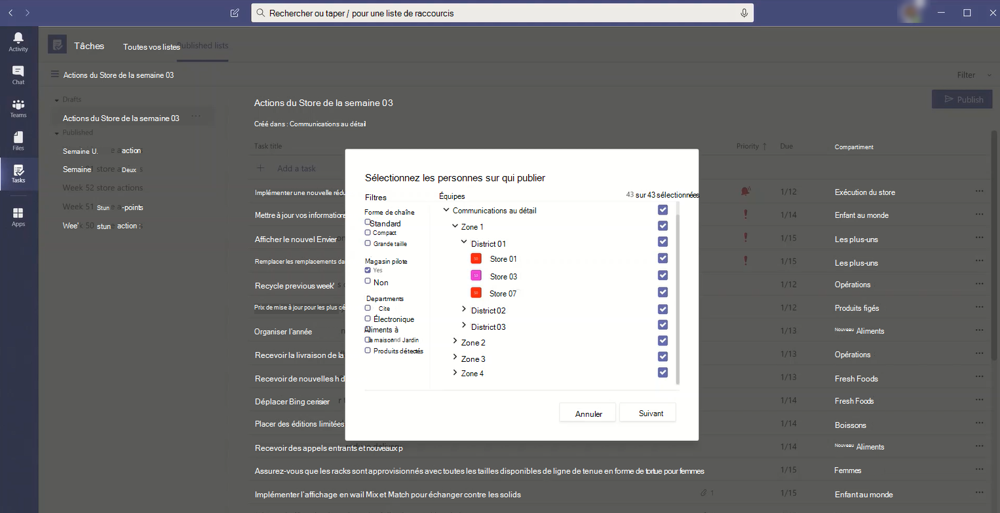

# <a name="set-up-your-team-targeting-hierarchy"></a>Configurer la hiérarchie de ciblage de votre équipe

La configuration d’une hiérarchie de ciblage d’équipe permet à votre organisation de publier du contenu sur un ensemble important d’équipes. La hiérarchie de ciblage d’équipe définit la relation entre les équipes dans votre hiérarchie, sur lesquelles les utilisateurs peuvent publier des tâches et sur les équipes sur lesquelles les utilisateurs sont autorisés à publier des données. Les fonctionnalités de publication sont désactivées pour tous les utilisateurs, sauf si une hiérarchie de ciblage d’équipe est définie pour votre organisation. Pour configurer une hiérarchie de ciblage d’équipe, vous devez créer un fichier qui définit la hiérarchie, puis le télécharger dans Teams pour l’appliquer à votre organisation. Une fois le schéma téléchargé, les applications au sein Teams peuvent l’utiliser.

> [!IMPORTANT]
> Pour la version initiale, seule l’application Tâches prend en charge les équipes hiérarchiques.  L’application d’une hiérarchie de ciblage d’équipe à votre organisation activera [la publication](https://support.microsoft.com/office/publish-task-lists-to-create-and-track-work-in-your-organization-095409b3-f5af-40aa-9f9e-339b54e705df) des tâches dans l’application Tâches. Vous ne verrez pas une hiérarchie d’équipes dans d’autres domaines Microsoft Teams.

Voici un exemple de la manière dont la hiérarchie est représentée dans l’application Tâches dans Teams. Une fois qu’une liste de tâches est créée, les membres de l’équipe de publication peuvent sélectionner les équipes de destinataires à qui envoyer (publier) la liste de tâches. Lors de la sélection d’équipes, l’équipe de publication peut filtrer par hiérarchie, par attributs ou une combinaison des deux.<br>



## <a name="terminology"></a>Terminologie

Les termes suivants seront importants lorsque vous naviguerez dans les hiérarchies. Teams sera appelé **« nodes**».

* **Les nodes racines** sont les plus élevés dans la hiérarchie. Dans l’exemple, Retail Communications est un nœud racine.
* **Les nodes parents** et **les nodes enfants** sont des termes qui représentent une relation entre deux nod connectés. Dans l’exemple, le District 01 est un nœud enfant de la Zone 1.
* Plusieurs niveaux d’enfants sont appelés **descendants.** District 01, Store 01, Store 03, Store 07, District 02 et District 03 sont tous descendants de la Région 1.
* Un nœud sans enfants est appelé **nœud de feuilles.** Ils se placent au bas d’une hiérarchie.
* **Les équipes** de destinataires sont des équipes qui ont été sélectionnées pour recevoir un ensemble spécifique de contenu à publier. Ce doivent être des nodes de feuilles.

## <a name="plan-your-hierarchy"></a>Planifier votre hiérarchie

Avant de créer le schéma qui définit votre hiérarchie, vous devez planifier et décider comment vous voulez mettre en forme votre organisation.  Une des premières priorités consiste à décider quels groupes organisationnels doivent publier des tâches dans d’autres groupes. Chaque nœud de la hiérarchie représente un groupe de travail ou un groupe de groupes.

### <a name="permissions-to-publish"></a>Autorisations de publication

L’autorisation de publier dépend du fait qu’un utilisateur est membre d’une équipe de la hiérarchie ainsi que de la relation qui existe entre cette équipe ou un ensemble d’équipes avec d’autres équipes de la hiérarchie.

> [!NOTE]
> Le propriétaire d’une équipe se vu également accorder des autorisations de publication.

* Si un utilisateur est membre d’au moins une équipe qui a des descendants dans la hiérarchie, cet utilisateur peut publier sur ces descendants sans être membre de toutes les équipes dans qui il souhaite publier.
* Si un utilisateur est membre d’au moins une équipe dans la hiérarchie, mais n’est pas membre d’une équipe avec des descendants dans la hiérarchie, il peut voir et recevoir des contenus publiés de l’organisation.
* Si un utilisateur n’est membre d’aucune équipe dans la hiérarchie, il ne verra aucune fonctionnalité liée à la publication.

### <a name="guidelines"></a>Instructions

* Un seul fichier hiérarchique peut être appliqué par organisation. Toutefois, vous pouvez inclure différentes parties de votre organisation sous forme de hiérarchies distinctes de nodes au sein d’un fichier. Par exemple, Contoso Pharmaceuticals possède un nœud racine Densaire et un nœud racine Commercial. Les deux nod racines ont plusieurs lignes de descendants et il n’existe aucun chevauchement entre eux.
* Seuls les nodes de feuille peuvent être des destinataires d’une composition. D’autres niveaux de la hiérarchie sont utiles pour sélectionner les destinataires d’une composition.
* Une équipe ne peut être représentée qu’une seule fois dans une hiérarchie.
* Une hiérarchie peut contenir jusqu’à 15 000 nodes. Nous prévoyons de travailler avec des clients afin d’élever cette limite pour les grandes organisations.

### <a name="example-hierarchy"></a>Exemple de hiérarchie

Par exemple, dans la hiérarchie suivante, Recall, Communications et HR peuvent publier des tâches sur chaque nœud inférieur (équipe) dans la hiérarchie, mais la zone Nord-est peut uniquement publier des tâches dans les équipes du Store de New York et du Store de New York. La hiérarchie exemple permet aux groupes Rappel, Communications et RH de publier des tâches qui s’appliquent à l’ensemble de l’entreprise, telles que des informations sur les avantages ou des messages du PDG. La zone Nord-est peut publier des tâches telles que la planification du personnel, les informations météorologiques, etc., uniquement dans les équipes du Store de New York et du Store de York.


## <a name="create-your-hierarchy"></a>Créer votre hiérarchie

> [!NOTE]
> Le reste de cet article décrit la configuration d’une hiérarchie d’équipe dans le contexte de la publication de tâches dans les équipes de destinataires. Consultez [l’application Gérer les](./manage-tasks-app.md) tâches pour votre organisation dans Teams pour une vue d’ensemble de l’application Tâches, où la publication de tâches apparaît lorsqu’elle est activée.

Le schéma qui définit votre hiérarchie est basé sur un fichier de valeurs séparées par des virgules (CSV). Le fichier doit être au format UTF-8. Chaque ligne du fichier CSV correspond à un nœud au sein de la hiérarchie des équipes. Chaque ligne contient des informations qui nomment le nœud au sein de la hiérarchie, la lie éventuellement à une équipe et inclut des attributs qui peuvent être utilisés pour filtrer les équipes dans les applications qui la supportent.

Vous pouvez également définir des **compartiments,** qui sont des catégories que l’équipe de publication peut utiliser pour organiser le contenu envoyé aux équipes de destinataires afin de leur faciliter l’affichage, le tri et la concentration sur le contenu pertinent.

### <a name="add-required-columns"></a>Ajouter des colonnes requises

Le fichier CSV doit contenir les trois colonnes suivantes, dans l’ordre suivant, en commençant par la première colonne. Un nœud doit être lié à une équipe pour recevoir des tâches.

| Nom de colonne   | Obligatoire | Description   |
----------------|----------|---------------|
| DisplayName    | Oui      | Ce champ est le nom du nœud. Le nom peut comporter jusqu’à 100 caractères et contenir uniquement les caractères A-Z, a-z et 0-9. Les noms de nœuds doivent être uniques. |
| ParentName    | Oui       | Il s’agit du nom du nœud parent. La valeur que vous spécifiez ici doit correspondre exactement à la valeur du champ **DisplayName** du nœud parent. Si vous voulez ajouter plusieurs nœuds parents, séparez le nom de chaque nœud parent par un point-virgule (;). Vous pouvez ajouter jusqu’à 25 nœuds parents et chaque nom de nœud parent peut faire jusqu’à 2 500 caractères. Un nœud peut avoir plusieurs nœuds parents uniquement si les nœuds parents sont des nœuds racines.   <br><br>**IMPORTANT** Attention de ne pas créer de boucle dans laquelle un parent qui se trouve plus haut dans la hiérarchie fait référence à un nœud enfant plus bas dans la hiérarchie. Cela n’est pas pris en charge. |
| TeamId        | Oui, si l’équipe publie des tâches ou reçoit des tâches d’un nœud parent       | Il contient l’ID de l’équipe à qui vous voulez lier un nœud. Chaque nœud doit faire référence à une équipe unique, de sorte que chaque valeur TeamId peut apparaître une seule fois dans le fichier de hiérarchie. Pour obtenir l’ID d’une équipe à qui vous voulez lier un nœud, exécutez la commande PowerShell suivante `Get-Team | Export-Csv TeamList.csv` : Cette commande répertorie les équipes de votre organisation et inclut le nom et l’ID de chaque équipe. Recherchez le nom de l’équipe avec qui vous souhaitez établir un lien, puis copiez l’ID dans ce champ.|

> [!NOTE]
> Si un nœud n’est pas un nœud racine ou un nœud de feuille et que vous n’avez pas besoin de l’appartenance à l’équipe pour accorder les autorisations correspondantes pour la publication et la rapport, vous pouvez laisser l’TeamId vide. Vous pouvez utiliser cette méthode pour ajouter de la granularité lors du choix des équipes de destinataires ou pour afficher les rapports d’achèvement sans avoir d’équipe correspondante.

### <a name="add-attribute-columns"></a>Ajouter des colonnes d’attribut

Après avoir ajouté les trois colonnes requises, vous pouvez ajouter des colonnes d’attribut facultatives. Ces attributs peuvent être utilisés pour filtrer les nodes afin de sélectionner plus facilement ceux sur qui vous voulez publier des tâches. Il existe deux façons de définir vos attributs, selon que les valeurs pour cet attribut sont mutuellement exclusives.

|Méthodes d’ajout d’attributs|Description |Exemple  |
|---|---------|---------|
|Si les valeurs d’un attribut sont mutuellement exclusives, le nom de colonne que vous spécifiez devient le nom de l’attribut.|Chaque ligne peut contenir une valeur pour cet attribut, et chaque colonne d’attribut peut comporter jusqu’à 50 valeurs uniques. Chaque valeur peut faire jusqu’à 100 caractères. L’ensemble des valeurs d’attribut que vous spécifiez dans la colonne d’attribut s’affiche en tant que valeurs de filtre pour cet attribut lors de la sélection des équipes de destinataires à l’aide de la hiérarchie de ciblage d’équipe.|Vous souhaitez que les utilisateurs puissent filtrer les magasins par disposition. Les valeurs pour cet attribut s’excluent mutuellement, car un magasin ne peut avoir qu’une mise en page. <br><br>Pour ajouter un attribut afin de filtrer les magasins par mise en page, ajoutez une colonne nommée Disposition du Store. Dans cet exemple, les valeurs de l’attribut de disposition Store sont Compact, Standard et Grande.
|Si vous devez indiquer plusieurs valeurs pour un attribut et que les valeurs ne sont pas mutuellement exclusives, utilisez le format **AttributeName:UniqueValue** pour les noms de colonnes. <br><br>**IMPORTANT** Veillez à utiliser les deux-points en anglais uniquement (:) comme unicode n’est pas pris en charge en tant que délimiteur de colonne d’attribut. |Chaîne de texte avant les deux-points (:) devient le nom de l’attribut. Toutes les colonnes qui contiennent la même chaîne de texte avant les deux-:) sont regroupés en une section du menu de filtrage. Chacune des chaînes après les deux-points devient les valeurs de cette section.<br><br>Chaque ligne peut avoir une valeur de 0 (zéro) ou 1 pour cet attribut. Une valeur de 0 signifie que l’attribut ne s’applique pas au nœud et une valeur de 1 signifie que l’attribut s’applique à ce nœud.|Vous souhaitez que les utilisateurs puissent filtrer les magasins par service. Un magasin peut avoir plusieurs services et les valeurs pour cet attribut ne sont pas mutuellement exclusives.<br><br>Dans cet exemple, nous ajoutons Departments:Clothing, Departments:Electronics, Departments:Foods, Departments:Home and Garden, Departments:Sports: Attribute Columns. Les services deviennent le nom de l’attribut et les utilisateurs peuvent filtrer par les services Vêtements, Électronique, Aliments, Famille et Jardin et Articles de sport.|

Lorsque vous ajoutez une colonne d’attribut, gardez les éléments suivants à l’esprit :

* Nom de la colonne que vous spécifiez ou de la colonne que vous spécifiez avant les deux-points (:) devient le nom de l’attribut. Cette valeur sera affichée dans les Teams qui utilisent la hiérarchie.
* Vous pouvez avoir jusqu’à 50 colonnes d’attributs dans votre hiérarchie.
* Le nom de la colonne peut comporter jusqu’à 100 caractères et contenir uniquement les caractères A-Z, a-z et 0-9, ainsi que des espaces. Les noms de colonne doivent être uniques.

### <a name="add-bucket-columns"></a>Ajouter des colonnes de compartiment

Vous pouvez ajouter des colonnes de compartiment pour créer des compartiments, qui sont des regroupements dans lesquels les tâches peuvent être organisées. Chaque compartiment possède sa propre colonne dans le fichier CSV. Les compartiments que vous créez sont mis à la disposition de l’équipe de publication. L’équipe de publication peut ensuite utiliser ces compartiments pour catégoriser les tâches pour les équipes de destinataires. Si un compartiment n’existe pas encore dans une équipe, il est créé à la demande lors de la publication des tâches.

En classant les éléments de travail une fois de façon centralisée, l’équipe de publication peut pré-organiser la liste des tâches pour les dizaines, centaines ou milliers d’équipes de destinataires qui reçoivent la liste de tâches. Les équipes de destinataires peuvent ensuite trier et filtrer leurs tâches par compartiment pour se concentrer sur la zone la plus pertinente pour leur travail.

Lorsque vous ajoutez une colonne de compartiment, notez ce qui suit :

* Le nom de la colonne devient le nom du compartiment. Chaque compartiment que vous spécifiez apparaîtra dans la liste compartiments du Teams applications qui utilisent la hiérarchie.
* Nous vous recommandons de ne pas inclure d’informations sensibles dans les noms de compartiment. Pour le moment, les équipes de publication ne peuvent pas supprimer un compartiment via la publication après sa création.
* Le nom de la colonne doit être précédé d’un hashtag (#). Il peut comporter jusqu’à 100 caractères et contenir uniquement les caractères A-Z, a-z et 0-9. Par exemple, #Operations et #Frozen Produits.
* Une hiérarchie peut contenir jusqu’à 25 colonnes de compartiment. Nous prévoyons de travailler avec des clients afin d’augmenter cette limite pour les grandes organisations.

### <a name="example"></a>Exemple

Voici un exemple de fichier CSV de schéma qui serait créé pour prendre en charge la hiérarchie présentée dans l’image précédente. Ce schéma contient les éléments suivants :

* Trois colonnes obligatoires `TargetName` `ParentName` nommées , et `TeamId`
* Trois colonnes d’attribut `Store layout` `Departments:Clothing` nommées , et `Departments:Foods`
* Trois colonnes de compartiment `Fresh Foods` `Frozen Foods` nommées , et `Women's Wear`

`Store layout`L’attribut possède des valeurs qui `Compact` `Standard` comprennent , et `Large` . Les `Departments` colonnes d’attribut peuvent être définies sur une valeur de `0` (zéro) ou `1` . La `Store` disposition et les `Departments` attributs ne sont pas affichés dans l’image ci-dessus. Ils sont ajoutés ici pour vous aider à montrer comment les attributs peuvent être ajoutés aux entrées de nœud. Il en va de même pour les trois colonnes de compartiment.

```CSV
TargetName,ParentName,TeamId,Store layout,Departments:Clothing,Departments:Foods,#Fresh Foods,#Frozen Foods,#Women's Wear
Recall,,db23e6ba-04a6-412a-95e8-49e5b01943ba,,,,,,
Communications,,145399ce-a761-4843-a110-3077249037fc,,,,,,
HR,,125399ce-a761-4983-a125-3abc249037fc,,,,,,
East Regional Office,HR;Communications;Recall,,,,,,,
West Regional Office,HR;Communications;Recall,,,,,,,
Northeast Zone,East Regional Office,,,,,,,
Southeast Zone,East Regional Office,,,,,,,
New York Store,Northeast Zone,e2ba65f6-25e7-488b-b8f0-b8562d5de60a,Large,1,1,,,
Boston Store,Northeast Zone,0454f08a-0507-437c-969a-682eb2fae7fc,Standard,1,1,,,
Miami Store,Southeast Zone,619d6e4e-5f68-4b36-8e1f-16c98d7396c1,Compact,0,1,,,
New Orleans Store,Southeast Zone,6be960b8-72af-4561-a343-9ac4711874eb,Compact,0,1,,,
Seattle Store,West Regional Zone,487c0d20-4e55-4dc2-8187-a24c826e0fee,Standard,1,1,,,
Los Angeles Store,West Regional Zone,204a1287-2efb-4a8a-88e0-56fbaf5a2389,Large,1,1,,,
```

## <a name="apply-your-hierarchy"></a>Appliquer votre hiérarchie

> [!NOTE] 
> Pour effectuer cette étape, vous devez installer et utiliser Teams module d’aperçu public PowerShell à partir de la galerie PowerShell. Pour savoir comment installer le module, voir Installer Teams PowerShell.

> [!NOTE]
> Cloud de la communauté du secteur public clients (Cloud de la communauté du secteur public) doivent utiliser la version d’aperçu de la [cmdlet version 2.4.0 ou](https://www.powershellgallery.com/packages/MicrosoftTeams/2.4.0-preview) ultérieure pour s’assurer que les données sont acheminées vers l’environnement Cloud de la communauté du secteur public plutôt que vers le cloud public. de l’environnement.

Après avoir défini votre hiérarchie dans le fichier de schéma CSV, vous êtes prêt à la télécharger sur Teams. Pour ce faire, exécutez la commande suivante. Vous devez être un administrateur global ou un Teams de service pour cette étape.

```powershell
Set-TeamTargetingHierarchy -FilePath "C:\ContosoTeamSchema.csv"
```

### <a name="update-your-hierarchy"></a>Mettre à jour votre hiérarchie

Vous pouvez télécharger une nouvelle hiérarchie pour remplacer l’ancienne à l’aide de la même commande PowerShell que celle ci-dessus. Chaque fois que vous téléchargez une nouvelle hiérarchie, elle remplace la hiérarchie précédente.

### <a name="check-the-status-of-your-hierarchy"></a>Vérifier l’état de votre hiérarchie

Vous pouvez exécuter la commande suivante pour vérifier l’état du chargement de votre hiérarchie.

```powershell
Get-TeamTargetingHierarchyStatus
```

La commande retourne les champs suivants :

Champ|Description
-----|------------
ID | ID unique pour le téléchargement.
Statut | Télécharger statut de l’équipe. Les valeurs **sont Démarrage,** **Validation,** **Réussite** et **Échec**
ErrorDetails | Détails en cas d’erreur de téléchargement. Pour plus d’informations sur les détails des erreurs, voir la section de dépannage. S’il n’y a pas d’erreur, ce champ est vide.
LastUpdatedAt | Date et heure de la dernière mise à jour du fichier.
LastModifiedBy | ID du dernier utilisateur qui a modifié le fichier.
FileName | Nom du fichier CSV.

## <a name="remove-your-hierarchy"></a>Supprimer votre hiérarchie

Si vous souhaitez désactiver  immédiatement l’onglet Listes publiées pour tous les utilisateurs de votre organisation, vous pouvez supprimer votre hiérarchie. Les utilisateurs n’ont pas accès à l’onglet **Listes** publiées ou à l’une des fonctionnalités de l’onglet.  Cela inclut la possibilité de créer des listes des tâches à publier, d’accéder à des brouillons de listes, de publier, de republier et de dupliquer des listes, et d’afficher les rapports. La suppression de la hiérarchie ne supprime pas les tâches publiées précédemment. Ces tâches restent disponibles pour les équipes de destinataires.

Pour supprimer votre hiérarchie, exécutez la commande suivante. Vous devez être un administrateur pour effectuer cette étape.

```powershell
Remove-TeamTargetingHierarchy
```

Lors de la confirmation de la suppression, le message d’état affiche toujours le schéma précédent présent, même si la tentative de suppression renvoie une erreur qui a pour effet que l’objet est Null.

## <a name="create-a-sample-hierarchy"></a>Créer un exemple de hiérarchie

### <a name="install-the-teams-powershell-module"></a>Installer le module Teams PowerShell

> [!IMPORTANT]
> Pour effectuer cette étape, vous devez installer et utiliser le module Teams d’aperçu public PowerShell à partir de [la galerie PowerShell.](https://www.powershellgallery.com/packages/MicrosoftTeams/) Pour savoir comment installer le module, voir [Installer Teams PowerShell.](teams-powershell-install.md)

### <a name="sample-script"></a>Exemple de script

Le script suivant peut être utilisé pour créer les équipes et télécharger un .csv fichier dans votre Microsoft Teams client. Si vous avez une hiérarchie existante, ce script la remplace.

#### <a name="create-teams-for-a-simple-hierarchy"></a>Créer des équipes pour une hiérarchie simple

```powershell
$tm1 = New-Team -DisplayName "HQ"
$tm2 = New-Team -DisplayName "North"
$tm3 = New-Team -DisplayName "Store 1"
$tm4 = New-Team -DisplayName "Store 2"
$tm5 = New-Team -DisplayName "South"
$tm6 = New-Team -DisplayName "Store 3"
$tm7 = New-Team -DisplayName "Store 4"
```

#### <a name="use-team-data-to-create-comma-separated-output-displayname-parentname-teamid"></a>Utiliser les données d’équipe pour créer une sortie séparée par des virgules (DisplayName, ParentName, TeamId)

```powershell
$csvOutput = "DisplayName" + "," + "ParentName" + "," + "TeamId" + "`n"
$csvOutput = $csvOutput + $tm1.DisplayName + "," + "," + $tm1.GroupID + "`n"
$csvOutput = $csvOutput + $tm2.DisplayName + "," + $tm1.DisplayName + "," + $tm2.GroupID + "`n"
$csvOutput = $csvOutput + $tm3.DisplayName + "," + $tm2.DisplayName + "," + $tm3.GroupID + "`n"
$csvOutput = $csvOutput + $tm4.DisplayName + "," + $tm2.DisplayName + "," + $tm4.GroupID + "`n"
$csvOutput = $csvOutput + $tm5.DisplayName + "," + $tm1.DisplayName + "," + $tm5.GroupID + "`n"
$csvOutput = $csvOutput + $tm6.DisplayName + "," + $tm5.DisplayName + "," + $tm6.GroupID + "`n"
$csvOutput = $csvOutput + $tm7.DisplayName + "," + $tm5.DisplayName + "," + $tm7.GroupID 
```

#### <a name="save-output-to-a-csv-file-in-the-downloads-folder"></a>Enregistrer la sortie d'.csv fichier dans **le dossier Téléchargements**

```powershell
$csvOutputPath = $env:USERPROFILE + "\downloads\testhierarchy-" + (Get-Date -Format "yyyy-MM-dd-hhmmss") + ".csv" 
$csvOutput | Out-File $csvOutputPath
```

#### <a name="upload-the-hierarchy"></a>Télécharger la hiérarchie

```powershell
Set-TeamTargetingHierarchy -FilePath $csvOutputPath
Get-TeamTargetingHierarchyStatus
```

## <a name="troubleshooting"></a>Résolution des problèmes

### <a name="how-to-view-error-details"></a>Comment afficher les détails des erreurs

Vous pouvez exécuter la commande suivante pour comprendre ce qui est à l’origine d’une erreur et renvoyer les détails de l’erreur.

```powershell
(Get-TeamTargetingHierarchyStatus).ErrorDetails.ErrorMessage
```

### <a name="you-receive-an-error-message-when-you-upload-your-schema-csv-file"></a>Vous recevez un message d’erreur lors du téléchargement de votre fichier CSV de schéma

Notez le message d’erreur qui doit inclure des informations de dépannage pour indiquer la raison pour laquelle le schéma n’a pas pu être chargé. Examinez et modifiez votre fichier CSV de schéma en fonction des informations du message d’erreur, puis réessayez.

### <a name="you-receive-an-error-invalidteamid-error-message-when-you-upload-your-schema-csv-file"></a>Vous recevez un message d’erreur « Erreur : InvalidTeamId » lorsque vous téléchargez votre fichier CSV de schéma

Lorsque vous essayez de télécharger votre fichier CSV de schéma, vous obtenez le message d’erreur suivant :

```console
Error: InvalidTeamId
Description: TeamID in row # doesn't match a valid Group ID. Please view our documentation to learn how to get the proper GroupID for each team.
```

Vérifiez que vous utilisez le TeamId correct pour l’équipe dans votre fichier CSV de schéma. L’ID d’équipe doit être identique à l’ID de groupe du groupe Microsoft 365 qui le sous-titre de l’équipe. Vous pouvez rechercher l’ID de groupe de l’équipe dans le Microsoft Teams d’administration.

1. Dans le panneau de navigation gauche du [Microsoft Teams d’administration,](https://admin.teams.microsoft.com/)allez à la Teams   >  **Gérer les équipes.**
2. Si la **colonne ID** de groupe n’est  pas affichée dans la table, sélectionnez Modifier les colonnes dans le coin supérieur droit du tableau, puis activer **l’ID de groupe.**
3. Recherchez l’équipe dans la liste, puis recherchez l’ID de groupe.

Assurez-vous que l’TeamId de votre fichier CSV de schéma correspond à l’ID de groupe qui s’affiche dans le Microsoft Teams d’administration.

## <a name="related-topics"></a>Sujets associés

* [Gérer l’application Tâches pour votre organisation dans Teams](manage-tasks-app.md)
* [Présentation de Teams PowerShell](teams-powershell-overview.md)
