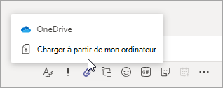
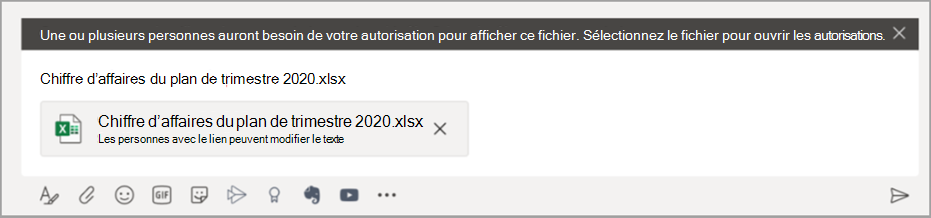

# Partage de fichiers dans Microsoft TeamsSharing files in Microsoft Teams

Dans Microsoft Teams, les utilisateurs peuvent partager du contenu avec d’autres utilisateurs Teams à l’intérieur et à l’extérieur de leur organisation.In Microsoft Teams, users can share content with other Teams users within and outside their organization. Le partage dans Microsoft Teams dépend des paramètres configurés dans SharePoint et OneDrive, de sorte que ce que vous configurez pour SharePoint et OneDrive affectera le partage dans Teams également.Sharing files and folders in Teams is based on the settings configured in SharePoint and OneDrive, so whatever you set up for SharePoint and OneDrive will affect sharing in Teams as well.

## Vue d’ensembleOverview

Les utilisateurs peuvent partager des fichiers à partir de OneDrive, d’équipes et de sites auxquels ils ont accès, et à partir de leur ordinateur.Users can share files from OneDrive, from teams and sites they have access to, and from their computer. Pour partager un fichier, les utilisateurs peuvent suivre la procédure suivante :To share a file, users can do the following:

- Dans un canal, cliquez sur **Joindre** (l’icône du trombone), sélectionnez **Récent**, **Parcourir les canaux et les équipes**, **OneDrive**, ou **Charger à partir de mon ordinateur**, puis choisir le fichier que vous voulez partager.In a channel, click **Attach** (the paperclip icon), select **Recent**, **Browse Teams and Channels**, **OneDrive**, or **Upload from my computer**, and then choose the file they want to share.   
    
- Dans une conversation, cliquez sur **Joindre** l’(icône du trombone), Sélectionnez  ou **OneDrive** ou **Charger à partir de mon ordinateur**, puis choisissez le fichier que vous voulez partager.In a chat, click **Attach** (the paperclip icon), select  or **OneDrive** or **Upload from my computer**, and then choose the file they want to share.  
    
- Copiez et collez le lien de partage dans la zone de rédaction.Copy and paste the sharing link in the compose box. 
    

### Autorisations relatives aux fichiers partagés et aux liens de partagePermissions of shared files and sharing links

Lorsque des utilisateurs partagent un fichier à partir de Teams, ils peuvent définir qui peut accéder au fichier tout comme ils le font dans Microsoft 365.When users share a file from within Teams, they can set who can access the file just like they do across Microsoft 365. Ils peuvent octroyer un accès à toute personne, à des personnes au sein de votre organisation, à des personnes ayant déjà un accès ou à des personnes spécifiques (ce qui peut inclure les personnes dans une discussion entre deux personnes, dans une conversation de groupe ou dans un canal).They can give access to anyone, people in your organization, people with existing access, or specific people (which can include the people in a 1:1 chat, group chat, or channel).  Lorsqu’un fichier est partagé, l’aperçu de fichier est disponible dans le message, avec toutes les actions de fichier telles que **Ouvrir en ligne**, **Télécharger** et **Copier le lien**.When a file is shared, the file preview is available in the message, along with all file actions such as **Open online**, **Download**, and **Copy link**. Le fichier s’ouvre dans Teams par défaut.By default, the file opens in Teams.

Lorsque des utilisateurs partagent un fichier dans une conversation ou un canal, ils sont avertis si tout ou partie des destinataires n’a pas l’autorisation d’afficher le fichier.When users share a file in a chat or channel, they're notified whether some or all recipients don't have permission to view the file. Ils peuvent modifier les autorisations sur le fichier avant de le partager en cliquant sur la flèche près de l’aperçu de fichier qui apparaît désormais dans le message.They can change the permissions on the file before they share it by clicking the arrow next to the file preview that now appears in the message.

## Rubriques connexesRelated topics

[Interaction de SharePoint Online et OneDrive Entreprise avec Microsoft TeamsHow SharePoint Online and OneDrive for Business interact with Microsoft Teams](sharepoint-onedrive-interact.md)

[Modifier le type de lien par défaut d’un siteChange the default link type for a site](/sharepoint/change-default-sharing-link)

[Collaborer avec des invités au sein d’une équipeCollaborate with guests in a team](/microsoft-365/solutions/collaborate-as-team)