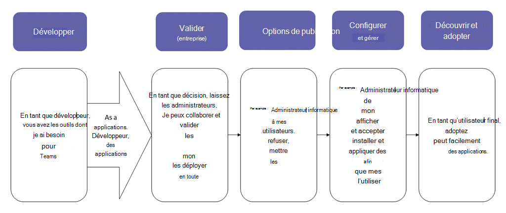
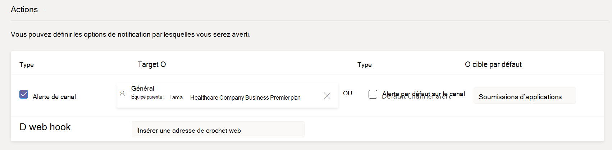
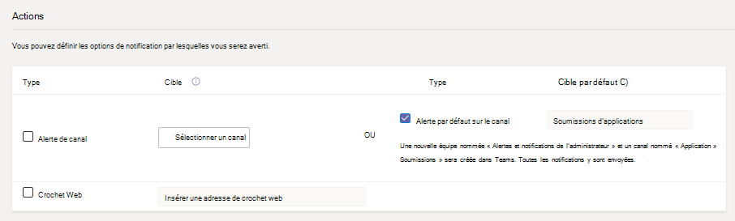
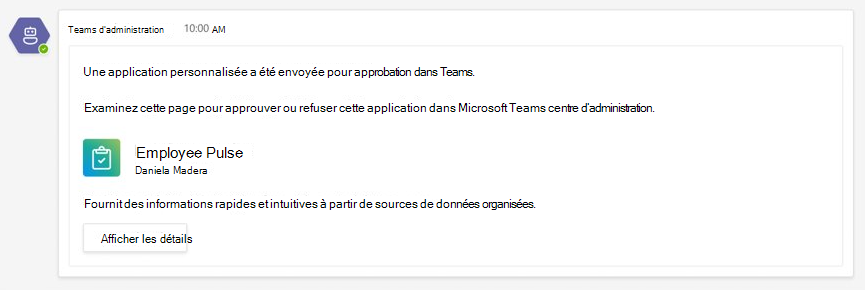
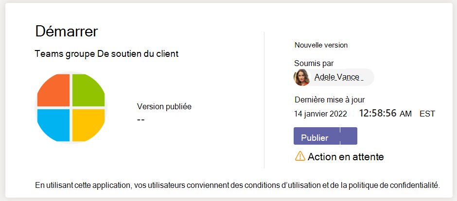

# Publier une application personnalisée envoyée via l’API Teams App Submission

## Présentation

> [!NOTE]
> Lorsque vous publiez une Teams personnalisée, elle est disponible pour les utilisateurs dans le magasin d’applications de votre organisation. Il existe deux façons de publier une application personnalisée et la façon dont vous l’utilisez dépend de la façon dont vous l’obtenez. Cet article explique comment approuver et publier une application personnalisée qu’un développeur envoie via l Teams **API Soumission de l’application**. L’autre méthode, le téléchargement d’une application personnalisée, est utilisée lorsqu’un développeur vous envoie un package d’application .zip format. Pour en savoir plus sur cette méthode, voir [Publier une application personnalisée en téléchargeant un package d’application](/microsoftteams/upload-custom-apps). Le widget d’approbation de l’application n’est pas Cloud de la communauté du secteur public vos locataires.

> [!IMPORTANT]
> Cette méthode n’est actuellement pas disponible pour Cloud de la communauté du secteur public environnements. Vous devez utiliser la *méthode de téléchargement d’une application* personnalisée.

Cet article fournit des instructions de bout en bout pour la façon d’orienter votre application Teams du développement au déploiement jusqu’à la découverte. Vous obtenez une vue d’ensemble des expériences connectées que Teams fournit dans le cycle de vie des applications pour simplifier le développement, le déploiement et la gestion d’applications personnalisées dans le magasin d’applications de votre organisation.

Nous allons couvrir chaque étape du cycle de vie, y compris la façon dont les développeurs peuvent utiliser l’API Teams App Submission pour envoyer des applications personnalisées directement au Centre d’administration Microsoft Teams pour vous aider à passer en revue et approuver, comment définir des stratégies pour gérer les applications pour les utilisateurs de votre organisation et comment vos utilisateurs les découvrent dans Teams.

Ces conseils se concentrent sur Teams aspects de l’application et sont destinés aux administrateurs et professionnels de l’informatique. Pour plus d’informations sur le développement Teams d’applications, voir la [documentation Teams développeur.](/microsoftteams/platform)

## Développer

### Créer l’application

La plateforme Microsoft Teams développeur permet aux développeurs d’intégrer facilement vos propres applications et services afin d’améliorer la productivité, de prendre des décisions plus rapidement et de créer une collaboration autour du contenu et des flux de travail existants. Les applications conçues sur la plateforme Teams sont des ponts entre le client Teams et vos services et flux de travail, ce qui les place directement dans le contexte de votre plateforme de collaboration. Pour plus d’informations, voir la documentation [Teams développeur](/microsoftteams/platform).

### Envoyer l’application

Lorsque l’application est prête à être utilisé en production, le développeur peut soumettre l’application à l’aide de l’API Soumission d’application Teams, qui peut être appelée à partir de [l’API Graph](/graph/api/teamsapp-publish?view=graph-rest-beta&tabs=http#example-2-upload-a-new-application-for-review-to-an-organizations-app-catalog), d’un environnement de développement intégré tel que Visual Studio Code ou d’une plateforme telle que Power Apps et Power Virtual Agents. L’application est alors disponible sur [la page Gérer](/microsoftteams/manage-apps) les applications du Centre d’administration Microsoft Teams, où vous pouvez l’examiner et l’approuver.

L’API Teams App Submission, conçue sur [Microsoft Graph](/graph/api/teamsapp-publish?tabs=http&view=graph-rest-beta#example-2-upload-a-new-application-for-review-to-an-organizations-app-catalog), permet à votre organisation de se développer sur la plateforme de votre choix et automatise le processus de soumission d’approbation pour les applications personnalisées sur Teams.

Voici un exemple de l’étape de soumission de l’application dans Visual Studio Code :

N’oubliez pas que l’application n’est pas encore publiée sur le magasin d’applications de votre organisation. Cette étape envoie l’application au Microsoft Teams d’administration dans lequel vous pouvez l’approuver pour la publication dans le magasin d’applications de votre organisation.

Pour plus d’informations sur l’utilisation de Graph API pour envoyer des applications, voir [ici](/graph/api/teamsapp-publish?tabs=http&view=graph-rest-beta#example-2-upload-a-new-application-for-review-to-an-organizations-app-catalog).

## Notifier

Vous pouvez activer les notifications afin de savoir quand les développeurs envoient une nouvelle application pour révision et approbation. Vous recevrez également des notifications lorsque les développeurs envoient des mises à jour d’application. Pour activer les notifications de soumission d’application dans le Centre d’administration Teams, allez dans [**Notifications & soumissions d’alertesRulesApp** >  > ](https://admin.teams.microsoft.com/notifications/rules) et activez la règle en modifiant le statut en **Actif**. Par défaut, ce paramètre est désactivé. Vous devez être administrateur global ou administrateur Teams pour activer ce paramètre.

Après avoir activer ce paramètre, vous recevrez des notifications dans l’équipe **Alertes et notifications** de l’administrateur sous un nouveau canal nommé **Soumissions d’application**. Vous pouvez également choisir une équipe et un canal existants pour recevoir les notifications à une équipe et un canal spécifiques. Pour cela, merci de procéder comme suit :

1. Dans la règle **Soumission d’application** , cochez **la case** Alerte sur le canal sous **Actions**.
1. Sélectionnez **le bouton Sélectionner un** canal.
1. Recherchez une équipe à ajouter.
1. Recherchez un canal à ajouter.
1. **Sélectionnez Appliquer**.

    

> [!NOTE]
> **Cochez la case** Alerte sur les canaux par défaut pour recevoir des notifications à l’équipe **Alertes et notifications** de l’administrateur dans le canal **Soumission d’application**.

Vous pouvez également configurer les notifications sur un site web externe en spécifiant une URL de site web public une fois que vous avez cocher la case **Web de** l’utilisateur. Une charge utile de notification JSON sera envoyée à l’URL de votre site web.

Après avoir installé la règle de soumission d’application, vous pouvez passer en revue les cartes de notification dans le canal spécifié pour afficher les **détails** de l’application et sélectionner Afficher les détails pour ouvrir les applications dans le Centre d’administration Teams’application.

## Validate

La [page Gérer](/microsoftteams/manage-apps) les applications du Centre d’administration Microsoft Teams (dans le navigation gauche, allez dans [**les applications Teams** **appsManage** > ](https://admin.teams.microsoft.com/manage-apps)) vous permet d’afficher toutes les applications Teams pour votre organisation. Le **widget Approbation en** attente en haut de la page vous permet de savoir quand une application personnalisée est soumise pour approbation.

Dans la table, une application nouvellement envoyée affiche automatiquement le **statut** Publication **d’Soumis** et **État** de **Bloqué**. Vous pouvez trier la **colonne État de publication** dans l’ordre décroit pour trouver rapidement l’application.

Cliquez sur le nom de l’application pour consulter la page des détails de l’application. Sous **l’onglet** À propos de, vous pouvez afficher des détails sur l’application, y compris la description, l’état, l’auteur et l’ID de l’application.

Pour plus d’informations sur l’utilisation de Graph API de publication pour vérifier l’état de **publication**, voir [ici](/graph/api/appcatalogs-list-teamsapps?tabs=http&view=graph-rest-beta#example-3-find-application-based-on-the-teams-app-manifest-id).

## Publier

Lorsque vous êtes prêt à mettre l’application à la disposition des utilisateurs, publiez l’application.

1. Dans le volet de navigation gauche du Centre d’administration Microsoft Teams, accédez aux **applications Teams** > **Gérer les applications**.
2. Cliquez sur le nom de l’application pour aller à la page des détails de l’application, puis dans la zone État **de publication,** sélectionnez **Publier**.

    

Après avoir publié l’application, le statut **publication** passe à **Publié et** **l’état** passe automatiquement à **Autorisé**.

## Configurer et gérer

### Contrôler l’accès à l’application

Par défaut, tous les utilisateurs de votre organisation peuvent accéder à l’application dans le magasin d’applications de votre organisation. Pour restreindre et contrôler les personnes autorisées à utiliser l’application, vous pouvez créer et affecter une stratégie d’autorisation d’application. Pour plus d’informations, consultez <a href="/microsoftteams/teams-app-permission-policies" target="_blank">Gérer les stratégies d’autorisation d’application dans Teams</a>.

### Épingler et installer l’application pour les utilisateurs

Par défaut, pour que les utilisateurs trouvent l’application qu’ils doivent trouver, ils doivent se rendre dans le magasin d’applications de votre organisation et la parcourir ou la rechercher. Pour faciliter l’accès des utilisateurs à l’application, vous pouvez épingler l’application à la barre de l’application dans Teams. Pour ce faire, créez une stratégie de configuration d’application et attribuez-la aux utilisateurs. Pour plus d’informations, consultez l’article <a href="/microsoftteams/teams-app-setup-policies" target="_blank">Gérer les stratégies et paramètres d’application personnalisés dans Teams</a>.

### Rechercher des événements d’application Teams dans le journal d’audit

Vous pouvez effectuer des recherches dans le journal d’audit Teams l’activité des applications dans votre organisation. Pour en savoir plus sur la recherche dans le journal d’audit et la liste des activités Teams enregistrées dans le journal d’audit, voir Rechercher des événements dans le journal <a href="/microsoftteams/audit-log-events" target="_blank">d’audit dans Teams</a>.

Pour effectuer une recherche dans le journal d’audit, vous devez au préalable activer la fonctionnalité d’audit dans le <a href="https://protection.office.com" target="_blank">Centre de sécurité et de conformité</a>. Si vous souhaitez en savoir plus, veuillez consulter <a href="https://support.office.com/article/Turn-Office-365-audit-log-search-on-or-off-e893b19a-660c-41f2-9074-d3631c95a014" target="_blank">Activer ou désactiver la recherche dans le journal d'audit</a>. N’oubliez pas que les données d’audit ne sont disponibles qu’à partir du moment où vous avez activé l’audit.

## Découvrir et adopter

Les utilisateurs qui ont des autorisations sur l’application peuvent la trouver dans le magasin d’applications de votre organisation. Dans la page Applications, allez à Built **for *Your Organization Name*** (Conçu pour le nom de votre organisation) pour rechercher les applications personnalisées de votre organisation.

Si vous avez créé et attribué une stratégie de configuration d’application, l’application est épinglée à la barre de l’application dans Teams pour faciliter l’accès aux utilisateurs à qui la stratégie a été attribuée.

## Mettre à jour

Pour mettre à jour une application, les développeurs doivent continuer à suivre les étapes de la section [Développer](#develop) .

Lorsque le développeur envoie une mise à jour à une application personnalisée publiée, vous êtes averti dans **le widget Approbation** en attente de la page [Gérer les applications](/microsoftteams/manage-apps) . Dans la table, **l’état de publication** de l’application sera réglé sur **Mettre à jour envoyée**. Vous serez également averti dans l’équipe **Alertes et notifications** de l’administrateur sous  le canal de soumission d’application si vous avez désactivé les notifications de soumission d’application. La carte de notification aura un lien pour vous diriger directement vers l’application dans le Teams d’administration. Pour plus d’informations sur la façon d’activer les notifications de soumission d’application, voir [Notifier](#notify).

Pour consulter et publier une mise à jour d’application :

1. Dans le volet de navigation gauche du Centre d’administration Microsoft Teams, accédez aux **applications Teams** > **Gérer les applications**.
2. Cliquez sur le nom de l’application pour aller à la page des détails  de l’application, puis sélectionnez Mettre à jour disponible pour passer en revue les détails de la mise à jour.

    
3. Lorsque vous êtes prêt, sélectionnez **Publier** pour publier la mise à jour. Cette faisant, remplace l’application existante, met à jour le numéro de version et modifie l’état de **publication** sur **Publié**. Toutes les stratégies d’autorisation d’application et stratégies de configuration d’application demeurent appliquées pour l’application mise à jour.

    Si vous refusez la mise à jour, la version antérieure de l’application reste publiée.

Gardez à l’esprit les choses suivantes :

- Lorsqu’une application est approuvée, n’importe qui peut envoyer une mise à jour à l’application. Cela signifie que d’autres développeurs, y compris le développeur ayant initialement soumis l’application, peuvent soumettre une mise à jour à l’application.
- Lorsqu’un développeur envoie une application et que la demande est en attente, seul ce même développeur peut envoyer une mise à jour de l’application. Les autres développeurs peuvent envoyer une mise à jour uniquement après l’approbation de l’application.

Pour plus d’informations sur l’utilisation de Graph API pour mettre à jour les applications, voir <a href="/graph/api/teamsapp-update">ici</a>.

## Voir aussi

- [Publier une application personnalisée en chargeant un package d’application](upload-custom-apps.md)
- [Gérer vos applications dans le Centre Microsoft Teams’administration](manage-apps.md)
- [Gérer les stratégies d’application personnalisée et les paramètres dans Teams](teams-custom-app-policies-and-settings.md)
- [Gérer les stratégies d’autorisation d’application dans Teams](teams-app-permission-policies.md)
- [Gérer les stratégies de mise en application dans Teams](teams-app-setup-policies.md)
- [Teams surveillance et alertes](alerts/teams-admin-alerts.md)
- <a href="/graph/api/resources/teamsapp?view=graph-rest-beta" target="_blank">API Microsoft Graph pour Teams applications</a>
