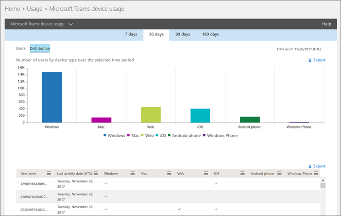
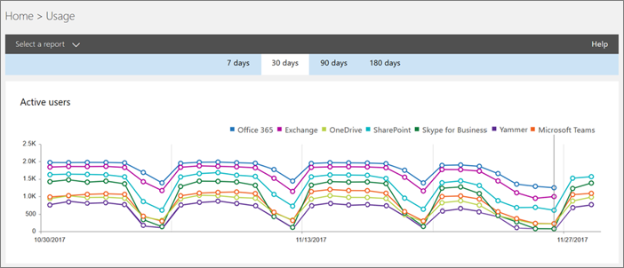

# Rapports d’activité de l’utilisateur Microsoft Teams 

Vous pouvez utiliser des rapports d’activité dans le Centre d’administration Microsoft 365 pour voir comment les utilisateurs de votre organisation utilisent Microsoft Teams. Par exemple, si certains n’utilisent pas encore Microsoft Teams, ils ne savent pas encore comment commencer à utiliser Teams pour être plus productifs et collaboratifs. Votre organisation peut utiliser les rapports d’activité pour choisir où hiérarchiser les efforts de formation et de communication.

## Afficher les rapports de Teams dans le tableau de bord Rapports

1. Dans la [Centre d’administration Microsoft 365,](https://portal.office.com/adminportal/home)sélectionnez **Utilisation**  >  **des rapports.**
 
2. Sur la page **Utilisation,** **sélectionnez** Sélectionner un rapport, puis sous **Microsoft Teams** dans la liste des rapports, sélectionnez le rapport que vous voulez afficher.

## Teams rapports d’activité disponibles

Vous pouvez afficher deux rapports d’activité :

- [Rapport d’activité des utilisateurs de Microsoft Teams](#microsoft-teams-user-activity-report) 
- [Rapport d’utilisation des périphériques de Microsoft Teams](#microsoft-teams-device-usage-report) 

### Rapport d’activité des utilisateurs de Microsoft Teams

Le Teams activité des utilisateurs vous donne un affichage des activités les plus courantes que vos utilisateurs effectuent dans Teams. Cela inclut le nombre de personnes qui participent à une conversation dans un canal, combien communiquent par le biais d’un message de conversation privée et combien participent à des appels ou des réunions. Vous pouvez voir ces informations pour l’ensemble de votre organisation et pour chaque utilisateur individuel.

#### Interpréter le rapport d Microsoft Teams activité des utilisateurs

Vous pouvez visualiser l’activité d Teams un utilisateur en regardant les graphiques **Activité** et **Utilisateurs.**

|Légende |Description  |
|--------|-------------|
|**1**   |Le Teams activité des utilisateurs peut être pris en compte pour les tendances des 7, 30, 90 ou 180 derniers jours. Toutefois, si vous cliquez sur un plage de temps spécifique dans le rapport, le tableau (7) affiche les données sur 30 jours, jusqu’à la date (2) à laquelle le rapport a été généré. |
|**2**   |Chaque rapport comporte la date à laquelle il a été généré. Les rapports reflètent généralement une latence de 24 à 48 heures par rapport à l’heure de l’activité. |
|**3**   |**L’affichage** Activité indique le nombre d’Microsoft Teams par type d’activité. Les types d’activités sont le nombre de messages de conversation d’équipe, de messages de conversation privée, d’appels et de réunions. |
|**4**   |**L’affichage** Utilisateurs indique le nombre d’utilisateurs par type d’activité. Les types d’activités sont le nombre de messages de conversation d’équipe, de messages de conversation privée, d’appels et de réunions. |
|**5**   |L’axe X sur les graphiques est la plage de dates sélectionnée pour le rapport spécifique. <ul><li>Dans le **graphique Activité,** l’axe Y indique le nombre d’activités spécifiées.</ul></li> <ul><li>Dans le graphique **Utilisateurs,** l’axe Y indique le nombre d’utilisateurs participant aux conversations d’équipe, aux conversations privées, aux appels ou aux réunions.</ul></li> |
|**6**   |You can filter the series you see on the chart by clicking on an item in the legend. Par exemple,  dans le graphique Activité, cliquez ou appuyez sur **Messages** de canal, **Messages** de conversation, **Appels** ou Réunions pour voir uniquement les informations **liées** à chacun d’eux. La modification de cette sélection ne modifie pas les informations du tableau grille. |
|**7**   |Liste des équipes actives dans l’ensemble de la période de rapport la plus large (180 jours).  Le nombre d’activités varie en fonction de la date de sélection.    Pour voir les informations suivantes dans le tableau, veillez à y ajouter les colonnes. <ul><li>**Nom d’utilisateur** est l’adresse de courrier de l’utilisateur. Vous pouvez afficher l’adresse de messagerie réelle ou rendre ce champ anonyme.</ul></li> <ul><li>La date de la dernière activité **(UTC)** fait référence à la dernière date à laquelle l’utilisateur a participé à une Microsoft Teams activité.</ul></li> <ul><li>**Les messages de** canal sont le nombre de messages uniques que l’utilisateur a publié dans une conversation d’équipe pendant la période spécifiée.</ul></li> <ul><li>**Les messages de** conversation sont le nombre de messages uniques que l’utilisateur a publié dans une conversation privée pendant la période spécifiée.</ul></li> <ul><li>**Les** appels sont le nombre d’appels que l’utilisateur a participé pendant la période spécifiée.</ul></li> <ul><li>**Les réunions** sont le nombre de réunions en ligne à qui l’utilisateur a participé pendant la période spécifiée.</ul></li> <ul><li>**Une** autre activité est le nombre d’autres activités d’équipe, dont certaines incluent, et non limitées à : aimer des messages, des applications, travailler sur des fichiers, rechercher, suivre des équipes et des canaux et les favoriter.</ul></li> <ul><li>**La suppression** indique si l’équipe est supprimée. Si l’équipe est supprimée mais qu’elle a connu une activité dans la période du rapport, elle s’affiche dans la grille avec la valeur Supprimé définie sur true.</ul></li> <ul><li>**La date de suppression** est la date à laquelle l’utilisateur a été supprimé.</ul></li> <ul><li>**Le produit affecté** est la liste des produits attribués à l’utilisateur.</ul></li>Si la politique de votre organisation vous empêche de consulter les rapports sur lequel sont identifiables les informations des utilisateurs, vous pouvez modifier les paramètres de confidentialité de tous ces rapports. Consultez la section **Comment puis-je masquer** les détails du niveau de l’utilisateur ? dans les rapports d’activité [du Centre Administration Microsoft 365 Preview.](https://support.office.com/article/activity-reports-in-the-office-365-admin-center-0d6dfb17-8582-4172-a9a9-aed798150263)</ui> |
|**8**   |Cliquez ou appuyez **sur Colonnes** pour ajouter ou supprimer des colonnes dans le tableau. |
|**9**   |Cliquez ou **appuyez sur Exporter pour** exporter les données du rapport vers Excel .csv fichier. Cela exportera les données de tous les utilisateurs et vous permettra de trier et de filtrer plus simplement pour une analyse ultérieure. Si vous avez moins de 2 000 utilisateurs, vous pouvez trier et filtrer dans le tableau, au sein du rapport proprement dit. Si vous avez plus de 2 000 utilisateurs, vous devez exporter les données pour filtrer et trier le rapport. 

### Rapport d’utilisation des périphériques de Microsoft Teams

Le Teams utilisation des appareils fournit des informations sur la connexion de vos utilisateurs à Teams, y compris les applications mobiles. Le rapport vous permet de comprendre les appareils les plus utilisés dans votre organisation et le nombre d’utilisateurs qui travaillent en cours.

### Interpréter le rapport Microsoft Teams utilisation de l’appareil

Vous pouvez visualiser l’utilisation Teams’appareils à l’aide des graphiques **Utilisateurs** **et Distribution.**

|Légende |Description  |
|--------|-------------|
|**1**   |Le Teams des appareils peut être pris en compte pour les tendances des 7, 30, 90 ou 180 derniers jours. Toutefois, si vous cliquez sur un plage de temps spécifique dans le rapport, le tableau (7) affiche les données sur 30 jours, jusqu’à la date (2) à laquelle le rapport a été généré. |
|**2**   |Chaque rapport comporte la date à laquelle il a été généré. Les rapports reflètent généralement une latence de 24 à 48 heures par rapport à l’heure de l’activité. |
|**3**   |**L’affichage** Utilisateurs indique le nombre d’utilisateurs quotidiens par type d’appareil. |
|**4**   |**L’affichage Distribution** indique le nombre d’utilisateurs par appareil sur la période sélectionnée.  |
|**5**   | <ul><li>Dans le **graphique Utilisateurs,** l’axe X est la plage de dates sélectionnée pour le rapport et l’axe Y indique le nombre d’utilisateurs par type d’appareil.</ul></li> <ul><li>Sur le graphique **de distribution,** l’axe X indique les différents appareils utilisés pour se connecter à Teams et l’axe Y indique le nombre d’utilisateurs utilisant l’appareil.</ul></li> |
|**6**   |You can filter the series you see on the chart by clicking on an item in the legend. Par exemple, dans le graphique **Distribution,** cliquez ou appuyez **sur Windows,** **Mac,** **Linux,** **Web,** **iOS** ou **Android** pour voir uniquement les informations relatives à chacune de ces séries. La modification de cette sélection ne modifie pas les informations du tableau grille. |
|**7**   |Liste des équipes actives dans l’ensemble de la période de rapport la plus large (180 jours).  Le nombre d’activités varie en fonction de la date de sélection.    Pour voir les informations suivantes dans le tableau, veillez à y ajouter les colonnes. <ul><li>**Nom d’utilisateur** est l’adresse de courrier de l’utilisateur. Vous pouvez afficher l’adresse de messagerie réelle ou rendre ce champ anonyme.</ul></li> <ul><li>La date de la dernière activité **(UTC)** fait référence à la dernière date à laquelle l’utilisateur a participé à Teams activité.</ul></li> <ul><li>**La suppression** indique si l’équipe est supprimée. Si l’équipe est supprimée mais qu’elle a connu une activité dans la période du rapport, elle s’affiche dans la grille avec la valeur Supprimé définie sur true.</ul></li><ul><li>**La date de suppression** est la date à laquelle l’utilisateur a été supprimé.</ul></li> <ul><li>**Windows** est sélectionnée si l’utilisateur a été actif dans le client Teams bureau sur un Windows ordinateur.</ul></li> <ul><li>**Mac** est sélectionné si l’utilisateur a été actif dans le client Teams bureau sur un ordinateur macOS.</ul></li>  <ul><li>**Linux** est sélectionné si l’utilisateur a été actif dans le client Teams bureau sur un ordinateur Linux.</ul></li>   <ul><li>**L’application Web** est sélectionnée si l’utilisateur a été actif sur Teams client web.</ul></li> <ul><li>**iOS** est sélectionné si l’utilisateur était actif sur le client Teams mobile pour iOS.</ul></li> <ul><li>**Le téléphone Android** est sélectionné si l’utilisateur a été actif sur Teams client mobile pour Android.</ul></li></li> <ui>Si la politique de votre organisation vous empêche de consulter les rapports sur lequel sont identifiables les informations des utilisateurs, vous pouvez modifier les paramètres de confidentialité de tous ces rapports. Consultez la section **Comment puis-je masquer** les détails du niveau de l’utilisateur ? dans les rapports d’activité [du Centre Administration Microsoft 365 Preview.](https://support.office.com/article/activity-reports-in-the-office-365-admin-center-0d6dfb17-8582-4172-a9a9-aed798150263)</ui> |
|**8**   |Cliquez ou appuyez **sur Colonnes** pour ajouter ou supprimer des colonnes dans le tableau. |
|**9**   |Cliquez ou **appuyez sur Exporter pour** exporter les données du rapport vers Excel .csv fichier. Cela exportera les données de tous les utilisateurs et vous permettra de trier et de filtrer plus simplement pour une analyse ultérieure. Si vous avez moins de 2 000 utilisateurs, vous pouvez trier et filtrer dans le tableau, au sein du rapport proprement dit. Si vous avez plus de 2 000 utilisateurs, vous devez exporter les données pour filtrer et trier le rapport. 

## Qui pouvez accéder aux rapports d’activité Teams’entreprise

Les rapports d’activité sont accessibles par les utilisateurs affectés :

- Rôle d’administrateur global
- Rôle d’administrateur spécifique au produit (Exchange, Skype Entreprise ou SharePoint)
- Rôle de lecteur de rapports

### Rôle de lecteur de rapports

Vous pouvez attribuer le rôle de lecteur de rapports à des personnes qui n’ont pas les droits d’administrateur mais qui sont responsables de la conduite de l’adoption ou du suivi de l’utilisation des licences Teams. Pour découvrir comment attribuer des rôles, lisez Attribuer des rôles d’administrateur et non administrateur aux utilisateurs avec [Azure Active Directory.](/azure/active-directory/fundamentals/active-directory-users-assign-role-azure-portal)

## Autres informations dans le tableau de bord Rapports

### Widget d’activité rapide

Le tableau de bord Rapports inclut les données d’utilisation de Teams dans le widget d’activité en un clin d’œil, qui offre une vue d’ensemble des produits de la façon dont les utilisateurs communiquent et collaborent à l’aide des autres services dans Microsoft 365 ou Office 365.

### Teams d’activité de la carte

La carte d’activité Teams du tableau de bord Rapports vous donne une vue d’ensemble de l’activité dans Teams, y compris le nombre d’utilisateurs actifs, afin que vous pouvez rapidement comprendre le nombre d’utilisateurs qui utilisent le service. Le fait de cliquer sur la carte d’activité dans le tableau de bord vous permet d’Teams rapport d’activité de l’utilisateur. 

