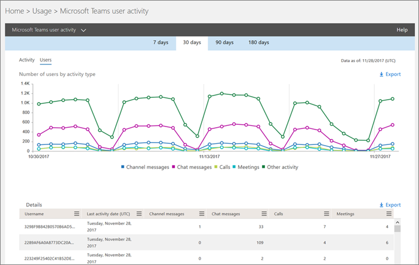

Rapports d’activité de l’utilisateur Microsoft TeamsUse activity reports for Microsoft Teams 
========================================

Vous pouvez utiliser les rapports d’activité du Centre Microsoft 365'administration pour voir comment les utilisateurs de votre organisation utilisent Microsoft Teams.You can use activity reports in the Microsoft 365 admin center to see how users in your organization are using Microsoft Teams. Par exemple, si certains n’utilisent pas encore Microsoft Teams, ils ne savent pas encore comment commencer à utiliser Teams pour être plus productifs et collaboratifs.For example, if some don't use Microsoft Teams yet, they might not know how to get started or understand how they can use Teams to be more productive and collaborative. Votre organisation peut utiliser les rapports d’activité pour choisir où hiérarchiser les efforts de formation et de communication.Your organization can use the activity reports to decide where to prioritize training and communication efforts.

## Afficher les rapports de Teams dans le tableau de bord RapportsHow to view the Teams reports in the Reports dashboard

1. Dans la [Microsoft 365 d’administration,](https://portal.office.com/adminportal/home)sélectionnez **Utilisation des**  >  **rapports.**In the [Microsoft 365 admin center](https://portal.office.com/adminportal/home), select **Reports** > **Usage**.
 
2. Sur la page **Utilisation,** **sélectionnez** Sélectionner un rapport, puis sous **Microsoft Teams** dans la liste des rapports, sélectionnez le rapport que vous voulez afficher.On the **Usage** page, choose **Select a report**, and then under **Microsoft Teams** in the list of reports, choose the report you want to view.

## Teams rapports d’activité disponiblesTeams activity reports that are available

Vous pouvez afficher deux rapports d’activité :There are currently two activity reports you can view:

- [Rapport d’activité des utilisateurs de Microsoft TeamsMicrosoft Teams user activity report](#microsoft-teams-user-activity-report) 
- [Rapport d’utilisation des périphériques de Microsoft TeamsMicrosoft Teams device usage report](#microsoft-teams-device-usage-report) 

### Rapport d’activité des utilisateurs de Microsoft TeamsMicrosoft Teams user activity report

Le Teams activité des utilisateurs vous donne un affichage des activités les plus courantes que vos utilisateurs effectuent dans Teams.The Teams user activity report gives you a view of the most common activities that your users perform in Teams. Cela inclut le nombre de personnes qui participent à une conversation dans un canal, combien communiquent par le biais d’un message de conversation privée et combien participent à des appels ou des réunions.This includes how many people engage in a chat in a channel, how many communicate via private chat message, and how many participate in calls or meetings. Vous pouvez voir ces informations pour l’ensemble de votre organisation et pour chaque utilisateur individuel.You can see this information for your whole organization, as well as for each individual user.

#### Interpréter le rapport d Microsoft Teams activité des utilisateursInterpret the Microsoft Teams user activity report

Vous pouvez visualiser l’activité d Teams un utilisateur en regardant les graphiques **Activité** et **Utilisateurs.**You can get a view into Teams user activity by looking at the **Activity** and **Users** charts.

|LégendeCallout |DescriptionDescription  |
|--------|-------------|
|**1****1**   |Le Teams activité des utilisateurs peut être pris en compte pour les tendances des 7, 30, 90 ou 180 derniers jours.The Teams user activity report can be viewed for trends over the last 7 days, 30 days, 90 days, or 180 days. Toutefois, si vous cliquez sur un plage de temps spécifique dans le rapport, le tableau (7) affiche les données sur 30 jours, jusqu’à la date (2) à laquelle le rapport a été généré.However, if you click into a particular time range in the report, the table (7) will show data for 30 days, up to the date (2) for when the report was generated. |
|**2****2**   |Chaque rapport comporte la date à laquelle il a été généré. Les rapports reflètent généralement une latence de 24 à 48 heures par rapport à l’heure de l’activité.Each report has a date for when this report was generated. The reports usually reflect a 24 to 48 hour latency from time of activity. |
|**3****3**   |**L’affichage** Activité indique le nombre d’Microsoft Teams par type d’activité.The **Activity** view shows you the number of Microsoft Teams activities by activity type. Les types d’activités sont le nombre de messages de conversation d’équipe, de messages de conversation privée, d’appels et de réunions.The activity types are number of team chat messages, private chat messages, calls, and meetings. |
|**4****4**   |**L’affichage** Utilisateurs indique le nombre d’utilisateurs par type d’activité.The **Users** view shows you the number of users by activity type. Les types d’activités sont le nombre de messages de conversation d’équipe, de messages de conversation privée, d’appels et de réunions.The activity types are number of team chat messages, private chat messages, calls, and meetings. |
|**5****5**   |L’axe X sur les graphiques est la plage de dates sélectionnée pour le rapport spécifique.The X axis on the charts is the selected date range for the specific report. <ul><li>Dans le **graphique Activité,** l’axe Y indique le nombre d’activités spécifiées.On the **Activity** chart, the Y axis is the count of the specified activity.</ul></li> <ul><li>Dans le graphique **Utilisateurs,** l’axe Y indique le nombre d’utilisateurs participant aux conversations d’équipe, aux conversations privées, aux appels ou aux réunions.On the **Users** chart, the Y axis is the number of users participating in teams chats, private chats, calls, or meetings.</ul></li> |
|**6****6**   |You can filter the series you see on the chart by clicking on an item in the legend.You can filter the series you see on the chart by clicking on an item in the legend. Par exemple,  dans le graphique Activité, cliquez ou appuyez sur **Messages** de canal, **Messages** de conversation, **Appels** ou Réunions pour voir uniquement les informations **liées** à chacun d’eux.For example, on the **Activity** chart, click or tap **Channel messages**, **Chat messages**, **Calls**, or **Meetings** to see only the info related to each one. La modification de cette sélection ne modifie pas les informations du tableau grille.Changing this selection doesn't change the information in the grid table. |
|**7****7**   |Liste des équipes actives dans l’ensemble de la période de rapport la plus large (180 jours).The list of active teams across the widest (180-day) reporting time frame.  Le nombre d’activités varie en fonction de la date de sélection.The activity count will vary according to the date selection.    Pour voir les informations suivantes dans le tableau, veillez à y ajouter les colonnes.To see the following information the table, make sure you add the columns to the table. <ul><li>**Nom d’utilisateur** est l’adresse de courrier de l’utilisateur.**Username** is the email address of the user. Vous pouvez afficher l’adresse de messagerie réelle ou rendre ce champ anonyme.You can display the actual email address or make this field anonymous.</ul></li> <ul><li>La date de la dernière activité **(UTC)** fait référence à la dernière date à laquelle l’utilisateur a participé à une Microsoft Teams activité.**Last Activity Date (UTC)** refers to the last date that the user participated in a Microsoft Teams activity.</ul></li> <ul><li>**Les messages de** canal sont le nombre de messages uniques que l’utilisateur a publié dans une conversation d’équipe pendant la période spécifiée.**Channel messages** is the number of unique messages that the user posted in a team chat during the specified time period.</ul></li> <ul><li>**Les messages de** conversation sont le nombre de messages uniques que l’utilisateur a publié dans une conversation privée pendant la période spécifiée.**Chat messages** is the number of unique messages that the user posted in a private chat during the specified time period.</ul></li> <ul><li>**Les** appels sont le nombre d’appels que l’utilisateur a participé pendant la période spécifiée.**Calls** is the number of calls that the user participated in during the specified time period.</ul></li> <ul><li>**Les réunions** sont le nombre de réunions en ligne à qui l’utilisateur a participé pendant la période spécifiée.**Meetings** is the number of online meetings that the user participated in during the specified time period.</ul></li> <ul><li>**Une** autre activité est le nombre d’autres activités d’équipe, dont certaines incluent, et non limitées à : aimer des messages, des applications, travailler sur des fichiers, rechercher, suivre des équipes et des canaux et les favoriter.**Other activity** is the number of other team activities by the user some of which include, and not limited to: liking messages, apps, working on files, searching, following teams and channel and favoriting them.</ul></li> <ul><li>**La suppression** indique si l’équipe est supprimée.**Deleted** indicates if the team is deleted. Si l’équipe est supprimée mais qu’elle a connu une activité dans la période du rapport, elle s’affiche dans la grille avec la valeur Supprimé définie sur true.If the team is deleted, but had activity in the reporting period, it will show up in the grid with deleted set to true.</ul></li> <ul><li>**La date de suppression** est la date à laquelle l’utilisateur a été supprimé.**Deleted date** is the date that the user was deleted.</ul></li> <ul><li>**Le produit affecté** est la liste des produits attribués à l’utilisateur.**Product assigned** is the list of products that are assigned to the user.</ul></li>Si la politique de votre organisation vous empêche de consulter les rapports sur lequel sont identifiables les informations des utilisateurs, vous pouvez modifier les paramètres de confidentialité de tous ces rapports.If your organization's policies prevents you from viewing reports where user information is identifiable, you can change the privacy setting for all these reports. Consultez la section **Comment puis-je masquer** les détails du niveau de l’utilisateur ? dans les rapports d’activité Microsoft 365 Preview du [Centre d’administration.](https://support.office.com/article/activity-reports-in-the-office-365-admin-center-0d6dfb17-8582-4172-a9a9-aed798150263)</ui>Check out the **How do I hide user level details?** section in the [Activity Reports in the Microsoft 365 Admin Center Preview](https://support.office.com/article/activity-reports-in-the-office-365-admin-center-0d6dfb17-8582-4172-a9a9-aed798150263).</ui> |
|**8****8**   |Cliquez ou appuyez **sur Colonnes** pour ajouter ou supprimer des colonnes dans le tableau.Click or tap **Columns** to add or remove columns in the table. |
|**9****9**   |Cliquez ou **appuyez sur Exporter pour** exporter les données du rapport vers Excel .csv fichier.Click or tap **Export** to export report data to an Excel .csv file. Cela exportera les données de tous les utilisateurs et vous permettra de trier et de filtrer plus simplement pour une analyse ultérieure.This exports data of all users and enables you to do simple sorting and filtering for further analysis. Si vous avez moins de 2 000 utilisateurs, vous pouvez trier et filtrer dans le tableau, au sein du rapport proprement dit.If you have less than 2,000 users, you can sort and filter within the table in the report itself. Si vous avez plus de 2 000 utilisateurs, vous devez exporter les données pour filtrer et trier le rapport.If you have more than 2,000 users, you will have to export the data to filter and sort the report. 

### Rapport d’utilisation des périphériques de Microsoft TeamsMicrosoft Teams device usage report

Le Teams utilisation des appareils fournit des informations sur la connexion de vos utilisateurs à Teams, y compris les applications mobiles.The Teams device usage report provides you with information about how your users connect to Teams, including mobile apps. Le rapport vous permet de comprendre les appareils les plus utilisés dans votre organisation et le nombre d’utilisateurs qui travaillent en cours.The report helps you understand which devices are popular in your organization and how many users work on the go.

### Interpréter le rapport Microsoft Teams utilisation de l’appareilInterpret the Microsoft Teams device usage report

Vous pouvez visualiser l’utilisation Teams’appareils à l’aide des graphiques **Utilisateurs** **et Distribution.**You can get a view into Teams device usage by looking at the **Users** and **Distribution** charts.

|LégendeCallout |DescriptionDescription  |
|--------|-------------|
|**1****1**   |Le Teams des appareils permet d’afficher les tendances des 7, 30, 90 ou 180 derniers jours.The Teams device report can be viewed for trends over the last 7 days, 30 days, 90 days, or 180 days. Toutefois, si vous cliquez sur un plage de temps spécifique dans le rapport, le tableau (7) affiche les données sur 30 jours, jusqu’à la date (2) à laquelle le rapport a été généré.However, if you click into a particular time range in the report, the table (7) will show data for 30 days, up to the date (2) for when the report was generated. |
|**2****2**   |Chaque rapport comporte la date à laquelle il a été généré. Les rapports reflètent généralement une latence de 24 à 48 heures par rapport à l’heure de l’activité.Each report has a date for when this report was generated. The reports usually reflect a 24 to 48 hour latency from time of activity. |
|**3****3**   |**L’affichage** Utilisateurs indique le nombre d’utilisateurs quotidiens par type d’appareil.The **Users** view shows you the number of daily users by device type. |
|**4****4**   |**L’affichage** Distribution indique le nombre d’utilisateurs par appareil sur la période sélectionnée.The **Distribution** view shows you the number of users by device over the selected time period.  |
|**5****5**   | <ul><li>Dans le **graphique Utilisateurs,** l’axe X est la plage de dates sélectionnée pour le rapport et l’axe Y indique le nombre d’utilisateurs par type d’appareil.On the **Users** chart, the X axis is the selected date range for the report and the Y axis is the number of users by device type.</ul></li> <ul><li>Sur le graphique **de distribution,** l’axe X indique les différents appareils utilisés pour se connecter à Teams et l’axe Y indique le nombre d’utilisateurs utilisant l’appareil.On the **Distribution** chart, the X axis shows the different devices used to connect to Teams and the Y axis is the number of users using the device.</ul></li> |
|**6****6**   |You can filter the series you see on the chart by clicking on an item in the legend.You can filter the series you see on the chart by clicking on an item in the legend. Par exemple, dans le graphique **Distribution,** cliquez ou appuyez **sur Windows,** **Mac,** **Linux,** **Web,** **iOS** ou **Android** pour voir uniquement les informations relatives à chacune de ces séries.For example, on the **Distribution** chart, click or tap **Windows**, **Mac**, **Linux**, **Web**, **iOS**, or **Android** to see only the info related to each one. La modification de cette sélection ne modifie pas les informations du tableau grille.Changing this selection doesn't change the information in the grid table. |
|**7****7**   |Liste des équipes actives dans l’ensemble de la période de rapport la plus large (180 jours).The list of active teams across the widest (180-day) reporting time frame.  Le nombre d’activités varie en fonction de la date de sélection.The activity count will vary according to the date selection.    Pour voir les informations suivantes dans le tableau, veillez à y ajouter les colonnes.To see the following information in the table, make sure you add the columns to the table. <ul><li>**Nom d’utilisateur** est l’adresse de courrier de l’utilisateur.**Username** is the email address of the user. Vous pouvez afficher l’adresse de messagerie réelle ou rendre ce champ anonyme.You can display the actual email address or make this field anonymous.</ul></li> <ul><li>La date de la dernière activité **(UTC)** fait référence à la dernière date à laquelle l’utilisateur a participé à Teams activité.**Last Activity Date (UTC)** refers to the last date that the user participated in a Teams activity.</ul></li> <ul><li>**La suppression** indique si l’équipe est supprimée.**Deleted** indicates if the team is deleted. Si l’équipe est supprimée mais qu’elle a connu une activité dans la période du rapport, elle s’affiche dans la grille avec la valeur Supprimé définie sur true.If the team is deleted, but had activity in the reporting period, it will show up in the grid with deleted set to true.</ul></li><ul><li>**La date de suppression** est la date à laquelle l’utilisateur a été supprimé.**Deleted date** is the date that the user was deleted.</ul></li> <ul><li>**Windows** est sélectionnée si l’utilisateur a été actif dans le client Teams bureau sur un Windows ordinateur.**Windows**  is selected if the user was active in the Teams desktop client on a Windows-based computer.</ul></li> <ul><li>**Mac** est sélectionné si l’utilisateur a été actif dans le client Teams bureau sur un ordinateur macOS.**Mac** is selected if the user was active in the Teams desktop client on a macOS computer.</ul></li>  <ul><li>**Linux** est sélectionné si l’utilisateur a été actif dans le client Teams bureau sur un ordinateur Linux.**Linux** is selected if the user was active in the Teams desktop client on a Linux computer.</ul></li>   <ul><li>**L’application Web** est sélectionnée si l’utilisateur a été actif sur Teams client web.**Web** is selected if the user was active on the Teams web client.</ul></li> <ul><li>**iOS** est sélectionné si l’utilisateur était actif sur le client Teams mobile pour iOS.**iOS** is selected if the user was active on the Teams mobile client for iOS.</ul></li> <ul><li>**L’application Téléphone Android** est sélectionnée si l’utilisateur a été actif sur Teams client mobile pour Android.**Android phone**  is selected if the user was active on the Teams mobile client for Android.</ul></li></li> <ui>Si la politique de votre organisation vous empêche de consulter les rapports sur lequel sont identifiables les informations des utilisateurs, vous pouvez modifier les paramètres de confidentialité de tous ces rapports. Consultez la section **Comment puis-je masquer** les détails du niveau de l’utilisateur ? dans la section Rapports d’activité Microsoft 365 Preview du [Centre d’administration.](https://support.office.com/article/activity-reports-in-the-office-365-admin-center-0d6dfb17-8582-4172-a9a9-aed798150263)</ui><ui>If your organization's policies prevents you from viewing reports where user information is identifiable, you can change the privacy setting for all these reports. Check out the **How do I hide user level details?** section in the [Activity Reports in the Microsoft 365 Admin Center Preview](https://support.office.com/article/activity-reports-in-the-office-365-admin-center-0d6dfb17-8582-4172-a9a9-aed798150263).</ui> |
|**8****8**   |Cliquez ou appuyez **sur Colonnes** pour ajouter ou supprimer des colonnes dans le tableau.Click or tap **Columns** to add or remove columns in the table. |
|**9****9**   |Cliquez ou **appuyez sur Exporter pour** exporter les données du rapport vers Excel .csv fichier.Click or tap **Export** to export report data to an Excel .csv file. Cela exportera les données de tous les utilisateurs et vous permettra de trier et de filtrer plus simplement pour une analyse ultérieure.This exports data of all users and enables you to do simple sorting and filtering for further analysis. Si vous avez moins de 2 000 utilisateurs, vous pouvez trier et filtrer dans le tableau, au sein du rapport proprement dit.If you have less than 2,000 users, you can sort and filter within the table in the report itself. Si vous avez plus de 2 000 utilisateurs, vous devez exporter les données pour filtrer et trier le rapport.If you have more than 2,000 users, you will have to export the data to filter and sort the report. 

## Qui pouvez accéder aux rapports d’activité Teams’entrepriseWho can access the Teams activity reports

Les rapports d’activité sont accessibles par les utilisateurs affectés :The activity reports can be accessed by users that are assigned:

- Rôle d’administrateur globalGlobal admin role
- Rôle d’administrateur spécifique au produit (Exchange, Skype Entreprise ou SharePoint)Product-specific admin role (Exchange, Skype for Business, or SharePoint)
- Rôle de lecteur de rapportsReports reader role

### Rôle de lecteur de rapportsReports reader role

Vous pouvez attribuer le rôle de lecteur de rapports à des personnes qui n’ont pas les droits d’administrateur mais qui sont responsables de la conduite de l’adoption ou du suivi de l’utilisation des licences Teams.You can assign the Reports reader role to people who don’t have administrator rights but are responsible for driving adoption or tracking license usage of Teams. Pour découvrir comment attribuer des rôles, lisez Attribuer des rôles d’administrateur et non administrateur aux utilisateurs avec [Azure Active Directory.](/azure/active-directory/fundamentals/active-directory-users-assign-role-azure-portal)To learn how to assign roles, read [Assign administrator and non-administrator roles to users with Azure Active Directory](/azure/active-directory/fundamentals/active-directory-users-assign-role-azure-portal).

## Autres informations dans le tableau de bord RapportsOther information on the Reports dashboard

### Widget d’activité rapideAt-a-glance activity widget

Le tableau de bord Rapports inclut les données d’utilisation de Teams dans le widget d’activité en un clin d’œil, qui vous offre une vue d’ensemble des produits de la façon dont les utilisateurs communiquent et collaborent à l’aide des autres services dans Microsoft 365 ou Office 365.The Reports dashboard includes the usage data from Teams in the at-a-glance activity widget, which gives you a cross-product view of how users communicate and collaborate using the other various services in Microsoft 365 or Office 365.

### Teams d’activité de la carteTeams activity card

La carte d’activité Teams du tableau de bord Rapports vous donne une vue d’ensemble de l’activité dans Teams, y compris le nombre d’utilisateurs actifs, afin que vous pouvez rapidement comprendre le nombre d’utilisateurs qui utilisent le service.The Teams activity card on the Reports dashboard gives you an overview of the activity in Teams, including the number of active users, so that you can quickly understand how many users are using the service. Le fait de cliquer sur la carte d’activité dans le tableau de bord vous permet d’Teams rapport d’activité de l’utilisateur.Clicking the activity card on the dashboard takes you to the Teams user activity report. 

