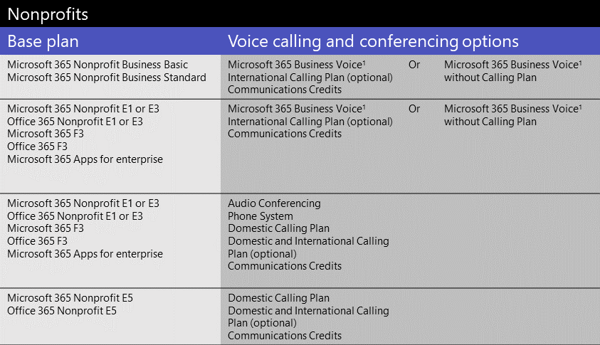

# Licences de compléments Microsoft teams

## Qu'est-ce qu'une licence de module complémentaire ?

Les licences de module complémentaire sont des licences Microsoft Teams spécifiques. Ils vous offrent la possibilité d’ajouter des fonctions uniquement aux utilisateurs de votre organisation qui en ont besoin. Pour ajouter une fonctionnalité, achetez une licence de module complémentaire pour chaque utilisateur qui l'utilisera.

## Quelles fonctionnalités puis-je obtenir avec des licences de module complémentaire ?

Vous trouverez ci-dessous une liste de fonctionnalités que vous pouvez ajouter aux licences de complément d’équipes. Les options de licence d’extension disponibles dépendent de l’offre Microsoft 365 ou Office 365.

|||||
|:-----|:-----|:-----|:-----|
|**Fonctionnalité**   |**Description**   |**Petites entreprises (<utilisateurs 300)**|**Grande entreprise (>utilisateurs 300)**|
**Téléphonie Microsoft 365 pour les PME**   | [Business Voice](../business-voice/whats-business-voice.md) est une solution de téléphonie conçue pour les petites et moyennes entreprises de plus de 300 utilisateurs qui regroupent le système téléphonique, les conférences audio, une offre d’appels nationaux, et bien plus encore. Les fonctionnalités du système téléphonique que vous recevez incluent la boîte vocale, l’ID de l’appelant, le parc d’appels, le transfert d’appel, les standards automatiques et les files d’attente d’appels.   Pour savoir si la voix professionnelle est disponible dans votre pays ou région, voir [disponibilité du pays et de la région pour les appels vocaux](../business-voice/country-region-availability.md). Pour plus d’informations sur les tarifs, voir [tarifs pour les appels vocaux](https://go.microsoft.com/fwlink/?linkid=2127221).   |&#x2713;||
|**Audioconférence**   |Parfois, les membres de votre organisation doivent utiliser un téléphone pour appeler une réunion teams à la place de leur ordinateur. Configurez l' [audioconférence](../audio-conferencing-in-office-365.md) pour les utilisateurs qui planifient ou animent des réunions.   Consultez cet article pour savoir si l’audioconférence est disponible dans votre pays ou région : [Disponibilité de l'audioconférence et des forfaits d'appels selon les régions et les pays](../country-and-region-availability-for-audio-conferencing-and-calling-plans/country-and-region-availability-for-audio-conferencing-and-calling-plans.md). Pour les informations de tarification, consultez les [Prix appliqués à l’audioconférence](https://go.microsoft.com/fwlink/?linkid=799762).    |&#x2713;|&#x2713;|
|**Numéros gratuits** |Si vous souhaitez utiliser des numéros sans frais pour les conférences audio, les standards automatiques ou les files d’attente d’appels, vous devez [configurer des crédits de communication](../set-up-communications-credits-for-your-organization.md).   |&#x2713;|&#x2713;|
|**Système téléphonique**   |Le [système téléphonique](../what-is-phone-system-in-office-365.md) est un service téléphonique hébergé qui vous permet de contrôler les appels et les fonctionnalités de connexion de succursale privée (PBX) grâce aux options de connexion au réseau téléphonique public commuté (RTC). Les fonctionnalités du système téléphonique incluent la boîte vocale Cloud, l’identification de l’appelant, le parc d’appels, le transfert d’appel, les standards automatiques, les files d’attente d’appels, le transfert d’appel, l’identification de l’appelant, etc.  Pour en savoir plus, voir [Voici ce que vous obtenez avec le système téléphonique](../here-s-what-you-get-with-phone-system.md). Pour plus d’informations sur les tarifs, voir [tarification du système téléphonique](https://go.microsoft.com/fwlink/?linkid=799763).    |&#x2713;1|&#x2713;|
|**Forfaits d’appel**   |Si vous souhaitez que les utilisateurs puissent appeler des numéros de téléphone à l’extérieur de votre organisation, vous pouvez obtenir un [plan d’appels](../calling-plans-for-office-365.md). Il existe des forfaits d’appels nationaux et des offres d’appels nationaux et internationaux. Pour plus d’informations sur les tarifs, voir [tarifs pour les offres d’appels](https://go.microsoft.com/fwlink/?linkid=799761 ).    |&#x2713;1|&#x2713;|
|**Salles Microsoft Teams**   |Les [salles de Microsoft teams](../rooms/index.md) ne sont pas des composants additionnels, mais une fonctionnalité qui permet de partager des vidéos, des sons et des contenus dans des salles de conférence. Voir gestion des [licences de salle de réunion teams](../rooms/rooms-licensing.md).    |&#x2713;|&#x2713;|

1 si vous êtes une petite ou moyenne entreprise disposant d’une offre Microsoft 365 entreprise, vous pouvez toujours acheter des licences de complément pour ces fonctionnalités vocales, mais nous vous conseillons de prendre en considération un plan d’entreprise [Microsoft 365](https://www.microsoft.com/microsoft-365/compare-all-microsoft-365-products?&activetab=tab:primaryr2) et une [voix professionnelle](https://www.microsoft.com/microsoft-365/business/business-voice).

## Quelles sont les fonctionnalités vocales disponibles avec mon plan ?

Pour connaître les licences de compléments dont vous avez besoin, consultez la rubrique fonctions vocales d’équipes, en fonction de votre plan.

En fonction des fonctionnalités vocales que vous souhaitez utiliser, nous vous recommandons d’évaluer s’il serait plus rentable pour vous de basculer vers un plan incluant ces fonctionnalités. Par exemple, pour la plupart des organisations de grande taille, l’achat d’une offre groupée de logiciels dans une offre Microsoft 365 entreprise aura pour effet de réduire le coût global. En règle générale, si vous achetez plusieurs licences de compléments individuellement au lieu d’une offre, vous risquez d’obtenir des frais plus élevés.

#### [**Petites entreprises**](#tab/small-business/)

S’il s’agit d’une petite entreprise ou d’une taille moyenne (moins de 300), vous disposez de quatre méthodes pour obtenir les fonctions vocales :

- Achetez un plan Microsoft 365 Business et Microsoft 365 Business Voice.
- Achetez un plan entreprise E1 ou E3 et Microsoft 365 Business Voice.
- Acheter une offre entreprise E1 ou E3 et ajouter des fonctions vocales individuellement.
- Achetez une offre entreprise E5, qui inclut des fonctionnalités vocales.

Pour Microsoft 365 Business Voice, vous avez le choix entre deux options :

- **Microsoft 365 Business Voice avec un plan d’appels**: obtenez cette valeur si vous souhaitez que la gestion des numéros de téléphone et la facturation soient gérées par Microsoft.
- **Microsoft 365 entreprise Voice sans plan d’appels (routage directe)**: Si vous souhaitez que la gestion des numéros de téléphone et la facturation soient gérées par votre fournisseur de services téléphonique tiers. Vous devez configurer et déployer le [routage direct](../direct-routing-landing-page.md) pour connecter vos contrôleurs de bordure de session locale (SBCS) à Microsoft 365 ou Office 365.

Pour en savoir plus, reportez-vous à la rubrique [que dois-je acheter pour utiliser Microsoft 365 Business Voice ?](../business-voice/what-to-buy.md).

Voici un résumé en fonction du plan de gestion des licences.

  

Si l’audioconférence n’est pas prise en charge dans votre pays ou région, vous pouvez obtenir une Microsoft 365 entreprise E5 sans plan de conférences audio ou Office 365 entreprise E5 sans plan de conférence audio.

Si vous avez déjà un plan Microsoft 365 entreprise ou Office 365 entreprise, vous pouvez toujours acheter des licences de complément pour les fonctionnalités vocales individuelles. Toutefois, vous avez la possibilité de basculer vers un plan [microsoft 365 Business](https://www.microsoft.com/microsoft-365/compare-all-microsoft-365-products?&activetab=tab:primaryr2) et [Microsoft 365 Business Voice](https://www.microsoft.com/microsoft-365/business/business-voice). Dans certains cas, selon les fonctionnalités que vous souhaitez utiliser, il peut être plus rentable d’obtenir un plan Microsoft 365 Business avec Microsoft 365 Business Voice.

> [!NOTE]
> Si vous devez utiliser un service téléphonique tiers, le [routage direct](../direct-routing-landing-page.md) est déployé au sein de votre organisation, ou si les plans d’appel ne sont pas disponibles dans votre pays ou région, vous devez utiliser le routage direct pour les fonctionnalités vocales.

#### [**Enterprise**](#tab/enterprise/)

S’il s’agit d’une entreprise ou d’une entreprise de grande envergure (plus de 300), vous pouvez utiliser les fonctionnalités vocales de deux manières :

- Acheter une offre entreprise E1 ou E3 et ajouter des fonctions vocales individuellement.
- Achetez une offre entreprise E5, qui inclut des fonctionnalités vocales.

Voici un résumé en fonction du plan de gestion des licences.

  

Si l’audioconférence n’est pas prise en charge dans votre pays ou région, vous pouvez obtenir une Microsoft 365 entreprise E5 sans plan de conférences audio ou Office 365 entreprise E5 sans plan de conférence audio.

Pour en savoir plus, voir [plans Microsoft 365 entreprise](https://www.microsoft.com/microsoft-365/compare-microsoft-365-enterprise-plans) et [offres Office 365 entreprise](https://www.microsoft.com/microsoft-365/business/compare-more-office-365-for-business-plans).

> [!NOTE]
> Si vous devez utiliser un service téléphonique tiers, le [routage direct](../direct-routing-landing-page.md) est déployé au sein de votre organisation, ou si les plans d’appel ne sont pas disponibles dans votre pays ou région, vous devez utiliser le routage direct pour les fonctionnalités vocales.

#### [**Expliquer**](#tab/education/)

Pour les écoles et organisations universitaires, vous disposez de trois méthodes pour obtenir les fonctions vocales.

- Achetez un plan EDU a1 ou a3 et Microsoft 365 Business Voice.
- Achetez une offre de l’UDE a1 ou a3 et ajoutez des fonctions vocales individuellement.
- Souscrivez une offre EDU EDU, qui inclut des fonctionnalités vocales.

Voici un résumé en fonction du plan de gestion des licences.

  

  1 disponible uniquement pour les organisations possédant moins de 300 utilisateurs.

Pour en savoir plus, consultez la rubrique [Microsoft 365 éducation](https://www.microsoft.com/education/buy-license/microsoft365) et les [offres Office 365 éducation](https://www.microsoft.com/microsoft-365/academic/compare-office-365-education-plan).

> [!NOTE]
> Si vous devez utiliser un service téléphonique tiers, le [routage direct](../direct-routing-landing-page.md) est déployé au sein de votre organisation, ou si les plans d’appel ne sont pas disponibles dans votre pays ou région, vous devez utiliser le routage direct pour les fonctionnalités vocales.

#### [**Nationale**](#tab/government/)

Pour les organisations gouvernementales américaines (GCC uniquement), il existe trois façons d’accéder aux fonctions vocales.

- Achetez une offre GOV G1 ou G3 et Microsoft 365 Business Voice.
- Achetez une offre GOV G1 ou G3 et ajoutez des fonctionnalités de voix Cloud individuellement.
- Achetez une offre GOV G5, qui inclut des fonctions vocales.

Voici un résumé en fonction du plan de gestion des licences.

  

  1 disponible uniquement pour les organisations possédant moins de 300 utilisateurs.

Pour en savoir plus, consultez la section [Microsoft 365 Government](https://www.microsoft.com/microsoft-365/government/) and [Office 365 Government](https://www.microsoft.com/microsoft-365/government/compare-office-365-government-plans).

> [!NOTE]
> Si vous devez utiliser un service téléphonique tiers, le [routage direct](../direct-routing-landing-page.md) est déployé au sein de votre organisation, ou si les plans d’appel ne sont pas disponibles dans votre pays ou région, vous devez utiliser le routage direct pour les fonctionnalités vocales.

#### [**Associations**](#tab/nonprofit/)

Si vous êtes un organisme à but non lucratif, vous disposez de quatre méthodes pour obtenir les fonctions vocales.

- Achetez un plan Business standard pour les associations Microsoft 365 ou Microsoft 365 Business standard et Microsoft 365 Business Voice.
- Achetez une offre pour les associations E1 ou E3 et Microsoft 365 Business Voice.
- Acheter une offre E1 ou E3 pour les associations et ajouter des fonctions vocales individuellement.
- Acheter une offre pour les associations E5, qui inclut des fonctionnalités vocales.

Voici un résumé en fonction du plan de gestion des licences.

  

  1 disponible uniquement pour les organisations possédant moins de 300 utilisateurs.

Pour en savoir plus, consultez l' [offre Microsoft 365 et Office 365](https://www.microsoft.com/microsoft-365/nonprofit/office-365-nonprofit-plans-and-pricing)pour les associations.

> [!NOTE]
> Si vous devez utiliser un service téléphonique tiers, le [routage direct](../direct-routing-landing-page.md) est déployé au sein de votre organisation, ou si les plans d’appel ne sont pas disponibles dans votre pays ou région, vous devez utiliser le routage direct pour les fonctionnalités vocales.

#### [**Offres d’évaluation**](#tab/trial/)

### Offres d’évaluation pour les plans de licence

En réponse à une augmentation du nombre de personnes qui travaillent à distance (ou à partir de la maison), Microsoft dispose de plusieurs offres d’essais d’équipe gratuites pour les organisations gouvernementales, éducatives et à but non lucratif. Des essais sont disponibles pour les offres suivantes :

- [Version d’évaluation d'](../e1-trial-license.md) Office 365 entreprise E1 (arrêtée à partir du 1er juillet 2020), de la version d’évaluation de E3 et de la période d’évaluation E5
- [Version d’évaluation d'](../teams-edu-licensing.md) Office 365 éducation a1
- [Version d’évaluation d'](../g1-trial-license.md) Office 365 pour le gouvernement G1 (arrêtée depuis le 1er juillet 2020)

Pour vous inscrire à une offre d’évaluation, voir s' [inscrire à une offre d’évaluation](https://transform.microsoft.com/customer-trials?tab=requestnewtrial).

### Offres d’évaluation pour les fonctionnalités vocales

Vous trouverez ci-dessous un résumé des offres d’évaluation de la fonction vocale.

  

 Par le biais de votre plan de base, vous n’avez pas besoin d’une offre d’évaluation pour utiliser les fonctions vocales. Vous pouvez utiliser un plan Microsoft 365 Business ou un plan d’entreprise, de secteur public, d’éducation ou d’établissement d’activités avec les offres d’évaluation pour les fonctionnalités vocales. Pour afficher les offres d’évaluation disponibles et les modules complémentaires, dans le centre d’administration 365 Microsoft **Billing**, accédez à  >  **services d’achat**de facturation, sélectionnez d' **autres catégories susceptibles de vous intéresser**, puis sélectionnez **composants**additionnels.

  Pour chacune de ces options de voix et de conférence, des [crédits de communication](../set-up-communications-credits-for-your-organization.md) sont requis si vous disposez de numéros sans frais ou si vous avez besoin d’ajouter des minutes supplémentaires aux utilisateurs pour passer des appels RTC nationaux et internationaux.

 Consultez également :

- [Version gratuite de teams](../manage-freemium.md)
- [Enseignements](../teams-exploratory.md) d’une équipe : actuellement, il n’existe aucune offre d’évaluation pour les fonctionnalités vocales à utiliser avec l’interface exploratoire Teams.
- [Système Microsoft Phone-licence utilisateur virtuel](virtual-user.md)

* * *

## Vous avez besoin d’aide ?

Vous avez besoin de parler à une personne sur les options d’extension ? [Contacter le support relatif aux produits d’entreprises : aide de l’administrateur](https://support.office.com/article/32a17ca7-6fa0-4870-8a8d-e25ba4ccfd4b).

## Voir aussi

- [Attribution de licences de complément d’équipes](assign-teams-add-on-licenses.md)
- [Gérer l’accès des utilisateurs à Microsoft Teams](../user-access.md)
- [Description du service teams](https://docs.microsoft.com/office365/servicedescriptions/teams-service-description)
