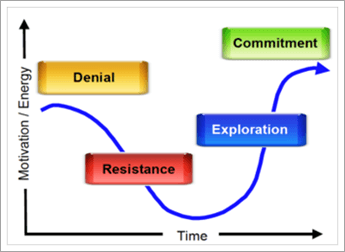

# Votre organisation est-elle prête pour Microsoft Teams ?

Maintenant que votre équipe de projet s’est rassemblée et que vous commencent à voir ce que Teams peut faire pour votre organisation, il est important d’évaluer la disponibilité de votre organisation pour la transition de Teams projet. Pour évaluer votre préparation, vous devrez :

1. Évaluez les parties prenantes.
2. Identifiez les premiers utilisateurs.
3. Évaluez la disponibilité de l’organisation en cas de modification. 

## Évaluer les parties prenantes

Énumérez les principales parties prenantes et les chefs d’entreprise de votre organisation. Pour chaque personne, posez les questions suivantes :
 
1. Ce leader est-il convivial avec les nouvelles technologies ?
2. Évaluer la satisfaction de ce leader par opposition à votre technologie actuelle.
3. L’un de ses responsables souhaite-t-il utiliser une technologie sans administration pour accélérer les résultats ou créer une meilleure expérience pour les membres de son équipe ?
4. Ce leader est-il sous une pression élevée pour apporter des résultats clés à l’entreprise ? 
5. Ce leader sera-t-il prêt à figer son expérience avec des Teams lui aider dans la transition ?
6. Ce leader a-t-il une relation positive avec les principaux membres de l’équipe de projet existante ?
7. Cet leader aime-t-il être considéré comme un « agent de changement » au sein de l’organisation ?  

Vous pouvez ajouter d’autres questions pertinentes pour votre organisation. Pour vos deux phases initiales (démarrage et expérimentations), vous verrez des leaders qui sont conviviales pour le changement, plutôt pas satisfaits de la technologie actuelle et avec qui vous avez une bonne relation. Ces leaders doivent être amenés dans l’équipe de projet principale en tant que conseillers commerciaux, et peuvent avoir des projets qui seront essentiels pour votre phase de expérimentation. Il est important de sélectionner des situations réelles et impactantes à tester et d’éviter les projets à risque élevé pour vos expérimentations initiales.
   
> [!NOTE]
> S’il est possible d’attribuer un score à ce type de questionnaire afin de minimiser l’impact de l’élément humain des relations au sein de votre organisation, la conduite du changement dépend de la chimie de l’équipe autant que de ses compétences techniques ou de son savoir-faire commercial. Examinez cette liste avec les membres de votre équipe pour discuter de l'« ajustement » de vos différents chefs de projet à mesure que vous sélectionnez les projets et le personnel pour les phases suivantes. 

## Identifier les premiers utilisateurs

Les premiers utilisateurs partagent certains traits d’caractère, quelle que soit la taille ou le secteur d’activité que votre organisation peut être. En règle générale, les premiers utilisateurs partagent les caractéristiques ci-après :

- Intéressé par la technologie
- Souhaitant faire partie du changement
- Demande d’amélioration
- Collaborer par nature
- Souhaitant partager ses observations et apprentissages avec le groupe
- sont des personnes qui prennent des risques ; autrement dit, ils souhaitent essayer quelque chose pour voir si cela fonctionne

Utilisez un formulaire simple dans Microsoft 365 ou Office 365 pour permettre à ces personnes de choisir votre programme d’utilisateurs précoces pour Teams. Selon la taille et la complexité de votre organisation, vous pouvez choisir d’activer une partie ou la plupart de ces individus pour votre phase de expérimentation. Dans ce programme, ils conviennent de participer activement à votre phase de expérimentation et de fournir des commentaires réguliers à l’équipe de projet. Évitez d’avoir des personnes qui souhaitent simplement tester la nouvelle technologie. Faites-leur savoir qu’en leur faisant part de ces commentaires actifs, ils contribuent à élaborer le résultat de votre projet. Vous utiliserez cette liste de personnes dans la [phase 2 (expérimentation).](teams-adoption-phase2-experiment.md)

Notre guide du programme des premiers utilisateurs est une ressource utile pour mettre un coup d’avance à ce programme dans votre environnement.  
 
## Évaluer la disponibilité de votre organisation en cas de modification

Le changement est un processus humain qui n’a rien à voir avec la technologie. Il existe une politique politique qui nous donne une bonne éducation sur la résistance naturelle au changement. Pour rendre les changements acceptables, il est essentiel d’anticiper les besoins de vos utilisateurs, d’exprimer votre compréhension de leur situation et de créer des solutions qui améliorent cette situation. Même en faisant cela, vous rencontrerez une résistance naturelle au changement.  

Chaque organisation se rapproche différemment, selon la région, le style de travail, le profil professionnel et d’autres éléments de l’organisation. Pour évaluer la disponibilité de votre organisation, voir Évaluer la disponibilité [en matière de changement d’organisation.](upgrade-org-change-readiness.md) Utilisez les instructions pour répondre aux questions suivantes :

1. Quel pourcentage d’utilisateurs se place dans chaque compartiment ? (Modifier *la résistance)*
    - **Premiers utilisateurs**: demandez la solution avant qu’elle ne soit disponible.
    - **Utilisateurs informés**: utilisez la solution une fois sa valeur éprouvée.
    - **Les dissideurs**: appuyez de nouveau sur toute modification.
    
   > [!TIP]
   > Les premiers utilisateurs font de bons testeurs pilotes et pairs champions. Les utilisateurs qui sont lents à adopter de nouveaux outils nécessitent un encouragement supplémentaire et plus de temps pour s’ajuster. 

2. Quelle est la compétence des utilisateurs pour le changement ? *(Formation)*
    - **Les démarrages autonomes** nécessitent uniquement un lien vers une vidéo.
    - **Les créateurs d’équipe** se sont bien passé des formations de groupe.
    - **Les apprenants un-à-un ont besoin** d’un support personnel.

    > [!TIP]
    > Personasz le type et la quantité de formation pour la compétence et les personnage. Continuez à mettre à jour les formations lorsque de nouvelles fonctionnalités sont disponibles en ligne.

3. En plus de ce déploiement de service, combien d’autres modifications sont en cours ? *(Insérabilité)*  Les modifications peuvent inclure des mises Office/Windows, des déplacements d’office, des fusions, des reorgs, etc.
    - Aucun
    - 1-3 modifications
    - Plus de 3 modifications
 
    > [!TIP] 
    > Trop de changements peuvent empêcher l’acceptation et la productivité. Si plus de 3 modifications sont en cours, envisagez de les espacer ou de créer un thème pour regrouper les modifications.  

Combinez ces données avec les profils des parties prenantes et les employés qui souhaitent s’associer au programme des premiers utilisateurs. Cela vous permettra d’identifier les groupes prêts à l’utiliser et de les absorber en même temps que leurs tâches existantes. Cette méthode vous permet de créer des partenaires en modification.

Vous pouvez faire appel à des champions internes pour résoudre le problème d’avoir différents types de changements. Ici, les commentaires sont essentiels au succès : encouragez les utilisateurs à partager leurs défis et besoins. Adoptez des perturbateurs et des dissidences en donnant à ces personnes ou à ces groupes un siège sur la table lors de l’expérimentation. Cette meilleure pratique préparera le terrain pour un déploiement plus fluide de vos améliorations de la collaboration.  

 Suivant : Microsoft Teams [phase d’adoption 2 : Tester](teams-adoption-phase2-experiment.md) 
