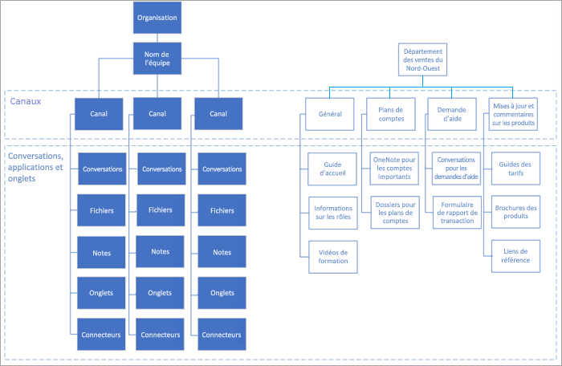

# Comprendre les équipes et les canaux dans Microsoft Teams

Les concepts d’équipes et de canaux sont fondamentaux pour une implémentation saine et productive de Microsoft Teams. 

- Une équipe est un ensemble de personnes, de contenu et d’outils qui collaborent pour produire des résultats commerciaux pour votre entreprise. Les équipes sont centrées autour de groupes Microsoft 365, et les modifications apportées à l’appartenance à un groupe Microsoft 365 sont synchronisées avec l’équipe.

- Les canaux sont les espaces de collaboration au sein desquels les tâches réelles sont effectuées. 

Pour en savoir plus sur les équipes et les canaux, veuillez consulter la [vue d’ensemble des équipes et des canaux dans Microsoft Teams](teams-channels-overview.md). Pour recevoir des instructions complètes sur l’adoption de Teams, veuillez consulter le [Guide d’adoption de Teams](https://aka.ms/teamstoolkit). Pour en savoir plus sur Teams et Groupes Microsoft 365, consultez [Groupes Microsoft 365 et Microsoft Teams](office-365-groups.md) et [en savoir plus sur Groupes Microsoft 365](https://support.office.com/article/Learn-about-Office-365-groups-b565caa1-5c40-40ef-9915-60fdb2d97fa2).

| &nbsp; |&nbsp;  |
|---------|---------|
| Regardez cette courte vidéo   | <iframe width="350" height="200" src="https://www.youtube.com/embed/WkAVgNKn0hs" frameborder="0" allowfullscreen></iframe>   |

Les types d’accès à l’équipe déterminent les utilisateurs qui peuvent rejoindre une équipe :

- Les équipes *privées* sont restreintes aux membres de l’équipe approuvés par le ou les propriétaire(s) de celle-ci. Il s’agit du paramètre le plus courant pour les équipes de projet et les équipes virtuelles dans une grande organisation.

- Les équipes *publiques* sont ouvertes à tous les membres de l’organisation et les utilisateurs peuvent les rejoindre directement. Les équipes publiques sont utiles pour la collaboration sur des thèmes d’intérêt général pour les personnes de services différents ou pour les personnes qui travaillent sur des projets distincts. Ce paramètre par défaut est idéal pour les organisations plus petites.

## Utiliser Teams pour favoriser la collaboration entre les organisations

Nous vous conseillons d’utiliser Teams pour améliorer la collaboration entre les organisations. De plus, de nombreux projets se prêtent eux-mêmes à ce modèle. Par ailleurs, les chefs d’équipe ou les divisions au sein d’une organisation peuvent souhaiter une équipe dédiée à leur propre personnel. Examinez les modèles d’organisation et de projet présentés dans l’illustration suivante.

Dans une équipe d’organisation (indiquée à gauche), des informations clés relatives à l’activité de l’organisation, aux événements d’équipe, aux stratégies principales et d’autres informations opérationnelles, comme les évaluations d’entreprise, peuvent être partagées. Pour l’équipe affichée sur la droite, les informations du secteur sont divisées en canaux représentant les catégories de travail accomplies par l’équipe. Les membres de cette équipe peuvent ou non être sous les ordres de la même personne, mais ils sont tous tenus de produire des résultats pour le secteur.
  
Vous travaillerez davantage sur la structure de vos équipes à l’[étape 2](teams-adoption-phase2-experiment.md) de votre implémentation.

 Suivant : [Créer vos premières équipes](teams-adoption-your-first-teams.md)
