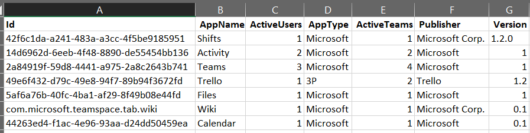

# rapport d’utilisation des applications Microsoft Teams

Le rapport d’utilisation des applications Teams dans le Centre d’administration Microsoft Teams vous fournit des informations sur les applications que les utilisateurs utilisent dans Teams.  

## Afficher le rapport d’utilisation des applications

1. Dans le volet de navigation gauche du centre <https://admin.teams.microsoft.com>d’administration, cliquez sur **Analytics & rapports** **reportsUsage** > .  
2. Sous l’onglet **Afficher les rapports** , sous **Rapport**, sélectionnez **Utilisation des applications**.

3. Dans **Plage de dates**, sélectionnez une plage puis cliquez sur **Exécuter le rapport**. Le rapport d’utilisation Teams Apps peut être consulté pour les tendances des 7, 30 ou 90 derniers jours.  

## Interpréter le rapport

:::image type="content" alt-text="Capture d’écran du rapport d’utilisation de l’application Teams dans le centre d’administration Teams avec des légendes." source="media/app-usage-report5.png" lightbox="media/app-usage-report5.png":::

Chaque rapport a une date en haut à gauche qui indique quand le rapport a été créé. Les rapports reflètent généralement une latence de 24 heures à partir du moment où une application a été ouverte.

L’axe Y du graphique est le nombre d’utilisateurs qui, pour la date que vous avez sélectionnée en pointant sur le graphique, sont considérés comme des utilisateurs actifs, car ils ont ouvert une application au moins une fois.

L’axe X du graphique correspond à la plage de dates que vous avez sélectionnée pour le rapport.

Pointez sur le point (4) représentant l’utilisation d’une application à n’importe quelle date pour voir le nombre total d’utilisateurs actifs de cette application à cette date.

Pour sélectionner d’autres applications, en haut à droite, cliquez sur l’icône **Filtre** (5), sélectionnez ou tapez de nouveaux critères, puis cliquez sur **Appliquer**.

Le tableau en bas du rapport (6) affiche les utilisateurs actifs et les équipes par nom d’application.

   - **Le nom** de l’application est le nom complet de l’application utilisée dans Teams.
   - **Les utilisateurs actifs** sont le nombre d’utilisateurs qui ont ouvert l’application au moins une fois pendant la période spécifiée.
   - **Le type d’application** est une valeur statique de « Microsoft » ou « Tiers ».
   - **Les équipes actives** sont le nombre d’équipes qui ont ouvert l’application par au moins un membre de l’équipe et pendant les périodes spécifiées.
   - **Publisher** est l’éditeur de logiciels de l’application.
   - **La version** est la version logicielle de l’application, à partir de l’éditeur de l’application.

   > [!NOTE]
   > **Les utilisateurs actifs et les** **équipes actives** sont calculés pour les applications utilisées uniquement dans les canaux.

Pour ajouter ou supprimer des colonnes dans le tableau, en haut à droite, cliquez sur l’icône **Modifier les colonnes** (7), sous l’onglet **Modifier les colonnes** , sélectionnez de nouveaux critères, puis cliquez sur **Appliquer**.

Pour exporter le rapport vers un fichier CSV à des fins d’analyse hors connexion, en haut à droite, sélectionnez l’icône **Exporter vers Excel** (8), puis sous l’onglet **Téléchargements** sous **État**, cliquez sur **Télécharger**.

   :::image type="content" alt-text="Capture d’écran du volet Téléchargements." source="media/app-usage-report7.png" lightbox="media/app-usage-report7.png":::

Lorsque vous affichez le rapport dans Excel, vous voyez également une colonne **d’ID**, qui représente l’ID d’application, généralement une chaîne alphanumérique. Si **l’ID** est **\n**, cela signifie qu’un utilisateur a demandé que ses informations soient supprimées.

   

## Voir aussi

- [Analyses et rapports Teams](teams-reporting-reference.md)
