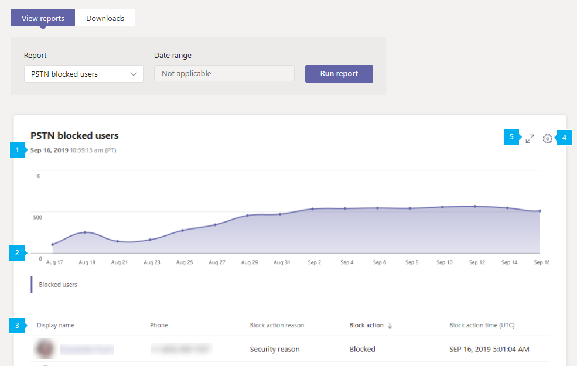

# Microsoft Teams Rapport sur le blocage d’utilisateurs PSTNMicrosoft Teams PSTN blocked users report

Le rapport sur le blocage d’utilisateurs PSTN dans le Centre d’administration Microsoft Teams affiche les utilisateurs de votre organisation qui sont bloqués et ne peuvent plus effectuer d’appels PSTN dans Teams.The PSTN blocked users report in the Microsoft Teams admin center shows you the users in your organization who are blocked from making PSTN calls in Teams. Vous pouvez afficher plus d’informations sur chaque utilisateur bloqué, y compris son numéro de téléphone affecté et la raison pour laquelle il a été bloqué.You can view more information about each blocked user, including their assigned phone number and the reason they were blocked from making calls.

## Afficher le rapport sur le blocage d’utilisateurs PSTNView the PSTN blocked users report

Dans la barre de navigation gauche du Centre Microsoft Teams’administration, cliquez sur **Analyse & rapports**  >  **d’utilisation.**In the left navigation of the Microsoft Teams admin center, click **Analytics & reports** > **Usage reports**. Sous **l’onglet Afficher les rapports,** sous **Rapport,** sélectionnez **Utilisateurs PSTN** bloqués, puis cliquez sur **Exécuter le rapport.**On the **View reports** tab, under **Report**, select **PSTN blocked users**, and then click **Run report**.

## Interpréter le rapportInterpret the report

|LégendeCallout |DescriptionDescription  |
|--------|-------------|
|**1****1**   |Chaque rapport indique la date à laquelle il a été généré.Each report has a date for when it was generated. Les rapports reflètent généralement une latence de 24 à 48 heures par rapport à l'heure de l'activité.The reports usually reflect a 24 to 48 hour latency from time of activity. |
|**2****2**   |L’axe X est la date.The X axis is the date. L’axe Y est le nombre d’utilisateurs.The Y axis is the number of users.  Pointez sur le point à une date donnée pour voir le nombre d’utilisateurs bloqués à cette date.Hover over the dot on a given date to see the number of users blocked on that date. |
|**3****3**   |Le tableau détailne tous les utilisateurs bloqués et ne peuvent plus effectuer d’appels PSTN.The table gives a breakdown of all users who are blocked from making PSTN calls.  Il affiche tous les utilisateurs Système téléphonique ou l’audioconférence et vous donne des informations supplémentaires sur chacun d’eux.It shows all users who have Phone System or Audio Conferencing assigned and gives you more information about each user. <ul><li>**Le nom d’affichage** est le nom d’affichage de l’utilisateur.**Display name** is the display name of the user. Vous pouvez cliquer sur le nom d’affichage pour aller à la page de paramètres de l’utilisateur dans le Microsoft Teams d’administration.You can click the display name to go to the user's setting page in the Microsoft Teams admin center. </li> <li>**Téléphone** est le numéro affecté à l’utilisateur.**Phone** is the number that's assigned to the user.</li> <li>**La raison du blocage** est la raison pour laquelle l’utilisateur est bloqué et ne peut plus effectuer d’appels.**Blocked reason** is the reason the user is blocked from making calls.</li><li>**L’action** bloquée vous indique si l’utilisateur est bloqué ou débloqué contre les appels PSTN dans Teams.**Blocked action**  tells you whether the user is blocked or unblocked from making PSTN calls in Teams.</li> <li>**L’heure** bloquée est la date et l’heure (UTC) à laquelle l’utilisateur a été bloqué.**Blocked time** is the date and time (UTC) that the user was blocked from making calls.</li></li> </ul>Pour afficher les informations que vous souhaitez dans le tableau, veillez à ajouter les colonnes correspondantes au tableau.To see the information that you want in the table, make sure to add the columns to the table. |
|**4****4**   |Sélectionnez **Modifier les colonnes** pour ajouter ou supprimer des colonnes dans le tableau.Select **Edit columns** to add or remove columns in the table.|
|**5****5**   |Sélectionnez **Plein écran** pour afficher le rapport en mode Plein écran.Select **Full screen** to view the report in full screen mode.|

## Voir aussiRelated topics

- [Analyses et rapports TeamsTeams analytics and reporting](teams-reporting-reference.md)