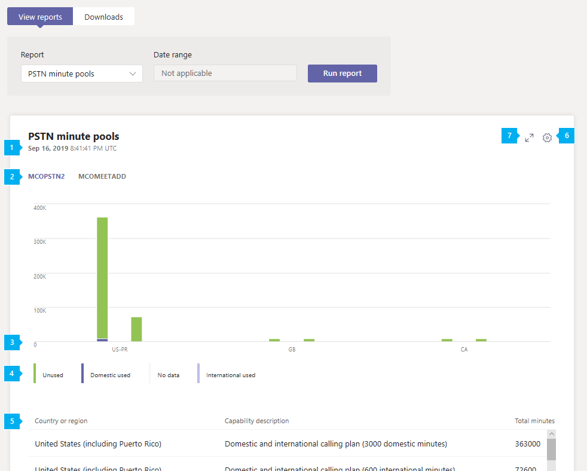

# Microsoft Teams Rapport sur les pools de minutes PSTN

Le rapport Teams pools de minutes PSTN dans le Centre d’administration Microsoft Teams donne une vue d’ensemble de l’activité d’audioconférence et d’appels dans votre organisation en vous indiquant le nombre de minutes consommées au cours du mois en cours. Vous pouvez consulter le détail de l’activité, notamment la licence utilisée pour les appels, le nombre total de minutes disponibles, les minutes utilisées et l’utilisation des licences par emplacement.

## Afficher le rapport sur les pools de minutes PSTN

Dans la barre de navigation gauche du Centre Microsoft Teams’administration, cliquez sur **Analyse & rapports**  >  **d’utilisation.** Sous **l’onglet Afficher les** rapports, sous **Rapport,** sélectionnez minute PSTN et pools **SMS (aperçu),** puis cliquez sur **Exécuter le rapport.**

## Interpréter le rapport

|Légende |Description  |
|--------|-------------|
|**1**   |Chaque rapport indique la date à laquelle il a été généré. Les rapports reflètent généralement une latence de 24 à 48 heures par rapport à l'heure de l'activité. |
|**2**   |Cliquez sur une fonctionnalité (licence) pour afficher l’activité de celle-ci. |
|**3**   |L’axe X est le pays ou la région. L’axe Y compte le nombre de minutes.  Pointez sur une barre du graphique pour voir l’activité en fonction de cet emplacement d’utilisation.  |
|**4**   |Vous pouvez filtrer ce qui est affiché dans le tableau en cliquant sur un élément dans la légende. Par exemple, cliquez **sur Utilisateurs** non **utilisés,** Utilisateurs nationaux, Aucune donnée ou **International** pour voir uniquement les informations relatives à chacune de ces tâches. |
|**5**   |Le tableau offre une répartition des groupes de minutes par fonctionnalité et emplacement d’utilisation. <ul><li>**Le pays ou la région est** le lieu d’utilisation. </li><li>**La description de** la fonctionnalité est la description de la licence utilisée pour l’appel.  Les descriptions des fonctionnalités que vous verrez peut-être dans ce rapport sont les suivantes : <ul><li>Forfait d’appels nationaux et internationaux (1 200 minutes nationales)</li><li>Forfait d’appels nationaux et internationaux (3 000 minutes nationales)</li><li>Forfait d’appels nationaux et internationaux (600 minutes internationales)</li></ul></li> <li>**Le nombre** total de minutes est le nombre total de minutes disponibles pour le mois.</li><li>**Le nombre de minutes** utilisées est le nombre de minutes utilisées chaque mois</li> <li>**Le nombre de** minutes disponibles est le nombre de minutes restantes pour le mois.</li><li>**La fonctionnalité** est la licence utilisée pour l’appel. Les licences que vous pouvez voir sont les suivantes :<ul><li>**MCOPSTN1** - Plan d’appels nationaux (plans de 3 000 min pour les États-Unis / 1 200 min pour l’UE)</li><li>**MCOPSTN2** - Forfait d’appels internationaux</li><li>**MCOPSTN5** - Forfait d’appels nationaux (plan d’appels de 120 min)</li><li>**MCOPSTN6** - Forfait d’appels nationaux (plan d’appels de 240 min)</li><li>**MCOMEETADD** - Audioconférence</li></ul></li> </ul> Pour afficher les informations que vous souhaitez dans le tableau, veillez à ajouter les colonnes correspondantes au tableau.|
|**6**   |Sélectionnez **Modifier les colonnes** pour ajouter ou supprimer des colonnes dans le tableau.|
|**7**   |Sélectionnez **Plein écran** pour afficher le rapport en mode Plein écran.|

## Voir aussi

- [Analyses et rapports Teams](teams-reporting-reference.md)
