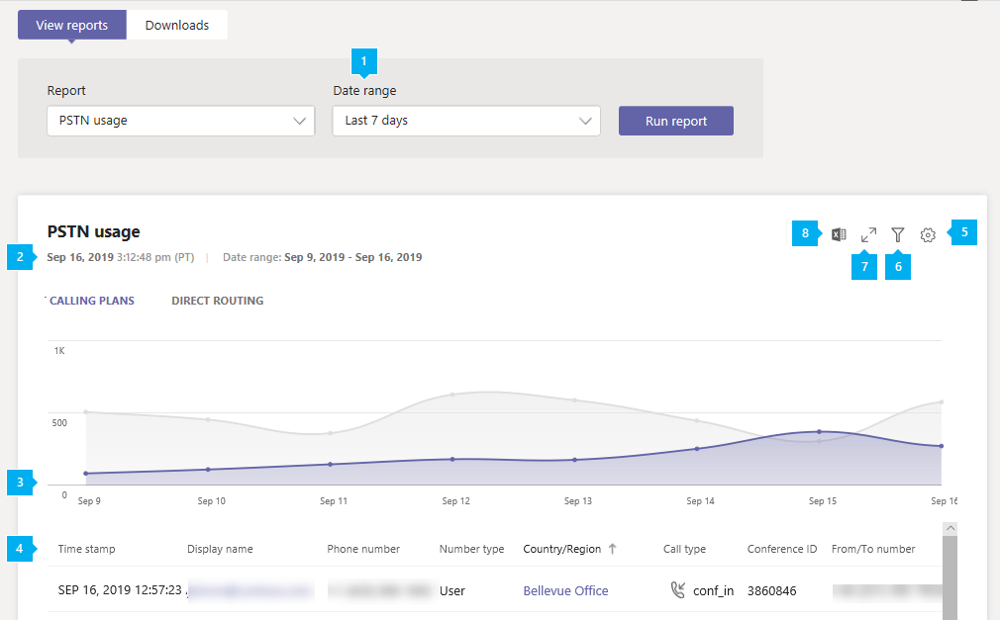

# Rapport utilisation RTC de Microsoft teams

Le rapport utilisation RTC de Microsoft teams dans le centre d’administration Microsoft teams vous donne un aperçu de l’activité des appels et de l’audioconférence au sein de votre organisation. Vous pouvez afficher les appels détaillés pour les offres d’appels si vous utilisez Microsoft comme opérateur de téléphonie et pour le routage direct si vous utilisez votre propre opérateur de téléphonie.

L’onglet **forfaits** d’appels affiche des informations telles que le nombre de minutes passées par les utilisateurs dans les appels RTC entrants et sortants et le coût de ces appels. L’onglet **routage direct** affiche des informations telles que l’adresse SIP et les heures de début et de fin de l’appel. Les informations contenues dans ce rapport vous permettent de vous familiariser avec l’utilisation RTC au sein de votre organisation et vous aident à examiner, planifier et prendre des décisions commerciales.

## Afficher le rapport

1. Dans le volet de navigation de gauche du centre d’administration de Microsoft Teams, cliquez sur **analyse &** > rapports d'**utilisation**des rapports. Dans l’onglet **afficher les rapports** , sous **rapport**, sélectionnez **rapport d’utilisation PSTN**.
2. Sous **plage de dates**, sélectionnez une plage de 7 ou 28 jours prédéfinie, ou définissez une plage personnalisée, puis sélectionnez **exécuter un rapport**.

## Interpréter le rapport

### Forfaits d’appel

|Légende |Description  |
|--------|-------------|
|**1**   |Le rapport peut être consulté pour les tendances au cours des 7 derniers jours, 28 jours ou une plage de dates personnalisée que vous avez définie |
|**2**   |Date de génération de chaque rapport. Les rapports reflètent généralement une latence de 24 à 48 heures par rapport à l'heure de l'activité. |
|**3**   |L’axe X représente la plage de dates sélectionnée pour ce rapport particulier. L’axe Y représente le nombre total d’appels sur la période sélectionnée.  Pointez sur le point d’une date donnée pour afficher le total des appels à cette date.  |
|**4**   |Le tableau présente une répartition de l’utilisation RTC par appel. <ul><li>**Time horodatage (UTC)** est l’heure à laquelle l’appel a commencé.</li><li>**Nom complet** est le nom d’affichage de l’utilisateur. Vous pouvez cliquer sur le nom d’affichage pour accéder à la page de paramètres de l’utilisateur dans le centre d’administration Microsoft Teams.</li><li>Nom **d'** utilisateur est le nom de connexion de l’utilisateur.</li><li>**Numéro de téléphone** est le numéro qui a reçu l’appel pour les appels entrants ou le numéro numéroté pour les appels sortants.</li><li>**Type d’appel** indique si l’appel était un appel RTC entrant ou sortant et le type d’appel passé par un utilisateur ou une conférence audio. Les types d’appels que vous pouvez voir sont les suivants :  **Types d’appels utilisateur teams**<ul><li>**user_in** : l’utilisateur a reçu un appel RTC entrant.</li><li>**user_out** : l’utilisateur a placé un appel RTC sortant</li><li>**user_out_conf** : l’utilisateur a ajouté au moins deux participants PSTN, par exemple une conférence téléphonique à trois directions.</li><li>**user_out_transfer** : l’utilisateur a transféré l’appel vers un numéro PSTN</li><li>**user_out_forwarding** : l’utilisateur a renvoyé l’appel vers un numéro PSTN</li><li>**conf_in** : appel entrant vers le pont de conférence audio</li><li>**conf_out** -un appel sortant émis par le pont d’audioconférence pour ajouter un numéro PSTN à la Conférence</li></ul> **Types d’appels de robots teams**<ul><li>**ucap_in** : appel RTC entrant au bot Teams, tel que le standard automatique ou la file d’attente d’appels</li><li>**ucap_out** : appel RTC sortant d’un bot de Microsoft Teams, tel que le standard automatique ou la file d’attente d’appels</li></ul> <li>**Appelé à** correspond au numéro composé.</li><li>Le **pays ou la région est le** pays ou la région.</li><li>**Appelé from** est le numéro qui a placé l’appel.</li><li>Le **pays ou la région est le** pays ou la région depuis lequel l’appel a été placé.</li><li>**Frais** est la somme d’argent ou le coût de l’appel débité sur votre compte. </li><li>**Devise** correspond au type de devise utilisé pour calculer le coût de l’appel. </li><li>**Durée** indique le temps de connexion de l'appel.</li><li>**National/international** vous indique si l’appel était national (dans un pays ou une région) ou international (à l’extérieur d’un pays ou d’une région) en fonction de l’emplacement de l’utilisateur.</li><li>**ID d’appel** est l’ID d’appel d’un appel. Il s’agit d’un identificateur unique de l’appel que vous pouvez utiliser lorsque vous appelez le support technique de Microsoft.</li><li>**Type de numéro** est le type de numéro de téléphone de l’utilisateur, par exemple un service de numéro gratuit. </li><li>Le **pays ou la région** correspond au lieu d’utilisation. </li> <li>**ID de conférence** est l’ID de conférence de la conférence audio. </li><li>**Capability** est la licence utilisée pour l’appel. Les types de licences que vous pouvez voir sont les suivants :<ul><li>**MCOPSTNPP** -crédits de communication</li><li>**MCOPSTN1** -forfait d’appels nationaux (3000 min US/1200 min Europe)</li><li>**MCOPSTN2** -forfait d’appels internationaux</li><li>**MCOPSTN5** -forfait d’appels nationaux (forfait d’appels min 120)</li><li>**MCOPSTN6** -forfait d’appels nationaux (forfait d’appels min 240)</li><li>**MCOMEETADD** -audioconférence</li><li>**MCOMEETACPEA** -audioconférence à la minute</li></ul></li></ul> Pour afficher les informations que vous souhaitez dans le tableau, veillez à ajouter les colonnes correspondantes au tableau.|
|**5**   |Sélectionnez **Modifier les colonnes** pour ajouter ou supprimer des colonnes dans le tableau. |
|**6**   |Sélectionner **filtre** pour filtrer le rapport par nom d’utilisateur ou type d’appel |
|**7**   |Pour afficher le rapport en mode plein écran, sélectionnez **plein écran** . |
|**version8**   |Vous pouvez exporter le rapport dans un fichier CSV pour une analyse hors connexion. Cliquez sur **Exporter vers Excel**, puis sous l’onglet **téléchargements** , cliquez sur **Télécharger** pour télécharger le rapport dès qu’il est prêt.|

### Routage direct

|Légende |Description  |
|--------|-------------|
|**1**   |Le rapport peut être consulté pour les tendances au cours des 7, ou 28 derniers jours. |
|**2**   |Date de génération de chaque rapport. Les rapports reflètent généralement une latence de 24 à 48 heures par rapport à l'heure de l'activité. |
|**3**   |L’axe X représente la plage de dates sélectionnée pour ce rapport particulier. L’axe Y représente le nombre total d’appels sur la période sélectionnée. Pointez sur le point d’une date donnée pour afficher le total des appels à cette date.  |
|**4**   |Le tableau présente une répartition de l’utilisation RTC par appel. <ul><li>**Time horodatage (UTC)** est l’heure à laquelle l’appel a commencé.</li><li>**Nom complet** est le nom d’affichage de l’utilisateur. Vous pouvez cliquer sur le nom d’affichage pour accéder à la page de paramètres de l’utilisateur dans le centre d’administration Microsoft Teams.</li><li>**Adresse SIP** correspond à l’adresse SIP de l’utilisateur qui a reçu ou a effectué l’appel.</li><li>**Numéro de téléphone** est le numéro de l’utilisateur qui a effectué l’appel. </li><li>**Type d’appel** indique si l’appel était un appel RTC entrant ou sortant et le type d’appel passé par un utilisateur ou une conférence audio. Les types d’appels que vous pouvez voir sont les suivants :  **Types d’appels utilisateur teams**<ul><li>**dr_in** : l’utilisateur a reçu un appel RTC entrant</li><li>**dr_out** : l’utilisateur a placé un appel RTC sortant</li><li>**dr_out_user_conf** : l’utilisateur a ajouté un participant PSTN à l’appel</li><li>**user_out_transfer** : l’utilisateur a transféré l’appel vers un numéro PSTN</li><li>**dr_out_user_forwarding** : l’utilisateur a renvoyé l’appel vers un numéro PSTN</li><li>**dr_out_user_transfer** : l’utilisateur a transféré l’appel vers un numéro PSTN</li><li>**dr_emergency_out** -l’utilisateur effectue un appel d’urgence</li></ul> **Types d’appels de robots teams**<ul><li>**dr_in_ucap** -un appel RTC entrant vers un bot de Microsoft Teams, tel que le standard automatique ou la file d’attente d’appels</li><li>**dr_out_ucap** : appel RTC sortant d’un bot de Microsoft Teams, tel que le standard automatique ou la file d’attente d’appels</li></ul> <li>**Appelé à** correspond au numéro de l’utilisateur qui a reçu l’appel.</li><li>**Heure de début (UTC)** est l’heure à laquelle l’appel s’est connecté.</li><li>**Temps d’invitation (UTC)** est l’heure à laquelle l’appel a commencé.</li><li>**Temps d’échec (UTC)** est l’heure à laquelle l’appel a échoué. (Pour les appels en échec uniquement.)</li><li>**Heure de fin (UTC)** est l’heure de fin de l’appel. (Pour les appels réussis uniquement.)</li><li>**Durée** indique le temps de connexion de l'appel.</li><li>**Type de numéro** est le type de numéro de téléphone de l’utilisateur, par exemple un service de numéro gratuit. </li><li>**Contournement de média** indique si le Trunk a été activé pour la dérivation multimédia </li> <li>Le **FQDN SBC** est le nom de domaine complet (FQDN) du contrôleur de bordure de session (SBC). </li><li>**Région Azure** est le centre de donnes utilisé pour la signalisation.</li><li>**Event type** est le type d’événement de l’appel. Vous verrez réussite pour les appels réussis et tentez d’essayer les appels en échec. </li><li>Le **code SIP final** correspond au code avec lequel l’appel a été interrompu.</li><li>Le sous- **code final de Microsoft** est un code qui indique des actions spécifiques qui se sont produites.</li><li>**Dernière phrase SIP** correspond à la description du code SIP et du sous-code Microsoft.</li><li>**COORELATION ID** est un identificateur unique de l’appel que vous pouvez utiliser lorsque vous appelez le support technique de Microsoft.</li></ul> Pour afficher les informations que vous souhaitez dans le tableau, veillez à ajouter les colonnes correspondantes au tableau.|
|**5**   |Sélectionnez **Modifier les colonnes** pour ajouter ou supprimer des colonnes dans le tableau. |
|**6**   |Pour afficher le rapport en mode plein écran, sélectionnez **plein écran** . |

## Voir aussi

- [Analyses et rapports Teams](teams-reporting-reference.md)