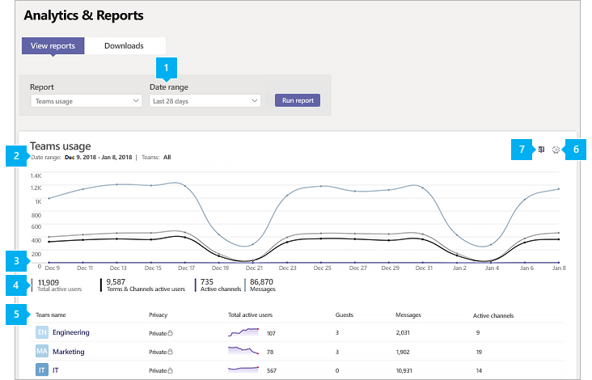

# Rapport d’utilisation de Microsoft TeamsMicrosoft Teams usage report

Le rapport de l’utilisation Teams dans le centre d’administration de Microsoft Teams vous offre une vue d’ensemble de l’activité de l’utilisation dans Teams, y compris le nombre d’utilisateurs et de canaux actifs, pour vous permettre de voir rapidement combien d’utilisateurs utilisent Teams pour communiquer et collaborer au sein de votre organisation.The Teams usage report in the Microsoft Teams admin center gives you an overview of the usage activity in Teams, including the number of active users and channels, so you can quickly see how many users across your organization are using Teams to communicate and collaborate. Vous pouvez afficher des informations d’utilisation concernant les équipes, y compris le nombre d’utilisateurs et de canaux actifs, d’invités et de messages dans chaque équipe.You can view usage information for  teams, including the number of active users and channels, guests, and messages in each team.

## Afficher le rapport d’utilisationView the usage report

1. Dans le volet de navigation de gauche du centre d’administration de Microsoft Teams, cliquez sur **analyse &** rapports d'  >  **utilisation**des rapports.In the left navigation of the Microsoft Teams admin center, click **Analytics & reports** > **Usage reports**. Dans l’onglet **afficher les rapports** , sous **rapport**, sélectionnez utilisation des **équipes**.On the **View reports** tab, under **Report**, select **Teams usage**.
2. Dans **Plage de dates**, sélectionnez une plage puis cliquez sur **Exécuter le rapport**.Under **Date range**, select a range, and then click **Run report**.

    

## Interpréter le rapportInterpret the report

|LégendeCallout |DescriptionDescription  |
|--------|-------------|
|**1****1**   |Le rapport activité de l’utilisation des équipes peut être consulté pour les tendances au cours des 7, 30 ou 90 derniers jours.The Teams usage activity report can be viewed for trends over the last 7 days, 30 or 90 days. |
|**2****2**   |Chaque rapport comporte la date à laquelle il a été généré. Les rapports reflètent généralement une latence de 24 à 48 heures par rapport à l’heure de l’activité.Each report has a date for when this report was generated. The reports usually reflect a 24 to 48 hour latency from time of activity. |
|**3****3**   |<ul><li>L’axe X représente la plage de dates sélectionnée pour ce rapport.The X axis on the chart is the selected date range for the report.</li> <li> L’axe Y indique le nombre d’éléments ou activités actif(ve)s.The Y axis is the count of active items or activity.</li> </ul>Pointez sur le point représentant un élément ou une activité à une date donnée pour voir le nombre d’instances de cet élément ou activité à cette date.Hover over the dot representing an item or activity on a given date to see the number of instances of that item or activity on that given date.|
|**4****4**   |Vous pouvez filtrer ce qui est affiché dans le tableau en cliquant sur un élément dans la légende.You can filter what you see on the chart by clicking an item in the legend. Par exemple, cliquez sur **nombre total d’utilisateurs actifs**, **équipes & canaux actifs**, **canaux actifs**ou **messages** pour afficher uniquement les informations relatives à chacun d’eux.For example, click  **Total active users**, **Teams & Channels active users**,  **Active channels**, or **Messages** to see only the info related to each one. La modification de cette sélection ne modifie pas les informations du tableau lui-même.Changing this selection doesn’t change the information in the table. |
|**5****5**   |Le tableau présente une répartition de l’utilisation par équipe.The table gives you a breakdown of usage by team. <ul><li>**Nom** de l’équipe correspond au nom d’affichage de l’équipe.**Team name** is the display name of the team. Vous pouvez cliquer sur le nom de l’équipe pour accéder à la page des paramètres de l’équipe dans le centre d’administration Microsoft Teams.You can click the team name to go to the team's settings page in the Microsoft Teams admin center. </li> <li>**Confidentialité** indique si l’équipe est une équipe privée ou publique.**Privacy** refers to whether the team is a private team or public team.</li> <li>**Utilisateurs actifs** correspond au nombre d’utilisateurs actifs dans l’équipe pour la période spécifiée.**Active users** is the number of active users in the team in the specified time period.</li><li>**Invités** correspond au nombre d’invités dans l’équipe pour la période spécifiée.**Guests** is the number of guests in the team in the specified time period.</li> <li>**Canaux actifs** correspond au nombre de canaux disposant d’au moins un utilisateur actif pendant la période spécifiée.**Active channels** is the number of channels that have at least one active user in the specified time period.</li> <li>**Comptabiliser les messages** est le nombre de tous les messages de publication dans les canaux pendant la période spécifiée.**Post Messages** is the number of all the post messages in channels in the specified time period.</li> <li>**Messages de réponse** correspond au numéro de tous les messages de réponse dans les canaux pendant la période spécifiée.**Reply messages** is the number  of all the reply messages in channels in the specified time period.</li> <li>**Réunions organisées** indique le nombre de réunions planifiées et ad hoc qu’un utilisateur a organisées pendant la période spécifiée.**Meetings organized** is the number of scheduled and ad hoc meetings a user organized during the specified time period. </li><li>**Messages urgents** indique le nombre de messages urgents pendant la période spécifiée.**Urgent messages** is the number  of all the urgent messages in the specified time period.</li><li>**Réactions** est le nombre de réponses aux messages pendant la période spécifiée.**Reactions** is the number  of all the reactions to messages in the specified time period.</li><li>**Mentions** est le nombre de toutes les mentions utilisées dans les messages pendant la période spécifiée.**Mentions** is the number of all the mentions used in messages in the specified time period.</li><li>**Messages de canal** indique le nombre de messages uniques que les utilisateurs d’une équipe a publié dans une conversation d’équipe pendant la période spécifiée.**Channel messages** is the number of unique messages that the team's users posted in a team chats during the specified time period.</li> </li> </ul>Notez que si un compte d’utilisateur n’existe plus dans Azure AD, le nom d’utilisateur est affiché en tant que « -- » dans la table.Note that if a user account no longer exists in Azure AD, the user name is displayed as "--" in the table.   Pour afficher les informations que vous souhaitez dans le tableau, veillez à ajouter les colonnes correspondantes au tableau.To see the information that you want in the table, make sure to add the columns to the table. |
|**6****6**   |Sélectionnez **Modifier les colonnes** pour ajouter ou supprimer des colonnes dans le tableau.Select **Edit columns** to add or remove columns in the table.|
|**7****7**   |Vous pouvez exporter le rapport dans un fichier CSV pour une analyse hors connexion.You can export the report to a CSV file for offline analysis. Cliquez sur **Exporter vers Excel**, puis sous l’onglet **téléchargements** , cliquez sur **Télécharger** pour télécharger le rapport dès qu’il est prêt.Click **Export to Excel**, and then on the **Downloads** tab, click **Download** to download the report when it's ready.  |

[!INCLUDE [teams-reports-definitions](../includes/teams-reports-definitions.md)]

## Voir aussiRelated topics

- [Analyses et rapports TeamsTeams analytics and reporting](teams-reporting-reference.md)
