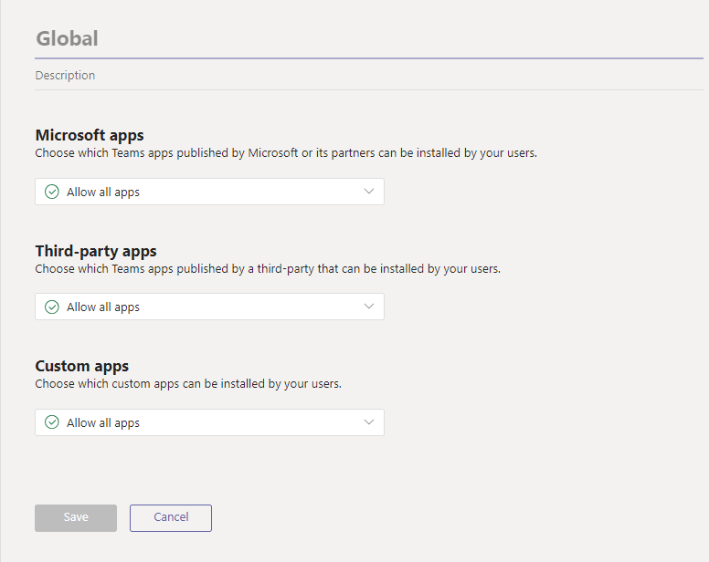
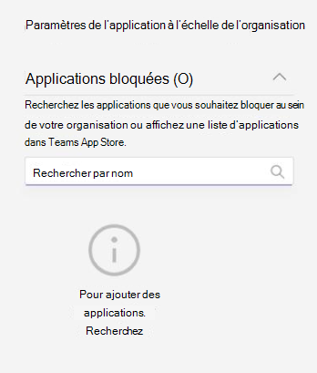

# Gérer les stratégies d’autorisation d’application dans Microsoft Teams

En tant qu’administrateur, vous pouvez utiliser des stratégies d’autorisation d’application pour contrôler les applications auxquelles les utilisateurs de Microsoft Teams peuvent accéder au sein de votre organisation. Vous pouvez autoriser ou bloquer toutes les applications ou des applications spécifiques publiées par Microsoft, par des tiers et par votre organisation. Lorsque vous bloquez une application, les utilisateurs qui disposent de la stratégie ne peuvent pas l’installer à partir de la boutique d’applications Teams. Vous devez être un administrateur général ou un administrateur du service Teams pour gérer ces stratégies.

Vous gérez les stratégies d’autorisation d'applications dans le Centre d'administration Microsoft Teams. Vous pouvez utiliser la stratégie globale (par défaut à l’échelle de l’organisation) ou créer et attribuer des stratégies personnalisées. Les utilisateurs de votre organisation recevront automatiquement la stratégie globale, sauf si vous créez et leur attribuez une stratégie personnalisée. Après avoir modifié ou attribué une stratégie, l’application des modifications peut prendre quelques heures.

> [!NOTE]
> Les paramètres de l’application à l’échelle de l’organisation remplacent la stratégie globale et les stratégies personnalisées que vous créez et affectez aux utilisateurs.

Si votre organisation utilise déjà Teams, les paramètres de l’application que vous avez configurés dans **Paramètres à l’échelle du client** dans le Centre d’administration Microsoft 365 sont reflétés dans les paramètres des applications à l’échelle de l’organisation sur la page [Gérer les applications](manage-apps.md). Si vous êtes nouveau dans Teams et que vous débutez, par défaut, toutes les applications sont autorisées dans la stratégie globale. Il inclut les applications publiées par Microsoft, les fournisseurs de logiciels tiers et votre organisation.

Par exemple, vous souhaitez autoriser uniquement quelques applications spécifiques pour l’équipe RH de votre organisation. Tout d’abord, dans la page [Gérer les applications](https://admin.teams.microsoft.com/policies/manage-apps) , assurez-vous que les applications que vous souhaitez autoriser pour l’équipe RH sont autorisées au niveau de l’organisation. Ensuite, créez une stratégie personnalisée, définissez-la pour bloquer et autoriser les applications souhaitées, puis affectez la stratégie aux utilisateurs de l’équipe RH.

> [!NOTE]
> Pour en savoir plus sur les paramètres d’application tiers qui sont propres à Microsoft 365 Cloud de la communauté du secteur public high (GCCH) et à l’environnement du ministère de la Défense (DoD), consultez [Gérer les paramètres d’application à l’échelle de l’organisation pour Microsoft 365 Gouvernement](#manage-org-wide-app-settings-for-microsoft-365-government).

## Créer une stratégie d’autorisation d’application personnalisée

Utilisez une ou plusieurs stratégies d’autorisation d’application personnalisées, si vous souhaitez contrôler les applications disponibles pour différents groupes d’utilisateurs. Vous pouvez créer et attribuer des stratégies personnalisées distinctes sur la base de la publication d’applications par Microsoft, des tiers ou votre organisation. Après avoir créé une stratégie personnalisée, vous ne pouvez pas la modifier si des applications tierces sont désactivées dans les paramètres d’application à l’échelle de l’organisation.

1. Se connecter au [centre d’administration Teams](https://admin.teams.microsoft.com/dashboard)
1. Dans le volet gauche, accédez à **Teams stratégies****d’autorisation** des applications > .
1. Sélectionnez **Ajouter**.

    

1. Fournissez un nom et une description pour la stratégie.
1. Sous **Applications Microsoft**, **Applications tierces** et **Applications personnalisées**, sélectionnez l’une des options suivantes :
   - **Autoriser toutes les applications**
   - **Autoriser des applications spécifiques et bloquer toutes les autres**
   - **Bloquer des applications spécifiques et autoriser toutes les autres**
   - **Bloquer toutes les applications**.

1. Si vous avez sélectionné **Autoriser des applications spécifiques et bloquer d’autres utilisateurs**, ajoutez les applications que vous voulez autoriser :

    1. Sélectionnez **Autoriser des applications**.
    1. Recherchez les applications que vous souhaitez autoriser, puis sélectionnez **Ajouter**. Les résultats de la recherche sont filtrés sur l’éditeur de l’application (**Applications Microsoft**, **Applications tierces** ou **Applications personnalisées**).
    1. Une fois que vous avez choisi la liste des applications, **sélectionnez Autoriser**.

1. De même, si vous avez sélectionné **Bloquer des applications spécifiques et autorisez toutes les autres** applications, recherchez et ajoutez les applications que vous souhaitez bloquer, puis sélectionnez **Bloquer**.
1. Sélectionnez **Enregistrer**.

## Modifier une stratégie d’autorisation à l’application

Vous pouvez utiliser le centre d’administration Teams pour modifier une stratégie, y compris la stratégie globale et les stratégies personnalisées que vous créez.

1. Dans le volet gauche du centre d’administration Microsoft Teams, accédez à **Teams stratégies****d’autorisation** des applications > .
1. Sélectionnez la stratégie en cliquant à gauche du nom de celle-ci, puis sélectionnez **Modifier**.
1. À partir de là, apportez les modifications souhaitées. Vous pouvez gérer les paramètres en fonction de l’éditeur de l’application et ajouter et supprimer des applications en fonction du paramètre Autoriser/Bloquer.
1. Sélectionnez **Enregistrer**.

## Affecter une stratégie d’autorisation d’application personnalisée aux utilisateurs

[!INCLUDE [assign-policy](includes/assign-policy.md)]

## Gérer les paramètres d’application à l’échelle de l’organisation pour Microsoft 365 secteur public  

Dans un déploiement Microsoft 365 Government - Cloud de la communauté du secteur public, GCCH et DoD de Teams, toutes les applications tierces sont bloquées par défaut. Dans les clouds GCCH et DOD, les applications tierces ne sont pas disponibles. En outre, dans Cloud de la communauté du secteur public, vous voyez la remarque suivante sur la gestion des applications tierces sur la page des stratégies d’autorisation d’application dans le centre d’administration Microsoft Teams.

:::image type="content" source="media/app-permission-policies-gcc.png" alt-text="Capture d’écran de la stratégie d’autorisation d’application dans GCCH et DoD.":::

Utilisez les paramètres de l’application à l’échelle de l’organisation pour contrôler si les utilisateurs peuvent installer des applications tierces. Les paramètres de l’application à l’échelle de l’organisation contrôlent le comportement de tous les utilisateurs et remplacent les autres stratégies d’autorisation d’application attribuées à des utilisateurs. Vous pouvez les utiliser pour contrôler des applications malveillantes ou problématiques.

<!---
1. On the **Permission policies** page, select **Org-wide app settings**. You can then configure the settings you want in the panel. --->

### Pour Cloud de la communauté du secteur public clouds

1. Dans la page **Gérer les applications** , sélectionnez **paramètres d’application à l’échelle de l’organisation**. Vous pouvez ensuite configurer les paramètres voulus dans le panneau.

  

1. Sous **Applications tierces**, désactiver ou activer ces paramètres pour contrôler l’accès à des applications tierces :
   - **Autoriser les applications tierces** : cette option contrôle si les utilisateurs peuvent utiliser des applications tierces. Si vous avez désactiver ce paramètre, vos utilisateurs ne pourront pas installer ou utiliser des applications tierces. Dans un déploiement Microsoft 365 Government - GCCH et DoD de Teams, ce paramètre est désactivé par défaut.
   - **Autoriser les nouvelles applications tierces publiées sur le store par défaut** : cette option contrôle si les nouvelles applications tierces publiées dans le Teams app store deviennent automatiquement disponibles dans Teams. Vous ne pouvez définir cette option que si vous autorisez des applications tierces.

1. Sous **Applications bloquées**, ajoutez les applications que vous voulez bloquer au sein de votre organisation. Dans un déploiement Microsoft 365 Government - GCCH et DoD de Teams, toutes les applications tierces sont ajoutées à cette liste par défaut. Pour une application tierce que vous voulez autoriser dans votre organisation, supprimez l’application de cette liste d’applications bloquées. Lorsque vous bloquez une application à l’échelle de l’organisation, l’application est automatiquement bloquée pour tous vos utilisateurs, qu’elle soit autorisée ou non dans les stratégies d’autorisation d’application.

1. Sélectionnez **Enregistrer** pour que les paramètres d’application à l’échelle de l’organisation prennent effet.

Pour autoriser les applications tierces, modifiez et utilisez la stratégie globale (par défaut à l’échelle de l’organisation) ou créez et affectez des stratégies personnalisées.

### Pour les clouds GCCH et DoD

1. Dans la page **Stratégies d’autorisations** , sélectionnez **Paramètres de l’application à l'échelle de l'organisation**. Vous pouvez ensuite configurer les paramètres voulus dans le panneau.

  

1. Sous **Applications bloquées**, ajoutez les applications que vous voulez bloquer au sein de votre organisation. Dans un déploiement Microsoft 365 Government - GCCH et DoD de Teams, toutes les applications tierces sont ajoutées à cette liste par défaut. Lorsque vous bloquez une application à l’échelle de l’organisation, l’application est automatiquement bloquée pour tous vos utilisateurs, qu’elle soit autorisée ou non dans les stratégies d’autorisation d’application.
1. Sélectionnez **Enregistrer** pour que les paramètres d’application à l’échelle de l’organisation prennent effet.

## FAQ

### Utiliser des stratégies d’autorisation d’application

#### Quelles interactions affectent les stratégies d’autorisation ?

Les stratégies d’autorisation contrôlent l’utilisation des applications en contrôlant l’installation, la découverte et l’interaction pour les utilisateurs finaux. Les administrateurs peuvent toujours gérer les applications dans le Centre d’administration Microsoft Teams quelles que soient les stratégies d’autorisation qui leur sont affectées.

#### Puis-je contrôler les applications métier (LOB) ?

Oui, vous pouvez utiliser les stratégies d'autorisation des applications pour contrôler le déploiement et la distribution des applications personnalisées (LOB). Vous pouvez créer une stratégie personnalisée ou modifier la stratégie globale pour autoriser ou bloquer des applications personnalisées en fonction des besoins de votre organisation.

#### Quel est le lien entre les stratégies d'autorisation des applications et les stratégies de configuration des applications ?

Vous pouvez utiliser les stratégies de configuration des applications en même temps que les stratégies de permission des applications. Les applications pré-épinglées sont sélectionnées dans l’ensemble des applications activées pour un utilisateur. Par ailleurs, si un utilisateur a une stratégie d’autorisation d’application qui bloque une application dans sa stratégie de configuration d’application, cette application n’apparaît pas dans Teams.

#### Puis-je utiliser des stratégies d’autorisation d’application pour restreindre le chargement d’applications personnalisées ?

Vous pouvez utiliser les paramètres à l’échelle de l’organisation sur la page **Gérer les applications**, ou des stratégies de configuration d’applications pour restreindre le chargement d’applications personnalisées pour votre organisation.  

Pour empêcher des utilisateurs spécifiques de télécharger des applications personnalisées, utilisez des stratégies d’application personnalisées. Pour plus d’informations, consultez [Gérer les stratégies et paramètres d’application personnalisés dans Teams](teams-custom-app-policies-and-settings.md).

#### Le blocage d’une application s’applique-t-il aux clients mobiles Teams ?

Oui, lorsque vous bloquez une application, cette application est bloquée dans tous les clients Teams.  

### Expérience utilisateur

#### Qu'est-ce qu'un utilisateur ressent lorsqu'une application est bloquée ?

Les utilisateurs ne peuvent pas interagir avec une application bloquée ou ses fonctionnalités, telles que les bots, les onglets et les extensions de messagerie. Dans un contexte partagé, tel qu’une conversation d’équipe ou de groupe, les bots peuvent toujours envoyer des messages à tous les participants de ce contexte. Teams indique à l’utilisateur lorsqu’une application est bloquée.

Par exemple, lorsqu’une application est bloquée, les utilisateurs ne peuvent effectuer aucune des tâches suivantes :

- Ajouter l’application personnellement ou à une conversation ou une équipe
- Envoyer des messages au bot de l’application
- Exécuter des actions de bouton qui renvoient des informations à l’application, telles que des messages actionnables  
- Afficher l’onglet de l’application
- Configurer des connecteurs pour recevoir des notifications
- Utiliser l’extension de messagerie de l’application

L'ancien portail permettait de contrôler les applications au niveau de l'organisation, ce qui signifie que lorsqu'une application est bloquée, elle l'est pour tous les utilisateurs de l'organisation. Le blocage d’une application sur page [Gérer les applications](manage-apps.md) fonctionne exactement de la même manière.

Pour les stratégies d’autorisation d’application affectées à des utilisateurs spécifiques, si une application avec une fonctionnalité bot ou de connecteur était autorisée, puis bloquée, et si l’application n’est ensuite autorisée que pour certains utilisateurs dans un contexte partagé, les membres d’une conversation de groupe ou d’un canal qui ne sont pas autorisés à cette application peuvent voir l’historique des messages et les messages publiés par le bot ou le connecteur, mais ne peut pas interagir avec.

## Voir aussi

- [Paramètres d’administration pour les applications dans Microsoft Teams](admin-settings.md)
- [Attribuer des stratégies à vos utilisateurs](policy-assignment-overview.md)
- [comparaison de la disponibilité des fonctionnalités Teams](/office365/servicedescriptions/teams-service-description#feature-availability)
