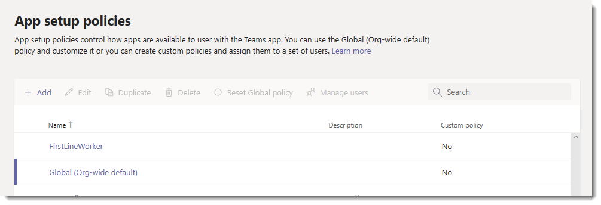

# <a name="manage-app-setup-policies-in-microsoft-teams"></a><span data-ttu-id="e2844-103">Gérer les stratégies de mise en application dans Microsoft Teams</span><span class="sxs-lookup"><span data-stu-id="e2844-103">Manage app setup policies in Microsoft Teams</span></span>

> [!NOTE]
> <span data-ttu-id="e2844-104">Si vous avez activé le paramètre de stratégie d’autorisation d’application à l’échelle de l’organisation, **autorisez les interactions avec les applications personnalisées**, il est possible que les stratégies de configuration des applications n’apparaissent pas dans le centre d’administration Microsoft Teams.</span><span class="sxs-lookup"><span data-stu-id="e2844-104">If you enabled the org-wide app permission policy setting, **Allow interaction with custom apps**, you may not see app setup policies yet in the Microsoft Teams admin center.</span></span> <span data-ttu-id="e2844-105">Ce service est actuellement déployé et sera disponible prochainement dans votre organisation.</span><span class="sxs-lookup"><span data-stu-id="e2844-105">It's currently being rolled out and will be available soon in your organization.</span></span>

<span data-ttu-id="e2844-106">En tant qu’administrateur, vous pouvez utiliser des stratégies de configuration d’application pour personnaliser Microsoft teams afin de mettre en évidence les applications les plus importantes pour vos utilisateurs.</span><span class="sxs-lookup"><span data-stu-id="e2844-106">As an admin, you can use app setup policies to customize Microsoft Teams to highlight the apps that are most important for your users.</span></span> <span data-ttu-id="e2844-107">Vous choisissez les applications à épingler et définir leur ordre d’apparition.</span><span class="sxs-lookup"><span data-stu-id="e2844-107">You choose the apps to pin and set the order that they appear.</span></span> <span data-ttu-id="e2844-108">Les stratégies de configuration des applications vous permettent de faire la promotion des applications requises par les utilisateurs de votre organisation, y compris celles créées par des tiers ou par des développeurs de votre organisation.</span><span class="sxs-lookup"><span data-stu-id="e2844-108">App setup policies let you showcase apps that users in your organization need, including those built by third parties or by developers in your organization.</span></span> <span data-ttu-id="e2844-109">Vous pouvez également utiliser des stratégies de configuration d’application pour gérer l’affichage des fonctionnalités intégrées.</span><span class="sxs-lookup"><span data-stu-id="e2844-109">You can also use app setup policies to manage how built-in features appear.</span></span>

<span data-ttu-id="e2844-110">Applications épinglées à la barre de l’application.</span><span class="sxs-lookup"><span data-stu-id="e2844-110">Apps are pinned to the app bar.</span></span> <span data-ttu-id="e2844-111">Il s’agit de la barre située sur le côté du client de bureau teams et au bas des clients mobiles Teams (iOS et Android).</span><span class="sxs-lookup"><span data-stu-id="e2844-111">This is the bar on the side of the Teams desktop client and at the bottom of the Teams mobile clients (iOS and Android).</span></span> 

|<span data-ttu-id="e2844-112">Client de bureau teams</span><span class="sxs-lookup"><span data-stu-id="e2844-112">Teams desktop client</span></span>  |<span data-ttu-id="e2844-113">Client mobile teams</span><span class="sxs-lookup"><span data-stu-id="e2844-113">Teams mobile client</span></span> |
|---------|---------|
|<br>  |         |

<span data-ttu-id="e2844-116">Vous gérez les stratégies de configuration des applications dans le centre d’administration Microsoft Teams.</span><span class="sxs-lookup"><span data-stu-id="e2844-116">You manage app setup policies in the Microsoft Teams admin center.</span></span> <span data-ttu-id="e2844-117">Vous pouvez utiliser la stratégie globale par défaut de l’organisation ou créer des stratégies personnalisées et les affecter à des utilisateurs.</span><span class="sxs-lookup"><span data-stu-id="e2844-117">You can use the global (Org-wide default) policy or create custom policies and assign them to users.</span></span> <span data-ttu-id="e2844-118">Les utilisateurs de votre organisation obtiennent automatiquement la stratégie globale sauf si vous créez et attribuez une stratégie personnalisée.</span><span class="sxs-lookup"><span data-stu-id="e2844-118">Users in your organization will automatically get the global policy unless you create and assign a custom policy.</span></span>

<span data-ttu-id="e2844-119">Vous pouvez modifier les paramètres de la stratégie globale de manière à inclure les applications souhaitées.</span><span class="sxs-lookup"><span data-stu-id="e2844-119">You can edit the settings in the global policy to include the apps that you want.</span></span> <span data-ttu-id="e2844-120">Si vous voulez personnaliser teams pour différents groupes d’utilisateurs de votre organisation, créez et attribuez une ou plusieurs stratégies personnalisées.</span><span class="sxs-lookup"><span data-stu-id="e2844-120">If you want to customize Teams for different groups of users in your organization, create and assign one or more custom policies.</span></span> <span data-ttu-id="e2844-121">Si un utilisateur dispose d’une stratégie personnalisée, cette politique s’applique à l’utilisateur.</span><span class="sxs-lookup"><span data-stu-id="e2844-121">If a user is assigned a custom policy, that policy applies to the user.</span></span> <span data-ttu-id="e2844-122">Si un utilisateur ne reçoit pas de stratégie personnalisée, la politique globale s’applique à l’utilisateur.</span><span class="sxs-lookup"><span data-stu-id="e2844-122">If a user isn't assigned a custom policy, the global policy applies to the user.</span></span>



> [!NOTE]
> <span data-ttu-id="e2844-124">Si vous disposez d’équipes pour l’éducation, il est important de savoir que l’application devoirs est épinglée par défaut dans la stratégie globale, même si elle n’est pas répertoriée dans la stratégie globale.</span><span class="sxs-lookup"><span data-stu-id="e2844-124">If you have Teams for Education, it's important to know that the Assignments app is pinned by default in the global policy even though currently, you don't see it listed in the global policy.</span></span> <span data-ttu-id="e2844-125">Il s’agira de la quatrième application de la liste des applications épinglées sur les clients Teams.</span><span class="sxs-lookup"><span data-stu-id="e2844-125">It will be the fourth app in the list of pinned apps on Teams clients.</span></span>

## <a name="create-a-custom-app-setup-policy"></a><span data-ttu-id="e2844-126">Créer une stratégie de configuration d’application personnalisée</span><span class="sxs-lookup"><span data-stu-id="e2844-126">Create a custom app setup policy</span></span>

<span data-ttu-id="e2844-127">Vous pouvez utiliser le centre d’administration de Microsoft teams pour créer une stratégie personnalisée.</span><span class="sxs-lookup"><span data-stu-id="e2844-127">You can use the Microsoft Teams admin center to create a custom policy.</span></span>

1. <span data-ttu-id="e2844-128">Dans le volet de navigation de gauche du centre d’administration de Microsoft Teams, accédez à > **stratégies de configuration**des **applications teams**.</span><span class="sxs-lookup"><span data-stu-id="e2844-128">In the left navigation of the Microsoft Teams admin center, go to **Teams apps** > **Setup policies**.</span></span>
2. <span data-ttu-id="e2844-129">Cliquez sur **Ajouter**.</span><span class="sxs-lookup"><span data-stu-id="e2844-129">Click **Add**.</span></span>
3. <span data-ttu-id="e2844-130">Entrez le nom et la description de la stratégie, puis cliquez sur **Ajouter des applications**.</span><span class="sxs-lookup"><span data-stu-id="e2844-130">Enter a name and description for the policy, and then click **Add apps**.</span></span>
4. <span data-ttu-id="e2844-131">Activez ou désactivez l’option autoriser le téléchargement d' **applications personnalisées**, selon que vous voulez permettre aux utilisateurs de télécharger des applications personnalisées dans Teams.</span><span class="sxs-lookup"><span data-stu-id="e2844-131">Turn on or turn off **Allow uploading custom apps**, depending on whether you want to let users upload custom apps to Teams.</span></span> <span data-ttu-id="e2844-132">Vous ne pourrez pas modifier ce paramètre si l’option **autoriser les applications tierces ou personnalisées** est désactivée dans [les paramètres](teams-app-permission-policies.md#manage-org-wide-app-settings) de l’application à l’échelle de l’organisation dans les stratégies d’autorisation d’application.</span><span class="sxs-lookup"><span data-stu-id="e2844-132">You won't be able to change this setting if **Allow third-party or custom apps** is turned off in [org-wide app settings](teams-app-permission-policies.md#manage-org-wide-app-settings) in app permission policies.</span></span>
5. <span data-ttu-id="e2844-133">Dans le volet **Ajouter des applications épinglées** , recherchez les applications que vous voulez ajouter, puis cliquez sur **Ajouter**.</span><span class="sxs-lookup"><span data-stu-id="e2844-133">In the **Add pinned apps** pane, search for the apps you want to add, and then click **Add**.</span></span> <span data-ttu-id="e2844-134">Vous pouvez également filtrer les applications par stratégie d’autorisation d’applications.</span><span class="sxs-lookup"><span data-stu-id="e2844-134">You can also filter apps by app permission policy.</span></span> <span data-ttu-id="e2844-135">Lorsque vous avez choisi votre liste d’applications, cliquez sur **Ajouter**.</span><span class="sxs-lookup"><span data-stu-id="e2844-135">When you've chosen your list of apps, click **Add**.</span></span>

     

6. <span data-ttu-id="e2844-137">Organisez les applications dans l’ordre dans lequel vous voulez qu’elles apparaissent dans Teams, puis cliquez sur **Enregistrer**.</span><span class="sxs-lookup"><span data-stu-id="e2844-137">Arrange the apps in the order that you want them to appear in Teams, and then click **Save**.</span></span>

    

## <a name="edit-an-app-setup-policy"></a><span data-ttu-id="e2844-139">Modifier une stratégie de configuration de l’application</span><span class="sxs-lookup"><span data-stu-id="e2844-139">Edit an app setup policy</span></span>

<span data-ttu-id="e2844-140">Vous pouvez utiliser le centre d’administration de Microsoft teams pour modifier une stratégie, dont la stratégie globale par défaut de l’organisation et les stratégies personnalisées que vous créez.</span><span class="sxs-lookup"><span data-stu-id="e2844-140">You can use the Microsoft Teams admin center to edit a policy, including the global (Org-wide default) policy and custom policies that you create.</span></span>

1. <span data-ttu-id="e2844-141">Dans le volet de navigation de gauche du centre d’administration de Microsoft Teams, accédez à > **stratégies de configuration**des **applications teams**.</span><span class="sxs-lookup"><span data-stu-id="e2844-141">In the left navigation of the Microsoft Teams admin center, go to **Teams apps** > **Setup policies**.</span></span>
2. <span data-ttu-id="e2844-142">Sélectionnez la stratégie en cliquant à gauche du nom de la stratégie, puis cliquez sur **modifier**.</span><span class="sxs-lookup"><span data-stu-id="e2844-142">Select the policy by clicking to the left of the policy name, and then click **Edit**.</span></span>
3. <span data-ttu-id="e2844-143">À partir de cet emplacement, apportez les modifications souhaitées.</span><span class="sxs-lookup"><span data-stu-id="e2844-143">From here, make the changes that you want.</span></span> <span data-ttu-id="e2844-144">Vous pouvez ajouter, supprimer et modifier l’ordre des applications.</span><span class="sxs-lookup"><span data-stu-id="e2844-144">You can add, remove, and change the order of apps.</span></span>
4. <span data-ttu-id="e2844-145">Cliquez sur **Enregistrer**.</span><span class="sxs-lookup"><span data-stu-id="e2844-145">Click **Save**.</span></span>

## <a name="assign-a-custom-app-setup-policy-to-users"></a><span data-ttu-id="e2844-146">Assigner une stratégie de configuration d’application personnalisée aux utilisateurs</span><span class="sxs-lookup"><span data-stu-id="e2844-146">Assign a custom app setup policy to users</span></span>

<span data-ttu-id="e2844-147">Vous pouvez utiliser le centre d’administration de Microsoft teams pour attribuer une stratégie personnalisée à des utilisateurs individuels ou au module PowerShell Skype entreprise pour attribuer une stratégie personnalisée à des groupes d’utilisateurs, tels qu’un groupe de sécurité ou un groupe de distribution.</span><span class="sxs-lookup"><span data-stu-id="e2844-147">You can use the Microsoft Teams admin center to assign a custom policy to individual users or the Skype for Business PowerShell module  to assign a custom policy to groups of users, such as a security group or distribution group.</span></span>

### <a name="assign-a-custom-app-setup-policy-to-users"></a><span data-ttu-id="e2844-148">Assigner une stratégie de configuration d’application personnalisée aux utilisateurs</span><span class="sxs-lookup"><span data-stu-id="e2844-148">Assign a custom app setup policy to users</span></span>

1. <span data-ttu-id="e2844-149">Dans le volet de navigation de gauche du centre d’administration de Microsoft Teams, accédez à **utilisateurs**, puis cliquez sur l’utilisateur.</span><span class="sxs-lookup"><span data-stu-id="e2844-149">In the left navigation of the Microsoft Teams admin center, go to **Users**, and then click  the user.</span></span>
2. <span data-ttu-id="e2844-150">Sélectionnez l’utilisateur en cliquant à gauche du nom de l’utilisateur, puis sur **modifier les paramètres**.</span><span class="sxs-lookup"><span data-stu-id="e2844-150">Select the user by clicking to the left of the user name, and then click **Edit settings**.</span></span>
3. <span data-ttu-id="e2844-151">Sous **stratégie de configuration des applications**, sélectionnez la stratégie de configuration de l’application que vous voulez attribuer, puis cliquez sur **appliquer**.</span><span class="sxs-lookup"><span data-stu-id="e2844-151">Under **App setup policy**, select the app setup policy you want to assign, and then click **Apply**.</span></span>

<span data-ttu-id="e2844-152">Pour attribuer une stratégie à plusieurs utilisateurs à la fois, voir [modifier les paramètres utilisateur d’équipes en bloc](edit-user-settings-in-bulk.md).</span><span class="sxs-lookup"><span data-stu-id="e2844-152">To assign a policy to multiple users at a time, see [Edit Teams user settings in bulk](edit-user-settings-in-bulk.md).</span></span>

<span data-ttu-id="e2844-153">Vous pouvez également effectuer les opérations suivantes :</span><span class="sxs-lookup"><span data-stu-id="e2844-153">Or, you can also do the following:</span></span>

1. <span data-ttu-id="e2844-154">Dans le volet de navigation de gauche du centre d’administration de Microsoft Teams, accédez à > **stratégies de configuration**des **applications teams**.</span><span class="sxs-lookup"><span data-stu-id="e2844-154">In the left navigation of the Microsoft Teams admin center, go to **Teams apps** > **Setup policies**.</span></span>
2. <span data-ttu-id="e2844-155">Sélectionnez la stratégie en cliquant à gauche du nom de la stratégie.</span><span class="sxs-lookup"><span data-stu-id="e2844-155">Select the policy by clicking to the left of the policy name.</span></span>
3. <span data-ttu-id="e2844-156">Sélectionnez **gérer les utilisateurs**.</span><span class="sxs-lookup"><span data-stu-id="e2844-156">Select **Manage users**.</span></span>
4. <span data-ttu-id="e2844-157">Dans le volet **gérer les utilisateurs** , recherchez l’utilisateur par nom complet ou par nom d’utilisateur, sélectionnez le nom, puis sélectionnez **Ajouter**.</span><span class="sxs-lookup"><span data-stu-id="e2844-157">In the **Manage users** pane, search for the user by display name or by user name, select the name, and then select **Add**.</span></span> <span data-ttu-id="e2844-158">Répétez cette étape pour chaque utilisateur que vous souhaitez ajouter.</span><span class="sxs-lookup"><span data-stu-id="e2844-158">Repeat this step for each user that you want to add.</span></span>
5. <span data-ttu-id="e2844-159">Lorsque vous avez terminé d’ajouter des utilisateurs, cliquez sur **Enregistrer**.</span><span class="sxs-lookup"><span data-stu-id="e2844-159">After you finish adding users, select **Save**.</span></span>

### <a name="assign-a-custom-app-setup-policy-to-users-in-a-group"></a><span data-ttu-id="e2844-160">Assigner une stratégie de configuration d’application personnalisée aux utilisateurs d’un groupe</span><span class="sxs-lookup"><span data-stu-id="e2844-160">Assign a custom app setup policy to users in a group</span></span>

<span data-ttu-id="e2844-161">Il est possible que vous souhaitiez affecter une stratégie de configuration d’application personnalisée à plusieurs utilisateurs déjà identifiés.</span><span class="sxs-lookup"><span data-stu-id="e2844-161">You may want to assign a custom app setup policy to multiple users that you’ve already identified.</span></span> <span data-ttu-id="e2844-162">Par exemple, vous souhaiterez probablement affecter une stratégie à l’ensemble des utilisateurs d’un groupe de sécurité.</span><span class="sxs-lookup"><span data-stu-id="e2844-162">For example, you may want to assign a policy to all users in a security group.</span></span> <span data-ttu-id="e2844-163">Pour cela, vous devez vous connecter au module Azure Active Directory PowerShell pour Graph et au module PowerShell Skype entreprise.</span><span class="sxs-lookup"><span data-stu-id="e2844-163">You can do this by connecting to the Azure Active Directory PowerShell for Graph module and the Skype for Business PowerShell module.</span></span> <span data-ttu-id="e2844-164">Pour plus d’informations sur l’utilisation de PowerShell pour gérer Teams, voir [vue d’ensemble de teams PowerShell](teams-powershell-overview.md).</span><span class="sxs-lookup"><span data-stu-id="e2844-164">For more information about using PowerShell to manage Teams, see [Teams PowerShell Overview](teams-powershell-overview.md).</span></span>

<span data-ttu-id="e2844-165">Dans cet exemple, nous affectons une stratégie d’installation d’application personnalisée appelée stratégie de configuration des applications humaines à tous les utilisateurs du groupe de projets RH de contoso Pharmaceuticals.</span><span class="sxs-lookup"><span data-stu-id="e2844-165">In this example, we assign a custom app setup policy called HR App Setup Policy to all users in the Contoso Pharmaceuticals HR Project group.</span></span>  

> [!NOTE]
> <span data-ttu-id="e2844-166">Assurez-vous d’abord de vous connecter au module Azure Active Directory PowerShell pour Graph et au module PowerShell Skype entreprise en suivant les étapes décrites dans l’article [se connecter à tous les services Office 365 dans une seule fenêtre Windows PowerShell](https://docs.microsoft.com/office365/enterprise/powershell/connect-to-all-office-365-services-in-a-single-windows-powershell-window).</span><span class="sxs-lookup"><span data-stu-id="e2844-166">Make sure you first connect to the Azure Active Directory PowerShell for Graph module and Skype for Business PowerShell module by following the steps in [Connect to all Office 365 services in a single Windows PowerShell window](https://docs.microsoft.com/office365/enterprise/powershell/connect-to-all-office-365-services-in-a-single-windows-powershell-window).</span></span>

<span data-ttu-id="e2844-167">Obtenez la GroupObjectId du groupe en particulier.</span><span class="sxs-lookup"><span data-stu-id="e2844-167">Get the GroupObjectId of the particular group.</span></span>
```
$group = Get-AzureADGroup -SearchString "Contoso Pharmaceuticals HR Project"
```
<span data-ttu-id="e2844-168">Obtenez les membres du groupe spécifié.</span><span class="sxs-lookup"><span data-stu-id="e2844-168">Get the members of the specified group.</span></span>
```
$members = Get-AzureADGroupMember -ObjectId $group.ObjectId -All $true | Where-Object {$_.ObjectType -eq "User"}
```
<span data-ttu-id="e2844-169">Attribuez à tous les utilisateurs du groupe une stratégie de configuration d’application particulière.</span><span class="sxs-lookup"><span data-stu-id="e2844-169">Assign all users in the group to a particular app setup policy.</span></span> <span data-ttu-id="e2844-170">Dans cet exemple, il s’agit de la stratégie de configuration des applications humaines.</span><span class="sxs-lookup"><span data-stu-id="e2844-170">In this example, it's HR App Setup Policy.</span></span>
```
$members | ForEach-Object { Grant-CsTeamsAppSetupPolicy -PolicyName "HR App Setup Policy" -Identity $_.UserPrincipalName}
``` 
<span data-ttu-id="e2844-171">En fonction du nombre de membres du groupe, cette commande risque de prendre quelques minutes.</span><span class="sxs-lookup"><span data-stu-id="e2844-171">Depending on the number of members in the group, this command may take several minutes to execute.</span></span>

## <a name="faq"></a><span data-ttu-id="e2844-172">FAQ</span><span class="sxs-lookup"><span data-stu-id="e2844-172">FAQ</span></span>

### <a name="working-with-app-setup-policies"></a><span data-ttu-id="e2844-173">Utilisation des stratégies de configuration des applications</span><span class="sxs-lookup"><span data-stu-id="e2844-173">Working with app setup policies</span></span>

#### <a name="what-built-in-app-setup-policies-are-included-in-the-microsoft-teams-admin-center"></a><span data-ttu-id="e2844-174">Quelles stratégies de configuration des applications intégrées sont incluses dans le centre d’administration de Microsoft teams ?</span><span class="sxs-lookup"><span data-stu-id="e2844-174">What built-in app setup policies are included in the Microsoft Teams admin center?</span></span>

- <span data-ttu-id="e2844-175">**Global (par défaut de l’organisation)**: cette stratégie par défaut s’applique à tous les utilisateurs de votre organisation sauf si vous affectez une autre stratégie.</span><span class="sxs-lookup"><span data-stu-id="e2844-175">**Global (Org-wide default)**: This default policy applies to all users in your organization unless you assign another policy.</span></span> <span data-ttu-id="e2844-176">Modifiez la stratégie globale pour épingler les applications les plus importantes à vos utilisateurs.</span><span class="sxs-lookup"><span data-stu-id="e2844-176">Edit the global policy to pin apps that are most important for your users.</span></span>
- <span data-ttu-id="e2844-177">**FirstLineWorker**: cette stratégie est destinée aux travailleurs de première ligne.</span><span class="sxs-lookup"><span data-stu-id="e2844-177">**FirstLineWorker**: This policy is for first-line workers.</span></span> <span data-ttu-id="e2844-178">Vous pouvez l’attribuer à des employés de votre organisation de première ligne.</span><span class="sxs-lookup"><span data-stu-id="e2844-178">You can assign it to first-line workers in your organization.</span></span> <span data-ttu-id="e2844-179">Il est important de savoir que, comme les stratégies personnalisées que vous créez, vous devez affecter la stratégie aux utilisateurs pour que les paramètres soient actifs.</span><span class="sxs-lookup"><span data-stu-id="e2844-179">It's important to know that like custom policies that you create, you have to assign the policy to users for the settings to be active.</span></span> <span data-ttu-id="e2844-180">Pour plus d’informations, accédez à la section [assigner une stratégie de configuration d’application personnalisée aux utilisateurs](#assign-a-custom-app-setup-policy-to-users) de cet article.</span><span class="sxs-lookup"><span data-stu-id="e2844-180">For more information, go to the [Assign a custom app setup policy to users](#assign-a-custom-app-setup-policy-to-users) section of this article.</span></span>

#### <a name="why-cant-i-find-an-app-in-the-add-pinned-apps-pane"></a><span data-ttu-id="e2844-181">Pourquoi ne puis-je pas retrouver une application dans le volet ajouter des applications épinglées ?</span><span class="sxs-lookup"><span data-stu-id="e2844-181">Why can't I find an app in the Add pinned apps pane?</span></span>

<span data-ttu-id="e2844-182">Toutes les applications ne peuvent pas être épinglées à teams via une stratégie de configuration d’application.</span><span class="sxs-lookup"><span data-stu-id="e2844-182">Not all apps can be pinned to Teams through an app setup policy.</span></span> <span data-ttu-id="e2844-183">Certaines applications ne prennent pas en charge cette fonctionnalité.</span><span class="sxs-lookup"><span data-stu-id="e2844-183">Some apps may not support this functionality.</span></span> <span data-ttu-id="e2844-184">Pour rechercher des applications qui peuvent être épinglées, recherchez l’application dans le volet **Ajouter des applications épinglées** .</span><span class="sxs-lookup"><span data-stu-id="e2844-184">To find apps that can be pinned, search for the app in the **Add pinned apps** pane.</span></span> <span data-ttu-id="e2844-185">Les onglets qui comportent des onglets statiques et des robots peuvent être épinglés au client de bureau teams et ces applications sont disponibles dans le volet **Ajouter des applications épinglées** .</span><span class="sxs-lookup"><span data-stu-id="e2844-185">Tabs that have a personal scope (static tabs) and bots can be pinned to the Teams desktop client and these apps are available in the **Add pinned apps** pane.</span></span>

<span data-ttu-id="e2844-186">Gardez à l’esprit que le Windows teams Store répertorie toutes les applications teams alors que le volet **Ajouter des applications épinglées** inclut uniquement les applications qui peuvent être épinglées aux équipes via une stratégie.</span><span class="sxs-lookup"><span data-stu-id="e2844-186">Keep in mind that the Teams app store lists all Teams apps whereas the **Add pinned apps** pane includes only apps that can be pinned to Teams through a policy.</span></span> 

#### <a name="im-a-teams-for-education-admin-what-do-i-need-to-know-about-app-setup-policies-in-teams-for-education"></a><span data-ttu-id="e2844-187">Je suis un administrateur d’équipe pour l’éducation. De quoi ai-je besoin en savoir plus sur les stratégies de configuration des applications dans teams pour l’éducation ?</span><span class="sxs-lookup"><span data-stu-id="e2844-187">I'm a Teams for Education admin. What do I need to know about app setup policies in Teams for Education?</span></span>

<span data-ttu-id="e2844-188">L’application appelante n’est pas disponible dans teams pour l’éducation.</span><span class="sxs-lookup"><span data-stu-id="e2844-188">The Calling app isn't available in Teams for Education.</span></span> <span data-ttu-id="e2844-189">Lorsque vous créez une stratégie personnalisée de configuration de l’application, l’application d’appel s’affiche dans la liste des applications.</span><span class="sxs-lookup"><span data-stu-id="e2844-189">When you create a new custom app setup policy, the Calling app is displayed in the list of apps.</span></span> <span data-ttu-id="e2844-190">Toutefois, l’application n’est pas épinglée aux clients teams et aux équipes destinées aux utilisateurs éducation ne verra pas l’application appels dans Teams.</span><span class="sxs-lookup"><span data-stu-id="e2844-190">However, the app isn't pinned to Teams clients and Teams for Education users won't see the Calls app in Teams.</span></span>

#### <a name="how-many-apps-can-be-added-to-a-policy"></a><span data-ttu-id="e2844-191">Combien d’applications peuvent être ajoutées à une stratégie ?</span><span class="sxs-lookup"><span data-stu-id="e2844-191">How many apps can be added to a policy?</span></span>

<span data-ttu-id="e2844-192">Au moins deux applications doivent être épinglées aux clients mobiles Teams (iOS et Android).</span><span class="sxs-lookup"><span data-stu-id="e2844-192">A minimum of two apps must be pinned to the Teams mobile clients (iOS and Android).</span></span> <span data-ttu-id="e2844-193">Si une stratégie comporte moins de deux applications, les clients mobiles ne reflètent pas les paramètres de stratégie et continuent à utiliser la configuration existante.</span><span class="sxs-lookup"><span data-stu-id="e2844-193">If a policy has less than two apps, the mobile clients won't reflect the policy settings and instead will continue to use the existing configuration.</span></span>

<span data-ttu-id="e2844-194">Il n’y a aucune limite au nombre d’applications que vous pouvez ajouter à une stratégie.</span><span class="sxs-lookup"><span data-stu-id="e2844-194">There's no limit on the number of apps you can add to a policy.</span></span>

#### <a name="how-long-does-it-take-for-policy-changes-to-take-effect"></a><span data-ttu-id="e2844-195">Combien de temps faut-il pour que les modifications soient prises en compte ?</span><span class="sxs-lookup"><span data-stu-id="e2844-195">How long does it take for policy changes to take effect?</span></span>

<span data-ttu-id="e2844-196">Lorsque vous modifiez la stratégie globale ou que vous attribuez une stratégie, un délai de 24 heures peut être nécessaire pour que les modifications soient prises en compte.</span><span class="sxs-lookup"><span data-stu-id="e2844-196">After you edit the global policy or assign a policy, it can take up to 24 hours for changes to take effect.</span></span>

### <a name="user-experience"></a><span data-ttu-id="e2844-197">Expérience utilisateur</span><span class="sxs-lookup"><span data-stu-id="e2844-197">User experience</span></span>

#### <a name="how-can-users-see-all-their-pinned-apps-in-teams"></a><span data-ttu-id="e2844-198">Comment les utilisateurs peuvent-ils voir toutes leurs applications épinglées dans teams ?</span><span class="sxs-lookup"><span data-stu-id="e2844-198">How can users see all their pinned apps in Teams?</span></span>

<span data-ttu-id="e2844-199">Pour afficher toutes les applications épinglées pour un utilisateur, les utilisateurs peuvent être amenés à effectuer les opérations suivantes, en fonction du nombre d’applications installées et de la taille de la fenêtre client d’équipes.</span><span class="sxs-lookup"><span data-stu-id="e2844-199">To view all apps that are pinned for a user, users may have to do the following depending on the number of installed apps and the size of their Teams client window.</span></span>

|<span data-ttu-id="e2844-200">Client de bureau teams</span><span class="sxs-lookup"><span data-stu-id="e2844-200">Teams desktop client</span></span> |<span data-ttu-id="e2844-201">Client mobile teams</span><span class="sxs-lookup"><span data-stu-id="e2844-201">Teams mobile client</span></span> |
|---------|---------|
|<span data-ttu-id="e2844-202">Dans la barre d’application sur le côté d’équipes, cliquez sur **... Autres applications**.</span><span class="sxs-lookup"><span data-stu-id="e2844-202">In the app bar on the side of Teams, click **... More apps**.</span></span>| <span data-ttu-id="e2844-203">Dans la barre de l’application en bas de teams, balayez vers le haut.</span><span class="sxs-lookup"><span data-stu-id="e2844-203">In the app bar near the bottom of Teams, swipe up.</span></span>|
|<br>   |  

#### <a name="what-do-i-need-to-know-about-the-teams-mobile-experience"></a><span data-ttu-id="e2844-206">Que dois-je savoir sur l’interface mobile de teams ?</span><span class="sxs-lookup"><span data-stu-id="e2844-206">What do I need to know about the Teams mobile experience?</span></span>

<span data-ttu-id="e2844-207">Les clients mobiles Teams (iOS et Android) ne prennent actuellement pas en charge les applications personnelles à l’aide d’onglets statiques.</span><span class="sxs-lookup"><span data-stu-id="e2844-207">The Teams mobile clients (iOS and Android) currently don't support personal apps with static tabs.</span></span> <span data-ttu-id="e2844-208">En fonction des applications définies dans la stratégie, les applications épinglées au client de bureau teams peuvent ne pas apparaître dans les clients mobiles Teams.</span><span class="sxs-lookup"><span data-stu-id="e2844-208">Depending on the apps set in the policy, apps pinned to the Teams desktop client might not appear in the Teams mobile clients.</span></span> <span data-ttu-id="e2844-209">Les robots personnels apparaîtront toujours dans la conversation sur les clients mobiles.</span><span class="sxs-lookup"><span data-stu-id="e2844-209">Personal bots will still appear in Chat on mobile clients.</span></span>

<span data-ttu-id="e2844-210">Les clients mobiles teams pourront voir les applications principales de teams, telles que les activités, les discussions et les équipes, et vous pouvez épingler certaines applications tierces de Microsoft, telles que les Shifts.</span><span class="sxs-lookup"><span data-stu-id="e2844-210">With the Teams mobile clients, users will see core Teams apps such as Activity, Chat, and Teams, and you can pin some first-party apps from Microsoft, such as Shifts.</span></span> 

#### <a name="can-users-change-the-order-of-apps-pinned-through-a-policy"></a><span data-ttu-id="e2844-211">Les utilisateurs peuvent-ils changer l’ordre des applications épinglées par le biais d’une stratégie ?</span><span class="sxs-lookup"><span data-stu-id="e2844-211">Can users change the order of apps pinned through a policy?</span></span>

<span data-ttu-id="e2844-212">Pour l’instant, les utilisateurs peuvent modifier l’ordre de leurs applications épinglées sur des clients mobiles Teams, mais pas sur le bureau teams ou les clients Web.</span><span class="sxs-lookup"><span data-stu-id="e2844-212">Currently, users can change the order of their pinned apps on Teams mobile clients but not on the Teams desktop or web clients.</span></span> 

### <a name="custom-teams-apps"></a><span data-ttu-id="e2844-213">Applications personnalisées d’équipes</span><span class="sxs-lookup"><span data-stu-id="e2844-213">Custom Teams apps</span></span>

#### <a name="my-organization-built-a-custom-teams-app-and-published-it-either-to-appsource-or-the-tenant-app-catalog-but-the-app-icon-isnt-displayed-as-expected-when-the-app-is-pinned-to-the-app-bar-in-teams-how-do-i-fix-it"></a><span data-ttu-id="e2844-214">Mon organisation a créé une application teams personnalisée et l’a publiée, soit dans AppSource, soit dans le catalogue d’applications du client, mais l’icône d’application ne s’affiche pas comme prévu lorsque l’application est épinglée à la barre de l’application dans Teams.</span><span class="sxs-lookup"><span data-stu-id="e2844-214">My organization built a custom Teams app and published it, either to AppSource or the Tenant app catalog, but the app icon isn't displayed as expected when the app is pinned to the app bar in Teams.</span></span> <span data-ttu-id="e2844-215">Comment résoudre ce problème ?</span><span class="sxs-lookup"><span data-stu-id="e2844-215">How do I fix it?</span></span> 

<span data-ttu-id="e2844-216">Veillez à suivre les recommandations relatives au logo avant de procéder à la soumission de l’application.</span><span class="sxs-lookup"><span data-stu-id="e2844-216">Make sure that you follow the logo guidelines before you submit the app.</span></span> <span data-ttu-id="e2844-217">Pour en savoir plus, voir [liste de contrôle pour la soumission du tableau de bord du vendeur](/microsoftteams/platform/concepts/deploy-and-publish/appsource/prepare/overview).</span><span class="sxs-lookup"><span data-stu-id="e2844-217">To learn more, see [Checklist for Seller Dashboard submission](/microsoftteams/platform/concepts/deploy-and-publish/appsource/prepare/overview).</span></span> 

 ## <a name="related-topics"></a><span data-ttu-id="e2844-218">Voir aussi</span><span class="sxs-lookup"><span data-stu-id="e2844-218">Related topics</span></span>
- [<span data-ttu-id="e2844-219">Paramètres d’administration pour les applications dans Microsoft Teams</span><span class="sxs-lookup"><span data-stu-id="e2844-219">Admin settings for apps in Teams</span></span>](admin-settings.md)
- [<span data-ttu-id="e2844-220">Publier une application dans le catalogue d’applications client à partir du client teams</span><span class="sxs-lookup"><span data-stu-id="e2844-220">Publish an app to the Tenant Apps Catalog from the Teams client</span></span>](tenant-apps-catalog-teams.md)
