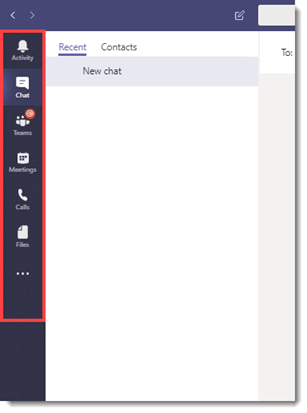
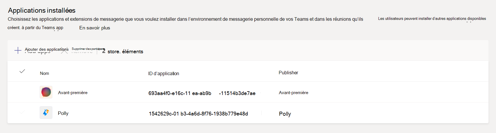
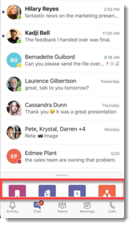

# Gérer les stratégies de mise en application dans Microsoft Teams

En tant qu’administrateur, vous utilisez des stratégies d’installation d’application pour installer et épingler des applications et permettre aux utilisateurs de charger des applications personnalisées. L’épinglage permet de promouvoir l’adoption d’applications pertinentes dans votre organisation.

* **Épingler des applications :** Les stratégies d’installation d’application vous permettent de choisir les applications à épingler, de définir l’ordre dans lequel les applications s’affichent pour vos utilisateurs dans la barre d’applications Teams ou dans la zone de composition du message. Les administrateurs peuvent également contrôler si les utilisateurs finaux peuvent épingler leurs propres applications ou non. Voir [Épingler des applications](#pin-apps).
* **Installer des applications :** Les stratégies d’installation des applications vous permettent d’installer des applications pour le compte des utilisateurs lorsqu’ils démarrent Teams et pendant les réunions. Pour plus d’informations, consultez [Installer des applications](#install-apps).
* **Télécharger applications personnalisées : les stratégies** d’installation des applications vous permettent d’autoriser les utilisateurs à charger des applications personnalisées dans Teams. Pour plus d’informations, consultez [Télécharger applications personnalisées](#upload-custom-apps).

## Épingler des applications

L’épinglage d’applications vous permet de mettre en évidence les applications dont les utilisateurs de votre organisation ont le plus besoin. L’épinglage fonctionne pour les applications fournies par Microsoft, par les éditeurs de logiciels indépendants et par les développeurs au sein de votre organisation. L’épinglage d’une application via une stratégie d’installation d’application l’installe également. À l’aide d’une stratégie d’installation d’application, vous pouvez effectuer les tâches suivantes :

* Personnaliser Teams afin de mettre en évidence les applications les plus importantes pour vos utilisateurs. Vous choisissez les applications à épingler et définissez l’ordre dans lequel elles apparaissent.
* Déterminez si les utilisateurs peuvent épingler des applications ou non.

Les applications sont épinglées à la barre de l’application sur le côté gauche du client de bureau Teams et en bas du Teams clients mobiles.

|Client de bureau Teams  |Client mobile Teams |
|---------|---------|
|.  |         |

Les extensions de messagerie sont disponibles en bas de la zone de composition du message.

Pour créer une stratégie d’installation d’application pour épingler des applications, procédez comme suit :

1. Connectez-vous au centre d’administration [Microsoft Teams](https://admin.teams.microsoft.com).

1. Dans le volet gauche, accédez à **Teams stratégies****d’installation** des applications > .

1. Sélectionnez **Ajouter**.

1. Entrez un nom pour votre stratégie, ainsi qu’une description.

1. Activez **l’épinglage utilisateur**.

   > [!NOTE]
   > Le paramètre **d’épinglage utilisateur** est disponible dans le centre d’administration Teams dans les environnements Microsoft 365 Cloud de la communauté du secteur public (Cloud de la communauté du secteur public) ( Cloud de la communauté du secteur public, Cloud de la communauté du secteur public High et DoD), mais il n’a actuellement aucun effet.

1. Sous **Applications épinglées**, sélectionnez **Ajouter des applications**.

1. Dans le volet **Ajouter des applications épinglées** , recherchez les applications que vous souhaitez ajouter, puis sélectionnez **Ajouter**. Vous pouvez également filtrer les applications par stratégie d’autorisation d’application.

1. Sélectionnez **Ajouter**.

1. Sous la **barre de l’application** ou **les extensions de messagerie**, organisez les applications dans l’ordre dans lequel vous souhaitez qu’elles apparaissent dans Teams.

   :::image type="content" source="media/pin-messaging-extensions.png" alt-text="section Applications épinglées"border="true":::

1. Sélectionnez **Enregistrer**.

> [!NOTE]
> Dans Teams pour l'éducation, l’application Affectations est épinglée par défaut dans la stratégie globale, même si vous ne la voyez pas répertoriée dans la stratégie globale.

> [!NOTE]
> Pour les employés de première ligne de votre organisation, nous vous recommandons d’utiliser l’expérience d’application de première ligne personnalisée. Cette fonctionnalité épingle les applications les plus pertinentes dans Teams pour les utilisateurs disposant d’une [licence F](https://www.microsoft.com/en-us/microsoft-365/enterprise/frontline?rtc=1#office-SKUChooser-0dbn8nt). Pour en savoir plus, consultez [Tailor Teams apps pour vos employés de première ligne](pin-teams-apps-based-on-license.md).

## Installer des applications

À l’aide d’une stratégie d’installation d’application, un administrateur peut effectuer les tâches suivantes :

* Installez des applications pour les utilisateurs finaux dans leur environnement de Teams personnel, par défaut.
* Installez des applications pour les utilisateurs finaux en tant [qu’extensions de messagerie](/microsoftteams/platform/messaging-extensions/what-are-messaging-extensions).
* Installez des applications dans les réunions pour les organisateurs de réunions.

Les utilisateurs finaux peuvent installer des applications par leurs propres moyens si la [stratégie d’autorisation d’application](teams-app-permission-policies.md) l’autorise.

Pour créer une stratégie d’installation d’application pour installer des applications, procédez comme suit :

1. Connectez-vous au centre d’administration Teams et accédez **aux stratégies d’installation des applications** >  Teams **.**

2. Sélectionnez **Ajouter**.

3. Fournissez un nom et une description pour la stratégie.

4. Sous **Applications installées**, sélectionnez **Ajouter des applications**.

5. Dans le volet **Ajouter des applications installées** , recherchez les applications que vous souhaitez installer pour les utilisateurs. Vous pouvez également filtrer les applications par stratégie d’autorisation d’application.

6. Sélectionnez **Ajouter**.

> [!IMPORTANT]
> Les utilisateurs ne peuvent pas désinstaller les applications installées par les administrateurs.

## Télécharger applications personnalisées

Pour créer une stratégie personnalisée pour permettre aux utilisateurs de charger des applications personnalisées, procédez comme suit :

1. Connectez-vous au centre d’administration Teams et accédez **aux stratégies d’installation des applications** >  Teams **.**

2. Sélectionnez **Ajouter**.

3. Fournissez un nom et une description pour la stratégie.

4. Activez ou désactivez **Télécharger applications personnalisées**.

> [!NOTE]
> Pour modifier ce paramètre, les [paramètres d’application à l’échelle de l’organisation](manage-apps.md#manage-org-wide-app-settings) de votre locataire doivent autoriser les **applications tierces**.

## Gérer les stratégies d’installation d’application

Vous gérez les stratégies d’installation d’application dans le centre d’administration Microsoft Teams. Utilisez la stratégie globale (par défaut à l’échelle de l’organisation) ou créez et affectez des stratégies personnalisées. Les utilisateurs finaux obtiennent la stratégie globale. Si vous créez une stratégie personnalisée, elle remplace la stratégie globale. L’administrateur général ou l’administrateur de service Teams peut gérer ces stratégies.

Vous modifiez les paramètres de la stratégie globale pour inclure les applications souhaitées. Pour personnaliser Teams pour différents groupes d’utilisateurs de votre organisation, créez et attribuez une ou plusieurs stratégies personnalisées.

### Modifier une stratégie d’installation d’application

Vous pouvez utiliser le centre d’administration Microsoft Teams pour modifier une stratégie, notamment la stratégie globale (par défaut à l’échelle de l’organisation) et les stratégies personnalisées que vous créez.

1. Dans le volet de navigation gauche du Centre d’administration Microsoft Teams, accédez à **Applications Teams** > **Stratégies de configuration**.

2. Choisissez la stratégie à modifier, puis **sélectionnez Modifier**.

3. Apportez les modifications souhaitées.

4. Sélectionnez **Enregistrer**.

### Affecter une stratégie d’installation d’application personnalisée aux utilisateurs et aux groupes

Pour plus d’informations sur l’affectation de stratégies à vos utilisateurs et groupes, consultez [Affecter des stratégies aux utilisateurs et aux groupes](assign-policies-users-and-groups.md).

## Faq

<!--- TBD: Incorporate these pointers in the content itself.
--->

### Utilisation des stratégies d’installation d’application

#### Quelles stratégies d’installation d’application intégrées sont incluses dans le centre d’administration Microsoft Teams

* **Global (par défaut à l’échelle** de l’organisation) : cette stratégie par défaut s’applique à tous les utilisateurs de votre organisation, sauf si vous affectez une autre stratégie. Modifiez la stratégie globale pour épingler les applications les plus importantes pour vos utilisateurs.

* **FrontlineWorker** : cette stratégie s’adresse aux travailleurs de première ligne. Vous pouvez l’affecter aux employés de première ligne de votre organisation. Il est important de savoir que, comme les stratégies personnalisées que vous créez, vous devez affecter la stratégie aux utilisateurs pour que les paramètres soient actifs. Pour plus d’informations, accédez à la section [Affecter une stratégie d’installation d’application personnalisée aux utilisateurs](#assign-a-custom-app-setup-policy-to-users-and-groups) de cet article.

#### Pourquoi ne puis-je pas trouver une application dans le volet Ajouter des applications épinglées ?

Toutes les applications ne peuvent pas être épinglées à Teams par le biais d’une stratégie d’installation d’application. Certaines applications ne prennent peut-être pas en charge cette fonctionnalité. Pour rechercher les applications qui peuvent être épinglées, recherchez l’application dans le volet **Ajouter des applications épinglées** . Les onglets qui ont une étendue personnelle (onglets statiques) et les bots peuvent être épinglés au client de bureau Teams et ces applications sont disponibles dans le volet **Ajouter des applications épinglées**.

N’oubliez pas que le magasin d’applications Teams répertorie toutes les applications Teams. Le volet **Ajouter des applications épinglées** inclut uniquement les applications qui peuvent être épinglées à Teams par le biais d’une stratégie.

#### Je suis administrateur Teams pour l'éducation. Que dois-je savoir sur les stratégies d’installation d’application dans Teams pour l'éducation

L’application Calling n’est pas disponible dans Teams pour l'éducation. Lorsque vous créez une stratégie d’installation d’application personnalisée, l’application appelante s’affiche dans la liste des applications. Toutefois, l’application n’est pas épinglée aux clients Teams et Teams pour l'éducation les utilisateurs ne voient pas l’application Appels dans Teams.

#### Combien d’applications épinglées peuvent être ajoutées à une stratégie

Au moins deux applications doivent être épinglées aux clients mobiles Teams (iOS et Android). Si une stratégie a moins de deux applications, les clients mobiles ne reflètent pas les paramètres de stratégie et continueront à utiliser la configuration existante.

Il n’existe aucune limite quant au nombre d’applications épinglées que vous pouvez ajouter à une stratégie.

#### Combien de temps faut-il pour que les modifications de stratégie prennent effet ?

Après avoir modifié ou attribué une stratégie, l’application des modifications peut prendre quelques heures.

### Expérience utilisateur

#### Comment les utilisateurs peuvent-ils voir toutes leurs applications épinglées dans Teams

Pour afficher toutes les applications épinglées pour un utilisateur, les utilisateurs peuvent être tenus d’effectuer les opérations suivantes en fonction du nombre d’applications installées et de la taille de leur fenêtre cliente Teams.

|Client de bureau Teams |Client mobile Teams |
|---------|---------|
|Dans la barre de l’application sur le côté de Teams, sélectionnez **... Autres applications**.| Dans la barre de l’application située en bas de Teams, balayez vers le haut.|
|   |  

#### Que dois-je savoir sur l’expérience mobile Teams

Les clients mobiles Teams (iOS et Android) prennent en charge les applications personnelles avec des onglets statiques. Les applications épinglées au client de bureau Teams s’affichent dans les clients mobiles Teams. Les bots personnels s’affichent dans Chat sur les clients mobiles.

Les applications tierces (qui peuvent être téléchargées à partir de Teams Store) doivent être approuvées avant de s’afficher sur un appareil mobile. Si un administrateur épingle une application, qui n’est pas approuvée par Microsoft pour Mobile, elle s’affiche sur le bureau Teams, mais ne s’affiche pas sur un appareil mobile. Pour plus d’informations, consultez [les clients Mobiles](/microsoftteams/platform/tabs/what-are-tabs#mobile-clients) .

Avec les clients mobiles Teams, les utilisateurs voient des applications Teams de base telles que l’activité, la conversation et Teams, et vous pouvez épingler des applications internes de Microsoft, telles que Shifts.

#### Les utilisateurs peuvent-ils modifier l’ordre des applications épinglées via une stratégie ?

Les utilisateurs peuvent modifier l’ordre de leurs applications épinglées sur Teams clients de bureau et mobiles si l’option **d’épinglage de l’utilisateur** est activée. Les utilisateurs ne peuvent pas modifier l’ordre de leurs applications épinglées sur Teams clients web.

#### L’épinglage de l’utilisateur est-il prioritaire ?

Administration épingles sont toujours prioritaires. Si **l’option d’épinglage utilisateur** est activée, les utilisateurs conservent leurs applications épinglées sous les applications épinglées par l’administrateur. Si **l’option d’épinglage utilisateur** est désactivée, les utilisateurs perdent leurs broches préexistantes et seules les applications épinglées par l’administrateur sont présentes dans la barre des applications.

### Applications Teams personnalisées

#### Mon organisation a créé une application Teams personnalisée et l’a publiée, dans AppSource ou le catalogue d’applications client, mais l’icône d’application n’est pas affichée comme prévu lorsque l’application est épinglée à la barre de l’application dans Teams. Comment faire le corriger ?

Veillez à respecter les instructions relatives au logo avant de soumettre l’application. Pour plus d’informations, consultez [Liste de vérification pour la soumission du tableau de bord vendeur](/microsoftteams/platform/concepts/deploy-and-publish/appsource/prepare/overview).

## Voir aussi

* [Paramètres d’administration pour les applications dans Microsoft Teams](admin-settings.md)
* [Affecter des stratégies aux utilisateurs finaux dans Teams](assign-policies-users-and-groups.md)
