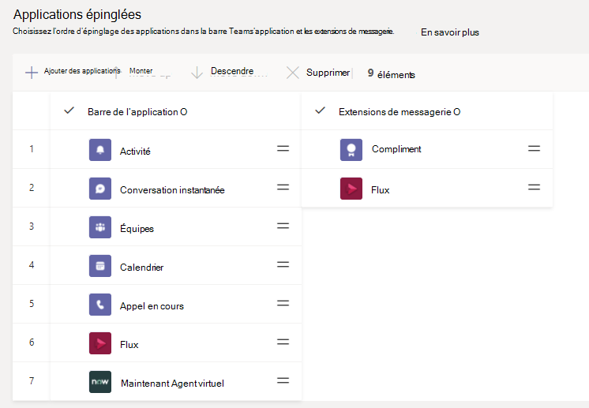

# Gérer les stratégies de mise en application dans Microsoft Teams

En tant qu’administrateur, vous pouvez utiliser des stratégies de configuration d’application pour installer et épingler des applications afin de promouvoir les applications les plus utilisées dans votre organisation et de décider si vous souhaitez que les utilisateurs téléchargent des applications personnalisées sur Teams.

- **Épingler des applications :** Les stratégies de configuration d’application vous permettent de choisir des applications à épingler, de définir l’ordre dans qui elles s’affichent pour vos utilisateurs dans la barre de l’application Teams ou dans la zone de composition des messages, et contrôler si les utilisateurs peuvent ou non épingler leurs propres applications. Pour plus d’informations, voir [Épingler des applications](#pin-apps).
- **Installer des applications :** Les stratégies de configuration d’application vous permettent d’installer des applications au nom des utilisateurs lorsqu’ils Teams et pendant les réunions. Pour plus d’informations, voir [Installer des applications](#install-apps).
- **Télécharger applications personnalisées : les** stratégies de configuration d’application vous permettent d’autoriser les utilisateurs à télécharger des applications personnalisées sur Teams. Pour plus d’informations, [voir Télécharger applications personnalisées](#upload-custom-apps).

## Épingler des applications

L’épinglage d’applications vous permet de présenter les applications dont les utilisateurs de votre organisation ont besoin, y compris les applications conçues par des tiers ou par des développeurs de votre organisation.

À l’aide d’une stratégie de configuration d’application, vous pouvez effectuer les tâches suivantes :

- Personnaliser Teams afin de mettre en évidence les applications les plus importantes pour vos utilisateurs. Vous choisissez les applications à épingler et définissez l’ordre dans celui-là.
- Déterminer si les utilisateurs peuvent épingler des applications à Teams.

Les applications sont épinglées à :

- La barre de l’application, qui est la barre sur le côté gauche du client de bureau Teams et dans la partie inférieure des clients mobiles Teams (iOS et Android).

- Zone des extensions de messagerie au bas de la zone de composition des messages.

|Client de bureau Teams  |Client mobile Teams |
|---------|---------|
|<  |         |

> [!NOTE]
> Si vous avez Teams pour l'éducation, il est important de savoir que l’application Devoirs est épinglée par défaut dans la stratégie globale, même si actuellement elle n’est pas répertoriée dans la stratégie globale. Il s’agit de la quatrième application dans la liste des applications épinglées Teams clients.

Pour créer une stratégie de configuration d’application afin d’épingler des applications, vous pouvez suivre les étapes suivantes :

1. Dans le navigation gauche du Teams [d’administration](https://www.admin.teams.microsoft.com), voir Teams **d’applicationsSetup** > .

2. Sélectionnez **Ajouter**.

3. Entrez un nom pour votre stratégie, ainsi qu’une description.

4. Activer **l’épinglage utilisateur**.

   > [!NOTE]
   > Le **paramètre d’épinglage** utilisateur est disponible dans le Centre Teams’administration dans Microsoft 365 Cloud de la communauté du secteur public (Cloud de la communauté du secteur public) environnements ( Cloud de la communauté du secteur public, Cloud de la communauté du secteur public Haut et DoD), mais actuellement, il n’a aucun effet.

5. Sous **Applications épinglées**, **sélectionnez Ajouter des applications**.

6. Dans le **volet Ajouter des applications épinglées** , recherchez les applications que vous voulez ajouter, puis sélectionnez **Ajouter**. Vous pouvez également filtrer les applications par stratégie d’autorisation d’application.

7. Sélectionnez **Ajouter**.

8. Sous la **barre de l’application** **ou les extensions** de messagerie, organisez les applications dans l’ordre dans l’ordre dans Teams.

   

9. Sélectionnez **Enregistrer**.

## Installer des applications

Vous pouvez choisir les applications installées par défaut pour les utilisateurs dans leur environnement Teams personnel, installer des applications en tant [qu’extensions](/microsoftteams/platform/messaging-extensions/what-are-messaging-extensions) de messagerie et désigner les applications à installer dans les réunions.

À l’aide d’une stratégie de configuration d’application, vous pouvez effectuer les tâches suivantes :

- Installer des applications pour les utilisateurs dans leur environnement Teams personnel
- Installer des applications pour les utilisateurs sous forme d’extensions de messagerie
- Installer des applications dans des réunions pour les organisateurs de réunion

> [!NOTE]
> Les utilisateurs peuvent toujours installer les applications elles-mêmes [si la](teams-app-permission-policies.md) stratégie d’autorisation d’application qui leur est attribuée le permet.

Pour créer une stratégie de configuration d’application pour installer des applications, vous pouvez suivre les étapes suivantes :

1. Dans le navigation gauche du Microsoft Teams d’administration, voir Teams **d’applicationsSetup** > .

2. Sélectionnez **Ajouter**.

3. Entrez un nom pour votre stratégie, ainsi qu’une description.

4. Sous **Applications installées**, **sélectionnez Ajouter des applications**.

5. Dans le **volet Ajouter des applications installées** , recherchez les applications que vous voulez installer automatiquement pour les utilisateurs. Vous pouvez également filtrer les applications par stratégie d’autorisation d’application.

6. Sélectionnez **Ajouter**.

> [!IMPORTANT]
> Les utilisateurs ne peuvent pas désinstaller les applications installées par les administrateurs.

## Télécharger applications personnalisées

Vous pouvez utiliser le Centre Microsoft Teams d’administration pour créer une stratégie personnalisée qui permet aux utilisateurs de télécharger des applications personnalisées sur Teams.

Pour créer une stratégie de configuration d’application afin de permettre aux utilisateurs de télécharger des applications personnalisées sur Teams applications, vous pouvez suivre les étapes suivantes :

1. Dans le navigation gauche du Microsoft Teams d’administration, voir Teams **d’applicationsSetup** > .

2. Sélectionnez **Ajouter**.

3. Entrez un nom pour votre stratégie, ainsi qu’une description.

4. Activer ou désactiver Télécharger **applications personnalisées**, selon que vous souhaitez ou non que les utilisateurs téléchargent des applications personnalisées Teams.

> [!NOTE]
> Vous ne pouvez pas modifier ce paramètre si **les** applications tierces sont désactivées dans les paramètres d’application [à l’échelle de l’organisation](manage-apps.md#manage-org-wide-app-settings).

## Gérer les stratégies de configuration des applications

Vous gérez les stratégies de configuration d’application dans Microsoft Teams centre d’administration. Utilisez la stratégie globale (à l’échelle de l’organisation par défaut) ou créez et attribuez des stratégies personnalisées.  Les utilisateurs de votre organisation recevront automatiquement la stratégie globale, sauf si vous créez et leur attribuez une stratégie personnalisée. Vous devez être un administrateur général ou un administrateur du service Teams pour gérer ces stratégies.

Vous devez modifier les paramètres de la stratégie globale pour inclure les applications que vous souhaitez. Pour personnaliser Teams différents groupes d’utilisateurs de votre organisation, créez et attribuez une ou plusieurs stratégies personnalisées.

### Modifier une stratégie de configuration d’application

Vous pouvez utiliser le Centre Microsoft Teams d’administration pour modifier une stratégie, y compris la stratégie globale (à l’échelle de l’organisation par défaut) et les stratégies personnalisées que vous créez.

1. Dans le navigation gauche du Microsoft Teams d’administration, voir Teams **d’applicationsSetup** > .

2. Choisissez la stratégie à modifier, puis sélectionnez **Modifier**.

3. A apporter les modifications de votre souhaitez.

4. Sélectionnez **Enregistrer**.

### Affecter une stratégie de configuration d’application personnalisée aux utilisateurs et groupes

Pour plus d’informations sur l’attribution de stratégies à vos utilisateurs et groupes, voir Affecter des stratégies [à des utilisateurs et groupes](assign-policies-users-and-groups.md).

## FAQ

### Fonctionnement des stratégies de configuration d’application

#### Quelles stratégies de configuration d’application intégrées sont incluses dans le Centre Microsoft Teams’administration de l’entreprise

- **Global (par défaut à l’échelle** de l’organisation) : cette stratégie par défaut s’applique à tous les utilisateurs de votre organisation, sauf si vous attribuez une autre stratégie. Modifiez la stratégie globale pour épingler les applications les plus importantes pour vos utilisateurs.

- **FrontlineWorker :** cette stratégie s’agit pour les employés en avant-première. Vous pouvez l’affecter à des employés en ligne de votre organisation. Il est important de savoir que, comme pour les stratégies personnalisées que vous créez, vous devez affecter la stratégie aux utilisateurs pour que les paramètres soient actifs. Pour plus d’informations, voir la section Affecter une stratégie de configuration d’application personnalisée aux [utilisateurs](#assign-a-custom-app-setup-policy-to-users-and-groups) de cet article.

#### Pourquoi ne puis-je pas trouver une application dans le volet Ajouter des applications épinglées ?

Toutes les applications ne peuvent pas être épinglées Teams via une stratégie de configuration d’application. Certaines applications peuvent ne pas prendre en charge cette fonctionnalité. Pour rechercher des applications qui peuvent être épinglées, recherchez l’application dans le volet Ajouter des applications **épinglées** . Les onglets qui ont une étendue personnelle (onglets statiques) et bots peuvent être épinglés au client de bureau Teams. Ces applications sont disponibles  dans le volet Ajouter des applications épinglées.

N’oubliez pas que le Teams app store répertorie toutes Teams applications. Le **volet Ajouter des applications épinglées** inclut uniquement les applications qui peuvent être épinglées à Teams via une stratégie.

#### Je suis un Teams pour l'éducation administrateur. Que dois-je savoir sur les stratégies de configuration d’application dans Teams pour l'éducation

L’application Appels n’est pas disponible dans Teams pour l'éducation. Lorsque vous créez une stratégie de configuration d’application personnalisée, l’application Appels s’affiche dans la liste des applications. Toutefois, l’application n’est pas épinglée à Teams clients et Teams pour l'éducation utilisateurs ne peuvent pas voir l’application Appels dans Teams.

#### Combien d’applications épinglées peuvent être ajoutées à une stratégie

Au moins deux applications doivent être épinglées aux clients Teams mobiles (iOS et Android). Si une stratégie possède moins de deux applications, les clients mobiles ne reflètent pas les paramètres de stratégie et continueront à utiliser la configuration existante.

Le nombre d’applications épinglées que vous pouvez ajouter à une stratégie n’est pas limité.

#### Combien de temps faut-il pour que les modifications de stratégie prennent effet

Après avoir modifié ou attribué une stratégie, l’application des modifications peut prendre quelques heures.

### Expérience utilisateur

#### Comment les utilisateurs peuvent-ils voir toutes leurs applications épinglées dans Teams

Pour afficher toutes les applications épinglées pour un utilisateur, les utilisateurs doivent peut-être faire les choses suivantes en fonction du nombre d’applications installées et de la taille de leur fenêtre cliente Teams client.

|Client de bureau Teams |Client mobile Teams |
|---------|---------|
|Dans la barre de l’application sur le côté Teams, sélectionnez **... Autres applications**.| Dans la barre de l’application en bas de Teams, balayez vers le haut.|
|   |  

#### Que dois-je savoir sur l’expérience Teams mobile ?

Les Teams clients mobiles (iOS et Android) peuvent utiliser des applications personnelles avec des onglets statiques. Les applications épinglées au client Teams bureau s’affichent dans le Teams clients mobiles. Les robots personnels apparaissent dans Conversation sur les clients mobiles.

Les applications tierces (qui peuvent être téléchargées à partir du Teams Store) doivent être approuvées avant de s’afficher sur les appareils mobiles. Si un administrateur épingle une application, nonapprobée par Microsoft pour mobile, elle s’affichera sur le bureau Teams, mais pas sur les appareils mobiles. Pour plus [d’informations, voir clients](/microsoftteams/platform/tabs/what-are-tabs#mobile-clients) mobiles.

Avec les clients mobiles Teams, les utilisateurs peuvent voir les principales applications de Teams telles que Activité, Conversation et Teams, et vous pouvez épingler certaines applications tierces de Microsoft, telles que Shifts.

#### Les utilisateurs peuvent-ils modifier l’ordre des applications épinglées via une stratégie ?

Les utilisateurs peuvent modifier l’ordre de leurs applications épinglées sur Teams clients de bureau et  mobiles si l’option Épinglage utilisateur est désactivée. Les utilisateurs ne peuvent pas modifier l’ordre de leurs applications épinglées sur Teams clients web.

#### L’épinglage des utilisateurs a-t-il la priorité ?

Les épingles administrateur sont toujours prioritaire. Si **l’option Épinglage d’utilisateur** est désactivée, les utilisateurs conservent leurs applications épinglées sous les applications épinglées par l’administrateur. Si **l’option Épinglage** utilisateur est désactivée, les utilisateurs perdent leurs épingles existantes et seules les applications épinglées par l’administrateur sont présentes dans la barre d’application.

### Applications Teams personnalisées

#### Mon organisation a créé une application Teams personnalisée et l’a publiée, soit dans AppSource, soit dans le catalogue des applications client, mais l’icône d’application ne s’affiche pas comme prévu lorsque l’application est épinglée à la barre d’application dans Teams. Comment résoudre le problème ?

Veillez à respecter les instructions relatives au logo avant de soumettre l’application. Pour en savoir plus, consultez [la liste de contrôle de l’envoi du tableau de bord du vendeur](/microsoftteams/platform/concepts/deploy-and-publish/appsource/prepare/overview).

## Articles connexes

[Paramètres d’administration pour les applications dans Microsoft Teams](admin-settings.md)

[Attribuer des stratégies à vos utilisateurs](assign-policies-users-and-groups.md)
