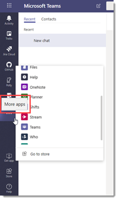

# <a name="manage-app-setup-policies-in-microsoft-teams"></a>Gérer les stratégies de mise en application dans Microsoft Teams

> [!NOTE]
> Si vous avez activé le paramètre de l’application à l’échelle de l’organisation, **autorisez les interactions avec les applications personnalisées**, il est possible que les stratégies de configuration des applications n’apparaissent pas dans le centre d’administration Microsoft Teams. Ce service est actuellement déployé et sera disponible prochainement dans votre organisation.

En tant qu’administrateur, vous pouvez utiliser les stratégies de configuration d’application pour effectuer les opérations suivantes :

- Personnaliser Teams afin de mettre en évidence les applications les plus importantes pour vos utilisateurs. Vous choisissez les applications à épingler et définir leur ordre d’apparition. L’épinglage d’applications vous permet de présenter les applications dont les utilisateurs de votre organisation ont besoin, y compris celles créées par des tiers ou par des développeurs de votre organisation.
- Déterminer si les utilisateurs peuvent épingler des applications à Teams.
- Installer des applications de la part des utilisateurs **(en**préversion). Vous choisissez les applications qui sont installées par défaut pour les utilisateurs lorsqu’elles démarrent Teams. Gardez à l’esprit que les utilisateurs peuvent tout de même installer les applications eux-mêmes, si la [stratégie d’autorisation d’application](teams-app-permission-policies.md) qui leur est attribuée le permet.

Les applications sont épinglées à la barre de l’application. Il s’agit de la barre située sur le côté du client de bureau Teams et au bas des clients mobiles Teams (iOS et Android).

|Client de bureau teams  |Client mobile teams |
|---------|---------|
|<br>  |         |

Pour voir les applications préinstallées, dans la barre de l’application, cliquez sur **... D’autres applications** sont installées sur les clients de bureau et Web teams et balayez vers le haut dans les clients mobiles.

Vous gérez les stratégies de configuration des applications dans le centre d’administration Microsoft Teams. Vous pouvez utiliser la stratégie globale (par défaut à l’échelle de l’organisation) ou créer des stratégies personnalisées et les attribuer à des utilisateurs. Les utilisateurs de votre organisation recevront automatiquement la stratégie globale, sauf si vous créez et leur attribuez une stratégie personnalisée. Vous devez être un administrateur général ou un administrateur du service Teams pour gérer ces stratégies.

Vous pouvez modifier les paramètres de la stratégie globale de manière à inclure les applications souhaitées. Si vous voulez personnaliser teams pour différents groupes d’utilisateurs de votre organisation, créez et attribuez une ou plusieurs stratégies personnalisées. Si un utilisateur dispose d’une stratégie personnalisée, cette politique s’applique à l’utilisateur. Si un utilisateur ne reçoit pas de stratégie personnalisée, la politique globale s’applique à l’utilisateur.


> [!NOTE]
> Si vous disposez d’équipes pour l’éducation, il est important de savoir que l’application devoirs est épinglée par défaut dans la stratégie globale, même si elle n’est pas répertoriée dans la stratégie globale. Il s’agira de la quatrième application de la liste des applications épinglées sur les clients Teams.

## <a name="create-a-custom-app-setup-policy"></a>Créer une stratégie de configuration d’application personnalisée

Vous pouvez utiliser le centre d’administration de Microsoft teams pour créer une stratégie personnalisée.

1. Dans le volet de navigation de gauche du centre d’administration de Microsoft Teams, accédez à stratégies de configuration des **applications teams**  >  **Setup policies**.
2. Cliquez sur **Ajouter**.
    
3. Entrez un nom pour votre stratégie, ainsi qu’une description.
4. Activez ou désactivez l’option **Télécharger des applications personnalisées**, selon que vous voulez permettre aux utilisateurs de télécharger des applications personnalisées dans Teams. Vous ne serez pas en mesure de modifier ce paramètre si l’option **autoriser les applications tierces** est désactivée dans [les paramètres de l’application à l’échelle](manage-apps.md#manage-org-wide-app-settings)de l’organisation.
5. Activez ou désactivez l’option **autoriser l’épinglement d’utilisateurs**, selon que vous voulez permettre aux utilisateurs de personnaliser leur barre d’application en épinglant des applications à celui-ci.
6. Pour installer des applications pour les utilisateurs **(en Preview)**, procédez comme suit :

    1. Sous **applications installées**, cliquez sur **Ajouter des applications**.
    2. Dans le volet **Ajouter des applications installées** , recherchez les applications que vous souhaitez installer automatiquement pour les utilisateurs lors du démarrage de teams. Vous pouvez également filtrer les applications par stratégie d’autorisation d’applications. Lorsque vous avez choisi votre liste d’applications, cliquez sur **Ajouter**.

        

7. Pour épingler des applications, procédez comme suit :

    1. Sous **applications épinglées**, cliquez sur **Ajouter des applications**.
    2. Dans le volet **Ajouter des applications épinglées** , recherchez les applications que vous voulez ajouter, puis cliquez sur **Ajouter**. Vous pouvez également filtrer les applications par stratégie d’autorisation d’applications. Lorsque vous avez choisi d’épingler votre liste d’applications, cliquez sur **Ajouter**.

         

    3. Organisez les applications dans l’ordre dans lequel vous voulez qu’elles apparaissent dans Teams, puis cliquez sur **Enregistrer**.

        

## <a name="edit-an-app-setup-policy"></a>Modifier une stratégie de configuration de l’application

Vous pouvez utiliser le centre d’administration de Microsoft teams pour modifier une stratégie, dont la stratégie globale par défaut de l’organisation et les stratégies personnalisées que vous créez.

1. Dans le volet de navigation de gauche du centre d’administration de Microsoft Teams, accédez à stratégies de configuration des **applications teams**  >  **Setup policies**.
2. Sélectionnez la stratégie en cliquant à gauche du nom de la stratégie, puis cliquez sur **modifier**.
3. À partir de cet emplacement, apportez les modifications souhaitées.
4. Cliquez sur **Enregistrer**.

## <a name="assign-a-custom-app-setup-policy-to-users"></a>Assigner une stratégie de configuration d’application personnalisée aux utilisateurs

Vous pouvez utiliser le centre d’administration de Microsoft teams pour attribuer une stratégie personnalisée aux utilisateurs individuels ou au module PowerShell Skype entreprise et attribuer une stratégie personnalisée aux utilisateurs d’un groupe, tels qu’un groupe de sécurité ou un groupe de distribution.

### <a name="assign-a-custom-app-setup-policy-to-users"></a>Assigner une stratégie de configuration d’application personnalisée aux utilisateurs

Pour attribuer une stratégie à un utilisateur :

1. Dans le volet de navigation gauche du centre d’administration Microsoft Teams, et accédez aux **Utilisateurs**, puis cliquez sur l’utilisateur.
2. Sélectionnez l’utilisateur en cliquant à gauche du nom de celui-ci, puis cliquez sur **Modifier les paramètres**.
3. Sous **stratégie de configuration des applications**, sélectionnez la stratégie de configuration de l’application que vous voulez attribuer, puis cliquez sur **appliquer**.

Pour affecter une stratégie à plusieurs utilisateurs à la fois :

1. Dans le volet de navigation gauche du Centre d’administration Microsoft Teams, accédez à **Utilisateurs**, puis recherchez les utilisateurs ou filtrez l’affichage pour afficher les utilisateurs souhaités.
2. Dans la colonne **&#x2713;** (coche), sélectionnez les utilisateurs. Pour sélectionner tous les utilisateurs, cliquez sur &#x2713; (coche) en haut du tableau.
3. Cliquez sur **Modifier les paramètres**, apportez les modifications souhaitées, puis cliquez sur **Appliquer**.  

Vous pouvez également effectuer les opérations suivantes :

1. Dans le volet de navigation de gauche du centre d’administration de Microsoft Teams, accédez à stratégies de configuration des **applications teams**  >  **Setup policies**.
2. Sélectionnez la stratégie en cliquant à gauche du nom de celle-ci.
3. Sélectionnez **Gérer les utilisateurs**.
4. Dans le volet **Gérer les utilisateurs**, recherchez l’utilisateur par son nom complet ou son nom d’utilisateur, sélectionnez le nom, puis sélectionnez **Ajouter**. Répétez cette étape pour chaque utilisateur que vous souhaitez ajouter.
5. Lorsque vous avez terminé d’ajouter des utilisateurs, cliquez sur **Enregistrer**.

### <a name="assign-a-custom-app-setup-policy-to-users-in-a-group"></a>Assigner une stratégie de configuration d’application personnalisée aux utilisateurs d’un groupe

Il est possible que vous souhaitiez affecter une stratégie de configuration d’application personnalisée à plusieurs utilisateurs déjà identifiés. Par exemple, vous souhaiterez probablement affecter une stratégie à l’ensemble des utilisateurs d’un groupe de sécurité. Pour cela, vous devez vous connecter au module Azure Active Directory PowerShell pour Graph et au module PowerShell Skype entreprise. Pour plus d’informations sur l’utilisation de PowerShell pour gérer Teams, voir [vue d’ensemble de teams PowerShell](teams-powershell-overview.md).

Dans cet exemple, nous affectons une stratégie d’installation d’application personnalisée appelée stratégie de configuration des applications humaines à tous les utilisateurs du groupe de projets RH de contoso Pharmaceuticals.  

> [!NOTE]
> Assurez-vous d’abord de vous connecter au module Azure Active Directory PowerShell pour Graph et au module PowerShell Skype entreprise en suivant les étapes décrites dans l’article [se connecter à tous les services Microsoft 365 ou Office 365 dans une seule fenêtre Windows PowerShell](https://docs.microsoft.com/office365/enterprise/powershell/connect-to-all-office-365-services-in-a-single-windows-powershell-window).

Obtenez la GroupObjectId du groupe en particulier.
```PowerShell
$group = Get-AzureADGroup -SearchString "Contoso Pharmaceuticals HR Project"
```
Obtenez les membres du groupe spécifié.
```PowerShell
$members = Get-AzureADGroupMember -ObjectId $group.ObjectId -All $true | Where-Object {$_.ObjectType -eq "User"}
```
Attribuez à tous les utilisateurs du groupe une stratégie de configuration d’application particulière. Dans cet exemple, il s’agit de la stratégie de configuration des applications humaines.
```PowerShell
$members | ForEach-Object { Grant-CsTeamsAppSetupPolicy -PolicyName "HR App Setup Policy" -Identity $_.UserPrincipalName}
``` 
En fonction du nombre de membres du groupe, cette commande risque de prendre quelques minutes.

## <a name="faq"></a>FAQ

### <a name="working-with-app-setup-policies"></a>Utilisation des stratégies de configuration des applications

#### <a name="what-built-in-app-setup-policies-are-included-in-the-microsoft-teams-admin-center"></a>Quelles stratégies de configuration des applications intégrées sont incluses dans le centre d’administration de Microsoft teams ?

- **Global (par défaut de l’organisation)**: cette stratégie par défaut s’applique à tous les utilisateurs de votre organisation sauf si vous affectez une autre stratégie. Modifiez la stratégie globale pour épingler les applications les plus importantes à vos utilisateurs.
- **FirstLineWorker**: cette stratégie concerne les travailleurs terrain. Vous pouvez l’affecter à des travailleurs terrain au sein de votre organisation. Il est important de savoir que, comme les stratégies personnalisées que vous créez, vous devez affecter la stratégie aux utilisateurs pour que les paramètres soient actifs. Pour plus d’informations, accédez à la section [assigner une stratégie de configuration d’application personnalisée aux utilisateurs](#assign-a-custom-app-setup-policy-to-users) de cet article.

#### <a name="why-cant-i-find-an-app-in-the-add-pinned-apps-pane"></a>Pourquoi ne puis-je pas retrouver une application dans le volet ajouter des applications épinglées ?

Toutes les applications ne peuvent pas être épinglées à teams via une stratégie de configuration d’application. Certaines applications ne prennent pas en charge cette fonctionnalité. Pour rechercher des applications qui peuvent être épinglées, recherchez l’application dans le volet **Ajouter des applications épinglées** . Les onglets qui comportent des onglets statiques et des robots peuvent être épinglés au client de bureau teams et ces applications sont disponibles dans le volet **Ajouter des applications épinglées** .

Gardez à l’esprit que le Windows teams Store répertorie toutes les applications teams alors que le volet **Ajouter des applications épinglées** inclut uniquement les applications qui peuvent être épinglées aux équipes via une stratégie. 

#### <a name="im-a-teams-for-education-admin-what-do-i-need-to-know-about-app-setup-policies-in-teams-for-education"></a>Je suis un administrateur d’équipe pour l’éducation. De quoi ai-je besoin en savoir plus sur les stratégies de configuration des applications dans teams pour l’éducation ?

L’application appelante n’est pas disponible dans teams pour l’éducation. Lorsque vous créez une stratégie personnalisée de configuration de l’application, l’application d’appel s’affiche dans la liste des applications. Toutefois, l’application n’est pas épinglée aux clients teams et aux équipes destinées aux utilisateurs éducation ne verra pas l’application appels dans Teams.

#### <a name="how-many-pinned-apps-can-be-added-to-a-policy"></a>Combien d’applications épinglées peuvent être ajoutées à une stratégie ?

Au moins deux applications doivent être épinglées aux clients mobiles Teams (iOS et Android). Si une stratégie comporte moins de deux applications, les clients mobiles ne reflètent pas les paramètres de stratégie et continuent à utiliser la configuration existante.

Il n’y a aucune limite sur le nombre d’applications épinglées que vous pouvez ajouter à une stratégie.

#### <a name="how-long-does-it-take-for-policy-changes-to-take-effect"></a>Combien de temps faut-il pour que les modifications soient prises en compte ?

Après avoir modifié la stratégie globale ou affecté une stratégie, plusieurs heures peuvent être nécessaires pour que les modifications prennent effet.

### <a name="user-experience"></a>Expérience utilisateur

#### <a name="how-can-users-see-all-their-pinned-apps-in-teams"></a>Comment les utilisateurs peuvent-ils voir toutes leurs applications épinglées dans teams ?

Pour afficher toutes les applications épinglées pour un utilisateur, les utilisateurs peuvent être amenés à effectuer les opérations suivantes, en fonction du nombre d’applications installées et de la taille de la fenêtre client d’équipes.

|Client de bureau teams |Client mobile teams |
|---------|---------|
|Dans la barre d’application sur le côté d’équipes, cliquez sur **... Autres applications**.| Dans la barre de l’application en bas de teams, balayez vers le haut.|
|<br>   |  

#### <a name="what-do-i-need-to-know-about-the-teams-mobile-experience"></a>Que dois-je savoir sur l’interface mobile de teams ?

Les clients mobiles Teams (iOS et Android) ne prennent actuellement pas en charge les applications personnelles à l’aide d’onglets statiques. En fonction des applications définies dans la stratégie, les applications épinglées au client de bureau teams peuvent ne pas apparaître dans les clients mobiles Teams. Les robots personnels apparaîtront toujours dans la conversation sur les clients mobiles.

Les clients mobiles teams pourront voir les applications principales de teams, telles que les activités, les discussions et les équipes, et vous pouvez épingler certaines applications tierces de Microsoft, telles que les Shifts.

#### <a name="can-users-change-the-order-of-apps-pinned-through-a-policy"></a>Les utilisateurs peuvent-ils changer l’ordre des applications épinglées par le biais d’une stratégie ?

Les utilisateurs peuvent modifier l’ordre de leurs applications épinglées sur les ordinateurs de bureau et mobiles teams si l’option **autoriser l’épinglage** de l’utilisateur est activée. Les utilisateurs ne peuvent pas modifier l’ordre de leurs applications attachées sur les clients Web Teams.

#### <a name="does-user-pinning-take-precedence"></a>L’épinglage de l’utilisateur est-il prioritaire ?

Si la stratégie de configuration de l’application affectée à l’utilisateur est modifiée pour bloquer le verrouillage de l’application utilisateur, teams supprime toutes les applications épinglées à la barre de l’application. Si la stratégie est alors modifiée de façon à autoriser le verrouillage de l’application utilisateur, les utilisateurs doivent réépingler leurs applications épinglées précédemment.

### <a name="custom-teams-apps"></a>Applications personnalisées d’équipes

#### <a name="my-organization-built-a-custom-teams-app-and-published-it-either-to-appsource-or-the-tenant-app-catalog-but-the-app-icon-isnt-displayed-as-expected-when-the-app-is-pinned-to-the-app-bar-in-teams-how-do-i-fix-it"></a>Mon organisation a créé une application teams personnalisée et l’a publiée, soit dans AppSource, soit dans le catalogue d’applications du client, mais l’icône d’application ne s’affiche pas comme prévu lorsque l’application est épinglée à la barre de l’application dans Teams. Comment résoudre ce problème ?

Veillez à suivre les recommandations relatives au logo avant de procéder à la soumission de l’application. Pour en savoir plus, voir [liste de contrôle pour la soumission du tableau de bord du vendeur](/microsoftteams/platform/concepts/deploy-and-publish/appsource/prepare/overview). 

## <a name="related-topics"></a>Voir aussi

- [Paramètres d’administration pour les applications dans Microsoft Teams](admin-settings.md)
- [Attribuer des stratégies à vos utilisateurs dans teams](assign-policies.md)
