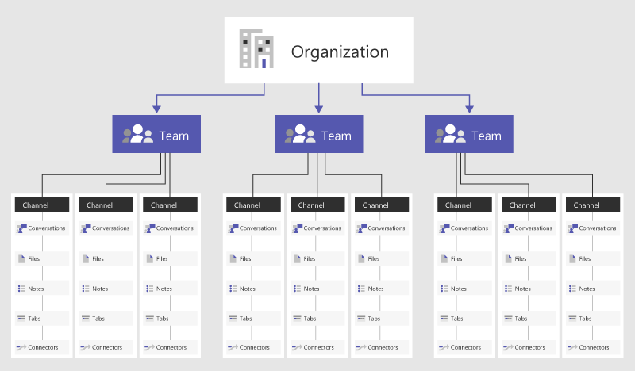

> [!NOTE]
> Passez en revue les informations suivantes pour comprendre la conversation, les équipes, les canaux, applications & dans les équipes.Review the following information to understand chat, teams, channels, & apps in Teams. Ensuite, passez à [déployer conversation, équipes, canaux, applications & dans les équipes](deploy-chat-teams-channels-microsoft-teams-landing-page.md) pour parcourir une liste de décisions importantes à votre déploiement d’équipes.Then, go to [Deploy chat, teams, channels, & apps in Teams](deploy-chat-teams-channels-microsoft-teams-landing-page.md) to walk through a list of decisions important to your Teams rollout.

Présentation des équipes et des canaux dans Microsoft TeamsOverview of teams and channels in Microsoft Teams
=================================================

Commençons par nous pencher sur la façon dont Microsoft Teams permet aux équipes individuelles de s’auto-organiser et de collaborer dans différents scénarios d’entreprise.Let’s get started by thinking about how Microsoft Teams allows individual teams to self-organize and collaborate across business scenarios:

-   **Les équipes** sont une collection de personnes, le contenu et les outils qui entoure des projets différents et les résultats d’une organisation.**Teams** are a collection of people, content, and tools surrounding different projects and outcomes within an organization.

    -   Les équipes peuvent être créées de manière privée pour des utilisateurs invités uniquement.Teams can be created to be private to only invited users.

    -   Les équipes peuvent également être créées pour être public et ouvrir et tout le monde dans l’organisation peut participer à des (jusqu'à 5 000 membres).Teams can also be created to be public and open and anyone within the organization can join (up to 5000 members).
    
    Une équipe est destinée à réunir un groupe de personnes qui travaillent en étroite collaboration pour atteindre leurs objectifs.A team is designed to bring together a group of people that work closely to get things done. Les équipes peuvent être dynamiques pour un travail de projet (lancer un produit ou créer un centre de crise numérique par exemple) et être courantes, pour refléter la structure interne de votre organisation (services et bureaux par exemple).Teams can be dynamic for project-based work (for example, launching a product, creating a digital war room), as well as ongoing, to reflect the internal structure of your organization (for example, departments and office locations). Les conversations, les fichiers et les notes ne sont visibles que pour les membres de l’équipe.Conversations, files and notes across team channels are only visible to members of the team.

-   Les **canaux** sont des sections dédiées dans une équipe pour stocker des conversations organisées par sujets, projets et disciplines spécifiques ; à votre équipe de décider !**Channels** are dedicated sections within a team to keep conversations organized by specific topics, projects, disciplines—-whatever works for your team!

    -   Les canaux d'une équipe sont des endroits où chaque membre dans l'équipe peut mener des conversations ouvertes. Les discussions privées ne sont accessibles qu'aux personnes qui participent à cette conversation.Team channels are places where everyone on the team can openly have conversations. Private chats are only visible to those people in the chat.

    -   Les canaux sont plus importantes lorsque étendu avec des applications qui incluent des onglets, des connecteurs et des robots qui augmente leur valeur aux membres de l’équipe.Channels are most valuable when extended with apps that include tabs, connectors, and bots that increase their value to the members of the team.

Afficher cette courte vidéo pour en savoir plus sur les meilleures pratiques pour la création d’équipes et canaux.View this short video to learn more about best practices for creating teams and channels.

   > [!VIDEO https://www.youtube.com/embed/hjJWtoaRJeE]

L’appartenance, les rôles et les paramètresMembership, roles, and settings
------------------------------

**Appartenance aux équipes** Lorsque Microsoft Teams est activé pour l’ensemble de votre organisation, des propriétaires d’équipe désignés peuvent inviter n’importe quel employé avec lequel ils travaillent à rejoindre leur équipe.**Team Membership** When Microsoft Teams is activated for your entire organization, designated team owners are able to invite any employee they work with to join their team. Microsoft Teams permet aux propriétaires d’équipe d’ajouter facilement des personnes de l’organisation selon leur nom.Microsoft Teams makes it easy for team owners to add people in the organization based on their name. En fonction des paramètres de votre organisation, des invités qui sont membres d’une équipe mais externes à votre organisation peuvent également être ajoutés à vos équipes.Depending on your organization's settings guests who are team members but outside of your organization can also be added to your teams. Reportez-vous à la rubrique [Accès invité dans Microsoft Teams](guest-access.md) pour plus d’informations.See [Guest Access in Microsoft Teams](guest-access.md) for more information. 

Les propriétaires d’équipe peuvent également créer une équipe basée sur un groupe Office 365 existant.Team owners can also create a team based on an existing Office 365 Group. Toutes les modifications apportées au groupe seront synchronisées automatiquement avec Microsoft Teams.Any changes made to the group will be synched with Microsoft Teams automatically. Créer une équipe basée sur un groupe Office 365 existant simplifie non seulement le processus d’invitation et de gestion des membres, mais synchronise également les fichiers du groupe au sein de Microsoft Teams.Creating a team based on an existing Office 365 Group not only simplifies the process of inviting and managing members, but also syncs group files inside of Microsoft Teams.

**Rôles d’équipe** Il existe deux rôles principaux dans Microsoft Teams : un propriétaire d’équipe, - la personne qui crée l’équipe - et les membres de l’équipe, les personnes invitées à rejoindre l’équipe.**Team Roles** There are two main roles in Microsoft Teams: a team owner, the person who creates the team, and team members, the people who they invite to join their team. Les propriétaires d’équipe peuvent définir n’importe quel membre de leur équipe comme copropriétaire lorsqu'ils 'l’invitent à rejoindre l'équipe ou à n’importe quel moment une fois qu'il a rejoint l’équipe.Team owners can make any member of their team a co-owner when they invite them to the team or at any point after they’ve joined the team. Avoir plusieurs propriétaires d’équipe vous permet de partager les responsabilités de gestion des paramètres et d’appartenance, y compris les invitations.Having multiple team owners enables you to share the responsibilities of managing settings and membership, including invitations.

**Paramètres de l’équipe** Les propriétaires d’équipe peuvent gérer les paramètres à l’échelle de l’équipe directement dans Microsoft Teams.**Team Settings** Team owners can manage team-wide settings directly in Microsoft Teams. Les paramètres incluent la possibilité d’ajouter une image de l’équipe, de définir les autorisations entre les membres pour créer des canaux, ajouter des onglets et connecteurs, @mentionner toute l’équipe ou le canal et l’utilisation de fichiers GIF, autocollants et mèmes.Settings include the ability to add a team picture, set permissions across team members for creating channels, adding tabs and connectors, @mentioning the entire team or channel, and the usage of GIFs, stickers, and memes. 

Prendre trois minutes pour extraire ce atteindre guide vidéo pour les propriétaires de l’équipe :Take three minutes to check out this go-to-guide video for team owners: 

   > [!VIDEO https://www.youtube.com/embed/7XcDSuw6NR4]

Si vous êtes un administrateur de Microsoft Teams dans Office 365, vous avez accès à des paramètres système dans le centre d’administration Microsoft Teams.If you are a Microsoft Teams administrator in Office 365, you have access to system-wide settings in the Microsoft Teams admin center. Ces paramètres peuvent avoir une incidence sur les options et valeurs par défaut que les propriétaires d'équipe voient sous les paramètres de l’équipe.These settings can impact the options and defaults team owners see under team settings. Par exemple, vous pouvez activer un canal par défaut, « Général », pour les annonces, discussions et ressources de l’équipe, qui s’afficheront pour toutes les équipes.For example, you can enable a default channel, “General”, for team-wide announcements, discussions and resources, which will appear across all teams.

Par défaut, tous les utilisateurs sont autorisés à créer une équipe dans Microsoft Teams. (Pour modifier ces autorisations, consultez la rubrique [Attribuer des rôles et des autorisations dans Teams](assign-roles-permissions.md).)By default, all users have permissions to create a team within Microsoft Teams (to modify this, see [Assign roles and permissions in Teams](assign-roles-permissions.md). Les utilisateurs d'un groupe Office 365 existant peuvent également contribuer à des améliorations avec la fonctionnalité Teams.Users of an existing Office 365 Group can also enhance them with Teams functionality.

Pour faire adopter Microsoft Teams par les utilisateurs, une activité clé de planification initiale consiste à mener une réflexion sur l'amélioration de la collaboration dans le travail quotidien grâce à Teams.One key early planning activity to engage users with Microsoft Teams, is to help people think and understand how Teams can enhance collaboration in their day to day lives. Discuter avec des personnes et leur permettre de sélectionner les scénarios où ils collaborent actuellement façons fragmentés.Talk with people and help them select business scenarios where they are currently collaborating in fragmented ways.  Rassemblez-les dans un canal avec les onglets pertinents qui les aideront à effectuer leur travail.Bring them together into a channel with the relevant tabs that will help them get their work done. Un des cas d’utilisation les plus puissants de Teams est un processus inter-organisationnel.One of the most powerful use cases of Teams is any cross-organizational process. 

Exemple équipesExample Teams 
--------------

Voici quelques exemples fonctionnels de configuration d'équipes, de canaux et d'applications (onglets/connecteurs/bots) par différents types d'utilisateurs. Ils peuvent être utilisés pour initier une conversation sur Microsoft Teams avec votre communauté d'utilisateurs. Lorsque vous réfléchissez sur l'implémentation de Microsoft Teams dans votre organisation, rappelez-vous que vous pouvez fournir des conseils sur la structuration des équipes, bien que les utilisateurs puissent décider de leur propre organisation. Ces configurations sont fournies à titre d'exemples uniquement, pour permettre d'initier une réflexion sur les différentes possibilités.Below are a few functional examples of how different types of users may approach setting up their teams, channels and apps (tabs/connectors/bots) – this may be useful to help kick off a conversation about Microsoft Teams with your user community. As you think about how to implement Microsoft Teams in your organization, remember that you can provide guidance on how to structure their teams, however users have control of how they can self-organize. These are just examples to help get teams to start thinking through the possibilities.

Microsoft Teams permet d'aplanir efficacement les silos organisationnels et de promouvoir la formation d'équipes inter-fonctionnelles ; invitez donc vos utilisateurs à réfléchir en tant qu'équipes fonctionnelles et non en tant que silos organisationnels.Microsoft Teams is great at breaking down organizational silos and promoting cross-functional teams, so encourage your users to think about this as functional teams and not organizational silos.

|Types d'équipesTypes of Teams  |Canaux potentielsPotential Channels  |Applications (OngletsApps (Tabs /Connecteurs/Connectors /Bots/Bots )  |
|---------|---------|---------|
|VentesSales     |Réunion annuelles sur les ventesAnnual Sales Meeting   Évaluation trimestrielle des activitésQuarterly Business Review   Évaluation mensuelle de la pipeline des ventesMonthly Sales Pipeline Review   Registre des ventesSales Playbook |Power BIPower BI  TrelloTrello  CRMCRM  Bot récapitulatifSummarize Bot         |
|Relations publiquesPublic Relations     |Communiqués de pressePress Releases  Actualité et mises à jourNews and Updates  Vérification des faitsFact Checking         |Flux RSSRSS Feed  TwitterTwitter         |
|Planification d'événementsEvent Planning     |MarketingMarketing  Logistique et planificationLogistics and Scheduling  LieuVenue  BudgetBudget         |TwitterTwitter  FacebookFacebook  PlanificateurPlanner  PDFPDF         |
|Marketing/CommercialisationMarketing/Go to Market   |Recherche de marchéMarket Research  Piliers de messagerieMessaging Pillars  Plan de communicationsCommunications Plan  Nomenclature MarketingMarketing Bill of Materials        |YouTubeYouTube  Microsoft StreamMicrosoft Stream  TwitterTwitter  MailChimpMailChimp         |
|Opérations techniquesTechnical Operations    |Gestion des incidentsIncident Management  Planification d'itérationSprint Planning  Éléments de travailWork Items  Infrastructure et opérationsInfrastructure and Operations         |Services d'équipeTeam Services  JiraJira  AzureBotAzureBot         |
|Équipe de produitProduct Team      |StratégieStrategy  MarketingMarketing  VentesSales  OpérationsOperations  AperçusInsights  Services et support techniqueServices & Support         |Power BIPower BI  Services d'équipeTeam Services         |
|FinancesFinance    |Exercice fiscal en coursCurrent Fiscal  Planificiatin de l'excercice fiscalFY Planning  PrévisionsForecasting  Comptes débiteursAccounts Receivable  Comptes payablesAccounts Payable         |Power BIPower BI  Google AnalyticsGoogle Analytics         |
|LogistiqueLogistics     |Opérations d'entrepôtWarehouse Operations  Maintenance des véhiculesVehicle Maintenance  Registre des conducteursDriver Rosters         |Service météoWeather Service  Perturbations de déplacement / traficTravel / Road Disruptions  PlanificateurPlanner  TubotTubot  UPS BotUPS Bot         |
|RHHR     |Gestion des compétencesTalent Management  RecrutementRecruiting  Planification de l'évaluation des performancesPerformance Review Planning  ÉthiqueMorale         |Outil de RHHR Tools  Sites d'offres d'emploi externesExternal Job Posting Sites  GrowbotGrowbot         |
|Inter-organisationnelCross-organizational   Équipe virtuelleVirtual Team |StratégieStrategy  Développement des effectifsWorkforce Development  Concurrence et rechercheCompete & Research         |Power BIPower BI  Microsoft StreamMicrosoft Stream         |

Il est possible de créer des équipes alignées sur la structure de l’organisation.It is possible to create Teams that align to the organizational structure.  Cette option convient surtout aux responsables qui souhaitent encourager l’état d’esprit, avoir des évaluations spécifiques aux équipes, clarifier le processus d'intégration des employés, discuter des plans de gestion du personnel et accroître la visibilité auprès d'une main-d'œuvre diversifiée.This is best used for leaders who want to drive morale, have team specfic reviews, clarify employee onboarding processes, discuss workforce plans and increase visibility across a diverse workforce.  

## Équipes à l’échelle de l’organisationOrg-wide teams

Si votre organisation a pas plus de 2 500 utilisateurs, vous pouvez créer une équipe à l’échelle de l’organisation.If your organization has no more than 2,500 users, you can create an org-wide team. Les équipes à l’échelle de l’organisation offrent un moyen automatique pour tout le monde dans une organisation doit faire partie d’une équipe unique pour la collaboration.Org-wide teams provide an automatic way for everyone in an organization to be a part of a single team for collaboration. Pour plus d’informations, notamment les meilleures pratiques pour la création et gestion d’une équipe à l’échelle de l’organisation, voir [créer une équipe à l’échelle de l’organisation dans les équipes Microsoft](create-an-org-wide-team.md).For more information, including best practices for creating and managing an org-wide team, see [Create an org-wide team in Microsoft Teams](create-an-org-wide-team.md).
