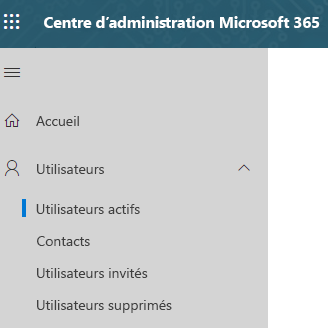

# Attribuer des licences Microsoft Teams dans l'éducationAssign Microsoft Teams licenses for EDU

Microsoft Teams est une plateforme numérique qui centralise les conversations, le contenu et les applications.Microsoft Teams is a digital hub that brings conversations, content, and apps together in one place. De par sa conception basée sur Office 365, les établissements scolaires bénéficient de l’intégration avec les applications et services Office classiques.Because it's built on Office 365, schools benefit from integration with their familiar Office apps and services. Avec l'expérience unique Office 365 dans l'éducation, votre établissement peut utiliser Microsoft Teams pour créer des classes collaboratives, se connecter à des communautés d’apprentissage professionnelles et communiquer avec d’autres membres du personnel de leur établissement.Your institution can use Microsoft Teams to create collaborative classrooms, connect in professional learning communities, and communicate with school staff all from a single experience in Office 365 for Education.

Pour démarrer, les administrateurs informatiques doivent utiliser le Centre d’administration Microsoft 365 pour activer [Microsoft Teams pour votre établissement scolaire](https://docs.microsoft.com/microsoft-365/education/intune-edu-trial/enable-microsoft-teams).To get started, IT administrators need to use the Microsoft 365 Admin Center to [enable Microsoft Teams for your school](https://docs.microsoft.com/microsoft-365/education/intune-edu-trial/enable-microsoft-teams).
Une fois l’opération terminée, vous devez attribuer des licences aux comptes d’utilisateurs pour que vos faculté, enseignants et étudiants puissent accéder aux services Office 365, tels que Microsoft Teams.Once complete, you must assign licenses to user accounts so your faculty, staff, and students can access Office 365 services, such as Microsoft Teams.

Vous pouvez attribuer des licences à des comptes d’utilisateurs, soit individuellement, soit automatiquement par le biais de l’appartenance à des groupes.You can assign licenses to user accounts either individually or automatically through group membership. Cet article vous explique comment attribuer des licences Office 365 à un individu ou un petit groupe de comptes d’utilisateurs via le Centre d’administration Microsoft 365.This article will walk you through how to assign Office 365 licenses to an individual or a small set of user accounts via the Microsoft 365 admin center. Pour attribuer automatiquement des licences par le biais de l’appartenance à des groupes, consultez l’un des articles support suivants :To assign licenses automatically through group membership, see one of our supporting articles:

- [Office 365 PowerShellOffice 365 Powershell](https://docs.microsoft.com/office365/enterprise/powershell/assign-licenses-to-user-accounts-with-office-365-powershell)
- [Gestion de licences basée sur des groupes dans Active DirectoryGroup-based Licensing in Active Directory](https://docs.microsoft.com/azure/active-directory/users-groups-roles/licensing-groups-assign)

Vous pouvez attribuer des licences à des utilisateurs à partir de la page des **Licences** ou de la page des **Utilisateurs actifs**.You can assign licenses to users on either the **Licenses** page, or on the **Active Users** page. La méthode utilisée dépend de votre souhait d’attribuer des licences de produit à des utilisateurs déterminés ou d’attribuer des licences aux utilisateurs pour des produits spécifiques.Which method you use depends on whether you want to assign product licenses to specific users, or assign users licenses to specific products.

> [!NOTE]
> Si le nouveau Centre d’administration Microsoft 365 n’est pas celui que vous utilisez, vous pouvez l’activer en sélectionnant le bouton bascule **Essayer le nouveau Centre d’administration** situé en haut de la page d’accueil.If you're not using the new Microsoft 365 admin center, you can turn it on by selecting the **Try the new admin center** toggle located at the top of the Home page.

## Attribution de licences à des utilisateurs via la page LicencesAssign licenses to users on the Licenses page

> [!NOTE]
> Vous devez être administrateur général, administrateur de facturation, administrateur de licence ou administrateur de gestion des utilisateurs. Pour plus d'informations, consultez [À propos des rôles d'administrateur Office 365](https://docs.microsoft.com/microsoft-365/admin/add-users/about-admin-roles).You must be a Global admin, Billing admin, License admin, or User management admin. For more information, see [About Office 365 admin roles](https://docs.microsoft.com/microsoft-365/admin/add-users/about-admin-roles).

Lorsque vous utilisez la page **Licences** pour l'attribution de licences, vous attribuez des licences pour un produit spécifique à un maximum de 20 utilisateurs.When you use the **Licenses** page to assign licenses, you assign licenses for a specific product for up to 20 users. Sur la page **Licences**, une liste de tous les produits pour lesquels vous avez souscrit un abonnement s’affiche, ainsi que le nombre total de licences par produit, le nombre de licences attribuées et le nombre de licences disponibles.On the **Licenses** page, you see a list of all the products you have subscriptions for, together with the total number of licenses for each product, how many licenses are assigned, and how many are available.

1. Dans le Centre d’administration, choisissez la page **Facturation** > [Licences](https://go.microsoft.com/fwlink/p/?linkid=842264).In the admin center, go to the **Billing** > [Licenses](https://go.microsoft.com/fwlink/p/?linkid=842264) page.

   
2. Sélectionnez le produit pour lequel vous voulez attribuer des licences.Select a product for which you want to assign licenses. Microsoft Teams fait partie de la version gratuite Office 365 A1 pour les étudiants SKU.Microsoft Teams is part of the free Office 365 A1 for Students SKU.

   
3. Choisissez **Affecter des licences**.Select **Assign licenses**.

   
4. Dans le volet **Attribuer des licences aux utilisateurs**, commencez à taper un nom, lequel qui doit générer une liste de noms.In the **Assign licenses to users** pane, begin typing a name, which should generate a list of names. Sélectionnez le nom que vous recherchez dans les résultats pour l’ajouter à la liste.Choose the name you're looking for from the results to add it to the list. Vous pouvez ajouter jusqu'à 20 utilisateurs à la fois.You can add up to 20 users at a time.

   
5. Sélectionnez **Activer ou désactiver les applications et les services** pour attribuer ou supprimer l’accès à des éléments particuliers, tels que Microsoft Teams.Select **Turn apps and services on or off** to assign or remove access to specific items, such as Microsoft Teams. Veillez à ce que **Microsoft Teams** et **Office pour le web (éducation)** soient sélectionnés.Ensure **Microsoft Teams** and **Office for the web (Education)** are selected.
6. Lorsque vous avez terminé, sélectionnez **Attribuer**, puis choisissez **Fermer**.When you're finished, select **Assign**, then select **Close**.

Pour modifier les applications et les services auxquels un utilisateur a accès :To change the apps and services a user has access to:

1. Sélectionnez la ligne contenant l'utilisateur.Select the row that contains the user.
1. Dans le volet droit, sélectionnez ou désélectionnez les applications et services auxquels vous voulez octroyer ou supprimer l'accès.In the right pane, select or deselect the apps and services that you want to give access to, or remove access from.
1. Une fois terminé, sélectionnez **Enregistrer**, puis choisissez **Fermer**.When you're finished, select **Save**, then select **Close**.

## Attribuer des licences à une seule personne ou à différents utilisateurs via la page Utilisateurs actifsAssign licenses to an individual or multiple users on the Active users page

1. Dans le Centre d’administration, accédez à la page **Utilisateurs**  >  [Utilisateurs actifs](https://go.microsoft.com/fwlink/p/?linkid=834822).In the admin center, go to the **Users** > [Active users](https://go.microsoft.com/fwlink/p/?linkid=834822) page.

   
2. Sélectionnez les cercles en regard un(des) nom(s) d'utilisateur(s) auquel(auxquels) vous voulez attribuer une(des) licence(s).Select the circles next to the name(s) of the user(s) you want to assign license(s) to.

   
3. Dans la partie supérieure, sélectionnez **Gérer des licences de produits**.At the top select **Manage product licenses**.

   
4. Dans le volet **Attribuer des licences de produits**, sélectionnez **Ajouter aux attributions de licence de produit existantes**  >  **Suivant**.In the **Manage product licenses** pane, select **Add to existing product license assignments** > **Next**.

   
5. Dans le volet **Ajouter aux produits existants**, positionnez le bouton bascule sur **Actif**correspondant à la licence que vous voulez attribuer aux utilisateurs sélectionnés.In the **Add to existing products** pane, switch the toggle to the **On** position for the license that you want the selected users to have. Veillez à ce que **Microsoft Teams** et **Office pour le web (éducation)** soient sélectionnés.Ensure **Microsoft Teams** and **Office for the web (Education)** are selected.

   

   Par défaut, tous les services associés à cette(ces) licence(s) sont automatiquement attribués à un ou plusieurs utilisateurs.By default, all services associated with those license(s) are automatically assigned to the user(s). Vous pouvez limiter les services mis à disposition des utilisateurs.You can limit which services are available to the users. Positionnez le bouton bascule sur **Inactif** pour les services que vous ne souhaitez pas attribuer aux utilisateurs.Switch the toggles to the **Off** position for the services that you don't want the users to have.
6. Dans la partie inférieure du volet, sélectionnez Ajouter > Fermer.At the bottom of the pane, select Add > Close.
