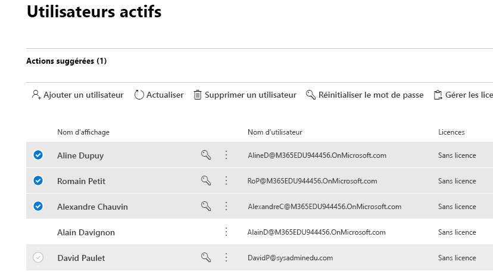
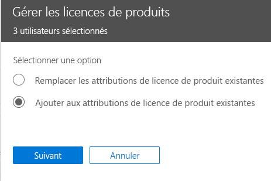

# Attribuer des licences Microsoft Teams dans l'éducation

Microsoft Teams est une plateforme numérique qui centralise les conversations, le contenu et les applications. De par sa conception basée sur Office 365, les établissements scolaires bénéficient de l’intégration avec les applications et services Office classiques. Avec l'expérience unique Office 365 dans l'éducation, votre établissement peut utiliser Microsoft Teams pour créer des classes collaboratives, se connecter à des communautés d’apprentissage professionnelles et communiquer avec d’autres membres du personnel de leur établissement.

Pour démarrer, les administrateurs informatiques doivent utiliser le Centre d’administration Microsoft 365 pour activer [Microsoft Teams pour votre établissement scolaire](/microsoft-365/education/intune-edu-trial/enable-microsoft-teams).
Une fois l’opération terminée, vous devez attribuer des licences aux comptes d’utilisateurs pour que vos faculté, enseignants et étudiants puissent accéder aux services Office 365, tels que Microsoft Teams.

Vous pouvez attribuer des licences à des comptes d’utilisateurs, soit individuellement, soit automatiquement par le biais de l’appartenance à des groupes. Cet article vous explique comment attribuer des licences Office 365 à un individu ou un petit groupe de comptes d’utilisateurs via le Centre d’administration Microsoft 365. Pour attribuer automatiquement des licences par le biais de l’appartenance à des groupes, consultez l’un des articles support suivants :

- [Office 365 PowerShell](/office365/enterprise/powershell/assign-licenses-to-user-accounts-with-office-365-powershell)
- [Gestion de licences basée sur des groupes dans Active Directory](/azure/active-directory/users-groups-roles/licensing-groups-assign)

Vous pouvez attribuer des licences à des utilisateurs à partir de la page des **Licences** ou de la page des **Utilisateurs actifs**. La méthode utilisée dépend de votre souhait d’attribuer des licences de produit à des utilisateurs déterminés ou d’attribuer des licences aux utilisateurs pour des produits spécifiques.

> [!NOTE]
> Si le nouveau Centre d’administration Microsoft 365 n’est pas celui que vous utilisez, vous pouvez l’activer en sélectionnant le bouton bascule **Essayer le nouveau Centre d’administration** situé en haut de la page d’accueil.

## Attribution de licences à des utilisateurs via la page Licences

> [!NOTE]
> Vous devez être administrateur général, administrateur de facturation, administrateur de licence ou administrateur de gestion des utilisateurs. Pour plus d'informations, consultez [À propos des rôles d'administrateur Office 365](/microsoft-365/admin/add-users/about-admin-roles).

Lorsque vous utilisez la page **Licences** pour l'attribution de licences, vous attribuez des licences pour un produit spécifique à un maximum de 20 utilisateurs. Sur la page **Licences**, une liste de tous les produits pour lesquels vous avez souscrit un abonnement s’affiche, ainsi que le nombre total de licences par produit, le nombre de licences attribuées et le nombre de licences disponibles.

1. Dans le Centre d’administration, choisissez la page **Facturation** > [Licences](https://go.microsoft.com/fwlink/p/?linkid=842264).

   
2. Sélectionnez le produit pour lequel vous voulez attribuer des licences. Microsoft Teams fait partie de la version gratuite Office 365 A1 pour les étudiants SKU.

   
3. Choisissez **Affecter des licences**.

   
4. Dans le volet **Attribuer des licences aux utilisateurs**, commencez à taper un nom, lequel qui doit générer une liste de noms. Sélectionnez le nom que vous recherchez dans les résultats pour l’ajouter à la liste. Vous pouvez ajouter jusqu'à 20 utilisateurs à la fois.

   
5. Sélectionnez **Activer ou désactiver les applications et les services** pour attribuer ou supprimer l’accès à des éléments particuliers, tels que Microsoft Teams. Veillez à ce que **Microsoft Teams** et **Office pour le web (éducation)** soient sélectionnés.
6. Lorsque vous avez terminé, sélectionnez **Attribuer**, puis choisissez **Fermer**.

Pour modifier les applications et les services auxquels un utilisateur a accès :

1. Sélectionnez la ligne contenant l'utilisateur.
1. Dans le volet droit, sélectionnez ou désélectionnez les applications et services auxquels vous voulez octroyer ou supprimer l'accès.
1. Une fois terminé, sélectionnez **Enregistrer**, puis choisissez **Fermer**.

## Attribuer des licences à une seule personne ou à différents utilisateurs via la page Utilisateurs actifs

1. Dans le Centre d’administration, accédez à la page **Utilisateurs**  >  [Utilisateurs actifs](https://go.microsoft.com/fwlink/p/?linkid=834822).

   
2. Sélectionnez les cercles en regard un(des) nom(s) d'utilisateur(s) auquel(auxquels) vous voulez attribuer une(des) licence(s).

   
3. Dans la partie supérieure, sélectionnez **Gérer des licences de produits**.

   
4. Dans le volet **Attribuer des licences de produits**, sélectionnez **Ajouter aux attributions de licence de produit existantes**  >  **Suivant**.

   
5. Dans le volet **Ajouter aux produits existants**, positionnez le bouton bascule sur **Actif** correspondant à la licence que vous voulez attribuer aux utilisateurs sélectionnés. Veillez à ce que **Microsoft Teams** et **Office pour le web (éducation)** soient sélectionnés.

   

   Par défaut, tous les services associés à cette(ces) licence(s) sont automatiquement attribués à un ou plusieurs utilisateurs. Vous pouvez limiter les services mis à disposition des utilisateurs. Positionnez le bouton bascule sur **Inactif** pour les services que vous ne souhaitez pas attribuer aux utilisateurs.
6. Dans la partie inférieure du volet, sélectionnez Ajouter > Fermer.