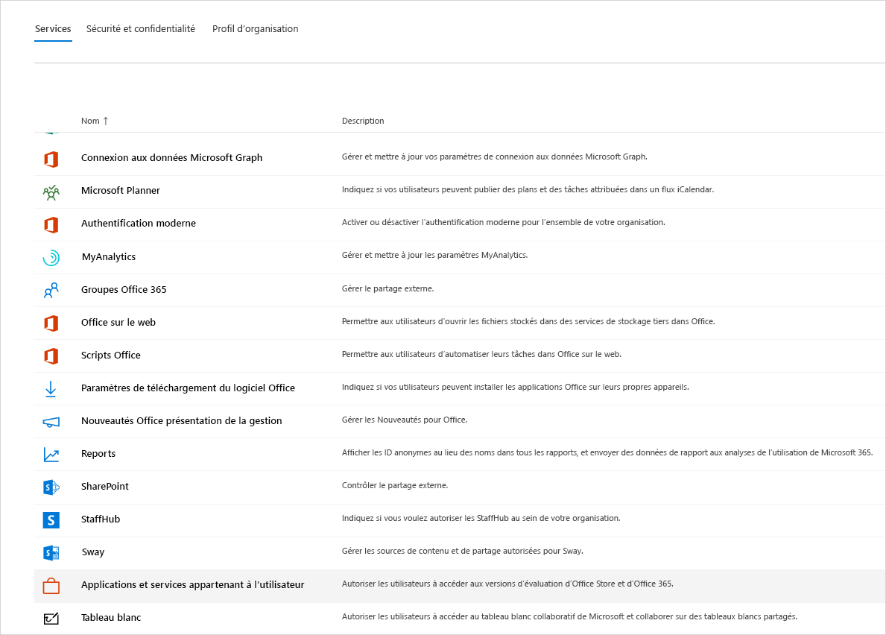
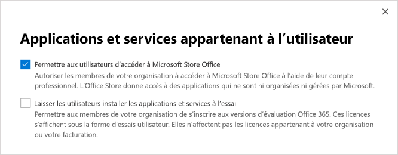

# Gérer la licence exploratoire Microsoft Teams

L’expérience exploratoire Microsoft Teams permet aux utilisateurs de votre organisation qui ont Azure Active Directory (Azure AD) et qui ne disposent pas d’une licence Teams de lancer une expérience exploratoire de Teams. Les administrateurs peuvent activer ou désactiver cette fonctionnalité pour les utilisateurs de leur organisation.

## Qu’est-ce que l’expérience exploratoire Teams ?

Les plans de service qu’un administrateur peut voir dans le cadre de l’expérience exploratoire Teams sont les suivants :

- Exchange Online (plan 1)
- Flux pour Microsoft 365 ou Office 365
- Informations obtenues par MyAnalytics
- Microsoft Forms (plan E1)
- Microsoft Planner
- Recherche Microsoft
- Microsoft StaffHub
- Microsoft Stream pour Microsoft 365 et Office 365 E1 SKU 1</1>
- Microsoft Teams
- Gestion des appareils mobiles pour Microsoft 365 ou Office 365
- Applications Office Mobile pour Office 365
- Office Online
- Power Apps pour Microsoft 365 ou Office 365
- SharePoint Online (plan 1)
- Sway
- Tâches (plan 1)
- Tableau blanc (plan 1)
- Yammer Enterprise

  1 Les modifications apportées à l’utilisation de Microsoft Stream pour [OneDrive Entreprise et SharePoint pour les enregistrements de réunion](tmr-meeting-recording-change.md) auront une approche progressive. Au démarrage, vous pourrez choisir cette expérience. En novembre, vous devrez abandonner cette option si vous souhaitez continuer à utiliser Stream. Au début de 2021, nous demanderons à tous les clients d’utiliser OneDrive Entreprise et SharePoint pour les nouveaux enregistrements de réunion.

## Critères d’éligibilité

Les utilisateurs éligibles à l’expérience Teams Exploratory sont les utilisateurs qui:

- Disposent d’une adresse e-mail du domaine Azure AD gérée.
- Appartiennent à un client disposant d’un abonnement payant.
- N’avez pas de licence Teams active.
- Ne se trouve pas dans un client où une stratégie d’attribution de licence a été créée.

Les utilisateurs doivent être autorisés à s’inscrire aux applications et aux essais (dans le Centre d’administration Microsoft 365). Pour plus d’informations, voir [Gérer l’expérience exploratoire Teams](#manage-the-teams-exploratory-experience) plus loin dans cet article.

## Qui n'est pas éligible ?

Les utilisateurs inéligibles sont les utilisateurs qui :

- Disposez actuellement de Teams à partir d’une licence payante ou d’une licence d’évaluation, ou d’une licence d’évaluation antérieure
- se trouvent dans un client qui utilise ou a reçu au moins une offre spéciale COVID.

Votre organisation n’est pas éligible pour cette offre si vous êtes un client partenaire de syndication ou un client GCC, GCC élevé, DoD ou EDU.

## Comment les utilisateurs s’inscrivent pour l’expérience exploratoire Teams ?

Les utilisateurs éligibles peuvent s’inscrire à l’expérience exploratoire Teams en se connectant à Teams à partir de l’ordinateur de bureau ou web ([teams.microsoft.com](https://teams.microsoft.com)). Pour l’instant, l’activation de exploratoire via mobile n’est pas prise en charge. Lorsqu’il s’inscrivent, la licence leur est attribuée automatiquement et l’administrateur client reçoit une notification par e-mail la première fois qu’une personne au sein de votre organisation démarre l’expérience Teams Exploratory.

## Gérer l’expérience Teams Exploratory

L’expérience Teams Exploratory est destinée aux utilisateurs finaux individuels et vous ne pouvez pas lancer cette offre pour le compte d’employés de l’utilisateur final.

L’expérience Teams Exploratory est offerte avec une licence Exchange Online, mais elle ne peut être attribuée à l’utilisateur que par l’administrateur. Si l’utilisateur ne dispose pas déjà d’une licence Exchange et que l’administrateur ne lui a pas encore attribué la licence Exchange Online, l’utilisateur ne peut pas planifier de réunions dans Teams et pourrait manquer d’autres fonctionnalités Teams.

Les administrateurs peuvent désactiver la possibilité pour les utilisateurs finaux d’exécuter l’expérience exploratoire des équipes au sein de leur organisation à l’aide du commutateur des **applications et services d’essai**.

### Empêcher les utilisateurs d’installer des applications et services à l’essai

Vous pouvez désactiver la possibilité pour un utilisateur d’installer des applications et des services d’essai, ce qui l’empêche d’exécuter l’expérience exploratoire Teams.

1. Dans le Centre d’administration Microsoft 365, accédez à **Paramètres** > **Paramètres org**, sélectionnez **Services**, puis choisissez **Services et applications propriétés de l'utilisateur**.

    

2. Désactivez la cache à cocher **Permettre aux utilisateurs d'installer les applications et services à l’essai**.

    

    > [!NOTE]
    > Si votre organisation n’est pas éligible à l’expérience exploratoire Teams, l'option **Laisser les utilisateurs installer les applications et services d’essai** ne s’affiche pas.

### Gérer la disponibilité pour un utilisateur disposant d’une licence incluant Teams

Un utilisateur détenteur d’une licence incluant Team n’est pas admissible à l’expérience exploratoire Teams. Lorsque le plan de service Teams est activé, l’utilisateur peut se connecter et utiliser Teams. Si le plan de service est désactivé, l’utilisateur ne peut pas se connecter et l’expérience exploratoire Teams n’est pas disponible. Vous devez disposer de privilèges d’administrateur.

Pour désactiver l’accès à Microsoft Teams :

1. Dans le centre d’administration Microsoft 365, sélectionnez **Utilisateurs** > **Utilisateurs actifs**.

2. Activez la case à cocher située en regard du nom de l’utilisateur.

3. Sur la ligne **Licences de produits**, sélectionnez **Modifier**.

4. Dans le volet **Licences de produit**, sélectionnez **Désactivé**.

    

### Gérer la disponibilité Teams pour les utilisateurs qui utilisent déjà l’expérience exploratoire Teams

Si un utilisateur exécute l’expérience exploratoire Teams, vous pouvez la désactiver en supprimant la licence ou le plan de service. Vous devez disposer de privilèges d’administrateur.

Pour désactiver la licence de l’expérience Teams Exploratory:

1. Dans le centre d’administration Microsoft 365, sélectionnez **Utilisateurs** > **Utilisateurs actifs**.

2. Activez la case à cocher située en regard du nom de l’utilisateur.

3. Sur la ligne **Licences de produits**, sélectionnez **Modifier**.

4. Dans le volet **Licences de produit**, sélectionnez **Désactivé** pour cette licence exploratoire.

    > [!NOTE]
    > Le commutateur de bascule exploratoire Teams apparaît une fois que le premier utilisateur de l’organisation a lancé l’expérience exploratoire Teams.

### Gérer Teams pour les utilisateurs disposant d’une licence exploratoire Teams

Vous pouvez gérer les utilisateurs qui ont une licence exploratoire Teams de la même façon que vous gérez ceux qui ont une licence payante régulière. Pour plus d’informations[Gérer les paramètres de Teams pour votre organisation](enable-features-office-365.md).

### Mettre à niveau des utilisateurs à partir de Teams Exploratoire

Vous devez disposer de privilèges d’administrateur pour mettre à niveau les utilisateurs à partir de Teams Exploratory. Pour plus d’informations, consultez [Mettre à niveau les utilisateurs à partir de l’essai exploratoire Teams](upgrade-from-teams-exploratory.md).

> [!NOTE]
> Si la licence exploratoire Teams se termine et qu’un utilisateur n’est pas immédiatement mis à niveau vers un abonnement incluant Teams, il perd l’accès à Teams après une période de grâce de 30 jours. Après 30 jours, les données sont supprimées. L’utilisateur demeure dans Azure Active Directory. Une fois qu’une nouvelle licence est attribuée à l’utilisateur pour réactiver la fonctionnalité Teams, tout le contenu reste en l’état si l’utilisateur est ajouté dans le cadre du délai de grâce.

### Supprimer une licence exploratoire Teams

- Si vous souhaitez supprimer cette licence à l’aide PowerShell, voir [Supprimer des licences de comptes d’utilisateurs avec Office 365 PowerShell](/office365/enterprise/powershell/remove-licenses-from-user-accounts-with-office-365-powershell).

- Si vous souhaitez supprimer cette licence via le portail d’administration, consultez : [Supprimer un utilisateur de votre organisation](/microsoft-365/admin/add-users/delete-a-user)

## En quoi consiste la stratégie de conservation des données ?

Consultez [informations d’abonnement 365](/microsoft-365/commerce/subscriptions/what-if-my-subscription-expires?view=o365-worldwide).

## Combien de temps dure l’expérience d’exploration de Teams ?

Teams Exploratory est disponible sous forme d'abonnement de 12 mois (à partir de l'inscription initiale de l'utilisateur) pour tous les nouveaux clients. Le nouvel abonnement Teams exploratoire démarre lorsque le premier utilisateur d’une organisation s’est abonné à Teams exploratoire et expirera au bout de 12 mois. La date d’expiration s’applique à tous les utilisateurs du même client. La période de 12 mois commence à la date d’inscription du premier utilisateur.

> [!NOTE]
> La date de fin de l’expérience est configurée au niveau de l’organisation, ce qui signifie qu’elle s’applique à tous les utilisateurs d’une même organisation. Par exemple, l’utilisateur 1 s’est abonné à l’abonnement le 1er janvier 2021. Cela déclenche la date de fin de l’abonnement le 31 décembre 2021. Un autre utilisateur, Utilisateur 2, s’est abonné à l’abonnement le 1er octobre 2021. L’utilisateur 2 peut utiliser Teams exploratoire pour deux mois, sa date de fin étant le 31 décembre 2021, car il est dans le cadre de l’abonnement de la même organisation que Utilisateur 1.

### Que doivent faire les administrateurs à la fin des 12 mois d’expérience Teams exploratoire

À la fin de l'abonnement de 12 mois, les administrateurs doivent convertir tous les utilisateurs de Teams exploratoire en une licence payante qui inclut Teams. Il est essentiel de s’assurer que cette opération se termine avant l’expiration de l’abonnement Teams exploratoire Pour éviter toute interruption de l’expérience de l’utilisateur.

> [!NOTE]
> Les clients seront désactivés et bloqués pour le démarrage d’une nouvelle licence d’évaluation de Exploratory pendant 3 mois après l’expiration de la licence d’évaluation Exploratory précédente.

Pour plus d’informations, consultez [Mettre à niveau les utilisateurs de Teams Exploratory](#upgrade-users-from-teams-exploratory), ci-dessus dans cet article.
