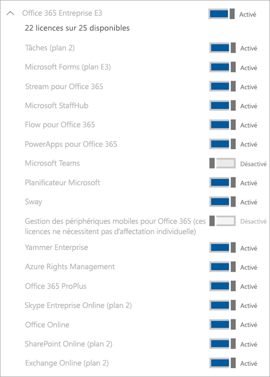

# Gérer la licence exploratoire Microsoft TeamsManage the Microsoft Teams Exploratory license

L’expérience exploratoire Microsoft Teams permet aux utilisateurs de votre organisation qui ont Azure Active Directory (Azure AD) et qui ne disposent pas d’une licence Teams de lancer une expérience exploratoire de Teams. Les administrateurs peuvent activer ou désactiver cette fonctionnalité pour les utilisateurs de leur organisation.The Microsoft Teams Exploratory experience lets users in your organization who have Azure Active Directory (Azure AD) and aren't licensed for Teams initiate an exploratory experience of Teams. Admins can switch this feature on or off for users in their organization.

## Qu’est-ce que l’expérience exploratoire Teams ?What's in the Teams Exploratory experience

Les plans de service qu’un administrateur peut voir dans le cadre de l’expérience exploratoire Teams sont les suivants :The service plans that an admin will see as part of the Teams Exploratory experience are:

- Exchange Online (plan 1)Exchange Online (Plan 1)
- Flux pour Microsoft 365 ou Office 365Flow for Microsoft 365 or Office 365
- Informations obtenues par MyAnalyticsInsights by MyAnalytics
- Microsoft Forms (plan E1)Microsoft Forms (Plan E1)
- Microsoft PlannerMicrosoft Planner
- Recherche MicrosoftMicrosoft Search
- Microsoft StaffHubMicrosoft StaffHub
- Microsoft Stream pour Microsoft 365 et Office 365 E1 SKU 1</1>Microsoft Stream for Microsoft 365 and Office 365 E1 SKUs 1</1>
- Microsoft TeamsMicrosoft Teams
- Gestion des appareils mobiles pour Microsoft 365 ou Office 365Mobile Device Management for Microsoft 365 or Office 365
- Applications Office Mobile pour Office 365Office Mobile Apps for Office 365
- Office OnlineOffice Online
- PowerApp pour Microsoft 365 ou Office 365PowerApps for Microsoft 365 or Office 365
- SharePoint Online (plan 1)SharePoint Online (Plan 1)
- SwaySway
- Tâches (plan 1)To-Do (Plan 1)
- Tableau blanc (plan 1)Whiteboard (Plan 1)
- Yammer EnterpriseYammer Enterprise

  1 Les modifications apportées à l’utilisation de Microsoft Stream pour [OneDrive Entreprise et SharePoint pour les enregistrements de réunion](tmr-meeting-recording-change.md) auront une approche progressive.1 The change from using Microsoft Stream to [OneDrive for Business and SharePoint for meeting recordings](tmr-meeting-recording-change.md) will be a phased approach. Au démarrage, vous pourrez choisir cette expérience.At launch, you'll be able to opt in to this experience. En novembre, vous devrez abandonner cette option si vous souhaitez continuer à utiliser Stream.In November, you'll have to opt out if you want to continue using Stream. Au début de 2021, nous demanderons à tous les clients d’utiliser OneDrive Entreprise et SharePoint pour les nouveaux enregistrements de réunion.Sometime in early 2021, we'll require all customers to use OneDrive for Business and SharePoint for new meeting recordings.

## Critères d’éligibilitéWho's eligible

Les utilisateurs éligibles à l’expérience Teams Exploratory sont les utilisateurs qui:Users fit the criteria for a Teams Exploratory experience if they:

- Disposent d’une adresse e-mail du domaine Azure AD gérée.Have a managed Azure AD domain email address.
- Appartiennent à un client disposant d’un abonnement payant.Belong to a tenant with a paid subscription.
- N’avez pas de licence Teams active.Do not have an active Teams license.
- Ne se trouve pas dans un client où une stratégie d’attribution de licence a été créée.Are not in a tenant where a license assignment policy was created.

Les utilisateurs doivent être autorisés à s’inscrire aux applications et aux essais (dans le Centre d’administration Microsoft 365).Users must be enabled to sign up for apps and trials (in the Microsoft 365 admin center). Pour plus d’informations, voir [Gérer l’expérience exploratoire Teams](#manage-the-teams-exploratory-experience) plus loin dans cet article.For more information, see [Manage the Teams Exploratory experience](#manage-the-teams-exploratory-experience), later in this article.

## Qui n'est pas éligible ?Who isn't eligible

Les utilisateurs inéligibles sont les utilisateurs qui :Users don't fit the criteria if they:

- Disposez actuellement de Teams à partir d’une licence payante ou d’une licence d’évaluation, ou d’une licence d’évaluation antérieureCurrently have Teams from a paid license or trial license, or previously had trial license
- se trouvent dans un client qui utilise ou a reçu au moins une offre spéciale COVID.Are in a tenant that used/received at least one special COVID offer.

Votre organisation n’est pas éligible pour cette offre si vous êtes un client partenaire de syndication ou un client GCC, GCC élevé, DoD ou EDU.Your organization isn't eligible for this offer if you're a Syndication Partner Customer or a GCC, GCC High, DoD, or EDU customer.

## Comment les utilisateurs s’inscrivent pour l’expérience exploratoire Teams ?How users sign up for the Teams Exploratory experience

Les utilisateurs éligibles peuvent s’inscrire à l’expérience exploratoire Teams en se connectant à Teams à partir de l’ordinateur de bureau ou web ([teams.microsoft.com](https://teams.microsoft.com)).Eligible users can sign up for the Teams Exploratory experience by signing in to Teams from the desktop or web ([teams.microsoft.com](https://teams.microsoft.com)). Pour l’instant, l’activation de exploratoire via mobile n’est pas prise en charge.At this time, enabling Exploratory through mobile is not supported. Lorsqu’il s’inscrivent, la licence leur est attribuée automatiquement et l’administrateur client reçoit une notification par e-mail la première fois qu’une personne au sein de votre organisation démarre l’expérience Teams Exploratory.When they sign up, they'll be assigned this license automatically and the tenant admin will receive an email notification the first time someone in your org starts the Teams Exploratory experience.

## Gérer l’expérience Teams ExploratoryManage the Teams Exploratory experience

L’expérience Teams Exploratory est destinée aux utilisateurs finaux individuels et vous ne pouvez pas lancer cette offre pour le compte d’employés de l’utilisateur final.The Teams Exploratory experience is meant to be initiated by individual end users, and you can't initiate this offer on behalf of end-user employees.

L’expérience Teams Exploratory est offerte avec une licence Exchange Online, mais elle ne peut être attribuée à l’utilisateur que par l’administrateur.The Teams Exploratory experience comes with an Exchange Online license, but it won't be assigned to the user until the admin assigns it. Si l’utilisateur ne dispose pas déjà d’une licence Exchange et que l’administrateur ne lui a pas encore attribué la licence Exchange Online, l’utilisateur ne peut pas planifier de réunions dans Teams et pourrait manquer d’autres fonctionnalités Teams.If the user doesn't have an Exchange license already, and the admin has yet to assign the Exchange Online license, the user won't be able to schedule meetings in Teams and might be missing other Teams functionality.

Les administrateurs peuvent désactiver la possibilité pour les utilisateurs finaux d’exécuter l’expérience exploratoire des équipes au sein de leur organisation à l’aide du commutateur des **applications et services d’essai**.Admins can disable the ability for end users to run the Teams Exploratory experience within their organization by using the **Trial apps and services** switch.

### Empêcher les utilisateurs d’installer des applications et services à l’essaiPrevent users from installing trial apps and services

Vous pouvez désactiver la possibilité pour un utilisateur d’installer des applications et des services d’essai, ce qui l’empêche d’exécuter l’expérience exploratoire Teams.You can turn off a user's ability to install trial apps and services, which would prevent the user from running the Teams Exploratory experience.

1. Dans le Centre d’administration Microsoft 365, accédez à **Paramètres** > **Paramètres org**, sélectionnez **Services**, puis choisissez **Services et applications propriétés de l'utilisateur**.From the Microsoft 365 admin center, go to **Settings** > **Org settings**, select **Services**, and then select **User owned apps and services**.

    

2. Désactivez la cache à cocher **Permettre aux utilisateurs d'installer les applications et services à l’essai**.Clear the check mark from **Let users install trial apps and services**.

    

    > [!NOTE]
    > Si votre organisation n’est pas éligible à l’expérience exploratoire Teams, l'option **Laisser les utilisateurs installer les applications et services d’essai** ne s’affiche pas.If your organization is ineligible for the Teams Exploratory experience, you won't see the **Let users install trial apps and services** option.

### Gérer la disponibilité pour un utilisateur disposant d’une licence incluant TeamsManage availability for a user with a license that includes Teams

Un utilisateur détenteur d’une licence incluant Team n’est pas admissible à l’expérience exploratoire Teams.A user who is assigned a license that includes Teams isn't eligible for the Teams Exploratory experience. Lorsque le plan de service Teams est activé, l’utilisateur peut se connecter et utiliser Teams.When the Teams service plan is turned on, the user can sign in and use Teams. Si le plan de service est désactivé, l’utilisateur ne peut pas se connecter et l’expérience exploratoire Teams n’est pas disponible.If the service plan is disabled, the user can't sign in and the Teams Exploratory experience isn't available. Vous devez disposer de privilèges d’administrateur.You must have admin privileges.

Pour désactiver l’accès à Microsoft Teams :To turn off access to Teams:

1. Dans le centre d’administration Microsoft 365, sélectionnez **Utilisateurs** > **Utilisateurs actifs**.In the Microsoft 365 admin center, select **Users** > **Active users**.

2. Activez la case à cocher située en regard du nom de l’utilisateur.Select the box next to the name of the user.

3. Sur la ligne **Licences de produits**, sélectionnez **Modifier**.In the **Product licenses** row, choose **Edit**.

4. Dans le volet **Licences de produit**, sélectionnez **Désactivé**.In the **Product licenses** pane, switch the toggle to **Off**.

    

### Gérer la disponibilité Teams pour les utilisateurs qui utilisent déjà l’expérience exploratoire TeamsManage Teams availability for users who are already using the Teams Exploratory experience

Si un utilisateur exécute l’expérience exploratoire Teams, vous pouvez la désactiver en supprimant la licence ou le plan de service. Vous devez disposer de privilèges d’administrateur.If a user is running the Teams Exploratory experience, you can turn it off by removing the license or service plan. You must have admin privileges.

Pour désactiver la licence de l’expérience Teams Exploratory:To turn off the Teams Exploratory experience license:

1. Dans le centre d’administration Microsoft 365, sélectionnez **Utilisateurs** > **Utilisateurs actifs**.In the Microsoft 365 admin center, select **Users** > **Active users**.

2. Activez la case à cocher située en regard du nom de l’utilisateur.Select the box next to the name of the user.

3. Sur la ligne **Licences de produits**, sélectionnez **Modifier**.In the **Product licenses** row, choose **Edit**.

4. Dans le volet **Licences de produit**, sélectionnez **Désactivé** pour cette licence exploratoire.In the **Product licenses** pane, switch the toggle for this exploratory license to **Off**.

    > [!NOTE]
    > Le commutateur de bascule exploratoire Teams apparaît une fois que le premier utilisateur de l’organisation a lancé l’expérience exploratoire Teams.The Teams Exploratory toggle switch will appear after the first user in the organization launches the Teams Exploratory experience.

### Gérer Teams pour les utilisateurs disposant d’une licence exploratoire TeamsManage Teams for users who have the Teams Exploratory license

Vous pouvez gérer les utilisateurs qui ont une licence exploratoire Teams de la même façon que vous gérez ceux qui ont une licence payante régulière.You can manage users who have the Teams Exploratory license just like you manage users who have a regular paid license. Pour plus d’informations[Gérer les paramètres de Teams pour votre organisation](enable-features-office-365.md).For more information, see [Manage Teams settings for your organization](enable-features-office-365.md).

### Mettre à niveau des utilisateurs à partir de Teams ExploratoireUpgrade users from Teams Exploratory

Vous devez disposer de privilèges d’administrateur pour mettre à niveau les utilisateurs à partir de Teams Exploratory.You must have admin privileges to upgrade users from Teams Exploratory. Pour plus d’informations, consultez [Mettre à niveau les utilisateurs à partir de l’essai exploratoire Teams](upgrade-from-teams-exploratory.md).For more information see [Upgrade users from the Teams Exploratory trial](upgrade-from-teams-exploratory.md).

> [!NOTE]
> Si la licence exploratoire Teams se termine et qu’un utilisateur n’est pas immédiatement mis à niveau vers un abonnement incluant Teams, il perd l’accès à Teams après une période de grâce de 30 jours.If the Teams Exploratory license ends and a user isn't immediately upgraded to a subscription that includes Teams, they lose access to Teams after a 30-days grace period. Après 30 jours, les données sont supprimées.Another 30 days after which, the data is deleted. L’utilisateur demeure dans Azure Active Directory.The user still exists in Azure Active Directory. Une fois qu’une nouvelle licence est attribuée à l’utilisateur pour réactiver la fonctionnalité Teams, tout le contenu reste en l’état si l’utilisateur est ajouté dans le cadre du délai de grâce.Once a new license is assigned to the user to enable Teams functionality again, all content will still exist if the user is added within the grace period time frame.

### Supprimer une licence exploratoire TeamsRemove a Teams Exploratory license

- Si vous souhaitez supprimer cette licence à l’aide PowerShell, voir [Supprimer des licences de comptes d’utilisateurs avec Office 365 PowerShell](/office365/enterprise/powershell/remove-licenses-from-user-accounts-with-office-365-powershell).If you would like to remove this license by using PowerShell, see: [Remove licenses from user accounts with Office 365 PowerShell](/office365/enterprise/powershell/remove-licenses-from-user-accounts-with-office-365-powershell)

- Si vous souhaitez supprimer cette licence via le portail d’administration, consultez : [Supprimer un utilisateur de votre organisation](/microsoft-365/admin/add-users/delete-a-user)If you would like to remove this license through the admin portal, see: [Delete a user from your organization](/microsoft-365/admin/add-users/delete-a-user)

## En quoi consiste la stratégie de conservation des données ?What is the data retention policy

Consultez [informations d’abonnement 365](/microsoft-365/commerce/subscriptions/what-if-my-subscription-expires?view=o365-worldwide).See [Microsoft 365 subscription information](/microsoft-365/commerce/subscriptions/what-if-my-subscription-expires?view=o365-worldwide).

## Combien de temps dure l’expérience d’exploration de Teams ?How long does the Teams Exploratory experience last

A partir de début 2021, Teams exploratoire est disponible sous la forme d'un abonnement de 12 mois (à partir de l'inscription initiale de l'utilisateur) pour tous les nouveaux clients.As of early 2021, Teams Exploratory is available as a 12 month subscription (from initial user sign-up) for all new customers. Le nouvel abonnement Teams exploratoire démarre lorsque le premier utilisateur d’une organisation s’est abonné à Teams exploratoire et expirera au bout de 12 mois.The new Teams Exploratory subscription starts when the first user in an organization signs-up for Teams Exploratory and it will expire after 12 months. La date d’expiration s’applique à tous les utilisateurs du même client. La période de 12 mois commence à la date d’inscription du premier utilisateur.The expiry date will apply to all users in the same tenant as the 12-month term begins on the first user's sign-up date.

> [!NOTE]
> La date de fin de l’expérience est configurée au niveau de l’organisation, ce qui signifie qu’elle s’applique à tous les utilisateurs d’une même organisation.The end date for the experience is configured at an organization level, meaning it will apply to all users in the same organization. Par exemple, l’utilisateur 1 s’est abonné à l’abonnement le 1er janvier 2021.For example, User 1 signs up for the subscription on January 1, 2021. Cela déclenche la date de fin de l’abonnement le 31 décembre 2021.This initiates a subscription end-date of December 31, 2021. Un autre utilisateur, Utilisateur 2, s’est abonné à l’abonnement le 1er octobre 2021.Another user, User 2, signs up for the subscription on October 1, 2021. L’utilisateur 2 peut utiliser Teams exploratoire pour deux mois, sa date de fin étant le 31 décembre 2021, car il est dans le cadre de l’abonnement de la même organisation que Utilisateur 1.User 2 can use Teams Exploratory for two months, as their end-date will be December 31, 2021 because they're under the same organization's subscription as User 1.

### Que doivent faire les administrateurs à la fin des 12 mois d’expérience Teams exploratoireWhat should administrators do at the end of the 12 month Teams Exploratory experience

À la fin de l'abonnement de 12 mois, les administrateurs doivent convertir tous les utilisateurs de Teams exploratoire en une licence payante qui inclut Teams.At the end of the 12 month subscription, administrators should convert all Teams Exploratory users to a paid license that includes Teams. Il est essentiel de s’assurer que cette opération se termine avant l’expiration de l’abonnement Teams exploratoire Pour éviter toute interruption de l’expérience de l’utilisateur.It is vital to ensure this is completed before the Teams Exploratory subscription expires to avoid any disruption to user's experience.

> [!NOTE]
> Les clients seront désactivés et bloqués pour le démarrage d’une nouvelle licence d’évaluation de Exploratory pendant 3 mois après l’expiration de la licence d’évaluation Exploratory précédente.Customers will be disabled and blocked from starting a new Exploratory trial licenses for 3 months past the expiration of their previous Exploratory trial license.

Pour plus d’informations, consultez [Mettre à niveau les utilisateurs de Teams Exploratory](#upgrade-users-from-teams-exploratory), ci-dessus dans cet article.For more information, see [Upgrade users from Teams Exploratory](#upgrade-users-from-teams-exploratory), above in this article.
