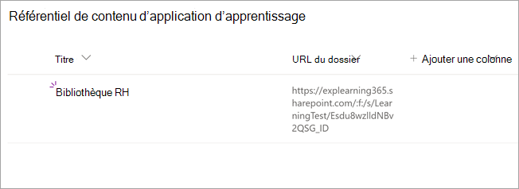

# Installer, gérer et attribuer des autorisations pour Microsoft Microsoft Microsoft Learning (prévisualisation privée)

*Cet article contient du contenu préliminaire pour Microsoft Learning, qui est en version d'évaluation privée.*

Microsoft Private Learning (pré-version préliminaire privée) permet aux équipes et aux membres de votre organisation de faire de l'apprentissage une partie naturelle de leur journée. L'application crée un hub central dans Teams où les employés peuvent partager, attribuer et apprendre des bibliothèques de contenu au sein de votre organisation.

Les administrateurs définissent des autorisations et autorisent les sources de contenu d'apprentissage pour Learning (prévisualisation privée). Le contenu d'apprentissage peut inclure LinkedIn Learning, Microsoft Learn, une formation Microsoft 365, le contenu de votre organisation stocké dans SharePoint Online et des fournisseurs tiers pris en charge par Learning Learning (prévisualisation privée).

## Rôles d'administrateur

Pour configurer Contrôle Learning (prévisualisation privée), vous devez obtenir les autorisations ci-après :

- Administrateur de Microsoft Teams
- Administrateur général de Microsoft 365 ou administrateur SharePoint
- Administrateur de connaissances : il s'agit d'un nouveau rôle dans le Centre d'administration Microsoft 365 qui peut être attribué à tous les membres de l'organisation. Ce rôle gère les sources de contenu pédagogique de l'organisation via le Centre d'administration Microsoft 365. 

> [!TIP]
> L'administrateur des connaissances doit être relativement technique et avoir des informations d'identification d'administrateur SharePoint, de préférence une personne qui a une bonne connaissance de l'enseignement, de l'apprentissage, de la formation ou de l'expérience des employés au niveau de l'organisation.
 
## Gérer Contrôle Learning (prévisualisation privée) dans le Centre d'administration Teams

L'administrateur Teams installe Contrôle Learning (prévisualisation privée) à partir du magasin d'applications, puis applique les stratégies de configuration, de gestion et d'autorisation via le Centre d'administration Teams.

### Gérer les paramètres pour Contrôle Learning (prévisualisation privée)

Vous devez être un administrateur du Centre d'administration Teams pour effectuer ces tâches.

Pour gérer les paramètres de Contrôle Learning, suivez les étapes suivantes :

1. Dans le panneau de navigation gauche du Centre d'administration Teams, allez à **l'application Teams** Gérer  >  **les applications.**

   

2. Dans la page **Gérer les applications,** dans la zone de recherche, tapez *Apprentissage* pour rechercher l'application Teams Learning (prévisualisation privée).

   

3. Sur la page **Apprentissage** :
   1. Sous **État,** **sélectionnez Autorisé** pour activer l'application.
   2. Sous **l'onglet Paramètres,** dans la section **Paramètres** des applications, allez au Centre d'administration Microsoft 365 pour configurer les sources de contenu d'apprentissage.

   

4. Après  avoir gérer les paramètres de l'application, accédez aux autorisations et aux stratégies de configuration pour accorder des **autorisations** aux employés qui doivent avoir accès à l'application dans le cadre de la participation de votre organisation à la prévisualisation privée.

> [!NOTE]
>  Si votre organisation fait partie de l'anneau 4.0 dans le cadre du programme Teams TAP100, vous devrez peut-être suivre les opérations suivantes pour permettre aux utilisateurs approuvés de l'anneau 3.0 d'accéder à Learning Learning (prévisualisation privée).

Dans le cadre de la prévisualisation privée, Learning (prévisualisation privée) est publié dans l'anneau 3.0. Si votre organisation est sous l'anneau 4.0, l'application n'est pas dans l'App Store. Pour tester l'application, vous devez créer une stratégie d'autorisation d'applications personnalisée, la définir sur Autoriser toutes les applications et l'affecter aux utilisateurs approuvés Ring 3.0.

   

## Configurer des sources de contenu d'apprentissage dans le Centre d'administration Microsoft 365

Les administrateurs du Centre d'administration Microsoft 365, seuls ou en leur attribuant le rôle d'administrateur des connaissances à des membres sélectionnés de votre organisation, peuvent gérer les paramètres relatifs à Learning Learning (prévisualisation privée) et configurer les sources de contenu d'apprentissage.

L'administrateur sélectionne les sources de contenu supplémentaires (par exemple, SharePoint ou les sources de fournisseurs de contenu tiers pris en charge) qui seront disponibles pour les utilisateurs de Cette formation (prévisualisation privée). L'administrateur configure ensuite ces sources pour s'assurer que le contenu est disponible pour la recherche et la découverte et peut être consulté par les employés qui utilisent Contrôle Learning (prévisualisation privée).

> [!NOTE]
>  Les utilisateurs se connectent aux apprentissages non-Microsoft et LinkedIn Learning Pro dans un navigateur ou une visionneuse incorporée. Cet apprentissage configuré est soumis aux conditions distinctes de licence, de confidentialité et de service entre votre organisation et le tiers, et non aux conditions générales de Cette formation (prévisualisation privée). Avant de sélectionner ce type d'apprentissage, vérifiez que vous avez un contrat en place pour votre organisation et les utilisateurs.

### Attribuer le rôle d'administrateur des connaissances [Facultatif]

Vous devez être un administrateur général Microsoft 365 pour effectuer ces tâches.

Pour désigner un administrateur des connaissances pour Contrôle Learning, suivez ces étapes :

1.  Dans le navigation gauche du Centre d'administration Microsoft 365, voir **Rôles.**

2.  Dans la page **Rôles,** sous **l'onglet Azure AD,** sélectionnez **Administrateur des connaissances.**
 
3.  Dans la page **Administrateur des** connaissances, dans la section **Administrateurs affectés,** sélectionnez **Ajouter,** puis ajoutez la personne que vous choisissez pour le rôle.

### Configurer les paramètres des sources de contenu d'apprentissage pour Learning Learning (aperçu privé)

Pour effectuer ces tâches, vous devez être administrateur général ou administrateur de connaissances Microsoft 365.

Pour configurer les paramètres des sources de contenu d'apprentissage dans Contrôle Learning, suivez ces étapes :

1.  Dans le panneau de navigation gauche du Centre d'administration Microsoft 365, allez dans  >  **Paramètres de l'organisation.**

2.  Dans la page **Paramètres de l'organisation,** sous l'onglet **Services,** sélectionnez **Application d'apprentissage (aperçu).**

     

3.  Dans le **panneau d'aperçu de** l'application d'apprentissage, sélectionnez les sources de contenu d'apprentissage que vous voulez configurer pour l'organisation, puis sélectionnez **Enregistrer.**

     

Parmi toutes les sources d’apprentissage existantes, certaines seront activées par défaut. Elles incluent les éléments suivants :

- LinkedIn Learning (contenu gratuit)
- Microsoft Learn
- Formation Microsoft 365

> [!NOTE]
> Si votre organisation a un abonnement LinkedIn Learning Standard ou Professionnel, le référentiel de contenu sera déverrouillé pour les employés de votre organisation. Seuls les employés autorisés pourront utiliser l’ensemble du référentiel de contenu.  D’autres sources doivent peut-être être activées ou configurées manuellement. Les sources d’apprentissage qui ne sont pas de Microsoft sont sous licence distinctes entre votre organisation et le tiers. Vous devrez vérifier que vous êtes inscrit à l’apprentissage pour vous et vos utilisateurs.

Pour activer ou désactiver une source de contenu d’apprentissage, activez la case à cocher en regard de la source. Si une source est activée, une coche est visible.

## Configurer SharePoint comme source de contenu d’apprentissage

Vous pouvez configurer SharePoint comme source de contenu d’apprentissage pour mettre à disposition le contenu de votre organisation dans Learning Learning (prévisualisation privée).

### Présentation

L’administrateur des connaissances (ou administrateur général) fournit une URL de site à laquelle le service d’apprentissage peut créer un emplacement centralisé vide, le référentiel de contenu des applications d’apprentissage, sous la forme d’une liste SharePoint structurée. Cette liste peut être utilisée par votre organisation pour contenir des liens vers des dossiers SharePoint entre entreprises contenant du contenu d’apprentissage. Les administrateurs sont responsables de la collecte et de l’organisation d’une liste d’URL pour les dossiers. Ces dossiers ne doivent inclure que du contenu qui peut être mis à disposition dans Nommé Learning (prévisualisation privée).

Contrôle Learning (aperçu privé) prend en charge les types de documents suivants :

- Word, PowerPoint, Excel, PDF
- Audio (.m4a)
- Vidéo (.mov, .mp4, .avi)

Pour plus d'informations, consultez [la documentation SharePoint Online.](https://docs.microsoft.com/sharepoint/introductionlink) 

### Autorisations

Les URL des dossiers de bibliothèque de documents peuvent être collectées à partir de n'importe quel site SharePoint de l'organisation. Cette version préliminaire (private preview) suit toutes les autorisations de contenu existantes. Par conséquent, seul le contenu pour lequel un utilisateur est autorisé à accéder est accessible et accessible dans Learning (aperçu privé). Tout contenu de ces dossiers pourra faire l'effet d'une recherche, mais seul le contenu auquel l'employé dispose des autorisations individuelles peut être utilisé.

La suppression du contenu du référentiel de votre organisation n'est pas prise en charge pour le moment.

Pour supprimer le contenu accidentellement surface, suivez ces étapes :

1.  Pour restreindre l'accès à la bibliothèque de documents, sélectionnez l'option **Afficher les actions,** puis **sélectionnez Gérer l'accès.**
     
     

2.  Supprimez le document d'origine dans la bibliothèque de documents.

Pour plus d'informations, [voir Partage et autorisations dans l'expérience moderne de SharePoint.](https://docs.microsoft.com/sharepoint/modern-experience-sharing-permissions) 

### Service d'apprentissage

Le service d'apprentissage utilise les URL des dossiers fournis pour obtenir les métadonnées de tout le contenu stocké dans ces dossiers. Dans les 24 heures après avoir fournissé l'URL du dossier dans le référentiel centralisé, les employés peuvent rechercher et utiliser le contenu de votre organisation dans Cette formation (prévisualisation privée). Toutes les modifications apportées au contenu, y compris les métadonnées et les autorisations mises à jour, seront également appliquées dans le service d'apprentissage dans les 24 heures.

### Configurer SharePoint en tant que source

Pour effectuer ces tâches, vous devez être un administrateur général, un administrateur SharePoint ou un administrateur de connaissances Microsoft 365.

Pour configurer SharePoint en tant que sources de contenu d'apprentissage pour Learning Learning (prévisualisation privée), suivez ces étapes :

1.  Dans le panneau de navigation gauche du Centre d'administration Microsoft 365, allez dans  >  **Paramètres de l'organisation.**
 
2.  Dans la page **Paramètres de l'organisation,** sous l'onglet **Services,** sélectionnez **Application d'apprentissage (aperçu).**

     

3.  Dans le panneau de l'application d'apprentissage **(prévisualisation),** sous **SharePoint,** fournissez l'URL du site vers le site SharePoint où vous souhaitez que Contrôle Learning crée un référentiel centralisé.

     

4.  Une liste SharePoint est créée automatiquement dans le site SharePoint fourni.

     

     Dans le navigation gauche du site SharePoint, sélectionnez Référentiel de **contenu d'application** d'apprentissage pour le  >  **contenu du site.** 

      

5. Dans la page **Référentiel** de contenu d'application d'apprentissage, insérez la liste SharePoint avec des URL vers les dossiers de contenu d'apprentissage.

   1. Sélectionnez Nouveau pour afficher **le panneau Nouvel** élément.  

       
 
   2. Dans le **panneau Nouvel élément,** dans le champ **Titre,** ajoutez le nom d'annuaire de votre choix. Dans le champ **URL du** dossier, ajoutez l'URL au dossier de contenu d'apprentissage. Sélectionnez **Enregistrer**.

       

   3. La page **référentiel de contenu des** applications d'apprentissage est mise à jour avec le nouveau contenu d'apprentissage.

       

> [!NOTE]
> Pour permettre un accès plus large au référentiel de contenu des applications d'apprentissage, un lien vers la liste sera bientôt disponible dans l'interface (prévisualisation privée) de Ces derniers, où les utilisateurs pourront demander l'accès et, finalement, vous aider à remplir la liste. Les propriétaires de site et les administrateurs globaux seront requis pour accorder l'accès à la liste. Access est spécifique à la liste uniquement et ne s'applique pas au site où la liste est stockée.

### Curation de la bibliothèque de documents d'URL de dossier

Les métadonnées par défaut (telles que la date de modification, créée par, le nom du document, le type de contenu et le nom de l'organisation) sont automatiquement extraites dans Le Learning (aperçu privé) par l'API Microsoft Graph.
 
Pour améliorer la pertinence globale de la découverte et de la recherche du contenu, nous vous recommandons d'ajouter une **colonne Description.**

Pour ajouter une colonne **Description** à la page de la bibliothèque de documents, suivez ces étapes :

1.  Dans la page **Documents,** **sélectionnez Ajouter une colonne.**

2. Sélectionnez **l'option Afficher** les actions, puis **sélectionnez Une seule ligne de texte.**

     

3. Dans le **panneau Créer une colonne,** dans **le** champ Nom, ajoutez un nom descriptif pour la colonne. Sélectionnez **Enregistrer**.

     
 
4. Dans la page **Documents,** dans la **colonne Description,** ajoutez des descriptions personnalisées pour chaque élément. Si aucune description n'est fournie, Cette option fournit un message par défaut qui met en évidence le contenu provenant de votre propre bibliothèque SharePoint. 

     
 
