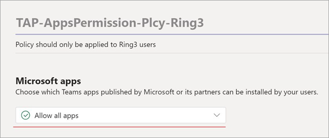
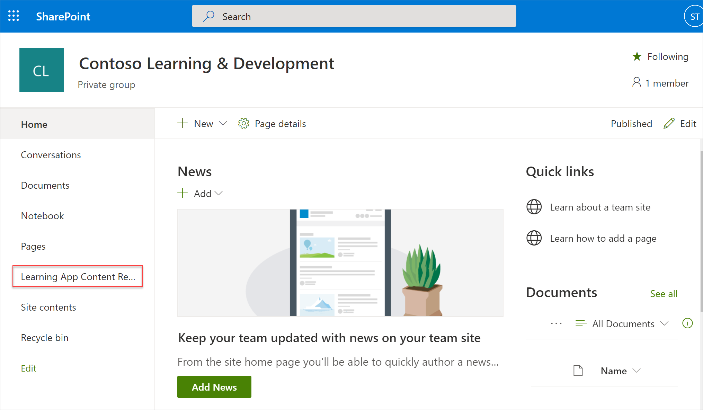

# Installer, gérer et attribuer des autorisations pour l’application Teams Learning (prévisualisation privée)Install, manage, and assign permissions for the Teams Learning app (private preview)

*Cet article contient du contenu préliminaire pour l’application Teams Learning, qui est en version d’évaluation privée.**This article contains preliminary content for the Teams Learning app, which is in private preview.*

L’application Microsoft Teams Learning (pré-version préliminaire privée) permet aux équipes et aux membres de votre organisation de faire de l’apprentissage une partie naturelle de leur journée.The Microsoft Teams Learning app (private preview) empowers teams and individuals in your organization to make learning a natural part of their day. L’application crée un hub central dans Teams dans lequel les employés peuvent partager, attribuer et apprendre des bibliothèques de contenu au sein de votre organisation.The app creates a central hub in Teams where employees can share, assign, and learn from content libraries across your organization. Les administrateurs définissent des autorisations et autorisent les sources de contenu d’apprentissage pour l’application.Admins set permissions and allow learning content sources for the app. Le contenu d’apprentissage peut inclure LinkedIn Learning, Microsoft Learn, une formation Microsoft 365, le contenu de votre organisation stocké dans SharePoint Online et des fournisseurs tiers pris en charge par l’application.Learning content can include LinkedIn Learning, Microsoft Learn, Microsoft 365 training, your organization's own content stored in SharePoint online, and third-party providers that are supported by the app.

Pour configurer l’application Teams Learning (prévisualisation privée), vous devez impliquer :To set up the Teams Learning app (private preview), you'll need to involve:

-   Administrateur du Centre d’administration TeamsTeams admin center admin
-   Administrateur du Centre d’administration Microsoft 365 (autrement dit, administrateur global)Microsoft 365 admin center admin (that is, a global admin)

## Gérer l’application Teams Learning (prévisualisation privée) dans le Centre d’administration TeamsManage the Teams Learning app (private preview) in the Teams admin center

L’administrateur Teams installe l’application Teams Learning (prévisualisation privée) à partir du magasin d’applications et applique les stratégies de configuration, de gestion et d’autorisations de l’application via le Centre d’administration Teams.The Teams admin installs the Teams Learning app (private preview) from the app store and applies app setup, manage, and permissions policies through the Teams admin center.

### Gérer l’application Teams Learning (prévisualisation privée)Manage the Teams Learning app (private preview)

Pour gérer les paramètres de l’application, suivez ces étapes :To manage settings for app, follow these steps:

1. Dans le panneau de navigation gauche du Centre d’administration Microsoft Teams, allez à **l’application Teams** Gérer  >  **les applications.**In the left navigation of the Microsoft Teams admin center, go to **Teams apps** > **Manage apps**.

   

2. Dans la page **Gérer les applications,** dans la zone de recherche, tapez *Apprentissage* pour rechercher l’application Teams Learning (prévisualisation privée).On the **Manage apps** page, in the search box, type *learning* to search for the Teams Learning app (private preview).

   

3. Sur la page **Apprentissage** :On the **Learning** page:
   1. Sous **État,** **sélectionnez Autorisé** pour activer l’application.Under **Status**, select **Allowed** to turn on the app.
   2. Sous **l’onglet Paramètres,** dans la section **Paramètres** des applications, allez au Centre d’administration Microsoft 365 pour configurer les sources de contenu d’apprentissage.On the **Settings** tab, in the **App settings** section, go to the Microsoft 365 admin center to configure learning content sources.

   

4. Après  avoir gérer les paramètres de l’application, accédez aux autorisations et aux stratégies de configuration pour accorder des **autorisations** aux employés qui doivent avoir accès à l’application dans le cadre de la participation de votre organisation à la prévisualisation privée.After **Manage app** settings, go to **Permissions and Set-up policies** to grant permission to employees who should have access to the app as part of your organization's participation in the private preview.

> [!NOTE]
>  Si votre organisation fait partie de l’anneau 4.0 dans le cadre du programme Teams TAP100, vous devrez peut-être faire ce qui suit pour permettre aux utilisateurs approuvés de l’anneau 3.0 d’accéder à l’application Teams Learning (prévisualisation privée).If your organization is in Ring 4.0 as part of Teams TAP100 program, you might need to do the following to enable approved users in Ring 3.0 to access the Teams Learning app (private preview).

Dans le cadre de la prévisualisation privée, l’application Teams Learning (prévisualisation privée) est publiée dans l’anneau 3.0.As part of private preview, the Teams Learning app (private preview) is released in Ring 3.0. Si votre organisation est sous l’anneau 4.0, l’application n’est pas dans l’App Store.If your organization is in Ring 4.0, you won’t see the app in the app store. Pour tester l’application, vous devez créer une stratégie d’autorisation d’applications personnalisée, la définir sur Autoriser toutes les applications et l’affecter aux utilisateurs approuvés Ring 3.0.To test the app, you need to create a custom apps permission policy, set it to **Allow all apps**, and assign it to Ring 3.0 approved users.

   

## Configurer des sources de contenu d’apprentissage dans le Centre d’administration Microsoft 365Configure learning content sources in the Microsoft 365 admin center

Les administrateurs du Centre d’administration Microsoft 365 peuvent gérer les paramètres liés à l’application Teams Learning (prévisualisation privée) et configurer les sources de contenu d’apprentissage.The admins for the Microsoft 365 admin center can manage settings related to the Teams Learning app (private preview) and can configure the learning content sources.

L’administrateur peut sélectionner les sources de contenu d’apprentissage supplémentaires (par exemple, SharePoint ou les sources de fournisseurs de contenu tiers pris en charge) qui seront disponibles pour les utilisateurs de l’application.The admin can select which additional learning content sources (for example, SharePoint or supported third-party content provider sources) will be available to users of the app. L’administrateur configure ensuite ces sources pour s’assurer que le contenu est disponible pour la recherche et la découverte et peut être consulté par les employés qui utilisent l’application.The admin then configures those sources to make sure the content is available for search and discovery and can be browsed by the employees who use the app.

> [!NOTE]
>  Les utilisateurs se connectent aux apprentissages non-Microsoft et LinkedIn Learning Pro dans un navigateur ou une visionneuse incorporée.Users sign in to non-Microsoft and LinkedIn Learning Pro learnings in a browser or embedded viewer. Cet apprentissage configuré est soumis aux conditions distinctes de licence, de confidentialité et de service entre votre organisation et le tiers, et non aux conditions d’apprentissage (prévisualisation).This configured learning is subject to the separate license, privacy and service terms between your organization and the third party, and not the Learning (Preview) terms. Avant de sélectionner cet apprentissage dans Learning (Preview), vérifiez que vous avez un contrat en place pour votre organisation et les utilisateurs.Before selecting this learning in Learning (Preview), verify you have an agreement in place for your organization and users.

### Configurer les paramètres des sources de contenu d’apprentissage pour l’applicationConfigure settings for the learning content sources for the app

Ces étapes doivent être effectuées par l’administrateur Microsoft 365.These steps are to be performed by the Microsoft 365 admin.

1.  Dans le panneau de navigation gauche du Centre d’administration Microsoft 365, allez dans  >  **Paramètres de l’organisation.**In the left navigation of the Microsoft 365 admin center, go to **Settings** > **Org settings**.

2.  Dans la page **Paramètres,** dans l’onglet & des **modules,** sélectionnez **Application d’apprentissage.**On the **Settings** page, on the **Services & add-ins** tab, select **Learning app**.

   

3.  Dans le **panneau Application d’apprentissage,** sélectionnez les sources de contenu d’apprentissage que vous voulez configurer pour l’organisation, puis **sélectionnez Enregistrer.**On the **Learning app** panel, select the learning content sources you want to configure for the organization, and then select **Save**.

   

Parmi toutes les sources d’apprentissage existantes, certaines seront activées par défaut.Among all the learning sources that exist, some will be enabled by default. Elles incluent les éléments suivants :These include:

- LinkedIn Learning (contenu gratuit)LinkedIn Learning (free content)
- Microsoft LearnMicrosoft Learn
- Formation Microsoft 365Microsoft 365 Training

> [!NOTE]
> Si votre organisation a un abonnement LinkedIn Learning Standard ou Professionnel, le référentiel de contenu sera déverrouillé pour les employés de votre organisation.If your organization has a LinkedIn Learning Standard or Pro subscription, the content repository will be unlocked for the employees in your organization. Seuls les employés autorisés pourront utiliser l’ensemble du référentiel de contenu.Only those employees who have permission will be able to use the entire content repository.

D’autres sources doivent peut-être être activées ou configurées manuellement.Other sources might need to be enabled or configured manually. Les sources d’apprentissage qui ne sont pas de Microsoft sont sous licence distinctes entre votre organisation et le tiers.Learning sources that are not from Microsoft are separately licensed between your organization and the third party. Vous devrez vérifier que vous êtes inscrit à l’apprentissage pour vous et vos utilisateurs.You’ll need to verify you’ve signed up for their learning for you and your users.

Pour activer ou désactiver une source de contenu d’apprentissage, activez la case à cocher en regard de la source.To enable or disable a learning content source, select the check box next to the source. Si une source est activée, une coche est visible.If a source is enabled, a check mark will be visible.

## Configurer SharePoint comme source de contenu d’apprentissage (bientôt disponible)Configure SharePoint as a learning content source (Coming Soon)

Vous configurez SharePoint comme source de contenu d’apprentissage pour l’application Teams Learning (prévisualisation privée) dans le Centre d’administration Microsoft 365.You configure SharePoint as a learning content source for the Teams Learning app (private preview) in the Microsoft 365 admin center.

### PrésentationOverview

L’administrateur fournit une URL de site dans laquelle le service d’apprentissage peut créer un référentiel de contenu d’apprentissage centralisé vide sous la forme d’une liste SharePoint structurée.The admin provides a site URL to where the Learning Service can create an empty centralized learning content repository in the form of a structured SharePoint list. Cette liste peut être utilisée par l’organisation pour contenir des liens vers des dossiers SharePoint entre entreprises contenant du contenu pédagogique.This list can be used by the organization to house links to cross-company SharePoint folders that contain learning content. Les administrateurs sont responsables de la collecte et de l’organisation d’une liste d’URL pour les dossiers.Admins are responsible for collecting and curating a list of URLs for folders. Ces dossiers doivent inclure uniquement le contenu qui peut être mis à disposition dans l’application Teams Learning (prévisualisation privée).These folders should only include content that can be made available in the Teams Learning app (private preview).

### AutorisationsPermissions

Les URL des dossiers peuvent être collectées à partir de n’importe quel site SharePoint de l’organisation.Folder URLs can be collected from any SharePoint site in the organization. Tout contenu de ces dossiers pourra faire l’effet d’une recherche, mais seul le contenu auquel l’employé dispose des autorisations individuelles peut être utilisé.Any content within these folders will be searchable, but only content to which the individual employee has permissions can be used.
 
### Service d’apprentissageLearning Service

Le service d’apprentissage utilise les URL des dossiers fournis pour obtenir les métadonnées de tout le contenu stocké dans ces dossiers.The Learning Service uses the provided folder URLs to get metadata from all content stored in those folders. Après 24 heures de fourniture de l’URL du dossier dans le référentiel centralisé, les employés peuvent rechercher et utiliser le contenu de l’entreprise au sein de l’application.Within 24 hours of supplying the folder URL in the centralized repository, employees can search for and use the company’s content within the app. À ce stade, la suppression du contenu du référentiel n’est pas prise en charge.Content deletion from the repository isn't supported at this point. Le contenu accidentellement surface ne peut être supprimé qu’en fournissant une nouvelle URL de site SharePoint dans le Centre d’administration Microsoft 365.Unintentionally surfaced content can only be removed by supplying a new SharePoint site URL in the Microsoft 365 admin center.

### Configurer SharePoint en tant que sourceConfigure SharePoint as a source

Ces étapes doivent être effectuées par l’administrateur Microsoft 365.These steps are to be performed by Microsoft 365 admin.

1.  Dans le panneau de navigation gauche du Centre d’administration Microsoft 365, allez dans **Paramètres.**In the left navigation of the Microsoft 365 admin center, go to **Settings**.
 
2.  Dans la page **Paramètres,** dans l’onglet & des **modules,** sélectionnez **Application d’apprentissage.**On the **Settings** page, on the **Services & add-ins** tab, select **Learning app**.

   

3.  Dans le **panneau Application d’apprentissage,** fournissez l’URL du site au site SharePoint où vous souhaitez que l’application crée un référentiel centralisé.On the **Learning app** panel, provide the site URL to the SharePoint site where you want the app to create a centralized repository.

   

4.  Une liste SharePoint est créée automatiquement dans le site SharePoint de l’organisation fournie.A SharePoint list is created automatically within the provided organization’s SharePoint site. Dans le navigation gauche du site SharePoint, sélectionnez Référentiel de **contenu d’application d’apprentissage.**In the left navigation of the SharePoint site, select **Learning App Content Repository**. 

   

 
5. Dans la page **Référentiel** de contenu d’application d’apprentissage, insérez la liste SharePoint avec des URL dans les dossiers de contenu d’apprentissage.On the **Learning App Content Repository** page, populate the SharePoint list with URLs to the learning content folders.

   1.   Sélectionnez Nouveau pour afficher **le panneau Nouvel** élément. Select **New** to view the **New item** panel. 

   
 
   2.   Dans le **panneau Nouvel élément,** dans le champ **Titre,** ajoutez le nom d’annuaire de votre choix.On the **New item** panel, in the **Title** field, add a directory name of your choice. Dans le champ **URL du** dossier, ajoutez l’URL au dossier de contenu d’apprentissage.In the **Folder URL** field, add the URL to the learning content folder. Sélectionnez **Enregistrer**.Select **Save**.

   

   3. La page référentiel de contenu des applications d’apprentissage est mise à jour avec le nouveau contenu d’apprentissage.The Learning App Content Repository page is updated with the new learning content.

   

 

