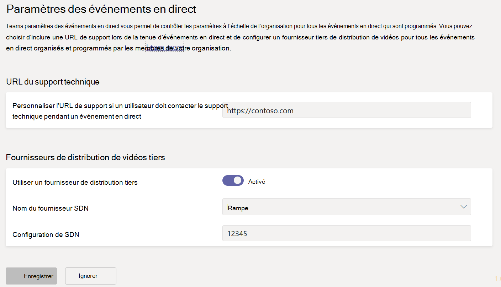
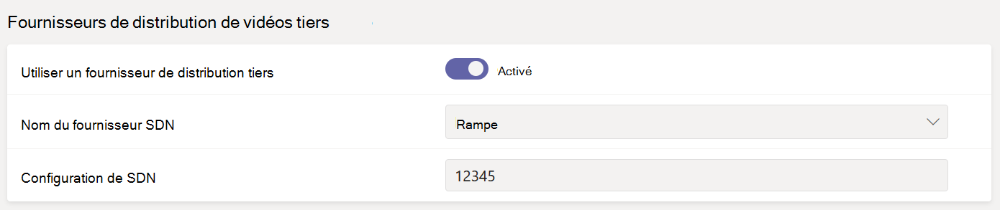

# <a name="configure-live-event-settings-in-microsoft-teams"></a>Configurer les paramètres d’événements en direct dans Microsoft Teams

Utilisez Teams paramètres d’événements en direct pour configurer les paramètres des événements en direct qui se tiennent dans votre organisation. Vous pouvez configurer une URL de prise en charge et configurer un fournisseur de distribution de vidéos tiers. Ces paramètres s’appliquent à tous les événements en direct créés dans votre organisation.

Vous pouvez facilement gérer ces paramètres dans le Centre d’administration Microsoft Teams’administration. Dans le navigation de gauche, allez aux **paramètres d’événements**  >  **live Meetings.**



## <a name="set-up-event-support-url"></a>Configurer l’URL de prise en charge des événements

Cette URL est affichée aux participants à l’événement en direct. Ajoutez l’URL de support pour votre organisation afin que les participants voient le support technique pendant un événement en direct.

### <a name="using-the-microsoft-teams-admin-center"></a>Utiliser le centre d’administration Microsoft Teams

1. Dans la barre de navigation de gauche, allez **aux paramètres de l’événement Meetings**  >  **Live event.**
2. Sous **URL du support technique,** entrez l’URL du support technique de votre organisation.

    

### <a name="using-windows-powershell"></a>Reportez-vous à la rubrique Envoyer un message électronique à un utilisateur avec leurs informations de conférence Audio.

Exécutez la commande suivante :

```PowerShell
Set-CsTeamsMeetingBroadcastConfiguration -SupportURL “{your URL}”
```
Pour plus d’informations, [voir Set-CsTeamsMeetingBroadcastConfiguration.](/powershell/module/skype/set-csteamsmeetingbroadcastconfiguration?view=skype-ps&preserve-view=true)
## <a name="configure-a-third-party-video-distribution-provider"></a>Configurer un fournisseur de distribution de vidéos tiers 

Si vous avez acheté et configuré une solution de réseau (SDN) définie par le logiciel ou de réseau de distribution de contenu d’entreprise (ECDN) via un partenaire de distribution de vidéos Microsoft, configurez le fournisseur pour les événements en direct dans Teams. 

### <a name="using-the-microsoft-teams-admin-center"></a>Utiliser le centre d’administration Microsoft Teams

1. Dans la barre de navigation de gauche, allez **aux paramètres de l’événement Meetings**  >  **Live event.**
2. Sous **Fournisseurs de distribution de vidéos tiers,** remplissez les conditions suivantes : 

    

    - **Utiliser un fournisseur de distribution tiers** Activez cette fonction pour activer le fournisseur de distribution de vidéos tiers.
    - **Nom du fournisseur SDN** Choisissez le fournisseur que vous utilisez.
    - **Configuration de SDN** Entrez les détails de la configuration SDN.
        
### <a name="using-windows-powershell"></a>Reportez-vous à la rubrique Envoyer un message électronique à un utilisateur avec leurs informations de conférence Audio.
Obtenez l’ID de licence ou le modèle d’API et le modèle d’API auprès de votre fournisseur, puis exécutez l’une des solutions suivantes, selon le fournisseur que vous utilisez :

**Hive** 
```PowerShell
Set-CsTeamsMeetingBroadcastConfiguration -AllowSdnProviderForBroadcastMeeting $True -SdnProviderName hive -SdnLicenseId {license ID GUID provided by Hive} -SdnApiTemplateUrl “{API template URL provided by Hive}”
```
**Kollective** 
```PowerShell
Set-CsTeamsMeetingBroadcastConfiguration -AllowSdnProviderForBroadcastMeeting $True -SdnProviderName kollective -SdnApiTemplateUrl "{API template URL provided by Kollective}" -SdnApiToken {API token GUID provided by Kollective}
```
**Riverbed** 
```PowerShell
Set-CsTeamsMeetingBroadcastConfiguration -AllowSdnProviderForBroadcastMeeting $True -SdnProviderName riverbed -SdnApiTemplateUrl "{API template URL provided by Riverbed}" -SdnApiToken {API token GUID provided by Riverbed}
```
**Ramp** 
```PowerShell
Set-CsTeamsMeetingBroadcastConfiguration -AllowSdnProviderForBroadcastMeeting $True -SdnProviderName ramp -SdnRuntimeConfiguration "{Configuration provided by RAMP}"
```
**Peer5**
```PowerShell
Set-CsTeamsMeetingBroadcastConfiguration -AllowSdnProviderForBroadcastMeeting $True -SdnProviderName peer5 -SdnLicenseId {peer5CustomerId}
```

Pour plus d’informations, [voir Set-CsTeamsMeetingBroadcastConfiguration.](/powershell/module/skype/set-csteamsmeetingbroadcastconfiguration?view=skype-ps&preserve-view=true)

> [!NOTE]
> Si vous prévoyez de créer des événements en direct à l’aide d’une application ou d’un appareil externe, vous devrez également configurer votre fournisseur [eCDN avec Microsoft Stream.](/stream/network-caching) 

>[!Note]
> Le passage de Microsoft Stream à [OneDrive Entreprise et SharePoint pour les enregistrements de réunion](../tmr-meeting-recording-change.md) est une approche à différentes étapes. Au lancement, vous aurez la possibilité de choisir cette expérience. En novembre vous devrez quitter cette option si vous souhaitez poursuivre avec Stream et, au début de 2021 nous exigerons de tous les clients l’utilisation de OneDrive Entreprise et SharePoint pour les nouveaux enregistrements de réunion.

>[!Note]
> Votre solution eCDN choisie est soumise aux conditions d’utilisation et à la politique de confidentialité du fournisseur tiers sélectionné, qui régissent votre utilisation de la solution du fournisseur eCDN. Votre utilisation de la solution du fournisseur eCDN ne sera pas soumise aux conditions de licence en volume ou aux conditions des services en ligne de Microsoft. Si vous n’acceptez pas les conditions du fournisseur tiers, n’activez pas la solution eCDN dans Microsoft Teams.

### <a name="related-topics"></a>Sujets associés
- [Que sont les événements en direct Teams ?](what-are-teams-live-events.md)
- [Offre pour les événements en direct Teams](plan-for-teams-live-events.md)
- [Configurer les événements en direct Teams](set-up-for-teams-live-events.md)
