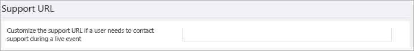

# <a name="configure-live-event-settings-in-microsoft-teams"></a>Configurer les paramètres d’événements en direct dans Microsoft Teams

Utilisez les paramètres d’événements en direct Teams pour configurer les paramètres des événements en direct qui sont organisés dans votre organisation. Vous pouvez configurer une URL de support et un fournisseur de distribution vidéo tiers. Ces paramètres s’appliquent à tous les événements en direct créés dans votre organisation.

Vous pouvez facilement gérer ces paramètres dans le Centre d’administration Microsoft Teams. Dans le volet de navigation de gauche, accédez à **Réunions** > **Paramètres des événements en direct**.


## <a name="set-up-event-support-url"></a>Configurer l’URL de prise en charge des événements

Cette URL s’affiche pour les participants à l’événement en direct. Ajoutez l’URL de support de votre organisation pour permettre aux participants de contacter le support pendant un événement en direct.

### <a name="using-the-microsoft-teams-admin-center"></a>Utiliser le centre d’administration Microsoft Teams

1. Dans le volet de navigation de gauche, accédez à **Réunions** > **Paramètres de l’événement en direct**.
2. Sous **URL de support**, entrez l’URL de support de votre organisation.

    

### <a name="using-windows-powershell"></a>Reportez-vous à la rubrique Envoyer un message électronique à un utilisateur avec leurs informations de conférence Audio.

Exécutez la commande suivante :

```PowerShell
Set-CsTeamsMeetingBroadcastConfiguration -SupportURL “{your URL}”
```

Pour plus d’informations, consultez [Set-CsTeamsMeetingBroadcastConfiguration](/powershell/module/skype/set-csteamsmeetingbroadcastconfiguration?view=skype-ps&preserve-view=true).

## <a name="configure-a-third-party-video-distribution-provider"></a>Configurer un fournisseur de distribution vidéo tiers

Si vous avez acheté et configuré une solution de réseau à définition logicielle (SDN) ou une solution de réseau de distribution de contenu d’entreprise (eCDN) via un partenaire de distribution de vidéos Microsoft, configurez le fournisseur pour les événements en direct dans Teams.

### <a name="using-the-microsoft-teams-admin-center"></a>Utiliser le centre d’administration Microsoft Teams

1. Dans le volet de navigation de gauche, accédez à **Réunions** > **Paramètres de l’événement en direct**.
2. Sous **Fournisseurs de distribution vidéo tiers**, effectuez les opérations suivantes :

    

    - **Fournisseur de distribution tiers** Activez cette option pour activer le fournisseur de distribution vidéo tiers.
    - **Nom du fournisseur SDN** Choisissez le fournisseur que vous utilisez.
    - **Configuration SDN** Entrez les détails de la configuration SDN.

### <a name="using-windows-powershell"></a>Reportez-vous à la rubrique Envoyer un message électronique à un utilisateur avec leurs informations de conférence Audio.

Obtenez l’ID de licence ou le jeton d’API et le modèle d’API de votre contact fournisseur, puis exécutez l’une des opérations suivantes, en fonction du fournisseur que vous utilisez :

**Microsoft eCDN**
```PowerShell
Set-CsTeamsMeetingBroadcastConfiguration -AllowSdnProviderForBroadcastMeeting $True -SdnProviderName microsoft
```
**Hive** 
```PowerShell
Set-CsTeamsMeetingBroadcastConfiguration -AllowSdnProviderForBroadcastMeeting $True -SdnProviderName hive -SdnLicenseId {license ID GUID provided by Hive} -SdnApiTemplateUrl “{API template URL provided by Hive}”
```
**Kollective** 
```PowerShell
Set-CsTeamsMeetingBroadcastConfiguration -AllowSdnProviderForBroadcastMeeting $True -SdnProviderName kollective -SdnApiTemplateUrl "{API template URL provided by Kollective}" -SdnApiToken {API token GUID provided by Kollective}
```
**Riverbed** 
```PowerShell
Set-CsTeamsMeetingBroadcastConfiguration -AllowSdnProviderForBroadcastMeeting $True -SdnProviderName riverbed -SdnApiTemplateUrl "{API template URL provided by Riverbed}" -SdnApiToken {API token GUID provided by Riverbed}
```
**Ramp** 
```PowerShell
Set-CsTeamsMeetingBroadcastConfiguration -AllowSdnProviderForBroadcastMeeting $True -SdnProviderName ramp -SdnRuntimeConfiguration "{Configuration provided by RAMP}"
```

Pour plus d’informations, consultez [Set-CsTeamsMeetingBroadcastConfiguration](/powershell/module/skype/set-csteamsmeetingbroadcastconfiguration?view=skype-ps&preserve-view=true).

> [!NOTE]
> Si vous envisagez de créer des événements en direct à l’aide d’une application ou d’un appareil externe, vous devez également [configurer votre fournisseur eCDN](../teams-stream-ecdn.md).

>[!Note]
> La solution eCDN choisie est soumise aux conditions d’utilisation et à la politique de confidentialité du fournisseur tiers sélectionné, qui régissent votre utilisation de la solution du fournisseur eCDN. Votre utilisation de la solution du fournisseur eCDN ne sera pas soumise aux termes du contrat de licence en volume Microsoft ni aux conditions des services en ligne. Si vous n’acceptez pas les conditions du fournisseur tiers, n’activez pas la solution eCDN dans Microsoft Teams.

### <a name="related-topics"></a>Rubriques connexes

- [Que sont les événements en direct Teams ?](what-are-teams-live-events.md)
- [Offre pour les événements en direct Teams](plan-for-teams-live-events.md)
- [Configurer les événements en direct Teams](set-up-for-teams-live-events.md)
