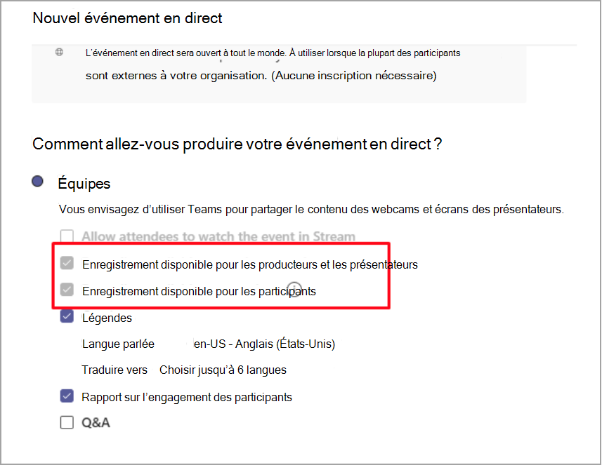

# Stratégies d’enregistrement d’événements en direct dans Microsoft Teams

Plusieurs options s’offrent à vous pour enregistrer un événement en direct Microsoft Teams. Les options d’enregistrement sont définies à l’aide de stratégies d’enregistrement. Cet article décrit les différents paramètres.

Les options d’enregistrement sont définies à l’aide de la commande PowerShell [Set-CsTeamsMeetingBroadcastPolicy](/powershell/module/skype/set-csteamsmeetingbroadcastpolicy?view=skype-ps)

## Planification et comportements des options

Deux options d’organisateur sont disponibles lors de la planification de l’enregistrement d’un événement en direct :

- Enregistrement disponible pour les producteurs et les présentateurs

  - Fichier d’enregistrement : fournit un fichier d’enregistrement que les producteurs et les présentateurs peuvent télécharger une fois l’événement terminé.

- Enregistrement disponible pour les participants

  - DVR : un enregistreur vidéo numérique (DVR) permet aux participants de rembobiner et de suspendre pendant l’événement

  - VOD : une vidéo à la demande permet aux participants de les regarder une fois l’événement terminé

## Paramètre de stratégie d’enregistrement de diffusion

Dans le cadre de la stratégie de diffusion, vous pouvez activer ou désactiver l’enregistrement d’un événement en direct à partir d’un paramètre.

|                                 | Enregistrement disponible pour les producteurs et les présentateurs | Enregistrement disponible pour les participants |
| ------------------------------- | ---------------------------------------------------- | ------------------------------------- |
| Toujours enregistrer               | Désactivé et sélectionné                                | Activé et sélectionné         |
| L’organisateur peut enregistrer ou non | Activé et sélectionné par défaut                  | Activé et sélectionné par défaut   |
| N’enregistrez jamais               | Désactivé et non sélectionné                            | Activé et non sélectionné      |

Lorsque la stratégie est définie sur **Toujours enregistrer,** la page de stratégie possède les options sélectionnées suivantes :

## Comportement de stockage et de persistance

| Option                                       | État   | DVR                                                   | VOD                                                     | Enregistrement                |
| ------------------------------------------------ | ------------ | --------------------------------------------------------- | ----------------------------------------------------------- | ---------------------------- |
| Enregistrement disponible pour les producteurs et les présentateurs | Sélectionné     | DVR est disponible et le bien Azure Media Services (AMS) est stocké pendant 180 jours | Les participants peuvent accéder à l’événement et le regarder                     |                              |
|                                                  | Non sélectionné | DVR est disponible et le bien AMS est stocké pendant 180 jours | Le participant ne sera pas autorisé à accéder à l’événement une fois celui-ci terminé |                              |
||Désactivé (non sélectionné)|DVR est disponible et l’actif AMS est supprimé après l’événement|Le participant ne sera pas autorisé à accéder à l’événement une fois celui-ci terminé||
| Enregistrement disponible pour les producteurs et les présentateurs | Sélectionné     |                                                           |                                                             | Un mp4 est créé et stocké |
|                                                  | Non sélectionné |                                                           |                                                             | Aucun fichier n’est créé           |

### Sujets associés

- [Comprendre un événement en direct Teams](what-are-teams-live-events.md)
- [Offre pour les événements en direct Teams](plan-for-teams-live-events.md)
- [Configurer les paramètres d’événements en direct dans Teams](configure-teams-live-events.md)
- [Enregistrement de réunion en nuages dans Teams](../cloud-recording.md)