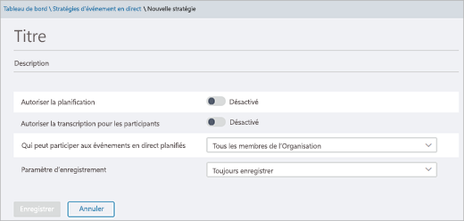

# Configurer des événements en direct dans Microsoft Teams

Pour configurer des événements en direct, vous devez suivre plusieurs étapes.

## Étape 1 : configurer votre réseau pour les événements en direct dans Teams

Les événements en direct créés dans Teams nécessitent que vous [prépariez le réseau de votre organisation pour Teams](../prepare-network.md).  

## Étape 2 : obtenir et attribuer des licences

Assurez-vous que vous disposez des affectations de licence appropriées pour définir [qui peut créer et planifier des événements en direct](plan-for-teams-live-events.md#who-can-attend-create-and-schedule-live-events) et [qui peut visionner des événements en direct](plan-for-teams-live-events.md#who-can-watch-live-events).

## Etape 3 : configurer des stratégies d’événements en direct

Les stratégies d’événements en direct sont utilisées pour contrôler qui dans votre organisation peut organiser des événements en direct et les fonctionnalités disponibles pour les événements qu’ils créent. Vous pouvez utiliser la stratégie par défaut ou créer une ou plusieurs stratégies d’événements en direct personnalisées. Une fois que vous avez créé une stratégie personnalisée, attribuez-la à un utilisateur ou à des groupes d’utilisateurs au sein de votre organisation.

> [!NOTE]
> Les utilisateurs de votre organisation auront la stratégie globale (à l’échelle de l’organisation par défaut), sauf si vous créez et attribuez une stratégie personnalisée. Par défaut, dans la stratégie globale, la planification des événements en direct est activée pour les utilisateurs de Teams ; les sous-titres en direct et les sous-titres (transcription) sont désactivés ; tous les membres de l’organisation peuvent participer aux événements en direct et le paramètre d’enregistrement est défini sur toujours enregistrer.

### Créer ou modifier une stratégie d’événements en direct

1. Dans le navigation gauche du centre Microsoft Teams d’administration, allez à **stratégies d’événements**  >  **en direct Meetings.**
2. Faites l’une des options suivantes :

    - Si vous voulez modifier la stratégie par défaut existante, sélectionnez **Globale (par défaut à l’échelle de l’organisation)**.
    - Si vous voulez créer une stratégie personnalisée, sélectionnez **Ajouter.**
    - Si vous voulez modifier une stratégie personnalisée, sélectionnez-la, puis choisissez **Modifier**.

    Voici les paramètres que vous pouvez modifier en fonction des besoins de votre organisation.

    

|Paramètres  |Description  |
|---------|---------|
|**Titre**     |Il s’agit du titre de la stratégie qui apparaît sur la page stratégies d’événements en direct. Le nom ne doit pas dépasser 64 caractères et ne peut pas contenir de caractères spéciaux.          |
|**Description**    |Utilisez ce paramètre pour ajouter une description informelle de la stratégie.         |
|**Autoriser la planification**     |L’activation de cette option permet aux utilisateurs de votre organisation de créer et de planifier des événements en direct dans Teams. Il est important de savoir que, si vous voulez que les utilisateurs puissent planifier un événement en direct produit avec une application ou un appareil externes, vous devez effectuer des réglages supplémentaires. Pour plus d’informations, voir [Permettre aux utilisateurs de planifier des événements générés avec une application ou un appareil externes](#enable-users-to-schedule-events-that-were-produced-with-an-external-app-or-device).     |
|**Autoriser la transcription pour les participants** |Ce paramètre ne peut être appliqué qu’aux événements créés dans Teams. Le fait d’activer cette fonction permet aux participants à l’événement en direct de voir les légendes et sous-titres en temps réel pendant l’événement.         |
|**Qui peut participer aux événements en direct planifiés**    |Choisissez l’une des options suivantes.  **Tout le monde** Les utilisateurs peuvent créer des événements en direct auxquels tout le monde, y compris des personnes extérieures à votre organisation, peut participer. Ce paramètre active le type d’autorisation **Publique** dans Teams lorsqu’un utilisateur planifie un événement en direct.  **Tous les membres de l’organisation** Les utilisateurs peuvent créer des événements en direct auxquels les membres de votre organisation, y compris les [utilisateurs invités](../add-guests.md) extérieurs à l’organisation, peuvent participer. Les utilisateurs ne peuvent pas créer des événements en direct suivis par des utilisateurs anonymes. Ce paramètre active le type d’autorisation **Org-wide** dans Teams lorsqu’un utilisateur planifie un événement en direct.  **Utilisateurs ou groupes spécifiques** Les utilisateurs peuvent créer des événements en direct auxquels seuls des utilisateurs ou des groupes spécifiques de votre organisation peuvent participer. Les utilisateurs ne peuvent pas créer des événements en direct suivis par tout le monde au sein de votre organisation ou par des utilisateurs anonymes. Ce paramètre active le type d’autorisation **Individus et groupes** dans Teams lorsqu’un utilisateur planifie un événement en direct.       |
|**Paramètre d’enregistrement**        | Ce paramètre ne peut être appliqué qu’aux événements créés dans Teams. Choisissez l’une des options suivantes.    **Toujours enregistrer** Les événements en direct créés par les utilisateurs sont toujours enregistrés. Une fois l’événement terminé, les membres de l’équipe peuvent télécharger l’enregistrement et les participants peuvent l’examiner.   **Ne jamais enregistrer** Les événements en direct créés par les utilisateurs ne sont jamais enregistrés.  **L’organisateur peut enregistrer ou non** Les utilisateurs peuvent choisir d’enregistrer ou non l’événement en direct. Si l’enregistrement a eu lieu, une fois l’événement terminé, les membres de l’équipe peuvent télécharger l’enregistrement et les participants peuvent le regarder.

Vous pouvez également le faire en utilisant Windows PowerShell. Pour plus d’informations, voir [Utiliser PowerShell pour définir les stratégies d’événements en direct dans Teams](set-teams-live-events-policies-using-powershell.md).

### Attribuer une stratégie d’événements en direct à des utilisateurs

Si vous avez créé une stratégie d’événements en direct personnalisée, attribuez-la à des utilisateurs pour que la stratégie soit active.   [!INCLUDE [assign-policy](../includes/assign-policy.md)]

### Permettre aux utilisateurs de planifier des événements générés avec une application ou un appareil externes.

Pour que les utilisateurs planifier des événements produits avec une application ou un appareil externe, vous devez également suivre les étapes suivantes :

1. Activer Microsoft Stream pour les utilisateurs de votre organisation. Stream est disponible dans le cadre d’abonnements Microsoft 365 ou Office 365 éligibles ou en tant que service autonome. Stream n’est pas inclus dans les offres Business Essentials ou Business Premium. Pour plus d’informations, consultez [Vue d’ensemble des licences Stream](/stream/license-overview).

   >[!Note]
   > Les modifications apportées à l’utilisation de Microsoft Stream pour [OneDrive Entreprise et SharePoint pour les enregistrements de réunion](../tmr-meeting-recording-change.md) auront une approche progressive. Au démarrage, vous serez en mesure d’opter pour cette expérience, en novembre vous devrez annuler votre abonnement si vous souhaitez continuer à utiliser Stream, et début 2021, tous les clients devront utiliser OneDrive Entreprise et SharePoint pour les nouveaux enregistrements de réunion. Découvrez comment attribuer des licences aux [**utilisateurs**](https://support.office.com/article/Assign-licenses-to-users-in-Office-365-for-business-997596B5-4173-4627-B915-36ABAC6786DC) pour leur donner accès à Stream. Assurez-vous que stream n’est pas bloqué pour les utilisateurs comme défini [**dans cet article.**](/stream/disable-user-organization)

2. Assurez-vous que les utilisateurs disposent de l’autorisation de créer des événements en direct sur Stream. Par défaut, les administrateurs peuvent créer des événements à l’aide d’une application ou d’un appareil externes. L’administrateur Stream peut [permettre à d’autres utilisateurs de créer des événements en direct](/stream/live-event-administration#enabling-and-restricting-users-to-creating) dans Stream.

3. Assurez-vous que les organisateurs d’événements en direct ont accepté la stratégie d’entreprise définie par l’administrateur de Stream. Si un administrateur de Stream a [configuré une stratégie de directives d’entreprise](/stream/company-policy-and-consent) qui nécessite que les employés acceptent cette stratégie avant d’enregistrer du contenu, alors les utilisateurs doivent le faire avant de créer un événement en direct (avec une application ou un appareil externe) dans Teams. Avant de déployer la fonctionnalité événements en direct dans l’organisation, assurez-vous que les utilisateurs qui seront amenés à créer des événements en direct ont accepté la stratégie.

## Étape 4 : configurer une solution de distribution vidéo pour les événements en direct dans Teams

La lecture de vidéos d’événement en direct utilise le streaming à débit adaptatif (ABR), mais il s’agit d’un flux de monodiffusion, ce qui signifie que chaque utilisateur obtient son propre flux vidéo à partir d’Internet. Pour les événements en direct ou les vidéos envoyées à de grandes parties de votre organisation, il est possible que la bande passante Internet utilisée soit significative. Pour les organisations qui souhaitent réduire ce trafic Internet pour les événements en direct, les solutions d’événements en direct sont intégrées aux partenaires de distribution de contenu vidéo approuvés par Microsoft qui proposent des réseaux de distribution de contenu SDN ou des réseaux de distribution de contenu d’entreprise (eCDN). Ces plateformes SDN/eCDN permettent aux organisations d’optimiser la bande passante réseau sans sacrifier les expériences des utilisateurs finaux. Nos partenaires peuvent vous aider à optimiser la distribution de vidéos sur votre réseau d’entreprise.

**Achetez et configurez votre solution en dehors de Teams** Obtenez une aide spécialisée concernant l’évolutivité de la diffusion vidéo en vous appuyant sur les partenaires de distribution de contenu vidéo de Microsoft. Avant d’activer l’utilisation d’un fournisseur de services de distribution de vidéos avec Teams, vous devez acheter et configurer la solution SDN/eCDN en dehors de Teams.

Les solutions SDN/eCDN suivantes sont pré-intégrées et peuvent être configurées pour être utilisées avec Stream.

- **Hive Streaming** est une solution simple et puissante pour la distribution de vidéos d’entreprise en direct et à la demande. Hive est une solution logicielle qui ne nécessite pas de matériel ou de bande passante supplémentaire et offre un moyen sécurisé d’activer des milliers de visionneuses vidéo simultanément sans impact sur votre réseau. Pour les clients qui souhaitent évaluer l’impact sur leur réseau avant d’acheter une solution SDN/eCDN, Hive Streaming fournit également une solution d’analyse basée sur un navigateur pour les clients Microsoft. [En savoir plus](https://www.hivestreaming.com/partners/integration-partners/microsoft/).

- **Kollective** est une plateforme de distribution intelligente par appairage basée sur le Cloud qui tire parti de votre infrastructure réseau existante pour transmettre du contenu, sous plusieurs formes (diffusion de vidéos en continu, vidéo à la demande, mises à jour de logiciels, correctifs de sécurité, etc.) plus rapidement, de manière fiable et en utilisant moins de bande passante. Notre plate-forme sécurisée est approuvée par les plus grandes institutions financières au monde. Sans nécessiter de matériel supplémentaire, la configuration et la maintenance en sont faciles. [En savoir plus](https://kollective.com/microsoft-pilot/).

- **Ramp OmniCache** assure la distribution de réseau nouvelle génération et permet de distribuer de façon transparente du contenu vidéo sur les WAN globaux, afin d’aider les producteurs d’événements à optimiser la bande passante réseau et à prendre en charge la diffusion d’événements en direct et la diffusion à la demande. L’assistance pour Ramp OmniCache pour les événements en direct créés dans Teams sera disponible prochainement. [En savoir plus](https://rampecdn.com).

- **Riverbed,** norme en optimisation des réseaux, étend ses solutions d’accélération à Microsoft Teams stream.  Désormais, Microsoft 365 clients peuvent accélérer en toute confiance le trafic de 365, dont Teams et Stream, ainsi qu’une foule d’autres services SaaS d’entreprise pour accroître la productivité du personnel en tout lieu. Teams et l’accélération stream peuvent être activés par le biais d’une configuration facile, qui offre toute la garantie de la prise en charge de niveau mondial de Riverbed et de l’investissement continu.

> [!NOTE]
> La solution SDN ou eCDN que vous avez choisie est soumise aux **conditions d’utilisation du service et à la politique de confidentialité du prestataire tiers**, lesquelles gouvernent votre utilisation de la solution. L’utilisation de la solution de votre prestataire ne sera pas soumise aux termes du programme de licences en volume Microsoft ou des services en ligne. Si vous n’acceptez pas les **conditions de votre prestataire tiers**, n’activez pas la solution dans Teams.

Une fois que vous avez configuré la solution SDN ou eCDN, vous pouvez configurer le prestataire pour les événements en direct dans Teams.

## Étapes suivantes

Accédez à [Configurer les paramètres d’événements en direct dans Teams](configure-teams-live-events.md).

### Voir aussi

- [Comprendre un événement en direct Teams](what-are-teams-live-events.md)
- [Offre pour les événements en direct Teams](plan-for-teams-live-events.md)
- [Configurer les paramètres d’événements en direct dans Teams](configure-teams-live-events.md)