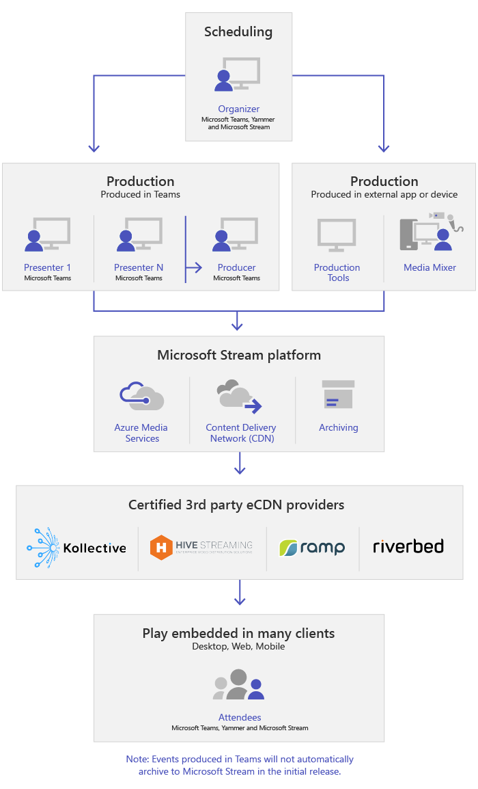

# Qu’est-ce que Microsoft teams Live EventsWhat are Microsoft Teams live events

## Vue d’ensembleOverview

Grâce aux événements en cours d’équipe, les utilisateurs de votre organisation peuvent diffuser du contenu vidéo et de réunion à des destinataires en ligne importants.With Teams lives events, users in your organization can broadcast video and meeting content to large online audiences.

Le nouveau niveau de diffusion vidéo en continu de Microsoft 365 est actif.Microsoft 365 live events bring live video streaming to a new level. Les événements en direct encouragent la connexion tout au long du cycle de vie de l’engagement avec les participants avant, pendant et après les événements en direct.Live events encourage connection throughout the entire engagement lifecycle with attendees before, during, and after live events. Vous pouvez créer un événement en temps réel à l’endroit où votre public, équipe ou communauté réside, à l’aide de Microsoft Stream, d’équipes ou de Yammer.You can create a live event wherever your audience, team, or community resides, using Microsoft Stream, Teams, or Yammer.  

Teams permet la collaboration, les appels, les réunions et les événements en direct basés sur une conversation, afin que vous puissiez développer le public de vos réunions.Teams delivers chat-based collaboration, calling, meetings, and live events, so you can expand the audience of your meetings. Les événements en direct teams sont une extension des réunions Teams, ce qui permet aux utilisateurs de diffuser de la vidéo et du contenu de la réunion à un large public.Teams live events is an extension of Teams meetings, enabling users to broadcast video and meeting content to a large online audience. Les événements en direct sont destinés aux communications un-à-plusieurs à l’origine de l’hébergement d’interactions et de la participation de l’auditoire pour afficher le contenu partagé par l’hôte.Live events are meant for one-to-many communications where the host of the event is leading the interactions and audience participation is primarily to view the content shared by host. Les participants peuvent regarder l’événement en direct ou enregistré dans Yammer, teams et/ou Stream et peuvent interagir avec les présentateurs à l’aide de la & Q modérée A ou d’une conversation Yammer.The attendees can watch the live or recorded event in Yammer, Teams, and/or Stream and can interact with the presenters using moderated Q & A or a Yammer conversation.

Les événements en direct teams sont considérés comme la prochaine version de la diffusion de réunion Skype et remplaceront les fonctionnalités fournies dans la diffusion de réunion Skype.Teams live events are considered the next version of Skype Meeting Broadcast and will eventually replace the capabilities provided in Skype Meeting Broadcast. À ce stade, Microsoft continuera à prendre en charge la diffusion de réunion Skype pour les utilisateurs de Skype entreprise dans leurs organisations, sans interruption de service pour les événements nouveaux ou futurs.At this point, Microsoft will continue to support Skype Meeting Broadcast for users who are using Skype for Business in their organizations, with no disruption in service for new or future events. Néanmoins, nous vous encourageons à essayer des événements en direct teams pour tirer parti de toutes les nouvelles fonctionnalités, notamment le partage d’écran et la prise en charge des encodeurs de matériel/logiciel externes.However, we encourage you to try out Teams live events to leverage all the new and exciting features including screen sharing and support for external hardware/software encoders.

Commençons.So, let's get started. Tout d’abord, jetez un coup d’œil au schéma suivant montrant les composants de niveau supérieur impliqués dans les événements Microsoft 365 Live et la manière dont ils sont connectés.First, take a look at the following diagram that shows high level components involved in Microsoft 365 live events and how they're connected.

### Rôles des groupes d’événementsEvent group roles

Les événements en direct dans teams permettent à plusieurs rôles (organisateur, producteur, présentateur et participant) de diffuser et de participer à un événement avec succès.Live events in Teams empowers multiple roles (organizer, producer, presenter, and attendee) to successfully broadcast and participate in an event. Pour en savoir plus, voir [rôles des groupes d’événements](https://support.office.com/article/get-started-with-microsoft-teams-live-events-d077fec2-a058-483e-9ab5-1494afda578a?ui=en-US&rs=en-US&ad=US#bkmk_roles).To learn more, see [Event group roles](https://support.office.com/article/get-started-with-microsoft-teams-live-events-d077fec2-a058-483e-9ab5-1494afda578a?ui=en-US&rs=en-US&ad=US#bkmk_roles).

## Composants clésKey components

Vous pouvez voir dans l’image ci-dessus qu’il existe quatre principaux composants utilisés avec des événements en direct dans Teams.You can see from the picture above that there are four key components that are used with live events in Teams.

> [!NOTE]
> Pour obtenir une vue d’ensemble de la configuration des événements en direct et de l’utilisation des participants, regardez les courtes [vidéos](https://support.office.com/article/video-plan-and-schedule-a-live-event-f92363a0-6d98-46d2-bdd9-f2248075e502)suivantes.For an overview of how to set up live events and the attendee experience, check out these short [videos](https://support.office.com/article/video-plan-and-schedule-a-live-event-f92363a0-6d98-46d2-bdd9-f2248075e502).

### TâchesScheduling

Teams permet aux organisateurs de créer un événement avec les autorisations des participants appropriés, de désigner les membres de l’équipe d’événement, de sélectionner une méthode de production et d’inviter des participants.Teams provides the ability for the organizers to create an event with the appropriate attendee permissions, designate event team members, select a production method, and invite attendees. Si l’événement en direct a été créé à partir d’un groupe Yammer, les participants à l’événement en direct pourront utiliser la conversation Yammer pour interagir avec des personnes dans l’événement.If the live event was created from within a Yammer group, the live event attendees will be able to use Yammer conversation for interacting with people in the event.

### ProductionsProduction

L’entrée vidéo est le fondement de l’événement en direct et peut varier d’une webcam unique à une production vidéo professionnelle multicaméra.The video input is the foundation of the live event and it can vary from a single webcam to a multi-camera professional video production. Les événements en direct dans Microsoft 365 prennent en charge un vaste éventail de scénarios de production ; incluez un événement produit dans teams à l’aide d’une webcam ou d’un événement généré dans une application ou un appareil externe.The live events in Microsoft 365 support a spectrum of production scenarios, include an event produced in Teams using a webcam or an event produced in an external app or device. Vous pouvez sélectionner ces options en fonction de la configuration requise et du budget de votre projet.You can choose these options depending on their project requirements and budget. Il existe deux façons de produire des événements :There are two ways to produce events:

- **Teams** : ce mode de production permet aux utilisateurs de produire leurs événements en direct dans teams à l’aide de leur webcam ou en utilisant une entrée A/V à partir de systèmes de salle Teams.**Teams** : This production method allows users to produce their live events in Teams using their webcam or using A/V input from Teams room systems. Cette option est l’option la plus rapide et la plus rapide si vous souhaitez utiliser les périphériques audio et vidéo connectés au PC ou inviter des présentateurs distants à participer à l’événement.This option is the best and quickest option if you want to use the audio and video devices connected to the PC or are inviting remote presenters to participate in the event. Cette option permet aux utilisateurs d’utiliser facilement leurs webcams et de partager leurs écrans en tant qu’entrées dans l’événement.This option allows users to easily use their webcams and share their screen as input in the event.

    

- **Application ou appareil externe** : les codeurs externes permettent aux utilisateurs de produire leurs événements en direct à partir d’un matériel externe ou d’un codeur logiciel avec [flux](https://stream.microsoft.com).**External app or device** : External encoders allow users to produce their live events directly from an external hardware or software-based encoder with [Stream](https://stream.microsoft.com). Cette option est idéale si vous disposez déjà d’un équipement de qualité de Studio (par exemple, des mixeurs multimédias) qui prend en charge la diffusion en continu vers un service de protocole de messagerie en temps réel (RTMP).This option is best if you already have studio quality equipment (for example, media mixers) which support streaming to a Real-time Messaging Protocol (RTMP) service. Ce type de production est généralement utilisé dans des événements à grande échelle comme le Directoire de la direction, dans lequel un flux unique d’un mélangeur de média est diffusé aux participants.This type of production is typically used in large-scale events such as executive town halls – where a single stream from a media mixer is broadcasted to the audience.

    

>[!Note]
> Les modifications apportées à l’utilisation de Microsoft Stream pour [OneDrive Entreprise et SharePoint pour les enregistrements de réunion](../tmr-meeting-recording-change.md) auront une approche progressive.The change from using Microsoft Stream to [OneDrive for Business and SharePoint for meeting recordings](../tmr-meeting-recording-change.md) will be a phased approach. Au démarrage, vous serez en mesure d’opter pour cette expérience, en novembre vous devrez annuler votre abonnement si vous souhaitez continuer à utiliser Stream, et début 2021, tous les clients devront utiliser OneDrive Entreprise et SharePoint pour les nouveaux enregistrements de réunion.At launch you'll be able to opt-in to this experience, in November you'll have to opt-out if you want to continue using Stream, and some time in early 2021 we'll require all customers to use OneDrive for Business and SharePoint for new meeting recordings.

### Plateforme en flux continuStreaming platform

La plateforme de flux d’événements en direct se compose des éléments suivants :The live event streaming platform is made up of the following pieces:

- **Services Azure Media** :  [Azure Media Services](https://docs.microsoft.com/azure/media-services/previous/) vous permet d’accéder à des services de diffusion vidéo en continu pour atteindre des audiences plus importantes sur les appareils mobiles les plus populaires du jour.**Azure Media Services** :  [Azure Media Services](https://docs.microsoft.com/azure/media-services/previous/) gives you broadcast-quality video streaming services to reach larger audiences on today’s most popular mobile devices. Media Services permet d’améliorer l’accessibilité, la distribution et l’évolutivité, et de faciliter et de rendre plus rentables le contenu de flux vers vos audiences locales ou internationales, tout en protégeant votre contenu.Media Services enhances accessibility, distribution, and scalability, and makes it easy and cost-effective to stream content to your local or worldwide audiences — all while protecting your content.
- **Réseau de distribution de contenu (CDN) Azure** : une fois que votre flux est actif, il est transmis via le [réseau de distribution de contenu (CDN) Azure](https://docs.microsoft.com/azure/cdn/).**Azure Content Delivery Network (CDN)** :  Once your stream goes live, it's delivered through the [Azure Content Delivery Network (CDN)](https://docs.microsoft.com/azure/cdn/). Azure Media Services fournit un CDN intégré pour les points de terminaison en flux continu.Azure Media Services provides integrated CDN for streaming endpoints. Cela permet d’afficher les flux partout dans le monde sans mise en mémoire tampon.This allows the streams to be viewed worldwide with no buffering.

### Réseau de distribution de contenu d’entreprise (eCDN)Enterprise Content Delivery Network (eCDN)

L’objectif de eCDN est de prendre le contenu vidéo à partir d’Internet et de distribuer le contenu au sein de votre entreprise, sans affecter les performances du réseau.The goal of eCDN is to take the video content from the internet and distribute the content throughout your enterprise without impacting network performance. Vous pouvez utiliser l’un des partenaires eCDN certifiés suivants pour optimiser votre réseau en ce qui concerne les événements dynamiques organisés au sein de votre organisation :You can use one of the following certified eCDN partners to optimize your network for live events held within your organization:

- [RucheHive](https://www.hivestreaming.com/partners/integration-partners/microsoft/)
- [KollectiveKollective](https://kollective.com/ecdn-solutions/microsoft-live-events/)
- [RenforcementRamp](https://rampecdn.com)
- [RiverbedRiverbed](https://www.riverbed.com/solutions/office-365.html)

### Compétences des participantsAttendee experience

L’utilisation des participants est l’aspect le plus important des événements en direct et il est essentiel que les participants puissent participer à l’événement en direct sans problèmes.The attendee experience is the most important aspect of live events and it's critical that the attendees can participate in the live event without having any issues. L’expérience des participants utilise le lecteur de flux (pour les événements produits dans Teams) et le lecteur multimédia Azure (pour les événements produits dans une application ou un appareil externe) et fonctionne sur les ordinateurs de bureau, les navigateurs et les appareils mobiles (iOS, Android).The attendee experience uses Stream Player (for events produced in Teams) and Azure Media Player (for events produced in an external app or device) and works across desktop, browser, and mobile (iOS, Android). Microsoft 365 et Office 365 fournissent Yammer et teams sous la forme de deux hubs de collaboration et l’environnement des participants est intégré à ces outils de collaboration.Microsoft 365 and Office 365 provide Yammer and Teams as two collaboration hubs, and the live attendee experience is integrated into these collaboration tools.

### Rapport sur l’utilisation des événements en directLive event usage report

Les administrateurs de clients peuvent afficher les analyses d’utilisation en temps réel des événements en direct dans le centre d’administration Microsoft Teams.Tenant admins can view real-time usage analytics for live events in Microsoft Teams admin center.  Le [rapport d’utilisation des événements en direct](../teams-analytics-and-reports/teams-live-event-usage-report.md) montre la vue d’ensemble de l’activité des événements en direct organisés au sein de l’organisation.The [live event usage report](../teams-analytics-and-reports/teams-live-event-usage-report.md) shows the activity overview of the live events held in the organization.  Les administrateurs peuvent afficher les informations d’utilisation des événements, notamment l’état des événements, l’heure de début, les affichages et le type de production.Admins can view event usage information, including event status, start time, views, and production type.  

## Étapes suivantesNext steps

Accédez au [plan pour les événements en direct teams](plan-for-teams-live-events.md).Go to [Plan for Teams live events](plan-for-teams-live-events.md).

### Voir aussiRelated topics

- [Événements en direct sur Microsoft 365 dans Yammer, Microsoft teams et Microsoft StreamLive events across Microsoft 365 in Yammer, Microsoft Teams, and Microsoft Stream](https://docs.microsoft.com/stream/live-event-m365)
- [Prise en main des événements en direct Microsoft TeamsGet started with Microsoft Teams live events](https://support.office.com/article/d077fec2-a058-483e-9ab5-1494afda578a)
- [Événements en direct dans YammerLive events in Yammer](https://support.office.com/article/live-events-in-yammer-4ece0ee2-c268-4636-bf2a-16e454befe57)
- [Événements en direct dans Microsoft StreamLive events in Microsoft Stream](https://docs.microsoft.com/stream/live-event-overview)
