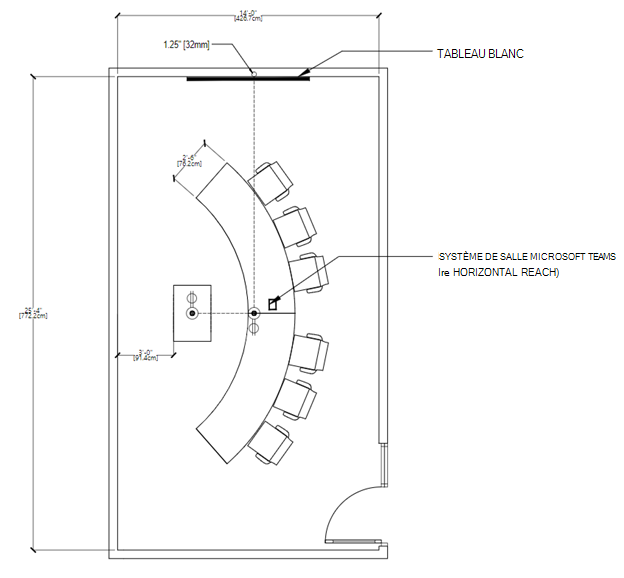

# Conseils de salle de réunion pour Teams

Cet article est destiné à guider les utilisateurs sur l’optimisation des espaces de réunion avec Salles Microsoft Teams solutions et appareils. Il inclut des informations sur salles Teams les utilisations, les dispositions et les spécifications des appareils et des solutions.

# [Utilisations et dispositions des salles de réunion](#tab/uses)

## Présentation

Salles Microsoft Teams solutions offrent une flexibilité d’objectif et même une flexibilité de mouvement dans un espace que les salles de réunion traditionnelles ne font pas. Par exemple, avec salles Teams appareils, les utilisateurs peuvent améliorer leur collaboration avec un tableau blanc numérique, et les caméras intelligentes de suivi des personnes s’assurent que chaque participant local peut être vu, où qu’ils se trouvent dans la salle. Tout type d’espace et tout type de réunion peuvent être optimisés avec des appareils salles Teams ou des solutions salles Teams.

### Réunions axées sur la présentation 

Les réunions et les réunions présentes constituent le premier compartiment, et cette réunion est généralement plus formelle. L’audio-visuel est une priorité et l’accent est mis sur la présentation du contenu. L’appareil est généralement fixe, ce qui permet aux utilisateurs de rester assis tout en interagissant avec l’appareil à partir d’une console centrale de table.

Les espaces de rencontre et de présentation hiérarchisent la présentation et la discussion, ce qui signifie que la disposition et la technologie doivent être optimisées pour le partage de contenu et la co-création à distance. Tout le monde doit être impliqué dans la discussion et être en mesure de voir et d’interagir avec le contenu partagé.

**Présentation et** **présentation des dispositions d’espace :** les tables doivent être fixes et situées devant les écrans de salle. Dans les chambres plus petites, les tables peuvent être attachées au mur, mais dans des espaces plus grands, elles doivent être séparées pour prendre en compte les considérations de caméra.

### Réunions axées sur la co-création

Les réunions de réunion et de co-création sont généralement moins formelles avec une priorité sur la co-création, l’entrée manuscrite et le tableau blanc. L’accès aux fichiers personnels est également un objectif pour ce compartiment. L’appareil peut être mobile, ce qui encourage les utilisateurs à se lever, à rassembler et à interagir avec l’appareil.

L’espace approprié relie les utilisateurs et la technologie en toute transparence et élimine les frictions pour les utilisateurs les plus novices. Teams appareils sont conçus pour être suffisamment conviviaux pour que les jeunes étudiants ou les nouveaux utilisateurs puissent naviguer correctement, et pour que les enseignants ou les administrateurs contrôlent et personnalisent dès leur première utilisation.

**Rencontrez et cocréez des dispositions d’espace :** Les tables et l’équipement de co-création peuvent avoir des positions flexibles et doivent accueillir des groupes de personnes travaillant aux tables ou à l’équipement.

### Présentation et réunions axées sur la co-création

N’oubliez pas que les deux types de salles peuvent gérer les deux types d’expériences en cas de besoin. Les chambres peuvent également être conçues pour accueillir les deux facilement en ayant la technologie pour chaque utilisation. L’important, c’est que quel que soit l’espace que vous équipez, d’un bureau privé à une salle de conférence, il doit être Teams activé.

**Présentation combinée et dispositions d’espace de co-création :** Une combinaison de cas d’usage d’autres scénarios de réunion peut être combinée pour former des salles à usages multiples où les réunions axées sur la présentation, ainsi que le travail de co-création, peuvent être réalisées avec une efficacité égale, souvent simultanément.

## Optimisation de l’expérience de réunion
Une grande expérience de réunion est le résultat de l’utilisation de la meilleure technologie possible pour un espace de réunion de manière à faciliter l’échange d’idées sans être intrusif.

### Expériences de salles Teams natives par rapport à d’autres appareils

salles Teams aller au-delà de ce qui peut être fait avec Teams sur des appareils personnels en fournissant des fonctionnalités uniques dans la salle, telles que la jointure tactile, des caméras de contenu pour partager des tableaux blancs physiques dans la réunion de manière intelligente, et des fonctionnalités de proximité telles que le transfert transparent d’une réunion Teams de votre appareil personnel vers la salle.

Les systèmes non natifs et auto-générés qui reposent sur des services externes ou une connexion bring-your-own-device ne correspondront jamais vraiment à la facilité d’utilisation ou à la qualité immersive d’une salle Teams native.

Il est entendu qu’au cours d’un déploiement, il peut être nécessaire d’effectuer des étapes intermédiaires (telles que le déploiement rapide de salles de réunion bring-your-own-device) implémentées sur votre chemin d’accès à une expérience de Teams entièrement native dans vos espaces de réunion.

### Utilisation de Teams pour créer la meilleure expérience de réunion possible

En ayant les deux Teams sur tous vos appareils personnels et correctement déployés Salles Microsoft Teams dans tous vos espaces, vous serez en mesure de faciliter la meilleure expérience de réunion possible pour chacun de vos utilisateurs. Lorsque vous prévoyez d’obtenir la meilleure expérience possible, vous devez gérer tous vos espaces en termes de déploiement technologique et d’aide et de formation des utilisateurs finaux.

Il est normal lors de la planification d’un déploiement à grande échelle à l’échelle de l’entreprise pour qu’il se produise par étapes avec certaines salles voyant la technologie ajoutée à différents moments, ou même certains composants installés plus tôt que d’autres (comme le déploiement de panneaux Teams pour la planification dans chaque pièce d’un bâtiment particulier tout en installant salles Teams solutions un étage ou même une pièce à la fois).

Préparez vos utilisateurs à le faire par étapes afin de maximiser votre expérience de réunion Teams à chaque moment du processus.

#### Bonne expérience : appareils personnels seuls dans un espace de réunion

Vous pouvez commencer par ce plan en adressant tous vos espaces de réunion non av ou non équipés de collaboration. Vous pouvez toujours tirer parti de Teams dans vos salles de réunion, même si ces salles de réunion n’ont pas encore Teams appareils installés.

*Audio:* Un excellent pont vers une salle de Teams complète consiste à planifier la technologie de réunion en fournissant à vos utilisateurs individuels des périphériques audio certifiés Teams pour les plus petites salles et groupes, ou en les déployant dans des salles avant une solution de salles Teams complète pour les grands espaces destinés aux groupes plus grands où un petit appareil ne le coupera pas.

*Vidéo:* Lorsque ces salles sont utilisées, les utilisateurs individuels peuvent apporter leurs propres appareils pour partager le contenu de la réunion Teams et capturer leurs expressions avec leurs appareils photo individuels. Les utilisateurs peuvent ensuite désigner quelqu’un comme source unique d’audio pour le groupe local, en connectant cet appareil personnel à l’appareil audio certifié, afin que tout le monde (local et distant) ait une expérience positive de l’audio de réunion.

*Engagement :* L’activation de vos salles de réunion pour une meilleure expérience de réunion Teams, même si elle nécessite l’utilisation d’appareils personnels et de périphériques, permettra toujours à vos utilisateurs de développer ce qu’ils peuvent faire avec Teams. Lorsque vos utilisateurs sont situés dans des bureaux privés et sur des stations de travail individuelles, Teams facilite les discussions en personne en plus d’engager des participants distants.

#### Meilleure expérience : salles Teams solutions et aucun appareil personnel

Si vous installez salles Teams solutions ou si vous disposez déjà de salles qui ont déjà été déployées avec des appareils salles Teams appropriés pour leurs espaces respectifs, vous êtes en bonne voie d’avoir d’excellentes expériences de réunion.

*Audio:* L’audio de ces espaces de réunion sera géré par la solution salles Teams et ses appareils audio certifiés Microsoft.

*Vidéo:* La vidéo dans ces espaces sera gérée par la solution salles Teams et ses caméras certifiées Microsoft.

*Engagement :* Vos utilisateurs finaux pourront tirer parti de l’expérience salles Teams complète pour leurs réunions, en veillant à ce que tout le monde puisse participer facilement aux réunions et disposer d’une expérience audio et vidéo exceptionnelle.

#### Meilleure expérience : salles Teams solutions utilisées conjointement avec des appareils personnels

La formation de vos utilisateurs à l’utilisation de la technologie en coordination aboutit à des résultats plus efficaces et rationalisés. Le meilleur scénario possible est une combinaison de technologies installées et d’appareils personnels.

*Audio:* La plupart de la connectivité de salle de réunion et du travail audio-vidéo seront gérés par la solution de salles Teams, tandis que les utilisateurs individuels peuvent participer à la même réunion avec des caméras activées et audio désactivées pour une expérience entièrement immersive.

*Vidéo:* Les utilisateurs distants pourront voir tout le monde participer à la réunion au-delà de la simple prise de parole et du partage de contenu. Un utilisateur distant peut activer la vidéo personnelle pour obtenir une vue n’importe où dans la salle avec la possibilité de se concentrer sur n’importe quel participant.

*Engagement :* La conversation peut rester dynamique avec tous les participants, locaux et distants, impliqués et engagés. Le partage de vidéos à partir de salles Teams et via des caméras individuelles permet aux participants distants de se sentir impliqués avec tout le monde.

L’utilisation de Teams sur tous les appareils garantit que les utilisateurs de la salle locale et les utilisateurs distants se sentent également impliqués dans les réunions.

## Considérations technologiques

Les choix de technologies audio et vidéo appropriés aideront les utilisateurs à tirer le meilleur parti de leurs réunions Microsoft Teams.

### Audio

Les considérations audio sont essentielles pour s’assurer que les participants à distance et en salle peuvent être clairement entendus et compris. La couverture du microphone et du haut-parleur doit inclure chaque siège de la pièce sans laisser d’espace.

*Périphériques audio appropriés pour chaque espace*

Une source audio unique pour un espace est nécessaire pour s’assurer qu’il n’y a aucun problème audio dans une salle de réunion.

L’association du microphone et des haut-parleurs appropriés pour chaque espace donnera les meilleurs résultats possibles pour être entendu clairement sans distraction.

-   Dans les espaces partagés, les options s’étendent, mais les mêmes principes demeurent : les participants à la réunion doivent être entendus et entendre clairement les autres.

    -   Les périphériques audio tout-en-un sont des options faciles à déployer et de haute qualité pour les **espaces plus petits** avec un nombre limité de participants assis relativement près de l’appareil audio.

    -   Dans **les espaces plus grands**, les microphones et les haut-parleurs se séparent pour garantir une couverture maximale pour tous les participants dans l’espace. De nombreuses solutions pour les salles de taille moyenne à grande sont disponibles dans le cadre d’un kit qui ne nécessite aucune configuration, uniquement l’installation physique des microphones et des haut-parleurs.

    -   Dans **les espaces les plus grands et les plus complexes**, des solutions sont disponibles pour permettre l’utilisation simultanée d’un large éventail de microphones et de types de haut-parleurs, comme la capture d’une voix de conférencier et de public à partir d’une grande salle tout en mettant l’appel à la disposition de tous. Ces solutions sont idéales lorsqu’elles sont déployées avec un partenaire Microsoft qui possède une expertise dans la conception et le déploiement de solutions plus techniquement impliquées.

### Vidéo

La vidéo est tout aussi importante que l’audio. Capturer des communications physiques et non verbales telles que des expressions faciales ou des gestes est aussi important que le contenu de la salle de classe ou de la réunion pour garantir un engagement et une compréhension maximums. Les salles doivent être équipées de la taille d’affichage appropriée afin que tout le monde puisse vivre la réunion correctement, que ce soit dans la salle ou à distance. C’est pourquoi les salles doivent également disposer d’une couverture caméra appropriée et d’un champ de vue (FOV) pour capturer efficacement tous les participants à la réunion en salle pour ceux qui rejoignent à distance.

*Les caméras appropriées pour chaque espace*

Aussi importante que la qualité audio, la vidéo de haute qualité est une nécessité pour la collaboration moderne Teams. La technologie des caméras a beaucoup évolué avec des caméras de haute qualité désormais disponibles pour tous les espaces.

-   Les caméras incluses dans les appareils tels que les ordinateurs portables et les tablettes doivent être utilisées dans toutes les réunions pour s’assurer que tout le monde est vu et entendu. Pour les utilisateurs qui souhaitent apporter une expérience vidéo plus riche à **un** **espace personnel**, les caméras externes représentent un pas en avant par rapport aux appareils incorporés et peuvent être utilisées dans un plus grand nombre de scénarios et de configurations, garantissant ainsi que les participants à l’appel partagent la meilleure vue d’eux-mêmes. Ces appareils s’installent facilement avec une connexion USB simple trouvée sur chaque PC.

-   Dans les espaces partagés, les options et fonctionnalités s’étendent. **Les salles plus petites** peuvent être couvertes par des caméras incluses dans des périphériques audio tout-en-un, tels que des barres audio. Ces caméras disposent généralement d’un large champ de vue, ce qui garantit qu’elles capturent chaque participant dans l’espace en une seule capture. Beaucoup de ces caméras disposent également de choses telles que le cadrage intelligent de l’image, de sorte que l’appareil photo montre uniquement les personnes dans la réunion et non pas des chaises vides, ou les personnes comptant, pour suivre et comprendre l’utilisation de l’espace.

-   Dans **les salles plus grandes**, les caméras disposent de la technologie nécessaire pour capturer les participants à différents endroits à différentes distances. Ces caméras peuvent capturer des groupes ou se concentrer sur des individus spécifiques tout en conservant une grande clarté visuelle. Les appareils qui peuvent suivre et présenter uniquement des haut-parleurs actifs sont régulièrement utilisés dans des espaces plus grands afin que de nombreux participants puissent être présentés individuellement tout au long d’une réunion pendant qu’ils apportent leurs idées.

# [Salle de Microsoft Teams améliorée](#tab/emtr)

## Salle de Microsoft Teams améliorée

Cette section explique comment Microsoft transforme les salles de conférence standard en Salles Microsoft Teams améliorées qui offrent le meilleur de la nouvelle expérience de première ligne Teams. Utilisez cet article pour obtenir des conseils sur la conception et la technologie des salles, des produits recommandés et des spécifications de référence de Microsoft Corporate Facilities.

## La vision de Microsoft pour l’avenir des salles de réunion

L’avenir du travail sera fluide, dynamique et alimenté par le cloud. Microsoft permet des expériences de réunion qui permettent aux utilisateurs d’être présents, où qu’ils soient, à tout moment. Ces réunions sont hybrides, ce qui signifie que vous pouvez y participer en toute transparence. Les réunions améliorées avec les appareils Microsoft sont inclusives ; chaque voix est entendue, et tout le monde est clairement représenté.

Microsoft voit un avenir où les réunions sont immersives et où les espaces sont conçus autour des personnes. Nos vues de réunion dynamiques permettent à chacun d’être connecté au contenu et aux autres : les présentations formelles sont associées à des conversations collaboratives. Les canevas numériques libèrent la créativité du groupe. Tout le monde peut se connecter face à face où qu’il soit.

La vision de l’avenir des réunions repose sur une simple conviction : les réunions devraient offrir bien plus qu’une simple transaction unique. Les réunions seront conçues pour tous, qu’elles soient dans la salle ou à travers le monde.

## Qu’est-ce qu’une salle de Microsoft Teams améliorée ?

Dans l’espace de travail hybride de Microsoft, la prochaine génération de normes de salle est informée des besoins des participants à distance et dans la salle. Une salle améliorée est une salle Microsoft Teams conçue pour offrir une expérience de réunion hybride *avec élévation de privilèges*, favorisant des connexions plus naturelles et immersives tout en permettant à tous les participants à la réunion de se sentir inclus, représentés et productifs. La salle suit un ensemble de principes rendus réels grâce à une combinaison de salles Teams des fonctionnalités logicielles et matérielles et des conseils de configuration de salle.

Le concept de la salle de Microsoft Teams améliorée est conçu autour de deux objectifs clés qui sont pris en charge par un ensemble de principes d’expérience.

**Objectif 1 : Tous les participants à la réunion se sentent inclus, représentés et productifs.**

Principes de conception :

-   Les participants distants peuvent établir une présence réelle dans la salle

-   Les participants en salle peuvent conserver leur identité individuelle dans la réunion

-   Tous les participants à la réunion peuvent s’engager dans une collaboration sans limites.

**Objectif 2 : Les connexions se sentent naturelles et immersives.**

Principes de conception :

-   Les expériences sont mises à l’échelle pour la connexion humaine, ce qui permet des interactions qui ont l’impression que tout le monde est dans la même pièce.

Une expérience de salle améliorée est l’ensemble de ces composants et idées mis en place sans fonctionnalité unique définissant l’expérience. Les fonctionnalités et concepts individuels de notre Salles Microsoft Teams amélioré peuvent également être déployés seuls.

Exemples de déploiement de fonctionnalités spécifiques :

-   Tirez parti de notre nouvelle expérience d’affichage en première ligne dans tous les types d’espaces de réunion où il existe une solution Microsoft Teams Room qui la prend en charge.

-   Implémentez des tables courbées et des dispositions orientées vers l’avant avec des expériences de salle Microsoft Teams traditionnelles pour promouvoir une meilleure connexion humaine dans la salle tout en conservant la continuité de l’expérience dans tous les espaces de réunion.

## Quand devez-vous déployer ce type de salle ?

Les Salles Microsoft Teams améliorées ne sont pas destinées à remplacer tous les autres espaces de réunion au sein de votre organisation, mais plutôt à servir de complément aux espaces de réunion existants qui utilisent Microsoft Teams. Elles doivent être déployées stratégiquement au sein de votre organisation dans les espaces et les emplacements où les interactions en face à face avec les participants à la réunion à distance seront les plus appréciés.

Salles Microsoft Teams continueront de proposer des expériences de réunion hybride centrées sur les personnes mises à disposition par le biais de mises à jour logicielles. Toutefois, il existe des technologies matérielles et des conseils de configuration de salle qui jouent un rôle clé dans l’optimisation de certaines des expériences améliorées. C’est la combinaison de ces composants qui comprend une salle Microsoft Teams améliorée. Lorsque vous évaluez le nombre de Salles Microsoft Teams que vous souhaitez faire évoluer vers une salle de Microsoft Teams améliorée, tenez compte des points suivants :

-   Les mises à niveau matérielles et/ou les investissements à effectuer.

-   La plupart des salles de conférence sont conçues pour maximiser les longueurs carrées précieuses avec une relation étroite entre la dimension de la salle et la capacité de la salle. Une salle de Microsoft Teams améliorée hiérarchise l’expérience de réunion au-dessus de l’optimisation des carrés. Toutes les organisations ne peuvent pas hiérarchiser de cette façon pour chaque espace de réunion, car cela pourrait réduire le nombre de salles de réunion qu’elles peuvent avoir.

### Comprendre cet espace 

*Équilibrage de la flexibilité hybride avec l’inclusion*

Chez Microsoft, nos instructions de travail flexibles hiérarchisent en donnant aux employés le choix et la flexibilité sur l’endroit où travailler et quand. Ce changement fondamental de politique nous a fait repenser l’évolution de nos espaces de réunion et de nos technologies.

Nos recherches ont montré que les réunions à distance pendant la pandémie ont eu de nombreux avantages, en particulier en ce qui concerne l’augmentation des sentiments d’équité et d’inclusion. Lorsque nous envisageons de revenir dans un cadre hybride, avec une collaboration à distance et en personne qui se produit simultanément, nous avons cherché à créer des espaces de réunion qui soutiennent mieux nos politiques de travail flexibles tout en maintenant un terrain de jeu équitable pour tous les participants par le biais de la conception de salle et de la technologie.

### À quoi sert cet espace ?

Cet espace est dédié à l’expérience de réunion la plus immersive Teams pour un petit groupe de personnes dans la salle physique.

À l’instar d’une salle Microsoft Teams classique, les participants à la réunion peuvent se rencontrer à distance et localement pour collaborer en toute transparence tout en présentant et en cocréant du contenu.

### Comment cet espace est-il disposé ?

La disposition de la salle est conçue pour une visibilité et un engagement maximums avec les participants distants et le contenu.

La disposition comporte une table courbée pour le contact visuel en personne et l’orientation pour les participants distants avec toutes les chaises face à l’affichage afin que les participants soient en mesure de suivre le long.

### Comment fonctionne l’audio ? 

À l’aide de solutions audio certifiées pour Salles Microsoft Teams, les utilisateurs sont en mesure d’entendre et d’être entendus clairement.

À l’avenir, salles Teams prend en charge les systèmes audio qui utilisent un concept appelé audio spatial. Avec l’audio spatial, le son émane de la direction de la personne qui parle. Par exemple, si une personne située à droite de la galerie de réunions parle, l’audio provient de l’orateur situé le plus proche de cet emplacement. Ce type d’expérience audio immersive aide les réunions à ressembler plus étroitement à une conversation en personne.

### Comment fonctionne la caméra ?

Une caméra à angle ultra-large est positionnée à l’avant de la pièce sous les écrans pour capturer tout le monde dans l’espace.

La caméra à angle ultra-large dispose d’un suivi intelligent des participants à la réunion afin qu’ils puissent être représentés individuellement dans un grand affichage au lieu d’être des visages dans une grande image de la salle entière.

### Comment fonctionnent les écrans avant de la pièce ? 

Cette salle est optimisée pour la disposition Salles Microsoft Teams appelée ligne d’avant et s’affiche par le biais d’un projecteur haute résolution à jet court spécialisé, créant ainsi une expérience immersif de front-of-room conçue spécifiquement pour Teams réunions. 

### Qu’est-ce que la première ligne ?

Pour donner aux personnes présentes dans la salle un plus grand sentiment de connexion aux participants distants et de soutenir la collaboration avant, pendant et après les réunions, Microsoft a introduit une nouvelle disposition de contenu pour Salles Microsoft Teams appelée première ligne. Visuellement, cette nouvelle disposition déplace la galerie vidéo vers le bas de l’écran et est fixe à un ratio spécifique pour conserver des visages de taille réaliste. Avec cette disposition, les participants dans la salle peuvent voir des collègues distants face à face sur un plan horizontal, comme s’ils se trouvaient dans la même pièce.

Le contenu de la réunion est entouré de composants contextuels fluides tels que l’ordre du jour, les tâches et les notes, qui peuvent être mis à jour en temps réel, ce qui permet aux participants de rester engagés et productifs. En outre, la conversation de réunion est clairement mise en évidence afin que lorsque vous rejoignez une réunion Teams à partir d’une salle Teams, vous pouvez facilement voir et engager la conversation en temps réel. Dans une salle de Microsoft Teams améliorée, ce contenu s’affiche sur un écran à proportions larges pour optimiser la taille du contenu de la réunion et le nombre de participants qui peuvent être consultés simultanément.

Cette disposition est prise en charge dans les configurations à affichage unique et double affichage. Bien que la disposition de la première ligne soit particulièrement impactante dans une salle améliorée, la première ligne peut être utilisée dans n’importe quelle salle Teams s’exécutant sur Windows, quelle que soit la configuration des meubles et du matériel.

### Comment co-créez-vous du contenu ?

Dans Salles Microsoft Teams, les utilisateurs peuvent tirer parti du tableau blanc analogique traditionnel à l’aide de la fonctionnalité de capture intelligente. Pour une expérience modernisée où tous les participants peuvent dessiner et faire des entrées manuscrites ensemble, Microsoft Whiteboard sont accessibles à l’aide d’un écran tactile avant de la salle, d’appareils complémentaires tels qu’un PC, un téléphone ou une tablette, et par le biais de Microsoft Surface Hub.

## Conseils améliorés en matière de conception de salle Microsoft Teams

Cette section est destinée à couvrir la construction d’une salle à partir de zéro. 

### Disposition de la salle 

#### Taille de la salle

25 pi x 14 pi

#### Capacité de la salle 

Cette salle Microsoft Teams améliorée est optimisée pour entre 6 et 8 personnes. 

#### Meubles de salle

Cette salle comporte une table courbée avec des participants assis d’un côté, ce qui permet aux participants en salle de conserver la visibilité les uns des autres et d’être positionnés face à face avec les participants distants.

Cette salle dispose d’une table de salle de réunion standard avec une hauteur de 30 pouces ou 76 cm.

#### Montage d’équipement

La sélection d’un emplacement pour le matériel est généralement basée sur la sélection de Teams matériel certifié Room utilisé dans un espace de réunion donné.

Pour les déploiements initiaux de salles améliorées au sein de nos installations Microsoft, nous avons choisi de monter le Salles Microsoft Teams console de calcul et tactile à la table, avec une caméra intégrée et un dispositif de barre audio (avec audio discret de canal gauche et droit pour l’audio spatial) monté sur des meubles spécialisés, situés sous l’image affichée ainsi qu’entre la projection avant de la salle et la table. Il est important de maintenir la console à la portée des participants sans entraver leur utilisation de la table pour les appareils personnels et/ou les documents. Pour l’affichage, un projecteur haute résolution à jet court est utilisé.

La plupart des participants choisiront de partager du contenu dans ce type de salle de réunion en rejoignant la réunion Teams via un appareil personnel. Toutefois, la présentation vidéo locale en salle doit également être mise à disposition à la table de manière facilement accessible pour ceux qui ne peuvent pas participer à l’appel de réunion.

#### Positionnement de la console tactile

La console tactile Salles Microsoft Teams doit être montée au centre de la table à portée des participants à la réunion sans bloquer l’utilisation de la table pour les appareils personnels ou les documents.

#### Présentation vidéo locale

Bien que de nombreux participants puissent choisir de partager du contenu dans ce type de salle de réunion en rejoignant la réunion Teams par le biais d’un appareil personnel à l’appel Teams, la présentation vidéo locale dans la salle doit également être mise à disposition à la table de manière facilement accessible.

## Infrastructure 

### Puissance de l’infrastructure

Au minimum, les connexions électriques doivent être fournies à la table (pour les utilisateurs finaux) et à l’emplacement de montage de l’équipement. Si des appareils de co-création sont utilisés dans l’espace, des connexions électriques peuvent également être nécessaires à leur emplacement.

### Données d’infrastructure

Les connexions réseau doivent être fournies à la fois à la table (pour les utilisateurs finaux) et à l’emplacement de montage de l’équipement (pour le réseau principal de la solution salles Teams). Si la co-création d’appareils est utilisée dans l’espace, des connexions réseau sont également nécessaires pour se connecter au réseau principal de la solution salles Teams.

### Traitements muraux acoustiques

Au moins deux murs d’une salle de ce type doivent être traités acoustiquement pour éviter les problèmes d’écho et de bruit ambiant pendant les réunions.

### Traitements de fenêtre

La lumière des fenêtres d’une pièce de ce type peut affecter négativement l’éclairage et introduire des reflets et des ombres à la fois à l’image de la caméra et à l’affichage avant de la pièce. Tout espace comportant des fenêtres doit également comporter des traitements de fenêtre qui permettent de bloquer la lumière externe pendant les réunions.

### Traitements au sol

Le plancher d’une pièce de ce type doit être tapissé ou traité de manière acoustique afin d’éviter les problèmes d’écho et de bruit ambiant pendant les réunions.

### Éclairage 

Des lumières de surcharge doivent être fournies pour éclairer l’espace uniformément, avec les participants de salle de réunion ne semblent pas être lavés ou assis dans un espace sombre. Les efforts visant à réduire l’éclairage direct sur les écrans avant de la pièce, les appareils de co-création ou d’autres surfaces réfléchissantes dans l’espace doivent être entrepris pour éviter d’introduire des reflets.

## Conseils technologiques 

### solution Salles Microsoft Teams

Les salles améliorées pour Microsoft Teams nécessitent l’utilisation de Salles Microsoft Teams sur Microsoft Windows.

### Caméras

#### options de Caméra

Une pièce de ce type nécessite l’utilisation d’un appareil photo intelligent à angle ultra-large qui est correctement évalué pour la largeur et la profondeur de l’espace.

#### placement Caméra

L’appareil photo doit être placé à l’avant de la salle sous la projection avant de la salle, mais au-dessus du haut de la table pour capturer tous les participants de la salle de réunion au niveau du plus près possible de l’œil.

### Microphones

#### Options du microphone

Les tableaux de microphones avant de la pièce et les microphones de table et de surcharge fonctionneront pour ce type d’espace.

#### Positionnement du microphone

Les tableaux de microphones doivent être positionnés pour assurer la couverture de tous les participants à la salle de réunion dans la plage certifiée de l’appareil.

### Haut-parleurs

#### Options de l’orateur

Les tableaux de haut-parleurs avant de la pièce et les haut-parleurs de surcharge fonctionneront pour ce type d’espace.

Remarque : l’audio spatial n’est pas encore disponible et peut nécessiter des périphériques audio spécifiques.

#### Positionnement de l’orateur

Les orateurs doivent être positionnés pour assurer la couverture de tous les participants à la salle de réunion dans la plage certifiée de l’appareil ou des appareils utilisés.

### Affichage avant de la salle

#### Type d’affichage

Une salle de ce type nécessite l’utilisation d’un rapport d’aspects ultra-large, un affichage avant-pièce haute résolution qui est correctement dimensionné pour la largeur et la profondeur de l’espace afin d’assurer une visibilité et une clarté maximales.

Voici quelques exemples de types d’affichage :

-   Projecteurs laser

-   Murs vidéo LED

-   Écrans plats À ÉCRANS LCD ou OLED spécialisés

#### Fonctions d’affichage

Les Salles Microsoft Teams améliorées, comme avec toutes les autres solutions Salles Microsoft Teams, nécessitent l’utilisation d’affichages qui peuvent prendre en charge les fonctionnalités suivantes pour une opération appropriée :

-   Veillez et réveillez-vous rapidement après le sommeil en fonction de la synchronisation HDMI.

    -   Pour les projecteurs, les périodes de préchauffage et de refroidissement automatiques doivent être prises en charge sans intervention de l’utilisateur.

-   Les affichages doivent prises en charge l’EDID et les résolutions appropriées requises par la conception Salles Microsoft Teams.

#### Emplacement d’affichage

Une salle améliorée nécessite que l’affichage soit placé devant tous les participants à la réunion en salle, directement en face de la table.

La ligne centrale horizontale de l’affichage doit être centrée sur la même ligne centrale que la table.

La ligne centrale verticale de l’affichage ne doit pas dépasser +/- 15 degrés par rapport à la ligne oculaire d’un participant à une réunion en salle standard assis à la table.

#### Nombre d’affichages

Une salle améliorée nécessite que l’affichage soit un affichage à proportions larges uniques ou une combinaison mixte d’affichages qui peut produire l’effet d’être un affichage unique lorsqu’il est vu par les participants à la réunion en salle.

### Options de co-création

#### Microsoft Whiteboard

Tous les salles Teams sont en mesure de tirer parti de Microsoft Whiteboard par le biais d’un appareil de collaboration interactif tel qu’un Microsoft Surface Hub, un écran tactile avant de la pièce, et par le biais d’appareils complémentaires tels qu’un PC, un téléphone ou une tablette.

#### Tableau blanc traditionnel 

Toutes les salles Teams sur Windows peuvent tirer parti des tableaux blancs traditionnels dans une réunion Teams à l’aide de la fonctionnalité de capture intelligente et d’une caméra de contenu secondaire.

## Produits recommandés pour cet espace

### console et calcul Microsoft Teams Room

-   Solution de Salles Microsoft Teams basée sur Windows.

Comme indiqué :

[Logitech TAP pour la console tactile associée à un appareil Lenovo Compute.](https://www.microsoft.com/en-us/microsoft-teams/across-devices/devices/product/logitech-tap-room-systems-with-thinksmart-edition-tiny/523)

Autres options :

-   [Lenovo ThinkSmart Core + Controller](https://www.microsoft.com/en-us/microsoft-teams/across-devices/devices/product/lenovo-thinksmart-core-controller/948)

-   [Système de conférence crestron Flex personnalisable](https://www.microsoft.com/en-us/microsoft-teams/across-devices/devices/product/crestron-flex-customizable-conference-system/849)

-   [Système de conférence crestron Flex personnalisable avancé](https://www.microsoft.com/en-us/microsoft-teams/across-devices/devices/product/crestron-flex-customizable-conference-system/849)

-   [Poly G10-T](https://www.microsoft.com/en-us/microsoft-teams/across-devices/devices/product/poly-g10-t/564)

### Caméra

-   Un appareil photo ultra-large avec cadrage intelligent.

Comme indiqué :

[Jabra Panacast 50](https://www.microsoft.com/en-us/microsoft-teams/across-devices/devices/product/jabra-panacast-50-series/922)

Autres options :

-   [Jabra PanaCast](https://www.microsoft.com/en-us/microsoft-teams/across-devices/devices/product/jabra-panacast/353)

-   [Yealink UVC30](https://www.microsoft.com/en-us/microsoft-teams/across-devices/devices/product/yealink-uvc30-room/409)

-   [Yealink UVC40](https://www.microsoft.com/en-us/microsoft-teams/across-devices/devices/product/yealink-uvc40/648)

-   [Bose Videobar VB1](https://www.microsoft.com/en-us/microsoft-teams/across-devices/devices/product/bose-videobar-vb1/809)

-   [Poly Studio](https://www.microsoft.com/en-us/microsoft-teams/across-devices/devices/product/poly-studio/206)

-   Poly Studio E70

-   [Logitech Rally](https://www.logitech.com/product/rally-ultra-hd-conferencecam)

-   [Logitech Rally Bar](https://www.logitech.com/products/video-conferencing/room-solutions/rallybar.960-001308.html)

-   [Logitech Rally Bar Mini](https://www.logitech.com/products/video-conferencing/room-solutions/rallybarmini.960-001336.html)

### Microphone

-   Une solution de microphone certifiée qui capturera clairement tous les participants à la réunion en salle.

Comme indiqué :

[Jabra Panacast 50](https://www.microsoft.com/en-us/microsoft-teams/across-devices/devices/product/jabra-panacast-50-series/922)

Autres options :

-   [Yealink UVC40](https://www.microsoft.com/en-us/microsoft-teams/across-devices/devices/product/yealink-uvc40/648)

-   [Bose Videobar VB1](https://www.microsoft.com/en-us/microsoft-teams/across-devices/devices/product/bose-videobar-vb1/809)

-   [Poly Studio](https://www.microsoft.com/en-us/microsoft-teams/across-devices/devices/product/poly-studio/206)

-   [Lenovo ThinkSmart Bar](https://www.microsoft.com/en-us/microsoft-teams/across-devices/devices/product/lenovo-thinksmart-bar/949)

-   [Lenovo ThinkSmart Bar XL](https://www.microsoft.com/en-us/microsoft-teams/across-devices/devices/product/lenovo-thinksmart-bar/949)

-   [Hub de salle de conférence Biamp Devio avec micro Parle Ceiling](https://www.microsoft.com/en-us/microsoft-teams/across-devices/devices/product/biamp-devio-conference-room-hubs/920)

-   [Hub de salle de conférence Biamp Devio avec micro de table Parle](https://www.microsoft.com/en-us/microsoft-teams/across-devices/devices/product/biamp-devio-conference-room-hubs/920)

-   [Système audio de montage mural Shure MXA710-4FT](https://www.microsoft.com/en-us/microsoft-teams/across-devices/devices/product/shure-mxa710-audio-systems/967)

-   [Système d’audioconférence Nureva HDL300](https://www.microsoft.com/en-us/microsoft-teams/across-devices/devices/product/nureva-hdl300-audio-conferencing-system/739)

-   [Audio de la salle de réunion QSC : haut-parleurs au plafond](https://www.microsoft.com/en-us/microsoft-teams/across-devices/devices/product/qsc-meeting-room-audio-in-ceiling-speakers/700)

-   [Audio directionnel QSC - audio de plafond](https://www.microsoft.com/en-us/microsoft-teams/across-devices/devices/product/qsc-directional-audio/704)

-   [Audio de la salle de réunion QSC : haut-parleurs de pendentif](https://www.microsoft.com/en-us/microsoft-teams/across-devices/devices/product/qsc-meeting-room-audio-pendant-speakers/711)

-   [Audio biamp avec micro de plafond Parlé](https://www.microsoft.com/en-us/microsoft-teams/across-devices/devices/product/biamp-complete-room-audio-with-parle-ceiling-mic/613)

-   [Audio de biamp avec micros de table Parlé](https://www.microsoft.com/en-us/microsoft-teams/across-devices/devices/product/biamp-complete-room-audio-with-parle-ceiling-mic/613)

-   [Solution audio de plafond Bose DS4](https://www.microsoft.com/en-us/microsoft-teams/across-devices/devices/product/bose-ds4-ceiling-audio-solution/694)

-   [Solution audio de plafond Bose ES1](https://www.microsoft.com/en-us/microsoft-teams/across-devices/devices/product/bose-es1-ceiling-audio-solution/506)

-   [Shure Microflex Advance MXA910 + IntelliMix P300](https://www.microsoft.com/en-us/microsoft-teams/across-devices/devices/product/shure-microflex-advance-mxa910-intellimix-p300/429)

-   [Biamp Tesira DSP & Sennheiser TeamConnect Ceiling 2](https://www.microsoft.com/en-us/microsoft-teams/across-devices/devices/product/biamp-tesira-dsp-sennheiser-teamconnect-ceiling-2/359)

### Haut-parleurs

-   Une solution d’orateur certifié qui fournira un son clair et intelligible à tous les participants à la réunion en salle.

Comme indiqué :

[Jabra Panacast 50](https://www.microsoft.com/en-us/microsoft-teams/across-devices/devices/product/jabra-panacast-50-series/922)

Autres options :

-   [Yealink UVC40](https://www.microsoft.com/en-us/microsoft-teams/across-devices/devices/product/yealink-uvc40/648)

-   [Bose Videobar VB1](https://www.microsoft.com/en-us/microsoft-teams/across-devices/devices/product/bose-videobar-vb1/809)

-   [Poly Studio](https://www.microsoft.com/en-us/microsoft-teams/across-devices/devices/product/poly-studio/206)

-   [Lenovo ThinkSmart Bar](https://www.microsoft.com/en-us/microsoft-teams/across-devices/devices/product/lenovo-thinksmart-bar/949)

-   [Lenovo ThinkSmart Bar XL](https://www.microsoft.com/en-us/microsoft-teams/across-devices/devices/product/lenovo-thinksmart-bar/949)

-   [Hub de salle de conférence Biamp Devio avec micro Parle Ceiling](https://www.microsoft.com/en-us/microsoft-teams/across-devices/devices/product/biamp-devio-conference-room-hubs/920)

-   [Hub de salle de conférence Biamp Devio avec micro de table Parle](https://www.microsoft.com/en-us/microsoft-teams/across-devices/devices/product/biamp-devio-conference-room-hubs/920)

-   [Système audio de montage mural Shure MXA710-4FT](https://www.microsoft.com/en-us/microsoft-teams/across-devices/devices/product/shure-mxa710-audio-systems/967)

-   [Système d’audioconférence Nureva HDL300](https://www.microsoft.com/en-us/microsoft-teams/across-devices/devices/product/nureva-hdl300-audio-conferencing-system/739)

-   [Audio de la salle de réunion QSC : haut-parleurs au plafond](https://www.microsoft.com/en-us/microsoft-teams/across-devices/devices/product/qsc-meeting-room-audio-in-ceiling-speakers/700)

-   [Audio directionnel QSC - audio de plafond](https://www.microsoft.com/en-us/microsoft-teams/across-devices/devices/product/qsc-directional-audio/704)

-   [Audio de la salle de réunion QSC : haut-parleurs de pendentif](https://www.microsoft.com/en-us/microsoft-teams/across-devices/devices/product/qsc-meeting-room-audio-pendant-speakers/711)

-   [Audio biamp avec micro de plafond Parlé](https://www.microsoft.com/en-us/microsoft-teams/across-devices/devices/product/biamp-complete-room-audio-with-parle-ceiling-mic/613)

-   [Audio de biamp avec micros de table Parlé](https://www.microsoft.com/en-us/microsoft-teams/across-devices/devices/product/biamp-complete-room-audio-with-parle-ceiling-mic/613)

-   [Solution audio de plafond Bose DS4](https://www.microsoft.com/en-us/microsoft-teams/across-devices/devices/product/bose-ds4-ceiling-audio-solution/694)

-   [Solution audio de plafond Bose ES1](https://www.microsoft.com/en-us/microsoft-teams/across-devices/devices/product/bose-es1-ceiling-audio-solution/506)

-   [Shure Microflex Advance MXA910 + IntelliMix P300](https://www.microsoft.com/en-us/microsoft-teams/across-devices/devices/product/shure-microflex-advance-mxa910-intellimix-p300/429)

-   [Biamp Tesira DSP & Sennheiser TeamConnect Ceiling 2](https://www.microsoft.com/en-us/microsoft-teams/across-devices/devices/product/biamp-tesira-dsp-sennheiser-teamconnect-ceiling-2/359)

### Affiche

- Un jet court ou ultra-court, une haute résolution et un projecteur laser à luminosité élevée avec mise en éveil automatique lors de la synchronisation et du refroidissement pendant la fonction de veille. Un écran de projecteur à faible gain avec la lumière ambiante rejetant les propriétés fournira la meilleure qualité d’image dans les salles lumineuses.

Comme indiqué : 

- [Projecteur Epson EB-PU1007 avec objectif ElPLX01S Ultra Short Throw](https://epson.com/For-Work/Projectors/Large-Venue/EB-PU1007B-WUXGA-3LCD-Laser-Projector-with-4K-Enhancement/p/V11HA34820)
- [Da-Lite UTB Contour Screen | Hd Progressive 0.6 Screen | Cinemascope 138 » Diagonale](https://www.legrandav.com/products/da-lite/screens/fixed_frame_screens/utb_contour)

Autres options :

Pour le scénario idéal, d’autres options d’affichage (autres projecteurs, murs LED et panneaux plats) doivent être en mesure de créer une image couvrant une table, de prendre en charge une image de 4 Ko et un rapport d’aspects de 21:9.

### Options de co-création

-   Tableau blanc analogique avec une caméra de contenu OR

-   Affichage tactile interactif compatible.

Comme indiqué :

[Logitech Scribe](https://www.microsoft.com/en-us/microsoft-teams/across-devices/devices/product/logitech-scribe/966)

Autres options :

Caméras de contenu :

-   [Caméra de contenu UVC30 Yealink](https://www.microsoft.com/en-us/microsoft-teams/across-devices/devices/product/yealink-uvc30-content-camera/647)

-   [Canevas Huddly](https://www.microsoft.com/en-us/microsoft-teams/across-devices/devices/product/huddly-canvas/568)

-   [Kit de Caméra de contenu BRIO Logitech](https://www.microsoft.com/en-us/microsoft-teams/across-devices/devices/product/logitech-brio-content-camera-kit/349)

Appareils tactiles interactifs :

[Microsoft Surface Hub 2S](https://www.microsoft.com/en-us/microsoft-teams/across-devices/devices/product/microsoft-surface-hub-2s/822?)
