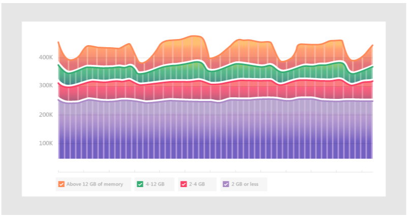

# Utilisation de la mémoire par Microsoft Teams

Certains utilisateurs de Microsoft Teams ont des questions sur la façon dont Teams utilise la mémoire. Cet article décrit comment la mémoire est utilisée par Teams et pourquoi l’application de bureau Teams (application) et l’application web Teams n’empêchent pas d’autres applications et charges de travail sur le même ordinateur d’avoir suffisamment de mémoire pour s’exécuter de manière optimale. Teams est conçu pour utiliser la technologie web moderne. Pour ce faire, le client de bureau Teams a été développé sur Electron, qui utilise Chromium pour le rendu. Il s’agit du même moteur de rendu que la plupart des navigateurs les plus populaires d’aujourd’hui, notamment Edge et Chrome.

## Fonctionnement de Teams

Teams étant conçu sur Electron permet un développement plus rapide, et il maintient également la parité entre les versions de Teams sur différents systèmes d’exploitation (Windows, Mac et Linux). Cette parité est possible, car Electron et Chromium maintenir une base de code similaire dans toutes les versions. Un autre avantage de cette architecture est qu’il existe un profil d’utilisation de la mémoire similaire entre l’application web Teams et la version de bureau. L’application web et les versions de bureau utilisent la mémoire de la même façon qu’un navigateur l’utiliserait. Pour plus d’informations sur Electron, consultez [son site Web](https://electronjs.org/).

Pour plus d’informations, consultez [Chromium utilisation](https://www.chromium.org/developers/memory-usage-backgrounder) de la mémoire et [les concepts clés de la mémoire Chrome](https://chromium.googlesource.com/chromium/src.git/+/master/docs/memory/key_concepts.md).

L’image suivante montre les utilisations côte à côte de la mémoire de l’application de bureau Teams pour Windows et l’application web Teams (dans cet exemple, en cours d’exécution dans Google Chrome).

## Utilisation de la mémoire dans Teams

Il est important de comprendre le comportement *attendu* de Teams en matière de mémoire système et de connaître les symptômes de problèmes de mémoire système véritablement problématiques.

### Utilisation de la mémoire attendue par Teams

Que vous exécutiez l’application de bureau Teams ou l’application web Teams, Chromium détecte la quantité de mémoire système disponible et utilise suffisamment de cette mémoire pour optimiser l’expérience de rendu. Quand d’autres applications ou services nécessitent de la mémoire système, Chromium abandonne la mémoire à ces processus. Chromium ajuste l’utilisation de la mémoire Teams sur une base continue afin d’optimiser les performances de Teams sans affecter quoi que ce soit d’autre en cours d’exécution.

De cette façon, des charges de travail Chromium similaires peuvent utiliser différentes quantités de mémoire, en fonction de la quantité de mémoire système disponible.

Le graphique suivant illustre l’utilisation de la mémoire par Teams sur quatre systèmes distincts, chacun avec des quantités de mémoire différentes disponibles. Chacun des systèmes traite des charges de travail similaires (mêmes applications ouvertes et en cours d’exécution).

Lorsque les ordinateurs ont plus de mémoire, Teams utilise cette mémoire. Dans les systèmes où la mémoire est rare, Teams utilise moins.

### Symptômes de problèmes de mémoire système

Si vous voyez un ou plusieurs des symptômes suivants sur votre ordinateur, vous pouvez rencontrer un problème grave de mémoire système :

- Utilisation élevée de la mémoire lorsque plusieurs applications volumineuses s’exécutent simultanément.
- Performances système lentes ou applications suspendues.
- Utilisation globale de la mémoire système soutenue de 90 % ou plus dans toutes les applications. Avec cette quantité d’utilisation de la mémoire, Teams doit rendre de la mémoire à d’autres applications et charges de travail. Une utilisation soutenue de la mémoire de 90 % peut signifier que Teams ne rend pas de mémoire au système, ce qui indique un problème.

Les images suivantes montrent des exemples de vues dans le Gestionnaire des tâches lorsque l’utilisation de la mémoire système est anormalement élevée.

