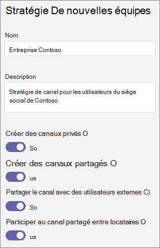

# Gérer les stratégies de canal dans Microsoft Teams

En tant qu’administrateur, vous pouvez utiliser des stratégies dans Microsoft Teams pour contrôler ce que les utilisateurs de votre organisation peuvent faire dans les équipes et les canaux. Par exemple, vous pouvez définir si les utilisateurs sont autorisés à créer des canaux privés ou partagés.

Vous gérez les stratégies Teams en  >  Teams **Teams** dans le Microsoft Teams d’administration. Vous pouvez utiliser la stratégie globale (par défaut à l’échelle de l’organisation) ou créer et attribuer des stratégies personnalisées. Les utilisateurs de votre organisation recevront automatiquement la stratégie globale, sauf si vous créez et leur attribuez une stratégie personnalisée.

Vous pouvez modifier la stratégie globale ou créer et affecter une stratégie personnalisée. Une fois que vous avez modifié la stratégie globale ou attribué une stratégie, l’application des modifications peut prendre 24 heures.

## Stratégies de canal

Les stratégies suivantes sont disponibles pour les canaux d’équipe :

|Stratégie|Description|
|:-----|:----------|
|**Créer des canaux privés**|Lorsque **c’est fait**, les propriétaires et les membres de l’équipe peuvent créer des canaux privés. (Les propriétaires d’équipe peuvent contrôler si les membres peuvent créer des canaux privés dans chaque équipe.)|
|**Créer des canaux partagés**|Lorsque **c’est fait**, les propriétaires d’équipe peuvent créer des canaux partagés. Teams applications disponibles pour votre organisation sont également disponibles dans des canaux partagés.|
|**Inviter des utilisateurs externes sur des canaux partagés**|Lorsque **cette fonction est** configurée, les propriétaires et les membres des canaux partagés peuvent inviter des participants externes d’organisations où une confiance entre les organisations a été configurée. Teams stratégies applicables à votre organisation s’appliquent à ces canaux.|
|**Rejoindre des canaux partagés externes**|Lorsque **cette fonction est** configurée, les utilisateurs peuvent participer à des canaux partagés créés par d’autres organisations dans le cas où une confiance entre les organisations a été configurée. Teams stratégies applicables à l’autre organisation s’appliquent à ces canaux.|

## Créer une stratégie d’équipe personnalisée

1. Dans le panneau de navigation gauche du Microsoft Teams d’administration,  >  voir Teams **Teams stratégies**.
2. Cliquez sur **Ajouter**.
3. Entrez un nom pour votre stratégie, ainsi qu’une description.

    
4. Activer ou désactiver les paramètres de votre souhaitez, puis cliquez sur **Enregistrer**.

5. Cliquez sur **Enregistrer**.

## Modifier une stratégie Teams

Vous pouvez modifier la stratégie globale ou toutes les stratégies personnalisées que vous créez.

1. Dans le panneau de navigation gauche du Microsoft Teams d’administration,  >  voir Teams **Teams stratégies**.
2. Sélectionnez la stratégie en cliquant à gauche du nom de celle-ci, puis cliquez sur **Modifier**.
3. Activer ou désactiver les paramètres de votre souhaitez, puis cliquez sur **Enregistrer**.

## Affecter une stratégie d’équipe personnalisée aux utilisateurs

[!INCLUDE [assign-policy](includes/assign-policy.md)]

## Rubriques connexes

[Gérer Teams sites connectés et des sites de canaux](/SharePoint/teams-connected-sites)

[Canaux privés dans Teams](private-channels.md)

[Attribuer des stratégies à vos utilisateurs](policy-assignment-overview.md)

[New-CsTeamsChannelsPolicy](/powershell/module/skype/new-csteamschannelspolicy)
