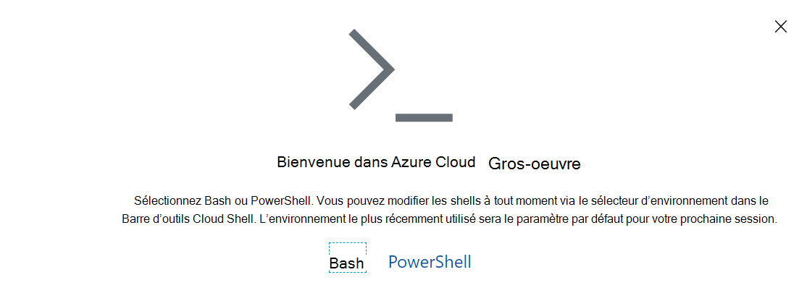

# <a name="manage-teams-with-microsoft-teams-powershell"></a>Gérer Teams avec Microsoft Teams PowerShell

Cet article vous explique comment utiliser Microsoft Teams PowerShell pour gérer Teams et Skype Entreprise.

Utilisez ces recommandations conjointement avec la référence Microsoft Teams de la [cmdlet](/powershell/teams/?view=teams-ps) et la [Skype Entreprise des cmdlet.](/powershell/skype/intro?view=skype-ps)

Pour gérer les Teams dans le Centre Teams’administration, voir Gérer les Teams [avec Azure Cloud Shell.](#manage-teams-with-azure-cloud-shell)

## <a name="create-and-manage-teams-using-powershell"></a>Créer et gérer des équipes à l’aide de PowerShell

Les cmdlets de création et de gestion des équipes sont dans le [module Microsoft Teams PowerShell.](https://www.powershellgallery.com/packages/MicrosoftTeams/)

Teams sont backed by Office 365 groups, so when you create a team, you create a group. Un ensemble d’lets est fourni pour l’exploitation de l’équipe principale et de ses paramètres (, , ), la gestion des utilisateurs de l’équipe ( , ), ainsi que des ``new-team`` ``get-team``  ``set-team`` ``add-teamuser`` ``remove-teamuser`` cmdlets ``new-teamchannel`` pour la gestion des canaux de l’équipe ( , ``remove-teamchannel`` ). Toutes ces cmdlets peuvent être exécutés en tant qu’utilisateurs finaux, mais elles ne fonctionnent que sur les équipes dont vous êtes propriétaire ou dont vous êtes membre. Si vous êtes administrateur général ou administrateur Teams de groupe, vous pourrez agir sur toutes les équipes de votre organisation.

```powershell
New-Team -DisplayName "Contoso Marketing" -Description "Collaboration space for Contoso's Marketing department"
```

> [!NOTE]
> **L’ID Groupid** utilisé dans Microsoft Teams cmdlets de module PowerShell est identique à la propriété **Identity** renvoyée par le ``Get-UnifiedGroup`` module Exchange PowerShell.

## <a name="manage-teams-with-azure-cloud-shell"></a>Gérer Teams avec Azure Cloud Shell

Cloud Shell est un shell interactif, authentifié et accessible au navigateur qui vous permet de gérer vos ressources. Pour plus d’informations sur Cloud Shell, voir [Azure Cloud Shell.](/azure/cloud-shell/overview)

Pour accéder à Azure Cloud Shell et utiliser PowerShell pour gérer Teams, connectez-vous au Centre Teams’administration Azure Cloud Shell.

1. Sélectionnez l’icône Cloud Shell dans le coin supérieur droit.

    

1. Lorsque vous y est invité, **sélectionnez PowerShell.**

    

1. Exécutez la commande suivante pour démarrer une session PowerShell Teams suivante :

    ```powershell
    Connect-MicrosoftTeams
    ```

Une fois ces étapes terminées, vous êtes prêt à exécuter Teams commandes PowerShell.

> [!IMPORTANT]
> Si vous voulez utiliser des cmdlets Cs*, vous devez d’abord vous connecter à Teams’aide de la ``Connect-MicrosoftTeams -UseDeviceAuthentication`` commande.

## <a name="manage-policies-via-powershell"></a>Gérer les stratégies via PowerShell

> [!NOTE]
> - Skype Entreprise Online Connector est en cours de consolidation dans Teams PowerShell. Elle est actuellement disponible en prévisualisation publique. Dans le temps, Skype Entreprise cmdlets Online qui s’appliquent à Teams seront disponibles en natif dans le module Teams PowerShell. Les étapes d’installation sont disponibles dans [l’article Teams PowerShell.](teams-powershell-install.md)
> - Les cmdlets seront disponibles dans votre session PowerShell une fois que vous serez connecté à Skype Entreprise Online. Pour plus d’informations, voir [Gérer Skype Entreprise Online avec Office 365 PowerShell.](/office365/enterprise/powershell/manage-skype-for-business-online-with-office-365-powershell)

Recherchez les cmdlets de gestion des stratégies dans [le module d Skype Entreprise de commande.](/microsoft-365/enterprise/manage-skype-for-business-online-with-microsoft-365-powershell)

Une stratégie est un groupe de paramètres qui peuvent être appliqués de façon granulaire à des utilisateurs individuels. Chaque type de stratégie possède son propre ensemble d’lets pour la création, l’affichage, la suppression et la mise à jour des stratégies proprement dits, puis l’attribution de ces stratégies aux utilisateurs. La structure générale est la :

- Commandes **GET** (par exemple, ) : renvoie les documents de stratégie que vous pouvez attribuer dans votre organisation, y compris les stratégies créées par Microsoft que vous pouvez utiliser, ainsi que les stratégies personnalisées que vous avez ``Get-CsTeamsMeetingPolicy`` créées.
  - Pour rechercher uniquement les stratégies personnalisées que vous avez créées dans votre organisation, ``-Filter "tag:*"`` utilisez.

- **NOUVELLES** commandes (par exemple, ) : crée de nouvelles stratégies que votre organisation doit ``New-CsTeamsMeetingPolicy`` affecter aux utilisateurs de votre organisation. Toutes les stratégies ne supportent pas la création de stratégies personnalisées. Il s’agit souvent de vous assurer que les stratégies que vous utilisez dans votre organisation utilisent une combinaison de paramètres prise en charge.

- **Commandes SET** (par exemple, ``Set-CsTeamsMeetingPolicy`` ) : définit des valeurs spécifiques sur une stratégie donnée. Certaines stratégies ne disposent pas de commandes SET ou contiennent des paramètres qui ne peuvent pas être personnalisés dans la stratégie. Les descriptions de PowerShell vous indiquent quels paramètres ne peuvent pas être personnalisés.
  - Pour modifier la stratégie qui sera par défaut affectée aux utilisateurs de votre organisation pour qui une stratégie personnalisée n’est pas attribuée, ``Set-Cs<PolicyName> -Identity Global`` exécutez.

- **Commandes** REMOVE (par exemple) : supprime une stratégie personnalisée créée ``Remove-CsTeamsMeetingPolicy`` dans votre client. Si vous supprimez une stratégie personnalisée affectée à au moins un utilisateur de votre organisation, cet utilisateur revenira à la stratégie globale.
  - Vous ne pouvez pas vraiment supprimer la stratégie globale de votre organisation, mais si vous voulez rétablir les paramètres par défaut fournis par Microsoft dans votre organisation, ``Remove-Cs<PolicyName> -Identity Global`` exécutez.

- **Commande GRANT** (par exemple, ``Grant-CsTeamsMeetingPolicy`` ) : affecte une stratégie à un utilisateur particulier.
  - Pour supprimer une affectation de stratégie personnalisée et faire en sorte que l’utilisateur revenir à la stratégie par défaut dans votre organisation, ``Grant-Cs<PolicyName> -Identity <User Identity> -PolicyName $null`` exécutez.

> [!TIP]
> Toutes les stratégies n’autorisent pas la création de stratégies personnalisées, et certaines stratégies ont des paramètres que vous ne pouvez pas personnaliser (de sorte que vous pouvez afficher le paramètre, mais ne pouvez pas définir de valeur personnalisée pendant ``set-`` ``new-`` et). La documentation de chaque cmdlet vous invite à déterminer si les paramètres sont disponibles pour les clients.

Paramètres courants :

- **Identité**: pour , et , le paramètre Identité fait toujours ``Get-`` référence à une instance de stratégie ``Set-`` ``New-`` ``Remove-`` spécifique.  Par ``Grant`` exemple, **le paramètre Identité** fait référence à un objet utilisateur spécifique auquel la stratégie est appliquée.

## <a name="manage-configurations-via-powershell"></a>Gérer les configurations via PowerShell

Recherchez les cmdlets pour gérer votre configuration dans [le module Skype Entreprise de commande.](/microsoft-365/enterprise/manage-skype-for-business-online-with-microsoft-365-powershell)

Les configurations sont des compartiments de paramètres conservés dans le service qui ne peuvent pas être spécifiés au niveau de l’utilisateur. Paramètres s’appliquent toujours à l’ensemble de l’organisation. Votre configuration globale est la seule configuration efficace au niveau de votre organisation. Chaque type de configuration est fourni avec deux cmdlets principales :

- ``Get-Cs<ConfigurationName>`` (par exemple, ``Get-CsTeamsClientConfiguration`` ) :

- Commandes SET (par exemple, ``Set-CsTeamsClientConfiguration`` ) : définissez des propriétés dans la configuration de ce type. Spécifiez les paramètres à modifier.
    > [!NOTE]
    > Vous pouvez référencer la configuration que vous modifiez de deux manières : en spécifiant : Identité **globale** ou en exécutant ``Get-Cs<ConfigurationName>``  |  ``Set-Cs<ConfigurationName>`` .

## <a name="what-can-each-admin-role-do"></a>Que peuvent faire chaque rôle d’administrateur ?

Lisez [Utiliser Microsoft Teams rôles](using-admin-roles.md) d’administrateur pour gérer Teams pour comprendre quels rôles d’administrateur peuvent exécuter chaque cmdlet PowerShell.

## <a name="related-topics"></a>Voir aussi

[Installation Teams PowerShell](teams-powershell-install.md)

[Teams Notes de publication de PowerShell](teams-powershell-release-notes.md)

[Informations de référence sur les applets de commande Teams](/powershell/teams/?view=teams-ps)

[Skype Entreprise des cmdlet](/powershell/skype/intro?view=skype-ps)

[Utiliser des rôles d’administrateur pour gérer Teams](using-admin-roles.md)
